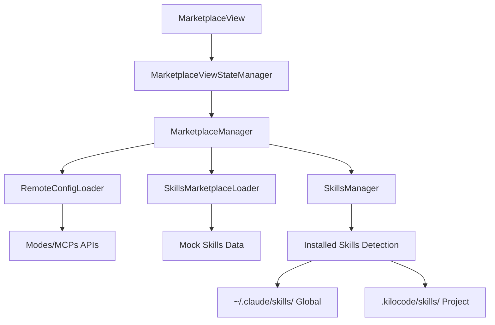

# Add Skills Tab to Marketplace

## Overview

Add a third "Skills" tab to the marketplace UI that displays available skills. Implementation follows the `RemoteConfigLoader` pattern:

- `SkillsMarketplaceLoader` class in its own file
- Zod schema validation for response data
- 5-minute caching with exponential backoff retry
- Mock data matching SkillsMP API structure
- Integration with existing `SkillsManager` for installation detection

## Architecture



## Key Design Decisions

### Loader vs Manager Separation

- `SkillsMarketplaceLoader` only fetches available skills from marketplace (mock data)
- `SkillsManager` handles installed skills detection (existing code)
- `MarketplaceManager` combines both and provides installation methods

### Installation Paths (matching existing patterns)

- **Global**: `~/.claude/skills/` (via `getGlobalRooDirectory()`)
- **Project**: `.kilocode/skills/` (in workspace)

### SkillsManager Integration

From `src/services/skills/SkillsManager.ts`:

- Tracks skills with `source: "global" | "project"`
- Reads `SKILL.md` frontmatter with `name` and `description`
- Discovers skills from both global and project directories
- Already handles file watchers for skill changes

## Implementation Steps

### 1. Update Types ([packages/types/src/marketplace.ts](packages/types/src/marketplace.ts))

Add skill schemas and update discriminated union:

```typescript
// Add "skill" to marketplace item types
export const marketplaceItemTypeSchema = z.enum(["mode", "mcp", "skill"] as const)

// Skill-specific schema (extends base marketplace item)
export const skillMarketplaceItemSchema = baseMarketplaceItemSchema.extend({
	repository: z.object({
		fullName: z.string(),
		stars: z.number(),
		forks: z.number(),
		url: z.string().url(),
		pushedAt: z.string(),
	}).optional(),
	category: z.string().optional(),
	hasInstallCommand: z.boolean().optional(),
	skillFile: z.string().optional(),
	marketplaceJson: z.object({
		name: z.string(),
		version: z.string().optional(),
		installCommand: z.string().optional(),
		description: z.string().optional(),
	}).optional(),
})

export type SkillMarketplaceItem = z.infer<typeof skillMarketplaceItemSchema>

// Update the discriminated union
export const marketplaceItemSchema = z.discriminatedUnion("type", [
	modeMarketplaceItemSchema.extend({ type: z.literal("mode") }),
	mcpMarketplaceItemSchema.extend({ type: z.literal("mcp") }),
	skillMarketplaceItemSchema.extend({ type: z.literal("skill") }), // NEW
])
```

### 2. Create SkillsMarketplaceLoader ([src/services/marketplace/SkillsMarketplaceLoader.ts](src/services/marketplace/SkillsMarketplaceLoader.ts))

Following `RemoteConfigLoader` pattern:

```typescript
import { z } from "zod"
import { getAppUrl } from "@roo-code/types" // kilocode_change
import type { MarketplaceItem } from "@roo-code/types"
import { skillMarketplaceItemSchema } from "../../../packages/types/src/marketplace"

// Zod schema for API response validation
const skillsMarketplaceResponse = z.object({
	skills: z.array(skillMarketplaceItemSchema),
})

// Mock data matching SkillsMP API response structure
const MOCK_SKILLS_DATA = {
	skills: [
		{
			id: "seo-review",
			name: "SEO Review",
			description: "Perform a focused SEO audit on pages...",
			author: "leonardomso",
			tags: ["seo", "marketing", "web"],
			repository: {
				fullName: "leonardomso/33-js-concepts",
				stars: 66000,
				forks: 6600,
				url: "https://github.com/leonardomso/33-js-concepts",
				pushedAt: "2026-01-07T12:00:00Z",
			},
			category: "documentation",
			hasInstallCommand: true,
			skillFile: "seo-review.md",
		},
		// ... more skills
	],
}

export class SkillsMarketplaceLoader {
	private cache: Map<string, { data: MarketplaceItem[]; timestamp: number }> = new Map()
	private cacheDuration = 5 * 60 * 1000 // 5 minutes

	async fetchAllSkills(): Promise<MarketplaceItem[]> {
		const cacheKey = "skills"
		const cached = this.getFromCache(cacheKey)

		if (cached) {
			return cached
		}

		// UNCOMMENT FOR REAL API CALL:
		// const url = getAppUrl("/api/marketplace/skills")
		// const data = await this.fetchWithRetry(url)
		// const validated = skillsMarketplaceResponse.parse(data)

		// Use mock data for now
		const validated = skillsMarketplaceResponse.parse(MOCK_SKILLS_DATA)

		const items: MarketplaceItem[] = validated.skills.map((item) => ({
			type: "skill" as const,
			...item,
		}))

		this.setCache(cacheKey, items)
		return items
	}

	async getSkill(id: string): Promise<MarketplaceItem | null> {
		const items = await this.fetchAllSkills()
		return items.find((item) => item.id === id && item.type === "skill") || null
	}

	private async fetchWithRetry(url: string, maxRetries = 3): Promise<unknown> {
		let lastError: Error
		for (let i = 0; i < maxRetries; i++) {
			try {
				const response = await fetch(url, { timeout: 10000 })
				return response.json()
			} catch (error) {
				lastError = error as Error
				if (i < maxRetries - 1) {
					const delay = Math.pow(2, i) * 1000
					await new Promise((resolve) => setTimeout(resolve, delay))
				}
			}
		}
		throw lastError!
	}

	private getFromCache(key: string): MarketplaceItem[] | null {
		const cached = this.cache.get(key)
		if (!cached) return null
		if (Date.now() - cached.timestamp > this.cacheDuration) {
			this.cache.delete(key)
			return null
		}
		return cached.data
	}

	private setCache(key: string, data: MarketplaceItem[]): void {
		this.cache.set(key, { data, timestamp: Date.now() })
	}

	clearCache(): void {
		this.cache.clear()
	}
}
```

### 3. Update SimpleInstaller ([src/services/marketplace/SimpleInstaller.ts](src/services/marketplace/SimpleInstaller.ts))

Add skill installation methods:

```typescript
import * as fs from "fs/promises"
import * as path from "path"
import * as vscode from "vscode"
import { getGlobalRooDirectory } from "../../utils/roo-config"

export class SimpleInstaller {
	// ... existing code ...

	async installItem(item: MarketplaceItem, options: InstallOptions): Promise<{ filePath: string; line?: number }> {
		const { target } = options

		switch (item.type) {
			case "mode":
				return await this.installMode(item, target)
			case "mcp":
				return await this.installMcp(item, target, options)
			case "skill": // NEW
				return await this.installSkill(item, target)
			default:
				throw new Error(`Unsupported item type: ${(item as any).type}`)
		}
	}

	// NEW: Install skill
	private async installSkill(
		item: MarketplaceItem,
		target: "project" | "global",
	): Promise<{ filePath: string; line?: number }> {
		// Skills are cloned/copied to skills directory
		const skillsDir = await this.getSkillsDirectory(target)
		const skillDirPath = path.join(skillsDir, item.id)

		// For now, just create a marker file indicating the skill is "installed"
		// In real implementation, would clone from GitHub or copy from temp
		const filePath = path.join(skillDirPath, "SKILL.md")

		await fs.mkdir(path.dirname(filePath), { recursive: true })
		await fs.writeFile(
			filePath,
			`---
name: ${item.name}
description: ${item.description}
---
# ${item.name}
${item.description}
`,
			"utf-8",
		)

		return { filePath }
	}

	// NEW: Remove skill
	async removeSkill(item: MarketplaceItem, target: "project" | "global"): Promise<void> {
		const skillsDir = await this.getSkillsDirectory(target)
		const skillDirPath = path.join(skillsDir, item.id)

		try {
			await fs.rm(skillDirPath, { recursive: true, force: true })
		} catch {
			// Directory doesn't exist or can't be removed
		}
	}

	private async getSkillsDirectory(target: "project" | "global"): Promise<string> {
		if (target === "project") {
			const workspaceFolder = vscode.workspace.workspaceFolders?.[0]
			if (!workspaceFolder) {
				throw new Error("No workspace folder found")
			}
			return path.join(workspaceFolder.uri.fsPath, ".kilocode", "skills")
		} else {
			return path.join(getGlobalRooDirectory(), "skills")
		}
	}

	// Update removeItem to handle skills
	async removeItem(item: MarketplaceItem, options: InstallOptions): Promise<void> {
		const { target } = options

		switch (item.type) {
			case "mode":
				await this.removeMode(item, target)
				break
			case "mcp":
				await this.removeMcp(item, target)
				break
			case "skill": // NEW
				await this.removeSkill(item, target)
				break
			default:
				throw new Error(`Unsupported item type: ${(item as any).type}`)
		}
	}
}
```

### 4. Update MarketplaceManager ([src/services/marketplace/MarketplaceManager.ts](src/services/marketplace/MarketplaceManager.ts))

Inject SkillsMarketplaceLoader and integrate with SkillsManager:

```typescript
import { SkillsMarketplaceLoader } from "./SkillsMarketplaceLoader"
import type { SkillsManager } from "../skills/SkillsManager"

export class MarketplaceManager {
	private configLoader: RemoteConfigLoader
	private skillsLoader: SkillsMarketplaceLoader // NEW
	private installer: SimpleInstaller

	constructor(
		private readonly context: vscode.ExtensionContext,
		private readonly customModesManager?: CustomModesManager,
		private readonly skillsManager?: SkillsManager, // NEW - optional
	) {
		this.configLoader = new RemoteConfigLoader()
		this.skillsLoader = new SkillsMarketplaceLoader()
		this.installer = new SimpleInstaller(context, customModesManager)
	}

	async getMarketplaceItems(): Promise<MarketplaceItemsResponse> {
		// ... existing code for modes/MCPs ...

		// NEW: Fetch skills from marketplace
		const skills = await this.skillsLoader.fetchAllSkills()

		return {
			organizationMcps,
			marketplaceItems: [...allMarketplaceItems, ...skills],
			errors: errors.length > 0 ? errors : undefined,
		}
	}

	// NEW: Get installation metadata from SkillsManager
	async getInstallationMetadata(): Promise<{
		project: Record<string, { type: string }>
		global: Record<string, { type: string }>
	}> {
		const metadata = {
			project: {} as Record<string, { type: string }>,
			global: {} as Record<string, { type: string }>,
		}

		// Use SkillsManager if available
		if (this.skillsManager) {
			const allSkills = this.skillsManager.getAllSkills()
			for (const skill of allSkills) {
				if (skill.source === "project") {
					metadata.project[skill.name] = { type: "skill" }
				} else {
					metadata.global[skill.name] = { type: "skill" }
				}
			}
		}

		return metadata
	}

	// Update filterItems to include skill type
	filterItems(
		items: MarketplaceItem[],
		filters: { type?: MarketplaceItemType; search?: string; tags?: string[] },
	): MarketplaceItem[] {
		return items.filter((item) => {
			if (filters.type && item.type !== filters.type) {
				return false
			}
			// ... existing search/tags filtering
			return true
		})
	}
}
```

### 5. Update UI Components

#### [webview-ui/src/components/marketplace/MarketplaceView.tsx](webview-ui/src/components/marketplace/MarketplaceView.tsx)

Add Skills tab button:

```typescript
<TabButton
	active={activeTab === "skill"}
	onClick={() => transition({ activeTab: "skill" })}
>
	<Icon name="skill" />
	{t("marketplace:tabs.skill")}
</TabButton>
```

#### [webview-ui/src/components/marketplace/MarketplaceItemCard.tsx](webview-ui/src/components/marketplace/MarketplaceItemCard.tsx)

Handle skill display:

```typescript
case "skill": {
	// Show repository stats
	if (item.repository) {
		return (
			<div className="skill-stats">
				<span className="stars">
					<Icon name="star" />
					{item.repository.stars}
				</span>
				<span className="forks">
					<Icon name="fork" />
					{item.repository.forks}
				</span>
			</div>
		)
	}
	
	// Show category
	if (item.category) {
		return <Badge>{item.category}</Badge>
	}
	
	return null
}
```

#### [webview-ui/src/components/marketplace/MarketplaceListView.tsx](webview-ui/src/components/marketplace/MarketplaceListView.tsx)

Update search placeholder:

```typescript
const getSearchPlaceholder = () => {
	switch (filterByType) {
		case "mode":
			return t("marketplace:search.modes")
		case "mcp":
			return t("marketplace:search.mcps")
		case "skill":
			return t("marketplace:search.skills")
		default:
			return t("marketplace:search.all")
	}
}
```

### 6. Add i18n Strings ([webview-ui/src/i18n/locales/en/marketplace.json](webview-ui/src/i18n/locales/en/marketplace.json))

```json
{
	"tabs": {
		"skill": "Skills"
	},
	"search": {
		"skills": "Search skills..."
	},
	"type": {
		"skill": "Skill"
	},
	"skill": {
		"stars": "stars",
		"forks": "forks",
		"category": "Category",
		"viewOnGithub": "View on GitHub",
		"repository": "Repository"
	},
	"installed": {
		"skillProject": "Installed in project",
		"skillGlobal": "Installed globally"
	}
}
```

### 7. Mock Skills Data ([src/services/marketplace/SkillsMarketplaceLoader.ts](src/services/marketplace/SkillsMarketplaceLoader.ts))

Add diverse examples:

```typescript
const MOCK_SKILLS_DATA = {
	skills: [
		{
			id: "skill-creator",
			name: "Skill Creator",
			description: "Guide for creating effective skills for Claude Code and Codex",
			author: "openai",
			tags: ["documentation", "development", "ai"],
			repository: {
				fullName: "openai/codex",
				stars: 55500,
				forks: 4200,
				url: "https://github.com/openai/codex",
				pushedAt: "2026-01-07T12:00:00Z",
			},
			category: "development",
			hasInstallCommand: true,
			skillFile: "skill-creator.md",
		},
		{
			id: "test-writer",
			name: "Test Writer",
			description: "Generate comprehensive Vitest tests for code examples",
			author: "leonardomso",
			tags: ["testing", "quality", "automation"],
			repository: {
				fullName: "leonardomso/33-js-concepts",
				stars: 66000,
				forks: 6600,
				url: "https://github.com/leonardomso/33-js-concepts",
				pushedAt: "2026-01-07T12:00:00Z",
			},
			category: "testing",
			hasInstallCommand: true,
			skillFile: "test-writer.md",
		},
	],
}
```

## Appendix: Storybook Story

### Update Mock Data ([apps/storybook/src/mockData/index.ts](apps/storybook/src/mockData/index.ts))

Add mock skill items:

```typescript
export const mockSkillItems = [
	{
		id: "seo-review",
		name: "SEO Review",
		description: "Perform a focused SEO audit on pages to maximize search visibility, featured snippet optimization, and ranking potential",
		author: "leonardomso",
		tags: ["seo", "marketing", "web", "optimization"],
		type: "skill" as const,
		repository: {
			fullName: "leonardomso/33-js-concepts",
			stars: 66000,
			forks: 6600,
			url: "https://github.com/leonardomso/33-js-concepts",
			pushedAt: "2026-01-07T12:00:00Z",
		},
		category: "documentation",
		hasInstallCommand: true,
		skillFile: "seo-review.md",
	},
	{
		id: "skill-creator",
		name: "Skill Creator",
		description: "Guide for creating effective skills for Claude Code and Codex. Use when users want to create, write, author, or design a new Skill",
		author: "openai",
		tags: ["documentation", "development", "ai", "skills"],
		type: "skill" as const,
		repository: {
			fullName: "openai/codex",
			stars: 55500,
			forks: 4200,
			url: "https://github.com/openai/codex",
			pushedAt: "2026-01-07T12:00:00Z",
		},
		category: "development",
		hasInstallCommand: true,
		skillFile: "skill-creator.md",
	},
	{
		id: "test-writer",
		name: "Test Writer",
		description: "Generate comprehensive Vitest tests for code examples, following project conventions and referencing source lines",
		author: "leonardomso",
		tags: ["testing", "quality", "automation", "vitest"],
		type: "skill" as const,
		repository: {
			fullName: "leonardomso/33-js-concepts",
			stars: 66000,
			forks: 6600,
			url: "https://github.com/leonardomso/33-js-concepts",
			pushedAt: "2026-01-07T12:00:00Z",
		},
		category: "testing",
		hasInstallCommand: true,
		skillFile: "test-writer.md",
	},
	{
		id: "git-commit-helper",
		name: "Git Commit Helper",
		description: "Creates well-structured git commits with conventional commit format and automated changelog generation",
		author: "kilocode",
		tags: ["git", "workflow", "productivity", "version-control"],
		type: "skill" as const,
		category: "development",
		hasInstallCommand: false,
		skillFile: "git-commit-helper.md",
	},
]

// Update createMockMarketplaceStateManager to support skill tab
export const createMockMarketplaceStateManager = (activeTab: "mcp" | "mode" | "skill" = "mcp") => ({
	getState: () => ({
		allItems: [...mockMarketplaceItems, ...mockSkillItems],
		organizationMcps: [],
		displayItems: activeTab === "skill" ? mockSkillItems : mockMarketplaceItems,
		displayOrganizationMcps: [],
		isFetching: false,
		activeTab,
		filters: {
			type: "",
			search: "",
			tags: [],
			installed: "all" as const,
		},
		installedMetadata: { global: {}, project: {} },
	}),
	transition: () => Promise.resolve(),
	onStateChange: () => () => {},
	cleanup: () => {},
	handleMessage: () => Promise.resolve(),
})
```

### Update MarketplaceView Story ([apps/storybook/stories/MarketplaceView.stories.tsx](apps/storybook/stories/MarketplaceView.stories.tsx))

Add SkillsTab story and update argTypes:

```typescript
import type { Meta, StoryObj } from "@storybook/react-vite"
import { MarketplaceView } from "../../../webview-ui/src/components/marketplace/MarketplaceView"
import { createMockMarketplaceStateManager, mockSkillItems } from "../src/mockData"
import { createExtensionStateMock } from "../src/utils/createExtensionStateMock"
import { withSidebarContainer } from "../src/decorators/withSidebarContainer"

const meta = {
	title: "Views/MarketplaceView",
	component: MarketplaceView,
	argTypes: {
		targetTab: {
			control: { type: "select" },
			options: ["mcp", "mode", "skill"],
			description: "Which tab should be active initially",
		},
		hideHeader: {
			control: "boolean",
			description: "Whether to hide the header",
		},
		onDone: {
			action: "onDone",
			description: "Callback when done button is clicked",
		},
	},
	args: {
		hideHeader: false,
		onDone: () => {},
	},
	decorators: [withSidebarContainer()],
	parameters: {
		extensionState: createExtensionStateMock({
			organizationAllowList: {
				allowAll: true,
				providers: {},
			},
			apiConfiguration: {
				apiProvider: "anthropic",
				apiModelId: "claude-3-5-sonnet-20241022",
				apiKey: "mock-key",
			},
			marketplaceInstalledMetadata: {
				global: {
					"filesystem-mcp": { type: "mcp" },
				},
				project: {
					"architect-mode": { type: "mode" },
					"seo-review": { type: "skill" },
				},
			},
			mcpServers: [],
			mode: "code",
			customModes: [],
		}),
	},
} satisfies Meta<typeof MarketplaceView>

export default meta
type Story = StoryObj<typeof meta>

export const MCPTab: Story = {
	args: {
		stateManager: createMockMarketplaceStateManager("mcp") as any,
		targetTab: "mcp",
	},
}

export const ModeTab: Story = {
	args: {
		stateManager: createMockMarketplaceStateManager("mode") as any,
		targetTab: "mode",
	},
}

// NEW: Skills Tab Story
export const SkillsTab: Story = {
	name: "SkillsTab",
	args: {
		stateManager: createMockMarketplaceStateManager("skill") as any,
		targetTab: "skill",
	},
}

export const SkillsTabWithInstall: Story = {
	name: "SkillsTabWithInstall",
	args: {
		stateManager: createMockMarketplaceStateManager("skill") as any,
		targetTab: "skill",
	},
	parameters: {
		extensionState: createExtensionStateMock({
			organizationAllowList: {
				allowAll: true,
				providers: {},
			},
			apiConfiguration: {
				apiProvider: "anthropic",
				apiModelId: "claude-3-5-sonnet-20241022",
				apiKey: "mock-key",
			},
			// Show one skill installed, others not
			marketplaceInstalledMetadata: {
				global: {},
				project: {
					"skill-creator": { type: "skill" },
				},
			},
			mcpServers: [],
			mode: "code",
			customModes: [],
		}),
	},
}

export const SkillsTabWithSearch: Story = {
	name: "SkillsTabWithSearch",
	args: {
		stateManager: {
			...createMockMarketplaceStateManager("skill"),
			getState: () => ({
				...createMockMarketplaceStateManager("skill").getState(),
				displayItems: mockSkillItems.filter(
					(item) =>
						item.type !== "skill" ||
						item.name.toLowerCase().includes("test") ||
						item.tags.some((tag) => tag.toLowerCase().includes("test")),
				),
				filters: {
					...createMockMarketplaceStateManager("skill").getState().filters,
					search: "test",
				},
			}),
		} as any,
		targetTab: "skill",
	},
}
```

## Testing

Add tests following existing patterns:

- [src/services/marketplace/__tests__/SkillsMarketplaceLoader.spec.ts](src/services/marketplace/__tests__/SkillsMarketplaceLoader.spec.ts)

## File Changes Summary

| File | Change |

|------|--------|

| [packages/types/src/marketplace.ts](packages/types/src/marketplace.ts) | Add skill schemas, update union |

| [src/services/marketplace/SkillsMarketplaceLoader.ts](src/services/marketplace/SkillsMarketplaceLoader.ts) | NEW - loader class with mock data |

| [src/services/marketplace/SimpleInstaller.ts](src/services/marketplace/SimpleInstaller.ts) | Add installSkill/removeSkill methods |

| [src/services/marketplace/MarketplaceManager.ts](src/services/marketplace/MarketplaceManager.ts) | Inject loader, integrate SkillsManager |

| [webview-ui/src/components/marketplace/MarketplaceView.tsx](webview-ui/src/components/marketplace/MarketplaceView.tsx) | Add Skills tab |

| [webview-ui/src/components/marketplace/MarketplaceItemCard.tsx](webview-ui/src/components/marketplace/MarketplaceItemCard.tsx) | Handle skill display |

| [webview-ui/src/components/marketplace/MarketplaceListView.tsx](webview-ui/src/components/marketplace/MarketplaceListView.tsx) | Update filters |

| [webview-ui/src/i18n/locales/en/marketplace.json](webview-ui/src/i18n/locales/en/marketplace.json) | Add skill strings |

| [apps/storybook/src/mockData/index.ts](apps/storybook/src/mockData/index.ts) | Add mock skill items, update state manager |

| [apps/storybook/stories/MarketplaceView.stories.tsx](apps/storybook/stories/MarketplaceView.stories.tsx) | Add SkillsTab stories |