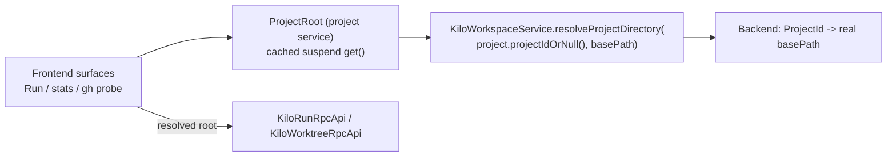

# Fix JetBrains worktree Run popup in split mode (resolve the real project root)

## Problem

The worktree editor's Run popup shows a single disabled row reading
`no open project for /…/.intellijPlatform/sandbox/kilo.jetbrains/IU-2026.1/config_runIdeFrontend/frontend/projects/fbc45d67…`
instead of the repo's run configurations.

Root cause: `WorktreeRunControl` reads `project.basePath` on the **frontend** and sends it to the
backend as the project key (`WorktreeRunControl.kt:58`, `:82`). In split mode / remote dev the
frontend project's `basePath` is a synthetic JetBrains Client path, not the real project root.
`KiloRunRpcApiImpl.resolve()` (`KiloRunRpcApiImpl.kt:54-59`) matches that string against
`ProjectManager.openProjects` on the backend, finds nothing, and returns
`RunConfigListDto(error = "no open project for …")`, which `WorktreeRunPopup` renders as the
disabled row (`WorktreeRunPopup.kt:53-55`).

Backend log evidence (`.intellijPlatform/sandbox/kilo.jetbrains/kilo-backend/kilo-dev.log.0:42`, `:505`):

```
WARN - KiloRunRpcApiImpl - worktree run states: no open project for
  …/config_runIdeFrontend/frontend/projects/fbc45d67ee7342b8bedc23a466135ccc0eb4e751
```

The repo does have supported configs — all three `packages/kilo-jetbrains/.run/*.run.xml` files are
`GradleRunConfiguration`, which `WorktreeRunAdapter.supports()` accepts unconditionally
(`WorktreeRunAdapter.kt:44`). Nothing is wrong with the adapter or the run manager.

The plugin already has the sanctioned resolution path for this:
`KiloWorkspaceService.resolveProjectDirectory(projectId, hint)` →
`KiloWorkspaceRpcApiImpl.resolveProjectDirectory` (`KiloWorkspaceRpcApiImpl.kt:102-111`), which uses
the experimental `ProjectId` API with a path-hint fallback. `KiloToolWindowFactory.kt:66-73` uses it
correctly. The Agent Manager worktree surfaces bypass it.

Two sibling call sites have the same bug and are fixed here because they share the root cause:

| Site | Symptom in split mode |
|---|---|
| `WorktreeStatusService.kt:87`, `:96` | Worktree stats and PR badges query the backend with the synthetic path |
| `GhStatusCoordinator.kt:126` | `gh`/`git` probe runs against the synthetic path; only appears healthy locally because the sandbox dir happens to live inside the repo |

## Approach

Add one cached, project-level frontend resolver and route the three worktree call sites through it.
Do not change the `KiloRunRpcApi` contract — the backend directory key stays a string, the frontend
just stops sending a lie.



Caching matters: the resolution is a round trip and the gh probe fires on a 5-120s timer, so it must
resolve once per project, not per call.

## Changes

### 1. New: `frontend/src/main/kotlin/ai/kilocode/client/app/ProjectRoot.kt`

Light project service, lazy + memoized via `Deferred`. `resolveProjectDirectory` already swallows RPC
failures and falls back to the hint (`KiloWorkspaceService.kt:107-110`), so `get()` never throws.

```kotlin
package ai.kilocode.client.app

import com.intellij.openapi.components.Service
import com.intellij.openapi.components.service
import com.intellij.openapi.project.Project
import com.intellij.platform.project.projectIdOrNull
import kotlinx.coroutines.CoroutineScope
import kotlinx.coroutines.CoroutineStart
import kotlinx.coroutines.Deferred
import kotlinx.coroutines.async

/**
 * The real backend project directory for [project], resolved once and cached.
 *
 * In split mode `project.basePath` on the frontend is a synthetic JetBrains Client path, so it must
 * never be sent to the backend as a project key or a filesystem path. Frontend code that needs the
 * project root for a backend call goes through here instead.
 */
@Service(Service.Level.PROJECT)
class ProjectRoot(private val project: Project, cs: CoroutineScope) {
    private val root: Deferred<String> = cs.async(start = CoroutineStart.LAZY) {
        // Experimental IntelliJ ProjectId API keeps multi-window and split-mode routing exact.
        service<KiloWorkspaceService>().resolveProjectDirectory(project.projectIdOrNull(), project.basePath ?: "")
    }

    /** Blank when the root cannot be resolved. */
    suspend fun get(): String = root.await()
}
```

Light services need no XML registration; do not add an entry to `kilo.jetbrains.frontend.xml`.

### 2. `WorktreeRunControl.kt` — the reported bug

- Drop `val repo = project.basePath` from `init` and `open()`.
- Add `private suspend fun root() = project.service<ProjectRoot>().get().takeIf { it.isNotBlank() }`.
- `init` becomes an unconditional `cs.launch { val repo = root() ?: return@launch; … }` wrapping the
  existing `states(repo)` collection; keep `key`/`normalizeWorktreePath` and the `catch` logging.
- `open()` becomes `cs.launch { val repo = root() ?: return@launch; val list = service<KiloRunService>().configs(repo); alive { popup(repo, list) } }`.
- `popup(repo, list)` already threads `repo` into the run/stop/output callbacks — no change there.
- Update the class KDoc to state that the project key is the resolved backend root.

Resolution is warmed by `init`, so a click almost always sees the cached value.

### 3. `WorktreeStatusService.kt`

Move directory resolution inside the existing `cs.launch` in both `loadStats()` and `loadPr()`:

```kotlin
private fun loadStats() {
    cs.launch {
        val dir = project.service<ProjectRoot>().get().takeIf { it.isNotBlank() } ?: return@launch
        runCatching { service<KiloWorktreeService>().stats(dir) }
            .onSuccess { dto -> statsFlow.value = dto.items.associateBy { normalizeWorktreePath(it.path) } }
            .onFailure { err -> LOG.warn("worktree stats refresh failed dir=$dir", err) }
    }
}
```

`loadPr()` mirrors this. The `project.isDisposed` guards in `refreshStats`/`refreshPr` stay as-is.

### 4. `GhStatusCoordinator.kt`

- Delete the `val dir = project.basePath ?: run { … }` block in `probe()`; keep `target()` unchanged
  (it still needs a non-disposed project with a frontend `basePath`).
- Resolve inside `cs.launch`, and add an `idle(gen)` sibling of `done`/`failed` for the unresolved
  case so a blank root reschedules without inflating the failure backoff:

```kotlin
cs.launch {
    val dir = project.service<ProjectRoot>().get()
    if (dir.isBlank()) {
        LOG.info("gh probe skipped reason=$reason unresolved_root=true project=${project.name}")
        idle(gen)
        return@launch
    }
    LOG.info("gh probe dir=$dir")
    runCatching { service<KiloWorktreeService>().ghStatus(dir) }
        .onSuccess { next -> done(gen, project, next, timers.now() - start) }
        .onFailure { err -> failed(gen, err, timers.now() - start) }
}

private fun idle(gen: Int) = edt {
    if (gen != generation || refs == 0) return@edt
    busy = false
    schedule()
}
```

Move the `dir=` value out of the existing `gh probe start` log line (it is no longer known on the EDT)
and into the new post-resolution line.

### 5. `shared/.../KiloRunRpcApi.kt` — doc only

The signatures stay unchanged. Tighten the interface KDoc (`:15-19`) to say the `directory` key must be
the **backend-resolved** project root, so the next caller does not reach for the frontend
`project.basePath` again. No behavioral change, no `@Rpc` surface change, no SDK regeneration.

## Tests

### New: `frontend/src/test/kotlin/ai/kilocode/client/testing/FakeRunRpcApi.kt`

Implements `KiloRunRpcApi` with `assertNotEdt` on every suspend method, matching the other fakes.
Records the directory each method receives (`configDirs`, `stateDirs`, `runs`) and exposes a settable
`configs: List<RunConfigDto>` plus a `MutableStateFlow<List<RunStateDto>>` for `states`.

### New: `FakeWorkspaceRpcApi` counter

Add `var resolveCalls = 0; private set` incremented in `resolveProjectDirectory`, so the caching test
can assert one round trip.

### New: `frontend/src/test/kotlin/ai/kilocode/client/app/ProjectRootTest.kt`

`BasePlatformTestCase`. Replace `KiloWorkspaceService` with `KiloWorkspaceService(coroutines.scope, FakeWorkspaceRpcApi().apply { directory = "/real/repo" })`.

- `get()` returns `/real/repo`, not `project.basePath`.
- Repeated concurrent + sequential `get()` calls leave `rpc.resolveCalls == 1`.

### New: `frontend/src/test/kotlin/ai/kilocode/client/agentManager/worktree/WorktreeRunControlTest.kt`

`BasePlatformTestCase`. In `setUp`, replace `KiloWorkspaceService` with the fake resolving to
`/real/repo` and `KiloRunService` with `KiloRunService(coroutines.scope, FakeRunRpcApi())`.
`WorktreeRunControl` owns an internal `Dispatchers.Default` scope, so drive assertions with
`coroutines.pumpUntil { … }` rather than a fixed drain.

- States subscription uses the resolved root: after construction, `run.stateDirs` contains
  `/real/repo` and never `project.basePath`.
- Configs use the resolved root: `button.doClick()` (`HoverIcon` extends `JButton`) then
  `run.configDirs` contains `/real/repo`.
- Regression guard for the reported symptom: with configs seeded on the fake, the popup group built
  from the returned `RunConfigListDto` has no error row — assert `list.error == null` via the
  recorded call rather than opening a real `JBPopup`.

### Updated tests

`ProjectRoot` calls `KiloWorkspaceService`, whose production path goes through `durable {}`. Any test
that now reaches `ProjectRoot` must replace that app service with `FakeWorkspaceRpcApi` in `setUp`,
otherwise it can hang instead of failing fast:

- `WorktreeStatusServiceTest`
- `AgentManagerPanelTest`
- `GhStatusCoordinatorTest`
- `GhBannerTest`

Also extend `GhStatusCoordinatorTest` to assert `rpc.ghCalls` contains the resolved root instead of
`project.basePath`. `FakeWorktreeRpcApi.stats`/`prStatus` ignore the directory argument, so the
existing stats/PR badge assertions keep passing once the fake resolver is installed.

## Verification

From `packages/kilo-jetbrains/`:

```
./gradlew typecheck
./gradlew test
```

Manual check of the original symptom — split mode is the broken configuration, so verify there rather
than in monolithic `runIde`:

1. `Run IDE (Backend)`, open a worktree session editor, click Run.
2. Expect `Run IDE (Backend)`, `Run IDE (Frontend)`, `runIdeSplitMode` listed under **Start**.
3. `kilo-backend/kilo-dev.log.0` must show no new `no open project for …/config_runIdeFrontend/…`
   warnings, and `gh probe dir=` must print the real worktree root.

## Changeset

`.changeset/jetbrains-split-mode-run-configs.md`:

```
---
"@kilocode/kilo-jetbrains": patch
---

Fix the worktree Run popup showing no run configurations, and worktree stats, PR, and GitHub CLI status not loading, when the IDE runs in split mode or remote development.
```

## Out of scope

- `WorktreeSessionEditorPanel.focusExistingFrame` (`:319-342`) intentionally matches the **frontend**
  project list, because the client owns the visible windows in remote dev. The
  `worktree focus: no open project matched` log lines are the designed fallback to
  `KiloWorktreeService.openInBackground`, not this bug. Leave it alone.
- Changing `KiloRunRpcApi` to take a `ProjectId?` instead of `directory: String`. It is arguably more
  correct — `WorktreeRunManager` is project-scoped and the backend already reads its own
  `project.basePath` for rebasing (`WorktreeRunManager.kt:90`) — but it touches `shared`, `backend`,
  and every call site for no behavioral gain over resolving on the frontend.
- No `kilocode_change` markers: everything here is under `packages/kilo-jetbrains/`, which is
  entirely Kilo-owned.
- Per `packages/kilo-jetbrains/AGENTS.md`, do not commit this plan file with the change.
