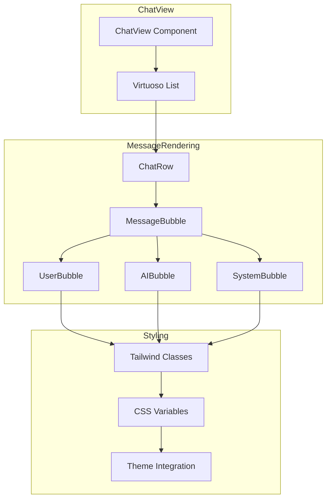

# Design Document: Chat Bubble UI System

## Overview

This design document outlines the implementation of a modern bubble-style UI system for the Kilo Code chat interface. The system will transform the current flat message layout into a visually engaging conversation interface with distinct bubbles for user messages, AI responses, and system notifications.

The design follows VSCode's design language while introducing modern chat UI patterns. It integrates seamlessly with the existing ChatRow and ChatView components, using Tailwind CSS for styling and maintaining compatibility with the virtualized list (Virtuoso) for performance.

## Architecture



### Component Hierarchy

1. **ChatView** - Main container, manages message list and input
2. **ChatRow** - Wrapper for individual messages, handles height tracking
3. **MessageBubble** - New component that determines bubble type and applies styling
4. **UserBubble** - Styled container for user messages
5. **AIBubble** - Styled container for AI responses
6. **SystemBubble** - Styled container for system messages and tool outputs

## Components and Interfaces

### MessageBubble Component

The core component that wraps message content with appropriate bubble styling.

```typescript
interface MessageBubbleProps {
	/** The type of message sender */
	variant: "user" | "ai" | "system"
	/** Whether this message is part of a consecutive group from same sender */
	isGrouped?: boolean
	/** Whether the message is currently streaming */
	isStreaming?: boolean
	/** Whether the message is highlighted (e.g., from timeline click) */
	isHighlighted?: boolean
	/** Whether the message is in edit mode */
	isEditing?: boolean
	/** Child content to render inside the bubble */
	children: React.ReactNode
	/** Optional className for additional styling */
	className?: string
}

function MessageBubble({
	variant,
	isGrouped = false,
	isStreaming = false,
	isHighlighted = false,
	isEditing = false,
	children,
	className,
}: MessageBubbleProps): JSX.Element
```

### BubbleContainer Component

A lower-level component for consistent bubble styling.

```typescript
interface BubbleContainerProps {
	/** Alignment of the bubble */
	align: "left" | "right" | "center" | "full"
	/** Background color variant */
	colorVariant: "user" | "ai" | "system" | "error"
	/** Whether to show reduced spacing (for grouped messages) */
	reducedSpacing?: boolean
	/** Children to render */
	children: React.ReactNode
	/** Additional className */
	className?: string
}
```

### Message Type Detection

Utility function to determine message bubble type from ClineMessage:

```typescript
type BubbleVariant = "user" | "ai" | "system"

function getBubbleVariant(message: ClineMessage): BubbleVariant {
	// User messages: type === 'ask' with specific ask types
	if (message.type === "ask") {
		const userAskTypes = ["followup", "completion_result", "resume_task"]
		if (userAskTypes.includes(message.ask || "")) {
			return "user"
		}
	}

	// System messages: tool outputs, commands, errors
	const systemSayTypes = [
		"api_req_started",
		"api_req_finished",
		"command_output",
		"tool",
		"error",
		"mcp_server_request_started",
	]
	if (message.say && systemSayTypes.includes(message.say)) {
		return "system"
	}

	// AI messages: text responses
	if (message.say === "text" || message.type === "say") {
		return "ai"
	}

	return "system" // Default fallback
}
```

## Data Models

### Bubble Style Configuration

```typescript
interface BubbleStyleConfig {
	/** CSS class for background color */
	bgClass: string
	/** CSS class for text color */
	textClass: string
	/** CSS class for border (if any) */
	borderClass?: string
	/** Alignment class */
	alignClass: string
	/** Max width class */
	maxWidthClass: string
	/** Padding classes */
	paddingClass: string
	/** Border radius class */
	radiusClass: string
}

const BUBBLE_STYLES: Record<BubbleVariant, BubbleStyleConfig> = {
	user: {
		bgClass: "bg-vscode-button-background/20",
		textClass: "text-vscode-foreground",
		alignClass: "ml-auto",
		maxWidthClass: "max-w-[80%]",
		paddingClass: "px-3 py-2",
		radiusClass: "rounded-2xl rounded-br-sm",
	},
	ai: {
		bgClass: "bg-vscode-editor-background",
		textClass: "text-vscode-foreground",
		borderClass: "border border-vscode-editorGroup-border",
		alignClass: "mr-auto",
		maxWidthClass: "max-w-[85%]",
		paddingClass: "px-3 py-2",
		radiusClass: "rounded-2xl rounded-bl-sm",
	},
	system: {
		bgClass: "bg-vscode-editorGroup-border/30",
		textClass: "text-vscode-descriptionForeground",
		alignClass: "mx-auto",
		maxWidthClass: "max-w-full",
		paddingClass: "px-3 py-2",
		radiusClass: "rounded-lg",
	},
}
```

### Spacing Configuration

```typescript
interface SpacingConfig {
	/** Normal spacing between different senders */
	normal: string
	/** Reduced spacing for consecutive messages from same sender */
	grouped: string
	/** Internal padding */
	internal: string
}

const BUBBLE_SPACING: SpacingConfig = {
	normal: "mt-3", // 12px
	grouped: "mt-1", // 4px
	internal: "p-3", // 12px
}
```

## Correctness Properties

_A property is a characteristic or behavior that should hold true across all valid executions of a system—essentially, a formal statement about what the system should do. Properties serve as the bridge between human-readable specifications and machine-verifiable correctness guarantees._

### Property 1: Variant-Based Styling Consistency

_For any_ message with a given variant (user, ai, or system), the MessageBubble component SHALL render with the correct combination of background class, alignment class, and border-radius class as defined in BUBBLE_STYLES configuration.

**Validates: Requirements 1.1, 1.2, 1.3, 2.1, 2.2, 2.3, 3.1, 3.2**

### Property 2: Spacing Based on Grouping State

_For any_ MessageBubble with a given isGrouped state, the component SHALL apply the correct spacing class: reduced spacing (mt-1) when isGrouped is true, normal spacing (mt-3) when isGrouped is false.

**Validates: Requirements 4.1, 4.2, 4.3**

### Property 3: State-Based Visual Indicators

_For any_ MessageBubble with state flags (isStreaming, isHighlighted, isEditing), the component SHALL apply the corresponding visual indicator classes or elements when the flag is true, and SHALL NOT apply them when the flag is false.

**Validates: Requirements 1.5, 2.5, 5.1, 5.2**

### Property 4: Theme Variable Usage

_For any_ color-related CSS class used in MessageBubble, the class SHALL reference VSCode CSS variables (--vscode-\*) and SHALL NOT contain hardcoded color values (hex, rgb, hsl).

**Validates: Requirements 6.1, 6.4**

### Property 5: Accessibility Attributes

_For any_ MessageBubble rendered with interactive content, the component SHALL include appropriate ARIA attributes (role, aria-label) to support screen readers.

**Validates: Requirements 7.3**

### Property 6: Efficient CSS Implementation

_For any_ MessageBubble component, styling SHALL be applied via className props using Tailwind classes, and SHALL NOT use inline style objects for properties that are consistent across instances.

**Validates: Requirements 8.4**

### Property 7: Maximum Width Constraints

_For any_ MessageBubble regardless of content length, the bubble SHALL have a max-width class that constrains it to at most 85% of the container width for AI messages and 80% for user messages.

**Validates: Requirements 4.4**

### Property 8: Image Content Containment

_For any_ user message containing images, the images SHALL be rendered within the bubble container as child elements.

**Validates: Requirements 1.4**

## Error Handling

### Invalid Message Types

When a message type cannot be determined, the system defaults to 'system' variant styling to ensure graceful degradation.

```typescript
function getBubbleVariant(message: ClineMessage): BubbleVariant {
	try {
		// ... variant detection logic
	} catch {
		return "system" // Safe fallback
	}
}
```

### Missing Theme Variables

CSS fallbacks are provided for cases where VSCode theme variables might not be defined:

```css
.bubble-user {
	background-color: var(--vscode-button-background, rgba(0, 122, 204, 0.2));
}
```

### Streaming State Errors

If streaming state becomes inconsistent, the component gracefully handles by not showing the streaming indicator rather than breaking the UI.

## Testing Strategy

### Unit Tests

Unit tests will verify specific examples and edge cases:

1. **Component Rendering**: Test that MessageBubble renders without errors for each variant
2. **Props Handling**: Test that all props are correctly applied to the rendered output
3. **Edge Cases**: Test empty content, very long content, special characters
4. **Accessibility**: Test ARIA attributes are present and correct

### Property-Based Tests

Property-based tests will use **fast-check** library to verify universal properties:

1. **Variant Styling Property**: Generate random variants and verify correct classes
2. **Spacing Property**: Generate random grouping states and verify spacing
3. **State Flags Property**: Generate random state combinations and verify indicators
4. **Theme Variables Property**: Verify no hardcoded colors in class definitions

Configuration:

- Minimum 100 iterations per property test
- Each test tagged with: **Feature: chat-bubble-ui, Property {number}: {property_text}**

### Integration Tests

1. Test MessageBubble integration with ChatRow
2. Test bubble rendering within Virtuoso list
3. Test theme switching behavior

## Implementation Notes

### CSS Classes to Add

New Tailwind classes needed in `index.css`:

```css
/* Bubble-specific hover effects */
.bubble-hover:hover {
	@apply bg-opacity-80 transition-colors duration-150;
}

/* Streaming indicator animation */
@keyframes bubble-pulse {
	0%,
	100% {
		opacity: 1;
	}
	50% {
		opacity: 0.7;
	}
}

.bubble-streaming {
	animation: bubble-pulse 1.5s ease-in-out infinite;
}
```

### Migration Strategy

1. Create MessageBubble component without modifying ChatRow
2. Integrate MessageBubble into ChatRow with feature flag
3. Test thoroughly with existing functionality
4. Remove feature flag and old styling

### File Structure

```
webview-ui/src/components/chat/
├── MessageBubble/
│   ├── index.ts
│   ├── MessageBubble.tsx
│   ├── MessageBubble.test.tsx
│   ├── BubbleContainer.tsx
│   ├── bubbleStyles.ts
│   └── bubbleUtils.ts
├── ChatRow.tsx (modified)
└── ChatView.tsx (minimal changes)
```
