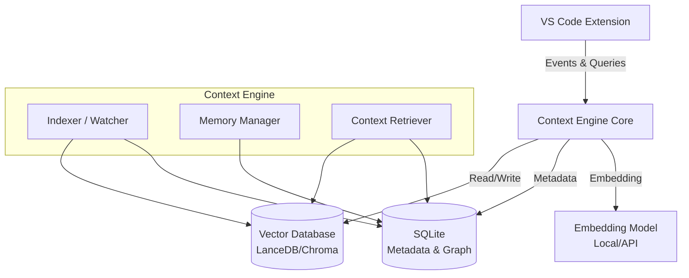
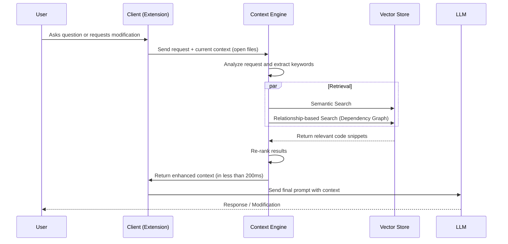

# Advanced Context System Design

## Overview

This design aims to develop Kilo Code's capabilities in managing Context and Memory with indexing to emulate systems like "Augment Code". The system relies on semantic indexing and static code analysis to build a knowledge graph and deep project understanding.

## Infrastructure Architecture

The system uses a hybrid architecture combining extension components with background services to ensure high performance without impacting editor responsiveness.

## Core Components

### 1. Indexing System

Responsible for reading code and converting it into searchable and understandable formats.

| Component        | Function                                                                                                      | Proposed Technology                                   |
| :--------------- | :------------------------------------------------------------------------------------------------------------ | :---------------------------------------------------- |
| **File Watcher** | Real-time monitoring of file creation, modification, and deletion for automatic index updates (CRUD Support). | `Chokidar` / `VSCode FileSystemWatcher`               |
| **AST Parser**   | Code analysis to understand functions, classes, and relationships (Imports/Inheritance).                      | `Tree-sitter`                                         |
| **Chunker**      | Breaking files into logical units (Block-based Chunking) instead of direct text splitting.                    | Custom Logic based on AST                             |
| **Embedder**     | Converting code snippets into vectors for semantic search.                                                    | `OpenAI text-embedding-3-small` / `Voyage AI` / Local |

**Operation Mechanism:**

1. On project opening, the system performs a full scan.
2. Each file is analyzed by Tree-sitter to extract structure.
3. A summary is generated for each function/class.
4. Code + summary are converted to Embeddings and stored in Vector DB.

### 2. Memory System

Responsible for retaining information over time to reduce repetition and improve answer accuracy.

- **Short-term Memory:** Storing current session details and recently opened files (Rolling Window).
- **Long-term Memory:** Storing user preferences, recurring code patterns, and previous architectural decisions.
- **Ephemeral Memory:** Storing temporary search results and current stack traces.

**Data Structure:**
Memory is stored in `SQLite` as key-value pairs or structured JSON documents with metadata.

### 3. Framework Support (Complex Framework Awareness - Odoo Example)

For handling large projects like **Odoo**, textual search is insufficient. A **dependency graph** must be built:

- **Cross-Language Linking:**
    - Linking Python fields (`fields.Char`) with their definitions in XML files (`<field name="...">`).
    - Understanding Odoo inheritance (`_inherit`) and how classes modify across hundreds of files.
- **Module Graph Analysis:**
    - Reading `__manifest__.py` and understanding module loading order (`depends`).
    - Understanding `csv` permission files (`ir.model.access.csv`).
- **Advanced XML Support:** Adding special support for `.xml` files to extract `record id`, `model`, and `xpath`.

### 4. Context Engine

Responsible for gathering appropriate information and sending it to the LLM.

**Retrieval Strategy:**

1. **Hybrid Search:** Combining semantic search (Vector Search) with exact text search (BM25) to ensure keyword and similar code discovery.
2. **Re-ranking:** Reordering retrieved results using Cross-encoder to ensure the most relevant results are sent to the model.
3. **Graph Traversal:** Tracing code relationships (such as finding function definitions used in the current file) to automatically enrich context.

### 5. Settings and Control Panel

A dedicated interface for users to control context system behavior:

- **Indexing Management:** "Re-index Project" button for manual re-indexing, and indexing status indicator.
- **Memory Customization:** Options to clear short/long-term memory, or browse what the system remembers.
- **Framework Settings:**
    - Specify `custom_addons` paths for Odoo.
    - Enable/disable specific features (like: XML Parsing).
- **Debug View:** Window for developers to see retrieved chunks and embeddings for each query.
- **Resource Management:**
    - Control CPU usage during background indexing (CPU Usage: Low/Medium/High).
    - Set maximum RAM consumption limit for the database.
    - Power-saving mode to pause intensive indexing when on battery.

## Data Flow

## Implementation Roadmap

### Phase 1: Foundation

- [ ] Set up local LanceDB vector database
- [ ] Build basic indexer component
- [ ] Enable code analysis using Tree-sitter for core languages (Python, JS, TS)
- [ ] Implement file watcher for automatic updates (CRUD)

### Phase 2: Integration

- [ ] Design and build settings UI in the extension
- [ ] Connect context engine with chat interface
- [ ] Enable basic semantic search
- [ ] Display context-used files to the user

### Phase 3: Advanced Context

- [ ] Implement hybrid search (BM25 + Vector)
- [ ] Build re-ranking system to improve result accuracy
- [ ] Implement long-term memory system

### Phase 4: Framework Support (Odoo)

- [ ] Add Odoo-specific XML file analysis support
- [ ] Build dependency graph from `__manifest__.py`
- [ ] Implement cross-language linking (Python with XML)
- [ ] Understand Odoo inheritance system and track modified fields

### Phase 5: Optimization

- [ ] Implement resource management settings (CPU/RAM limits)
- [ ] Optimize retrieval speed (Latency < 200ms)
- [ ] Move indexing to run completely in background worker
- [ ] Compress database size and optimize memory consumption
