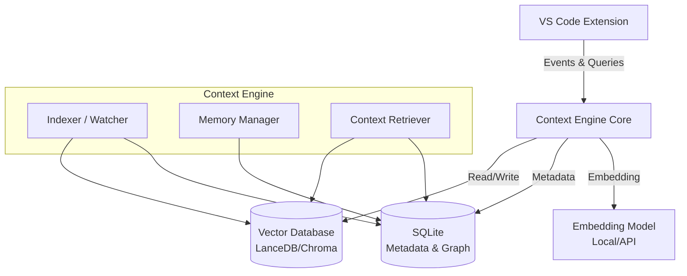
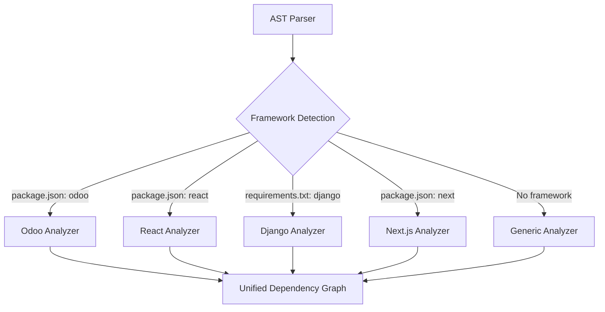
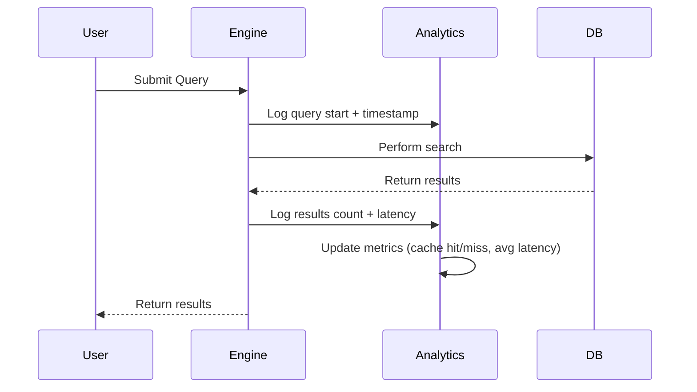
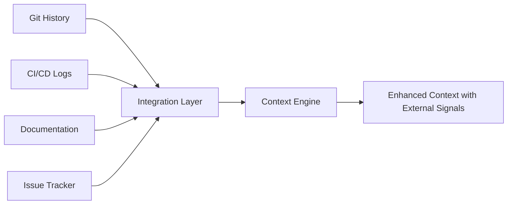
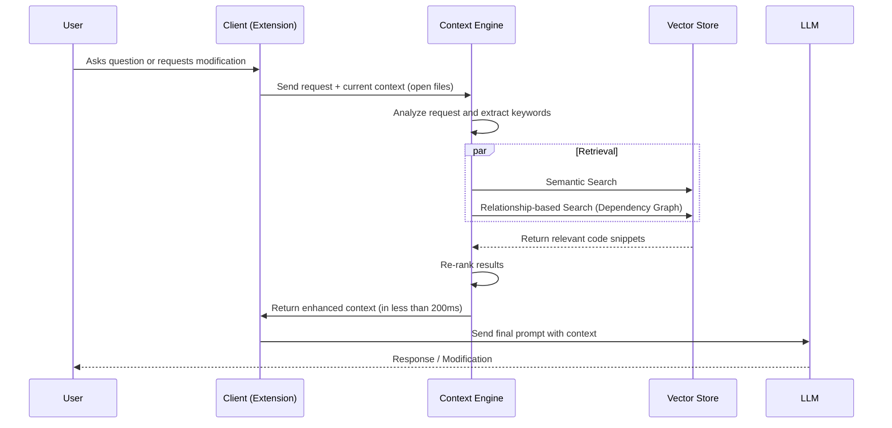

# Advanced Context System Design

## Overview

This design aims to develop Kilo Code's capabilities in managing Context and Memory using a **Code-RAG (Retrieval-Augmented Generation)** architecture. It relies on semantic indexing and static analysis to emulate systems like "Augment Code", building a knowledge graph for deep project understanding.

## Embedding Models Comparison

Choosing the right embedding model is critical for system performance and accuracy:

| Model                         | Dimensions | Speed  | Cost   | Use Case                        | Offline Support |
| :---------------------------- | :--------- | :----- | :----- | :------------------------------ | :-------------- |
| OpenAI text-embedding-3-small | 1536       | Fast   | Low    | General purpose code            | ❌              |
| OpenAI text-embedding-3-large | 3072       | Medium | Medium | High accuracy needs             | ❌              |
| Voyage Code-2                 | 1024       | Medium | Medium | Code-specific semantic search   | ❌              |
| CodeBERT (Local)              | 768        | Slow   | Free   | Privacy-focused projects        | ✅              |
| StarEncoder                   | 768        | Medium | Free   | Multilingual code understanding | ✅              |
| UniXcoder (Local)             | 768        | Medium | Free   | Cross-language code search      | ✅              |

**Recommendation:** Start with OpenAI text-embedding-3-small for rapid development, then offer local models (CodeBERT/StarEncoder) as privacy-focused alternatives.

## Infrastructure Architecture

The system uses a hybrid architecture combining extension components with background services to ensure high performance without impacting editor responsiveness.

## Core Components

### 1. Indexing System

Responsible for reading code and converting it into searchable and understandable formats.

| Component        | Function                                                                                                      | Proposed Technology                                   |
| :--------------- | :------------------------------------------------------------------------------------------------------------ | :---------------------------------------------------- |
| **File Watcher** | Real-time monitoring of file creation, modification, and deletion for automatic index updates (CRUD Support). | `Chokidar` / `VSCode FileSystemWatcher`               |
| **AST Parser**   | Code analysis to understand functions, classes, and relationships (Imports/Inheritance).                      | `Tree-sitter`                                         |
| **Chunker**      | Breaking files into logical units (Block-based Chunking) instead of direct text splitting.                    | Custom Logic based on AST                             |
| **Embedder**     | Converting code snippets into vectors for semantic search.                                                    | `OpenAI text-embedding-3-small` / `Voyage AI` / Local |

**Operation Mechanism:**

1. On project opening, the system performs a full scan.
2. Each file is analyzed by Tree-sitter to extract structure.
3. A summary is generated for each function/class.
4. Code + summary are converted to Embeddings and stored in Vector DB.

### 2. Memory System

Responsible for retaining information over time to reduce repetition and improve answer accuracy.

- **Short-term Memory:** Storing current session details and recently opened files (Rolling Window).
- **Long-term Memory:** Storing user preferences, recurring code patterns, and previous architectural decisions.
- **Ephemeral Memory:** Storing temporary search results and current stack traces.

**Data Structure:**
Memory is stored in `SQLite` as key-value pairs or structured JSON documents with metadata.

### 3. Multi-Framework Support (Complex Framework Awareness)

For handling large projects with specific frameworks, textual search is insufficient. Framework-specific analyzers must be built:

#### 3.1 Odoo ERP Framework

- **Cross-Language Linking:**
    - Linking Python fields (`fields.Char`) with their definitions in XML files (`<field name="...">`).
    - Understanding Odoo inheritance (`_inherit`) and how classes modify across hundreds of files.
- **Module Graph Analysis:**
    - Reading `__manifest__.py` and understanding module loading order (`depends`).
    - Understanding `csv` permission files (`ir.model.access.csv`).
- **Advanced XML Support:** Adding special support for `.xml` files to extract `record id`, `model`, and `xpath`.

#### 3.2 React/Vue/Angular Frameworks

- **Component Hierarchy:** Understanding parent-child relationships in component trees.
- **Props/Events Flow:** Tracking data flow between components.
- **State Management:** Understanding Redux/Vuex/NgRx patterns and global state.
- **Hooks/Lifecycle:** Analyzing component lifecycle and custom hooks.

#### 3.3 Django/FastAPI Backend Frameworks

- **URL Routing:** Mapping URLs → Views → Models automatically.
- **ORM Relationships:** Understanding `ForeignKey`, `ManyToMany` relationships.
- **Middleware Chain:** Tracking request/response processing pipeline.
- **Serializers/Schemas:** Linking API endpoints with data validation.

#### 3.4 Next.js/Nuxt.js Meta-Frameworks

- **App Router:** Understanding file-based routing conventions.
- **Server Components:** Differentiating client vs server components.
- **API Routes:** Mapping API endpoints to handlers.
- **Layouts/Templates:** Understanding nested layout hierarchy.

### 4. Context Engine

Responsible for gathering appropriate information and sending it to the LLM.

**Advanced Retrieval Strategy:**

1. **Hybrid Search:** Combining semantic search (Vector Search) with exact text search (BM25) to ensure keyword and similar code discovery.
2. **Query Expansion:** Automatically expanding user queries with synonyms and related terms (e.g., "button" → "button, click handler, event listener").
3. **Re-ranking:** Reordering retrieved results using Cross-encoder to ensure the most relevant results are sent to the model.
4. **Graph Traversal:** Tracing code relationships (such as finding function definitions used in the current file) to automatically enrich context.
5. **Multi-hop Reasoning:** Following relationships across multiple levels (e.g., Function → Calls → Uses → Imports).
6. **Temporal Context:** Prioritizing recently modified files and active workspace areas.
7. **Context Pruning:** Smart removal of irrelevant imports, comments, and boilerplate to save LLM context tokens.

### 5. Settings and Control Panel

A dedicated interface for users to control context system behavior:

- **Indexing Management:** "Re-index Project" button for manual re-indexing, and indexing status indicator.
- **Memory Customization:** Options to clear short/long-term memory, or browse what the system remembers.
- **Framework Settings:**
    - Specify `custom_addons` paths for Odoo.
    - Enable/disable specific features (like: XML Parsing).
- **Debug View:** Window for developers to see retrieved chunks and embeddings for each query.
- **Resource Management:**
    - Control CPU usage during background indexing (CPU Usage: Low/Medium/High).
    - Set maximum RAM consumption limit for the database.
    - Power-saving mode to pause intensive indexing when on battery.

### 6. Caching & Performance Strategy

To ensure high performance and responsiveness:

**Caching Layers:**

| Cache Type          | Lifetime   | Purpose                            | Invalidation Trigger        |
| :------------------ | :--------- | :--------------------------------- | :-------------------------- |
| **Query Cache**     | 5 minutes  | Store results of identical queries | Manual clear or time expiry |
| **Embedding Cache** | Persistent | Avoid re-embedding unchanged code  | File modification           |
| **Graph Cache**     | Session    | Store dependency graph queries     | File add/delete/modify      |
| **Metadata Cache**  | Persistent | Store AST parsing results          | File content change         |

**Incremental Indexing:**

- Only re-index modified sections of files, not entire files.
- Use diff-based analysis to detect changed functions/classes.
- Batch small changes and index every 5 seconds instead of on every keystroke.

**Performance Targets:**

| Metric               | Target           | Measurement                         |
| :------------------- | :--------------- | :---------------------------------- |
| Query Latency (p50)  | < 100ms          | Time from query to results          |
| Query Latency (p95)  | < 200ms          | 95th percentile response time       |
| Indexing Speed       | > 1000 files/min | Initial project scan                |
| Memory Footprint     | < 500MB          | For 10k file project                |
| CPU Usage (Idle)     | < 5%             | Background monitoring only          |
| CPU Usage (Indexing) | Configurable     | 25% (Low) / 50% (Med) / 100% (High) |

**Database Size Estimates:**

- Small Project (< 1k files): ~50-100 MB
- Medium Project (1k-10k files): ~100-500 MB
- Large Project (10k-100k files): ~500MB-2GB
- Enterprise (Odoo full source): ~2-5 GB

### 7. Performance Metrics & Monitoring

**Real-time Monitoring Dashboard:**

A dedicated panel in the extension UI showing:

- **Indexing Progress:** Files indexed / Total files, with progress bar
- **Database Stats:** Size on disk, number of embeddings, last update time
- **Query Analytics:**
    - Average query latency (last 100 queries)
    - Cache hit rate percentage
    - Most frequently searched terms
- **Resource Usage:**
    - Current CPU usage by indexer
    - RAM consumption
    - Disk I/O activity

**Query Analytics Tracking:**

**Health Checks:**

- Automatic detection of indexing stalls or crashes
- Alert user if database becomes corrupted
- Suggest re-indexing if search quality degrades

### 8. Testing & Validation Strategy

To ensure zero-regression and high reliability:

- **Unit Testing:**
    - Test `Tree-sitter` parsers with diverse code samples (syntax errors, partial code).
    - Verify `Chunking` logic to ensure large functions are split correctly.
- **Integration Testing:**
    - End-to-end flow: Create File -> Auto Index -> Query -> Verify Result.
    - Test persistence (Restart IDE -> Check if memory remains).
- **Retrieval Evaluation (Benchmarks):**
    - Create a "Golden Dataset" of questions and expected code files.
    - Measure **Recall@k** (Did we find the right file in top 5 results?).
    - Measure **Precision** (How much noise was retrieved?).
- **Stress Testing:**
    - Index a massive repo (e.g., full Odoo source ~2GB) to verify stability and memory limits.

### 9. Enhanced Security & Privacy

**Secret & PII Protection:**

- **Secret Filtering:** Pre-processing step to detect and redact API Keys, Passwords, Tokens before embedding using regex patterns:
    - `[A-Za-z0-9_-]{32,}` (API keys)
    - `password\s*=\s*["'][^"']+["']` (password assignments)
    - Email addresses, phone numbers, SSNs
- **Privacy Controls:**
    - `.kiloignore` file support to exclude sensitive folders (`.env`, `secrets/`, `credentials/`).
    - Option to disable cloud-based embedding and use only local models.
    - Automatic exclusion of common secret files (`.env.*`, `*.pem`, `*.key`).

**Code Sandboxing:**

- Execute AST parsing in isolated worker threads to prevent malicious code execution.
- Timeout mechanism (5 seconds max) for parser operations to prevent DoS.

**Encryption:**

- **Encryption at Rest:** SQLite database encrypted using SQLCipher.
- **User Control:** Option to enable/disable encryption (performance vs security tradeoff).

**User Feedback & Learning:**

- **Feedback Loop:** Users can mark retrieved context as "👍 Relevant" or "👎 Irrelevant".
- **Adaptive Ranking:** System down-weights files/patterns marked as irrelevant in future queries.
- **Privacy-Preserving:** All feedback stored locally, never sent to external servers.

## Integration with External Tools

### Git History Integration

- **Commit Context Awareness:** Parse git history to understand:
    - Which files are frequently modified together (co-change analysis).
    - Author expertise mapping (who works on which modules).
    - Bug-fix patterns (files often fixed together indicate dependencies).
- **Blame-based Context:** When showing code, include "Last modified by X, Y days ago" for better context.

### CI/CD Integration

- **Error Log Linking:** Parse CI/CD error logs and link stack traces to relevant code files.
- **Test Failure Context:** When tests fail, automatically surface related code chunks.
- **Build Artifact Analysis:** Understand compiled output to improve source mapping.

### Documentation Integration

- **README Parsing:** Extract project architecture and module descriptions from README.md.
- **Docstring Linking:** Link code functions to their documentation comments.
- **External Docs:** Support for linking to framework docs (e.g., "This is a React Hook" → React Hooks documentation).

### Issue Tracker Integration

- **Jira/GitHub Issues:** Link code files mentioned in issues/PRs to provide historical context.
- **TODO Comments:** Extract and index TODO/FIXME/HACK comments for code debt tracking.

## Migration & Upgrade Strategy

### Schema Versioning

- **Version Tracking:** Each database includes a `schema_version` metadata field.
- **Migration Scripts:** Automated migration from v1 → v2 → v3 as system evolves.
- **Rollback Support:** Ability to downgrade if newer version causes issues.

### Backward Compatibility

- **Legacy Project Support:** Older projects indexed with previous versions remain functional.
- **Graceful Degradation:** If new features aren't available, fall back to basic search.
- **Progressive Enhancement:** New features enabled incrementally as projects are re-indexed.

### Data Migration Process

1. **Backup:** Automatic backup of existing database before migration.
2. **Schema Update:** Apply SQL scripts to update table structure.
3. **Data Transformation:** Convert embeddings if model changes (with re-embedding option).
4. **Validation:** Verify data integrity post-migration.
5. **Cleanup:** Remove deprecated fields/tables after successful migration.

### Upgrade Notification

- User-friendly notifications: "New indexing improvements available. Re-index now to benefit."
- Background re-indexing option: "Re-index during idle time (low priority)."
- Skip option with understanding of trade-offs: "Continue with current index (may reduce accuracy)."

## Data Flow

## Implementation Roadmap

### Phase 1: Foundation

- [ ] Set up local LanceDB vector database
- [ ] Build basic indexer component
- [ ] Enable code analysis using Tree-sitter for core languages (Python, JS, TS)
- [ ] Implement file watcher for automatic updates (CRUD)

### Phase 2: Integration

- [ ] Design and build settings UI in the extension
- [ ] Connect context engine with chat interface
- [ ] Enable basic semantic search
- [ ] Display context-used files to the user

### Phase 3: Advanced Context

- [ ] Implement hybrid search (BM25 + Vector)
- [ ] Build re-ranking system to improve result accuracy
- [ ] Implement long-term memory system

### Phase 4: Framework Support (Odoo)

- [ ] Add Odoo-specific XML file analysis support
- [ ] Build dependency graph from `__manifest__.py`
- [ ] Implement cross-language linking (Python with XML)
- [ ] Understand Odoo inheritance system and track modified fields

### Phase 5: Optimization & Security

- [ ] Implement resource management settings (CPU/RAM limits)
- [ ] Optimize retrieval speed (Latency < 200ms)
- [ ] Move indexing to run completely in background worker
- [ ] Compress database size and optimize memory consumption
- [ ] Implement Secret/PII filtering in indexer

### Phase 6: Testing & QA

- [ ] Write Unit Tests for Parsers and Chunkers
- [ ] Build "Retrieval Benchmark" suite to measure search accuracy
- [ ] Perform Stress Test on large repositories (Odoo/Linux Kernel)
- [ ] Implement User Feedback Loop (Thumbs up/down on context)
