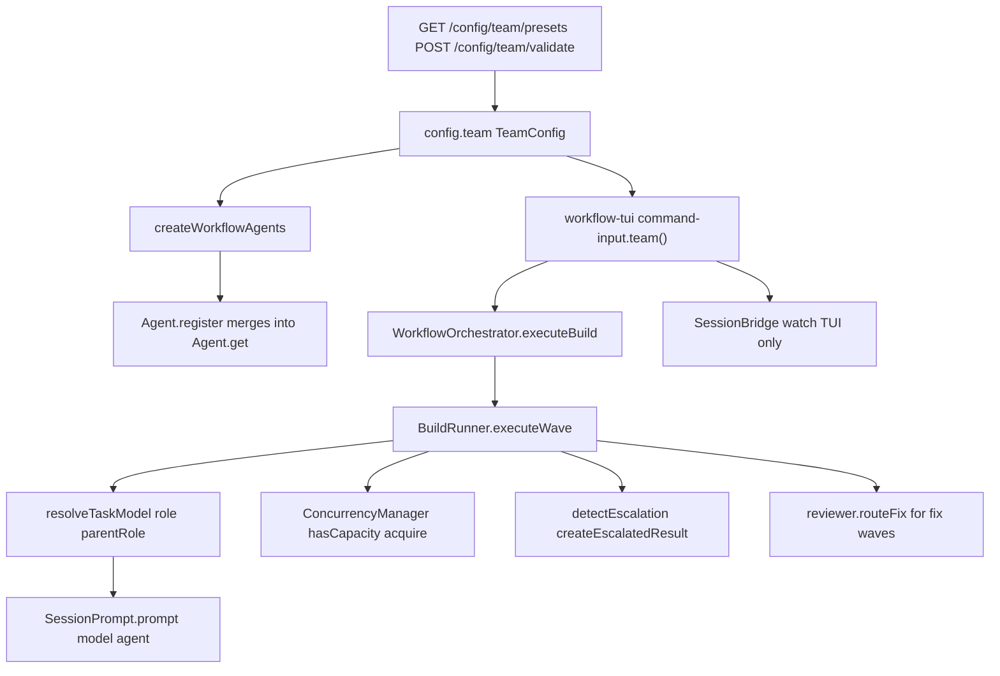
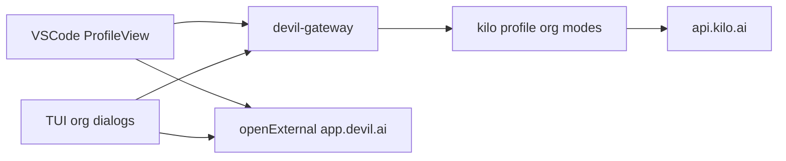

# Devil Code Monorepo — End-to-End Code Audit (Authoritative)

**Audit date:** 2026-04-17  
**Supersedes:** Reports archived under [archive/audit-2026-04-15/](archive/audit-2026-04-15/) (see [Prior reports (archived)](#prior-reports-archived)).  
**Repository:** `devilcode` monorepo (Turborepo + Bun).

---

## How to use this document (for implementers)

Each **finding** uses this template:

- **ID** — Stable identifier (e.g. `C7`, `MA1`, `OB3`, `N5`).
- **Severity** — CRITICAL | HIGH | MEDIUM | LOW.
- **Files** — Paths relative to repo root; line numbers are approximate; re-verify with search before editing.
- **Symptom** — What users or operators observe.
- **Root cause** — Why the code behaves that way.
- **Fix steps** — Numbered, file-specific steps a less-capable model can follow.
- **Verify** — Commands or tests that prove the fix.
- **Related** — Links to older audit IDs where applicable.

---

## Executive summary

This audit **re-verifies** the 2026-04-10/2026-04-15 master report items against current `HEAD`, **maps two distinct “teams” flows** end-to-end, and **adds** post–4/15 findings (N-series).

| Area | Top risks |
|------|-----------|
| **Multi-agent Team runtime** | Hardcoded `parentRole: "orchestrator"` in workflow build; `routeFix` hardcodes `"senior"`; escalation tags without re-dispatch; reactions schema unused; wave-level concurrency TOCTOU; preset/config drift across app vs server. |
| **Organization “Teams” product** | Most SaaS features (invite, billing, seats, dashboard CRUD, custom-modes write, audit, SSO) are **not in this repo**; client is login + org switch + balance + read-only modes + external links to `app.devil.ai`. |
| **Security / server** | Rate limiting still disabled (`server.ts`); OPTIONS bypasses auth when password set (documented tradeoff). |
| **App placeholders** | MCP / Commands / Agents settings in `packages/app` are still “future update” copy only. |
| **Tooling** | `check-devilcode-change` uses `grep` and fails on Windows without Git Bash; run in CI/Linux or WSL. |

**Build snapshot (2026-04-17):**

| Check | Result | Notes |
|-------|--------|--------|
| `bun turbo typecheck` | **PASS** | All 17 in-scope packages. |
| `bun run knip` (cwd `packages/devil-vscode`) | **PASS** | No unused-export output. |
| `bun run script/extract-source-links.ts` | **PASS** | Rewrites `packages/devil-docs/source-links.md`; commit if URLs changed. |
| `bun run script/check-opencode-annotations.ts` | **PASS** | No shared opencode files changed in this session. |
| `bun run check-devilcode-change` (vscode) | **FAIL on Windows** | Script uses `grep` / `!`; use Linux CI or Git Bash. |
| `bun test` (cwd `packages/opencode`) | **Many failures on Windows** | Includes `RemoteSender`, `RemoteWS`, `config resilience`, provider tests, etc. **Treat Linux CI as source of truth.** Observed: `(fail) integration: BuildRunner... cleans up worktrees` — `Instance.project.vcs` undefined in test context (`worktree-family.ts:8`). |

**Smoke:** `bun dev -- help` — **PASS** (CLI prints help). `bun run extension` (VS Code launch) was **not** run — it opens an editor; validate in CI or locally when needed.

---

## Prior reports (archived)

The following files were moved to **[archive/audit-2026-04-15/](archive/audit-2026-04-15/)** (not deleted):

| Original filename | Archive path |
|-------------------|--------------|
| `E2E_CODE_AUDIT_MASTER_REPORT.md` | [archive/audit-2026-04-15/E2E_CODE_AUDIT_MASTER_REPORT.md](archive/audit-2026-04-15/E2E_CODE_AUDIT_MASTER_REPORT.md) |
| `BACKEND_ARCHITECTURE_AUDIT.md` | [archive/audit-2026-04-15/BACKEND_ARCHITECTURE_AUDIT.md](archive/audit-2026-04-15/BACKEND_ARCHITECTURE_AUDIT.md) |
| `broken-flows-audit-report.md` | [archive/audit-2026-04-15/broken-flows-audit-report.md](archive/audit-2026-04-15/broken-flows-audit-report.md) |
| `TESTING_CI_AUDIT_REPORT.md` | [archive/audit-2026-04-15/TESTING_CI_AUDIT_REPORT.md](archive/audit-2026-04-15/TESTING_CI_AUDIT_REPORT.md) |
| `API_INTEGRATION_AUDIT_REPORT.md` | [archive/audit-2026-04-15/API_INTEGRATION_AUDIT_REPORT.md](archive/audit-2026-04-15/API_INTEGRATION_AUDIT_REPORT.md) |
| `CODE_AUDIT_REPORT.md` | [archive/audit-2026-04-15/CODE_AUDIT_REPORT.md](archive/audit-2026-04-15/CODE_AUDIT_REPORT.md) |
| `AUDIT_QUICK_REFERENCE.md` | [archive/audit-2026-04-15/AUDIT_QUICK_REFERENCE.md](archive/audit-2026-04-15/AUDIT_QUICK_REFERENCE.md) |
| `FIX_PASS_GUIDE.md` | [archive/audit-2026-04-15/FIX_PASS_GUIDE.md](archive/audit-2026-04-15/FIX_PASS_GUIDE.md) |

---

## Reconciliation: prior CRITICAL (C1–C12) vs HEAD

| ID | Status | Evidence (HEAD) |
|----|--------|-----------------|
| C1 Empty catch cache migration | **FIXED** | `packages/opencode/src/global/index.ts` — catch logs `cache migration failed`. |
| C2 ACP `authenticate` throws | **FIXED** | `packages/opencode/src/acp/agent.ts` — `authenticate` is documented no-op; no throw. |
| C3 LLM `_streamFim` / `_streamComplete` not implemented | **PARTIAL** | `packages/devil-vscode/.../llm/index.ts` — throws informative error if subclass lacks adapter; still throws at runtime for misconfigured providers. |
| C4 Empty catch blocks (listed sites) | **FIXED** | Cited paths now log; verify with `rg "} catch \\{\\}" packages/opencode/src`. |
| C5 `FREE_PERIOD_TODO` warpgrep | **FIXED** | `packages/opencode/src/tool/warpgrep.ts` — requires `MORPH_API_KEY`; no proxy TODO. |
| C6 build-runner concurrency release | **FIXED** | `packages/opencode/src/devilcode/workflow/build-runner.ts:240-244` — `finally` releases slot. |
| C7 No rate limiting | **STILL-OPEN** | `packages/opencode/src/server/server.ts:9-10,112-121` — commented `rateLimiter`. |
| C8 Mutex unbounded queue | **FIXED** | `packages/opencode/src/devilcode/workflow/mutex.ts` — `maxQueueSize`, overflow throw. |
| C9 E2E mislabeled mocks | **FIXED** | Renamed to `workflow-state.integration.test.ts`; real fs. |
| C10 App settings placeholders | **STILL-OPEN** | `packages/app/src/components/settings-mcp.tsx:11`, `settings-commands.tsx`, `settings-agents.tsx` — "future update". |
| C11 Filesystem symlink escape | **FIXED** | `packages/opencode/src/file/index.ts` — `Filesystem.canonicalize` + containment check. |
| C12 server-manager kill | **FIXED** | `packages/devil-vscode/src/services/cli-backend/server-manager.ts` — SIGTERM + SIGKILL fallback + timer cleanup. |

---

## Reconciliation: prior HIGH (H1–H45) vs HEAD

| ID | Status | Evidence (HEAD) |
|----|--------|-----------------|
| H1 OPTIONS bypass auth | **STILL-OPEN** (by design) | `server.ts:103-106` — OPTIONS skips `basicAuth`. |
| H2 Body size limit | **FIXED** | `server.ts:122-128` — 10MB check → 413. |
| H3 CORS localhost any port | **FIXED** | Port allowlist in `server.ts` (~157–193). |
| H4 Deprecated session route | **PARTIAL** | Deprecation headers + Sunset; route still works. |
| H5 SSE security headers | **FIXED** | SSE route sets CSP / X-Frame-Options / etc. |
| H6 build-runner tests mocked | **STILL-OPEN** | `test/kilocode/workflow/build-runner.test.ts` still mocks modules; integration sibling exists. |
| H7 session-bridge mocked | **STILL-OPEN** | Mocks still present. |
| H8 workflow-tui no tests | **STILL-OPEN** | No `workflow-tui*.test.*` files. |
| H9 Team router no tests | **FIXED** | `test/kilocode/team/router.test.ts` exists. |
| H10 Visual regression skip macOS | **FIXED** | Skip removed per prior verification. |
| H11 dispatch e2e placeholder | **PARTIAL** | Skipped placeholder + `TEST-E2E-001`; other smoke added. |
| H12 locks/mutex tests | **FIXED** | `locks.test.ts`, `mutex.test.ts`. |
| H13–H24 `@ts-ignore` / `@ts-expect-error` | **PARTIAL** | Count reduced; some remain (e.g. `plugin/index.ts`). |
| H25 `let` violations | **STILL-OPEN** | e.g. `tool/edit.ts`, `tool/write.ts` — many `let`. |
| H26–H37 `any` usage | **STILL-OPEN** | e.g. `provider/provider.ts`, `util/log.ts`. |
| H38 workflow routes bare catch | **FIXED** | `workflow/routes.ts` `/status` — ENOENT vs 500 + log. |
| H39 events silent parse | **FIXED** | `workflow/events.ts` — corrupt line logging. |
| H40 sdk-sse-adapter timer | **FIXED** | `clearHeartbeat` / `resetHeartbeat`. |
| H41 permission ruleset not persisted | **FIXED** | `permission/next.ts` — persist to global + DB. |
| H42 session pricing TODO | **STILL-OPEN** | `packages/opencode/src/session/index.ts` ~1011 — reasoning token pricing TODO. |
| H43 model-cache providers | **PARTIAL** | Explicit unsupported list + debug; listing still absent for many providers. |
| H44 session prompt validation | **PARTIAL** | Zod on routes; deep part edge cases unverified. |
| H45 SDK optional permission | **FIXED** | Server + SDK agree optional `permission`. |

---

## Flow A — Multi-agent Team runtime (e2e)

### Diagram

### Stage-by-stage narrative

1. **Config** — `TeamConfig` in [`packages/opencode/src/config/config.ts`](packages/opencode/src/config/config.ts) and Zod in [`packages/opencode/src/devilcode/team/config.ts`](packages/opencode/src/devilcode/team/config.ts). `reactions[]` is accepted but **never dispatched** in runtime (no subscriber).
2. **Agent synthesis** — [`packages/opencode/src/devilcode/team/agents.ts`](packages/opencode/src/devilcode/team/agents.ts) builds agents from roles; [`packages/opencode/src/agent/agent.ts`](packages/opencode/src/agent/agent.ts) `Object.assign(result, workflowAgents)` — **name collisions overwrite user agents**.
3. **Routing** — [`packages/opencode/src/devilcode/team/router.ts`](packages/opencode/src/devilcode/team/router.ts) `resolveTaskModel`: if `hierarchical` and `parentRole` set but **missing** from `roles`, delegation is **skipped** (silent bypass).
4. **Task tool** — [`packages/opencode/src/tool/task.ts`](packages/opencode/src/tool/task.ts) uses `resolveTaskModel` + concurrency; [`packages/opencode/src/tool/tool.ts`](packages/opencode/src/tool/tool.ts) `Context.teamRole`.
5. **Workflow build** — [`packages/opencode/src/devilcode/workflow/build-runner.ts`](packages/opencode/src/devilcode/workflow/build-runner.ts) passes `parentRole: "orchestrator"` **always** (lines 164–168) — wrong for presets whose tier-1 role is not `orchestrator`.
6. **Concurrency** — [`packages/opencode/src/devilcode/team/concurrency.ts`](packages/opencode/src/devilcode/team/concurrency.ts): `acquire` does not enforce capacity; callers must `hasCapacity` first; **wave uses `Promise.all`** — parallel tasks can exceed capacity (TOCTOU).
7. **Review routing** — [`packages/opencode/src/devilcode/workflow/reviewer.ts`](packages/opencode/src/devilcode/workflow/reviewer.ts) returns `"senior"` for security/architecture/blocker correctness **without checking** `teamConfig.roles.senior`.
8. **Escalation** — [`packages/opencode/src/devilcode/workflow/escalation.ts`](packages/opencode/src/devilcode/workflow/escalation.ts): `resolveEscalationTarget` / `findParentRole` tested but **not wired** to re-dispatch tasks in `build-runner`.
9. **HTTP** — [`packages/opencode/src/server/routes/config.ts`](packages/opencode/src/server/routes/config.ts) `GET /config/team/presets`, `POST /config/team/validate`. SDK **does not** expose team types — UIs use `fetch` or config patch.
10. **UI** — VS Code: [`packages/devil-vscode/webview-ui/src/components/settings/Team*.tsx`](packages/devil-vscode/webview-ui/src/components/settings/). App: [`packages/app/src/components/settings-team.tsx`](packages/app/src/components/settings-team.tsx) — limited vs server presets.

### Flow A findings (implementer detail)

#### MA1 — Hardcoded `parentRole: "orchestrator"` in BuildRunner

- **Severity:** HIGH  
- **Files:** [`packages/opencode/src/devilcode/workflow/build-runner.ts`](packages/opencode/src/devilcode/workflow/build-runner.ts) ~164–168  
- **Symptom:** Hierarchical delegation not enforced for teams whose primary role is not `"orchestrator"`.  
- **Root cause:** Constant parent role; combined with `router.ts` if `roles[parentRole]` missing, check skipped.  
- **Fix steps:**  
  1. Derive `parentRole` from workflow state (e.g. plan wave’s `orchestrator` / `lead` role from config `routing.defaultRole` or explicit task metadata).  
  2. Add unit test: preset without `orchestrator` role + hierarchical → expect delegation error or correct parent.  
  3. Optionally: in `resolveTaskModel`, if `parentRole` not in `roles`, throw or log instead of skipping.  
- **Verify:** `bun test packages/opencode/test/kilocode/team/router.test.ts` + new build-runner tests.  
- **Related:** Prior audit workflow team.

#### MA2 — `routeFix` hardcodes `"senior"`

- **Severity:** HIGH  
- **Files:** [`packages/opencode/src/devilcode/workflow/reviewer.ts`](packages/opencode/src/devilcode/workflow/reviewer.ts) lines 7–10  
- **Symptom:** Fix tasks routed to non-existent `senior` role.  
- **Fix steps:**  
  1. Replace `return "senior"` with `teamConfig.routing.defaultRole` or a config field `routing.reviewEscalationRole` validated by Zod.  
  2. Update [`packages/opencode/test/kilocode/workflow/reviewer.test.ts`](packages/opencode/test/kilocode/workflow/reviewer.test.ts) to use a preset **without** `senior` and assert expected role.  
- **Verify:** `bun test packages/opencode/test/kilocode/workflow/reviewer.test.ts`

#### MA3 — Escalation without re-dispatch

- **Severity:** HIGH  
- **Files:** [`packages/opencode/src/devilcode/workflow/build-runner.ts`](packages/opencode/src/devilcode/workflow/build-runner.ts) (escalation block ~249+); [`packages/opencode/src/devilcode/workflow/escalation.ts`](packages/opencode/src/devilcode/workflow/escalation.ts)  
- **Symptom:** Tasks marked `escalated` but no follow-up task to `resolveEscalationTarget`.  
- **Fix steps:**  
  1. After `createEscalatedResult`, enqueue a new task or wave with role from `resolveEscalationTarget(...)`.  
  2. Or document as “tag only” and remove dead exports from public API.  
- **Verify:** Integration test with mocked `SessionPrompt` asserting second prompt with escalated role.

#### MA4 — `reactions[]` unused

- **Severity:** MEDIUM  
- **Files:** [`packages/opencode/src/devilcode/team/config.ts`](packages/opencode/src/devilcode/team/config.ts); [`packages/opencode/src/devilcode/team/presets.ts`](packages/opencode/src/devilcode/team/presets.ts)  
- **Fix steps:** Implement dispatcher subscribed to workflow events / CI signals, or remove from schema and presets until implemented.  
- **Verify:** Grep `reactions` consumers; add test when wired.

#### MA5 — Wave concurrency TOCTOU

- **Severity:** HIGH  
- **Files:** [`packages/opencode/src/devilcode/workflow/build-runner.ts`](packages/opencode/src/devilcode/workflow/build-runner.ts) — `executeWave` + `Promise.all`  
- **Fix steps:** Serialize per-role execution within a wave, or acquire all slots before spawning any task in wave.  
- **Verify:** `build-runner-concurrency.test.ts` extended for N parallel same-role tasks.

#### MA6 — Preset drift (app vs server)

- **Severity:** MEDIUM  
- **Files:** [`packages/opencode/src/devilcode/team/presets.ts`](packages/opencode/src/devilcode/team/presets.ts); [`packages/app/src/components/settings-team.tsx`](packages/app/src/components/settings-team.tsx); [`packages/devil-vscode/webview-ui/src/components/settings/TeamTemplateGallery.tsx`](packages/devil-vscode/webview-ui/src/components/settings/TeamTemplateGallery.tsx)  
- **Fix steps:** Single source of truth — only `GET /config/team/presets` or shared TS module imported by both.  
- **Verify:** Snapshot test comparing counts.

#### MA7 — `team/types.ts` dead schemas

- **Severity:** LOW  
- **Files:** [`packages/opencode/src/devilcode/team/types.ts`](packages/opencode/src/devilcode/team/types.ts)  
- **Fix steps:** Use `TeamTaskResult` in workflow result types or delete from `index.ts` exports.  
- **Verify:** `knip` / unused export check on opencode package.

#### MA8 — SessionBridge `onOutput` placeholder

- **Severity:** MEDIUM  
- **Files:** [`packages/opencode/src/devilcode/workflow/session-bridge.ts`](packages/opencode/src/devilcode/workflow/session-bridge.ts)  
- **Fix steps:** Stream message parts or document that only title is used; wire `BuildRunner` if CLI should stream.  
- **Verify:** Manual TUI test.

#### MA9 — TUI fallback roles `["senior","worker"]`

- **Severity:** MEDIUM  
- **Files:** [`packages/opencode/src/devilcode/workflow-tui/context.tsx`](packages/opencode/src/devilcode/workflow-tui/context.tsx) (search `senior`, `worker`)  
- **Fix steps:** When no team config, derive from `routing.defaultRole` or empty list with explicit error.  
- **Verify:** Plan dispatch test without team.

---

## Flow B — Organization “Teams” product (e2e)

### Diagram

### Docs vs implementation matrix

| Capability (docs under `packages/devil-docs/pages/collaborate/`) | In this repo? | Where / gap |
|------------------------------------------------------------------|---------------|-------------|
| Device auth / login | Yes | `packages/devil-gateway`, VS Code `kilo-provider/handlers/auth.ts`, TUI dialogs |
| List orgs / switch org | Yes | `POST /kilo/organization`, `AccountSwitcher`, `dialog-kilo-organization.tsx` |
| Balance | Yes | `fetchBalance` + profile UI |
| Read org custom modes | Yes | `GET /kilo/modes` + `modes-migrator.ts` |
| Create org / invite / seats / billing / invoices / audit / SSO / model blocklist | **No** | SaaS at `app.devil.ai` and `api.kilo.ai` (out of repo) |
| Dashboard UI | **Partial** | Opens external URL only |
| Custom modes CRUD | **No** | Only GET |

### Flow B findings

#### OB1 — Org role is display-only

- **Severity:** LOW  
- **Files:** [`packages/devil-gateway/src/server/routes.ts`](packages/devil-gateway/src/server/routes.ts) `Organization` schema; webview components showing `role.toUpperCase()`  
- **Fix steps:** If product requires gating, add `plan` / `permissions` from API and enforce in gateway or extension.  
- **Related:** [`packages/devil-vscode/docs/non-agent-features/authentication-organization-enterprise-enforcement.md`](packages/devil-vscode/docs/non-agent-features/authentication-organization-enterprise-enforcement.md)

#### OB2 — `/kilo/modes` errors → empty array

- **Severity:** MEDIUM  
- **Files:** [`packages/devil-gateway/src/server/routes.ts`](packages/devil-gateway/src/server/routes.ts); [`packages/devil-gateway/src/api/modes.ts`](packages/devil-gateway/src/api/modes.ts)  
- **Fix steps:** Return 401/403 JSON on auth failure; distinguish empty vs error in response shape.  
- **Verify:** Gateway unit test with mocked fetch.

#### OB3 — `enterpriseUrl` in auth unused

- **Severity:** LOW  
- **Files:** [`packages/opencode/src/auth/index.ts`](packages/opencode/src/auth/index.ts)  
- **Fix steps:** Remove field or read it in gateway client for enterprise SSO.  

#### OB4 — `fetchBalance` returns null on error

- **Severity:** MEDIUM  
- **Files:** [`packages/devil-gateway/src/api/profile.ts`](packages/devil-gateway/src/api/profile.ts)  
- **Fix steps:** Propagate error to UI toast or status code.  

#### OB5 — Docs role contradiction

- **Severity:** LOW  
- **Files:** `packages/devil-docs/pages/collaborate/teams/*.md` — Owner/Member vs Owner/Admin/Member  
- **Fix steps:** Single source of truth paragraph; link to SaaS UI.  

---

## N-series — Additional findings (post–4/15)

#### N1 — TS LSP stub rejects in lightweight mode

- **Severity:** MEDIUM  
- **Files:** [`packages/opencode/src/devilcode/ts-client.ts`](packages/opencode/src/devilcode/ts-client.ts) ~58  
- **Fix steps:** Guard callers; or return typed error code instead of generic `Error`.  

#### N2 — Claw module: `any`, swallowed errors, dead-end chat UI

- **Severity:** MEDIUM  
- **Files:** [`packages/opencode/src/devilcode/claw/`](packages/opencode/src/devilcode/claw/)  
- **Fix steps:** Type `sdk` as SDK client; surface errors in TUI; add retry/reason.  

#### N3 — `.catch(() => null)` hides failures

- **Severity:** MEDIUM  
- **Files:** [`packages/opencode/src/devilcode/kilo-commands.tsx`](packages/opencode/src/devilcode/kilo-commands.tsx); [`packages/opencode/src/devilcode/remote-tui.tsx`](packages/opencode/src/devilcode/remote-tui.tsx)  
- **Fix steps:** Log + distinguish `null` (no data) vs error (network).  

#### N4 — Telemetry route always returns true

- **Severity:** LOW  
- **Files:** [`packages/opencode/src/server/routes/telemetry.ts`](packages/opencode/src/server/routes/telemetry.ts)  
- **Fix steps:** Return `{ ok: false }` on track failure.  

#### N5 — Workflow `GET /plans` catch returns `[]`

- **Severity:** MEDIUM  
- **Files:** [`packages/opencode/src/devilcode/workflow/routes.ts`](packages/opencode/src/devilcode/workflow/routes.ts) ~91–93  
- **Symptom:** Disk errors look like “no plans”.  
- **Fix steps:** Mirror `/status` pattern: log + 500 for non-ENOENT.  

#### N6 — TUI stray `console.log`

- **Severity:** LOW  
- **Files:** [`packages/opencode/src/cli/cmd/tui/context/route.tsx`](packages/opencode/src/cli/cmd/tui/context/route.tsx), `sync.tsx`, `theme.tsx`, etc.  
- **Fix steps:** Replace with `Log.create` or remove.  

#### N7 — Webview debug logs

- **Severity:** LOW  
- **Files:** [`packages/devil-vscode/webview-ui/src`](packages/devil-vscode/webview-ui/src) — search `console.log`, `[Devil New]`  
- **Fix steps:** Gate behind `import.meta.env.DEV` or remove.  

#### N8 — Desktop-electron console logs

- **Severity:** LOW  
- **Files:** [`packages/desktop-electron/src`](packages/desktop-electron/src)  

#### N9 — `apply-diff.md` `<<<<<<< SEARCH` markers

- **Severity:** INFO (false positive for git)  
- **Files:** [`packages/devil-docs/pages/automate/tools/apply-diff.md`](packages/devil-docs/pages/automate/tools/apply-diff.md)  
- **Note:** These are **search-replace block markers** for the apply-diff tool, not unresolved git conflicts. **Do not delete** unless changing doc format.  

#### N10 — Gateway `routes.ts` uses `any` for Hono/DI

- **Severity:** MEDIUM  
- **Files:** [`packages/devil-gateway/src/server/routes.ts`](packages/devil-gateway/src/server/routes.ts)  
- **Fix steps:** Type `Context`, `Hono`, validators from `hono` types.  

#### N11 — i18n “coming soon” provider config

- **Severity:** LOW  
- **Files:** [`packages/devil-vscode/webview-ui/src/i18n/en.ts`](packages/devil-vscode/webview-ui/src/i18n/en.ts) ~725  

#### N12 — Modes parity doc: org features not available

- **Severity:** INFO  
- **Files:** [`packages/devil-vscode/docs/agent-behaviour/modes-subtab-parity.md`](packages/devil-vscode/docs/agent-behaviour/modes-subtab-parity.md)  

#### N13 — remote routes 401 not in OpenAPI

- **Severity:** MEDIUM  
- **Files:** [`packages/opencode/src/server/routes/remote.ts`](packages/opencode/src/server/routes/remote.ts)  
- **Fix steps:** Add 401 to OpenAPI + regenerate SDK.  

---

## Open items from prior report (quick reference)

| ID | Title | Action |
|----|-------|--------|
| C7 | Rate limiting | Enable `hono-rate-limiter` or add Bun-native limiter. |
| C10 | App settings stubs | Implement MCP/commands/agents UI or remove routes. |
| H1 | OPTIONS | Threat-model; optional token for preflight. |
| H6–H8 | Tests | Reduce mocks; add workflow-tui tests. |
| H25–H37 | Style | Gradual `let`/`any` cleanup per AGENTS.md. |
| H42 | Pricing | `session/index.ts` TODO for reasoning tokens. |

---

## Appendices

### A — Stubs and placeholders

- `packages/app/src/components/settings-mcp.tsx`, `settings-commands.tsx`, `settings-agents.tsx` — "future update" (C10).  
- `packages/opencode/src/devilcode/ts-client.ts` — LSP reject in lightweight mode (N1).  

### B — Knip (devil-vscode)

`bun run knip` — **PASS** (no unused exports reported in this run).

### C — `check-devilcode-change`

Script in `packages/devil-vscode/package.json` `"check-devilcode-change"` uses shell `grep`. **Fails on Windows PowerShell** — run in CI or Git Bash.

### D — Windows test failures

Do not treat `bun test` on Windows as definitive until CI green. Fix `build-runner.integration.test.ts` cleanup path when `Instance` not bootstrapped (`worktree-family.ts`).

---

## Remediation roadmap

| Priority | Items | Effort |
|----------|-------|--------|
| P0 | C7 rate limit; MA1–MA3 team/workflow correctness | Medium |
| P1 | MA5 concurrency; N5 workflow routes; OB2 modes errors | Medium |
| P2 | MA6 preset unification; N6–N8 logging cleanup; H25/H26 tech debt | Medium |
| P3 | Docs OB5; N9 doc clarification | Low |

---

*End of AUDIT_2026-04-17.md*
