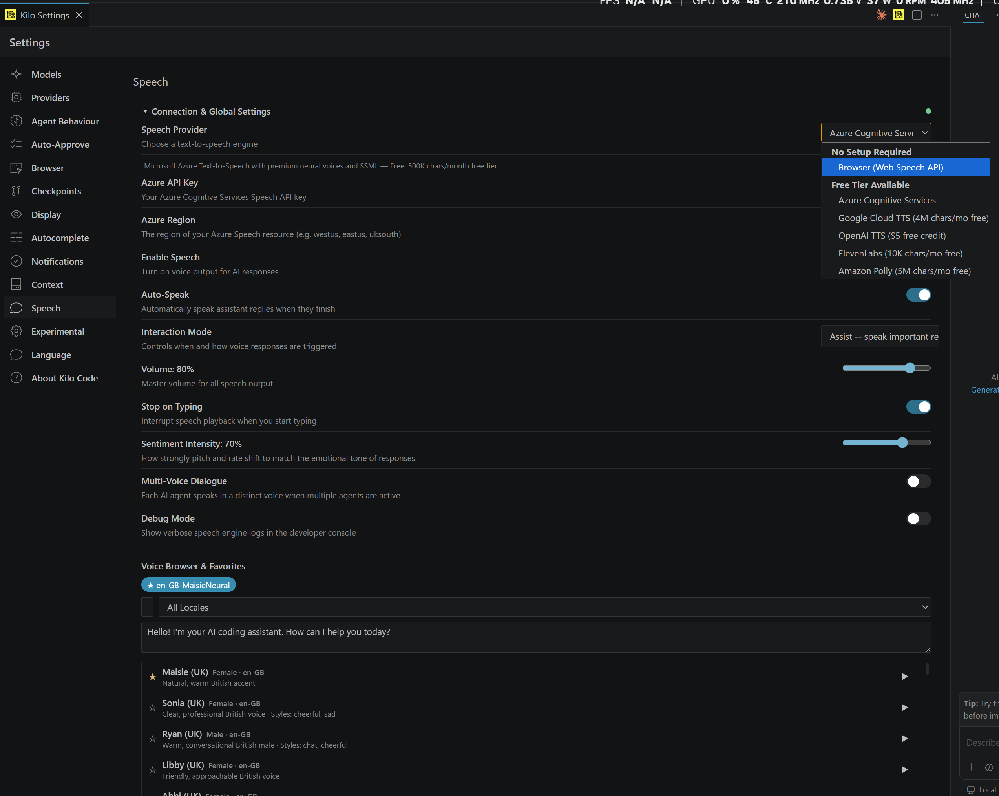
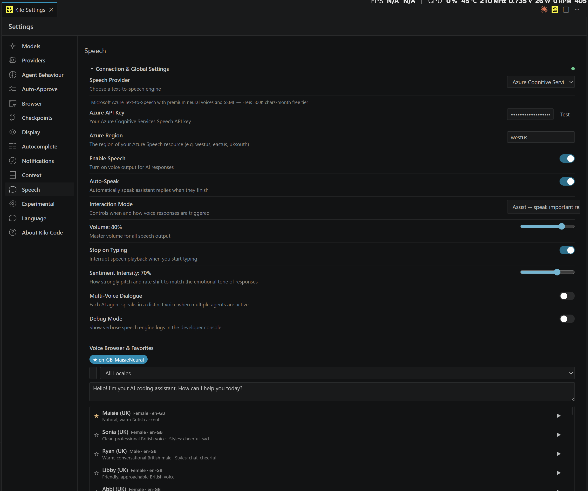
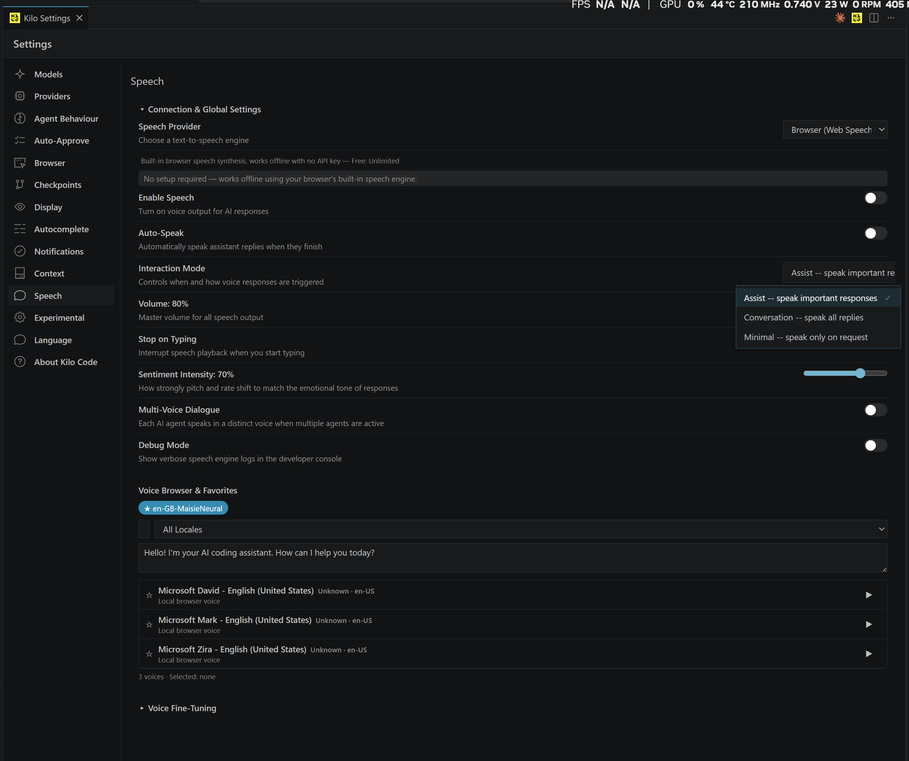
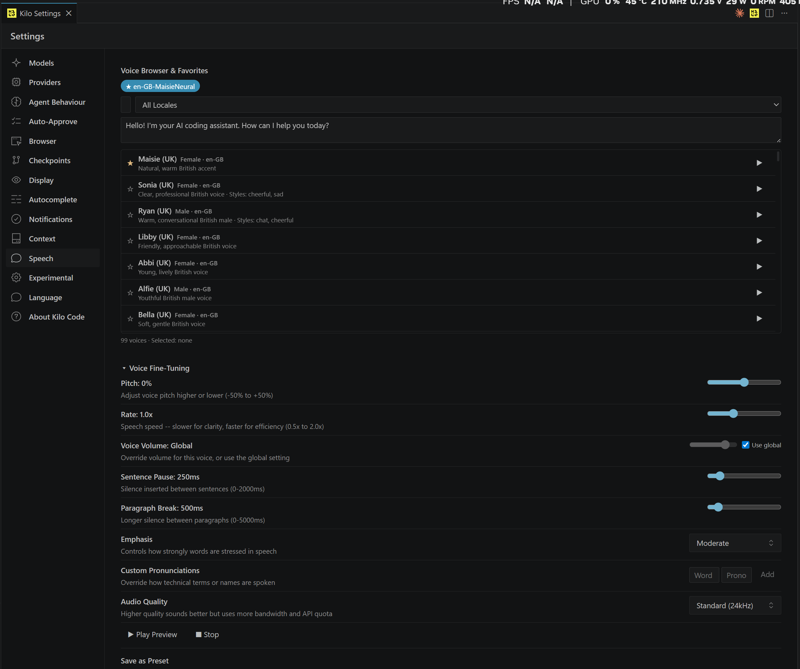
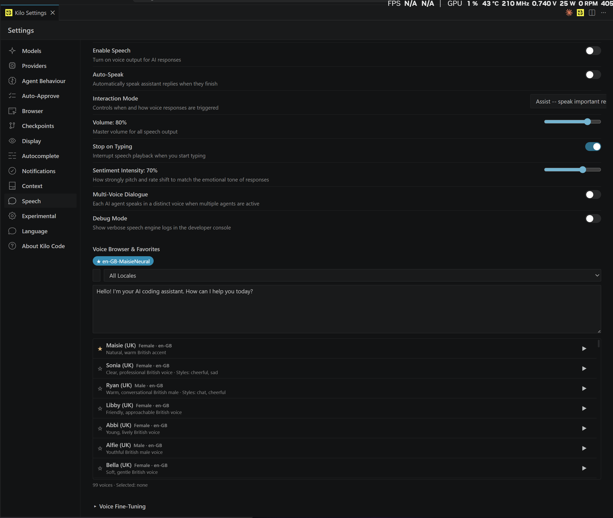
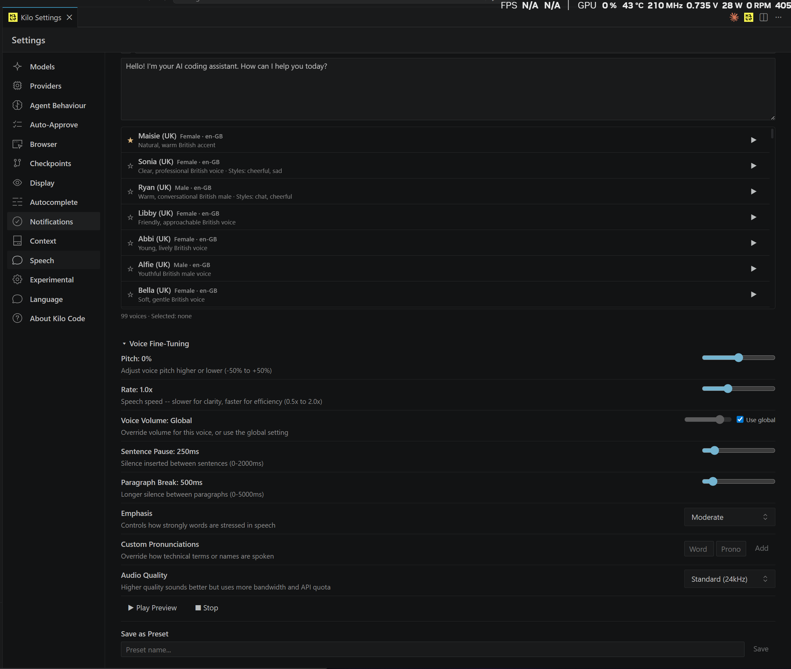

<p align="center">
  <a href="https://marketplace.visualstudio.com/items?itemName=kilocode.Kilo-Code"></a>
  <a href="https://x.com/kilocode"></a>
  <a href="https://blog.kilo.ai"></a>
  <a href="https://kilo.ai/discord"></a>
  <a href="https://www.reddit.com/r/kilocode/"></a>
</p>

# Kilo Code — Multi-Provider Speech Synthesis

> **This fork adds a full Speech tab to Kilo Code** — hear AI responses spoken aloud with 6 text-to-speech providers, all with free tiers. Works out of the box with zero setup using the built-in Browser provider.

<p align="center">
  <a href="https://github.com/Kilo-Org/kilocode/pull/8839"></a>
  <a href="https://github.com/AiDave71/kilocode/tree/feat/azure-voice-studio"></a>
</p>

---

## Speech Feature Highlights

**Works immediately — no API keys, no accounts, no cost.** The Browser provider uses your system's built-in speech engine. Want premium neural voices? Add an API key for any of the 5 cloud providers — all have generous free tiers.

### Provider Selector

Choose from 6 providers, organized by setup requirement:

<p align="center">
  
</p>

| Provider | Free Tier | Voices | Setup |
|----------|-----------|--------|-------|
| **Browser (Web Speech API)** | Unlimited, offline | System voices | None |
| **Azure Cognitive Services** | 500K chars/month | 125+ neural voices | API key |
| **Google Cloud TTS** | 4M chars/month | 21 Neural2 + Studio | API key |
| **OpenAI TTS** | $5 free credit | 10 voices | API key |
| **ElevenLabs** | 10K chars/month | 10 expressive voices | API key |
| **Amazon Polly** | 5M chars/month (12 mo) | 20 voices, 7 locales | Access key |

### Full Settings View — Azure Configured

The complete Speech tab with Azure connected, auto-speak enabled, and voice browser showing 99 neural voices:

<p align="center">
  
</p>

### Browser Provider — Free & Offline

Zero-setup speech using your operating system's built-in voices. Works offline, no account needed:

<p align="center">
  
</p>

### Voice Browser & Fine-Tuning

Browse voices by locale, preview them, set favorites, and fine-tune pitch, rate, emphasis, and custom pronunciations:

<p align="center">
  
</p>

<details>
<summary><strong>More Screenshots</strong></summary>

#### Azure Voice List with Favorites

<p align="center">
  
</p>

#### Voice Fine-Tuning Detail

<p align="center">
  
</p>

</details>

---

## Key Capabilities

- **Auto-Speak** — AI responses are spoken automatically when they finish
- **Stop on Typing** — Speech interrupts instantly when you start typing
- **Interaction Modes** — Assist (important responses only), Conversation (all replies), or Minimal (on request)
- **Sentiment Detection** — Voice pitch and rate shift to match emotional tone
- **Multi-Voice Dialogue** — Each AI agent speaks in a distinct voice
- **Voice Favorites & Presets** — Star voices you like, save full configurations as presets
- **25-Rule Text Filter** — Strips markdown, code blocks, URLs, and formatting before speaking
- **LRU Synthesis Cache** — Repeated phrases play instantly from a 32-entry cache
- **SSML Support** — Full SSML, styles, emphasis, and pronunciation controls (provider-dependent)

## Architecture

```
SpeechProvider (interface)
    |
    +-- BrowserProvider      (Web Speech API, offline)
    +-- AzureProvider        (wraps existing tts-azure.ts)
    +-- GoogleProvider       (REST, base64 audio response)
    +-- OpenAIProvider       (REST, Bearer auth)
    +-- ElevenLabsProvider   (REST, xi-api-key header)
    +-- PollyProvider        (REST, AWS auth)
    |
SpeechProviderRegistry      (register / get / list / listByTier)
    |
speech-playback.ts          (provider-agnostic play/stop/cache)
    |
SpeechTab.tsx               (Settings UI, Solid.js)
```

- **Provider Interface** — `getVoices()`, `synthesize()`, `stop()`, `testConnection()`
- **Capability Gating** — UI controls appear/hide based on `provider.capabilities`
- **CSP Whitelisted** — All provider endpoints added to webview `connect-src`
- **95 Unit Tests** — Registry, browser provider, azure provider, text filter + sentiment

## Try It

### Quick Install (VSIX)

```bash
# Download the VSIX from this fork's releases, then:
code --install-extension kilo-code-7.2.5.vsix
```

### Build From Source

```bash
git clone https://github.com/AiDave71/kilocode.git
cd kilocode
bun install
cd packages/kilo-vscode
node esbuild.js        # builds 5 bundles
npx @vscode/vsce package --no-dependencies
code --install-extension kilo-code-7.2.5.vsix
```

### First Run

1. Open Kilo Code Settings
2. Click the **Speech** tab in the sidebar
3. It defaults to **Browser (Web Speech API)** — works immediately
4. Enable Speech, click a play button next to any voice to preview
5. Optional: select a cloud provider and enter an API key for neural voices

## Contributing

This feature is submitted as [PR #8839](https://github.com/Kilo-Org/kilocode/pull/8839) to the upstream Kilo Code repository. Feedback, testing, and reviews are welcome!

- **Branch:** [`feat/azure-voice-studio`](https://github.com/AiDave71/kilocode/tree/feat/azure-voice-studio)
- **Tests:** `bun test` in `packages/kilo-vscode` — 95 tests across 4 files
- **Lint:** 0 errors across 14 speech-related files
- **Build:** 5 esbuild bundles, 0 errors

---

<details>
<summary><strong>Original Kilo Code README</strong></summary>

## About Kilo Code

> Kilo is the all-in-one agentic engineering platform. Build, ship, and iterate faster with the most popular open source coding agent.

- Generate code from natural language
- Checks its own work
- Run terminal commands
- Automate the browser
- Inline autocomplete suggestions
- Latest AI models
- API keys optional

### Quick Links

- [VS Code Marketplace](https://kilo.ai/vscode-marketplace?utm_source=Readme) (download)
- Install CLI: `npm install -g @kilocode/cli`
- [Official Kilo.ai Home page](https://kilo.ai) (learn more)

### License

This project is licensed under the MIT License. See [License](/LICENSE).

### Where did Kilo CLI come from?

Kilo CLI is a fork of [OpenCode](https://github.com/anomalyco/opencode), enhanced to work within the Kilo agentic engineering platform.

</details>
