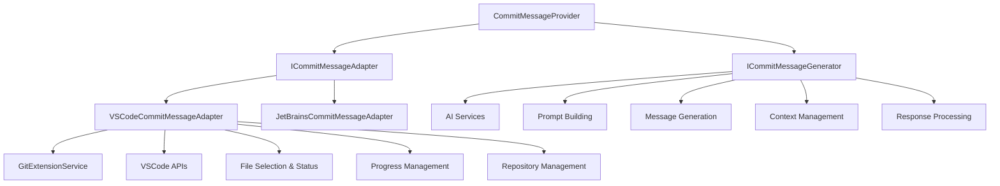
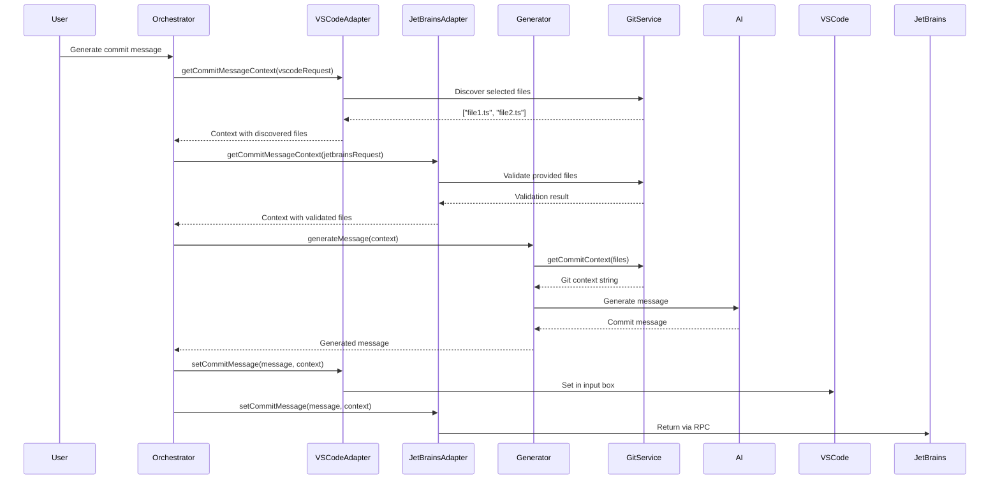
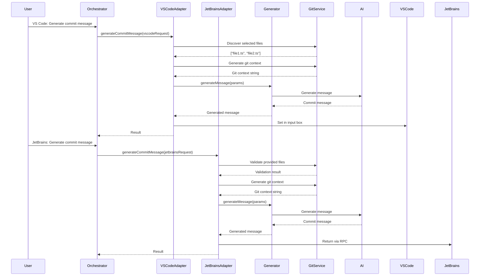

# Commit Message Provider Refactoring Plan

## Current Analysis

After analyzing the existing code, the [`CommitMessageProvider`](src/services/commit-message/CommitMessageProvider.ts:26) class has multiple responsibilities that violate the Single Responsibility Principle:

### Current Responsibilities in CommitMessageProvider

1. **Command Registration** (`activate()`, command handlers)
2. **VSCode-Specific Integration** (progress reporting, Git extension API, UI interactions)
3. **File Selection Logic** (`getSelectedFiles()`, `getChangesForFiles()`)
4. **AI Integration** (`callAIForCommitMessage()`, prompt building)
5. **Message Generation Logic** (`buildCommitMessagePrompt()`, message extraction)
6. **Repository Management** (target repository determination, workspace root management)

## Proposed Architecture

### Core Interface Design

```typescript
interface ICommitMessageOrchestrator {
	generateCommitMessage(request: CommitMessageRequest): Promise<CommitMessageResult>
}

interface ICommitMessageAdapter {
	// IDE-specific file selection
	getSelectedFiles(workspacePath: string): Promise<string[]>

	// IDE-specific progress reporting
	showProgress<T>(task: ProgressTask<T>): Promise<T>

	// IDE-specific message setting
	setCommitMessage(message: string, workspacePath: string): Promise<void>

	// IDE-specific user notifications
	showMessage(message: string, type: "info" | "error"): Promise<void>
}

interface ICommitMessageGenerator {
	generateMessage(context: CommitMessageContext): Promise<string>
	buildPrompt(gitContext: string, options: PromptOptions): Promise<string>
}
```

## Proposed Class Structure

### 1. CommitMessageProvider (Orchestrator Only)

**Location**: `src/services/commit-message/CommitMessageProvider.ts`
**Responsibilities**:

- Command registration
- High-level orchestration
- Dependency injection

**Methods to Keep**:

- `activate()` (simplified)
- `dispose()`

**Methods to Remove**:

- All VSCode-specific UI logic
- All AI/prompt logic
- File selection logic

### 2. ICommitMessageAdapter Interface

**Location**: `src/services/commit-message/interfaces/ICommitMessageAdapter.ts`
**Purpose**: Define contract for IDE-specific operations

### 3. VSCodeCommitMessageAdapter

**Location**: `src/services/commit-message/adapters/VSCodeCommitMessageAdapter.ts`
**Responsibilities**:

- VSCode Git extension integration
- VSCode progress reporting
- VSCode UI interactions
- VSCode-specific file selection

**Methods to Move From CommitMessageProvider**:

- `generateCommitMessageVsCode()` → `generateCommitMessage()`
- `determineTargetRepository()`
- `setCommitMessage()`
- `copyToClipboardFallback()`
- `getSelectedFiles()`
- `gatherGitChanges()`
- Progress reporting logic from `callAIForCommitMessageWithProgress()`

### 4. CommitMessageGenerator

**Location**: `src/services/commit-message/CommitMessageGenerator.ts`
**Responsibilities**:

- AI prompt building
- Message generation
- Response processing
- Context management for repeated generations

**Methods to Move From CommitMessageProvider**:

- `callAIForCommitMessage()`
- `buildCommitMessagePrompt()`
- `extractCommitMessage()`
- `generateCommitMessageForFiles()` (core logic)
- Previous message tracking logic

### 5. JetBrainsCommitMessageAdapter (Future)

**Location**: `src/services/commit-message/adapters/JetBrainsCommitMessageAdapter.ts`
**Responsibilities**:

- JetBrains-specific integrations
- External API handling

**Methods to Move From CommitMessageProvider**:

- `generateCommitMessageForExternal()` → Core logic moved here

### 6. GitExtensionService (Keep As-Is)

**Location**: `src/services/commit-message/GitExtensionService.ts`
**Status**: ✅ Already well-structured, no changes needed

## Detailed Method Distribution

### CommitMessageProvider (New - Orchestrator)

```typescript
class CommitMessageProvider {
  constructor(
    private adapter: ICommitMessageAdapter,
    private generator: ICommitMessageGenerator,
    private context: vscode.ExtensionContext
  )

  // KEEP (simplified)
  async activate(): Promise<void>
  dispose(): void

  // NEW (orchestration)
  async generateCommitMessage(request?: CommitMessageRequest): Promise<void>
}
```

### VSCodeCommitMessageAdapter

```typescript
class VSCodeCommitMessageAdapter implements ICommitMessageAdapter {
	// FROM CommitMessageProvider:
	async getSelectedFiles(workspacePath: string): Promise<string[]>
	async showProgress<T>(task: ProgressTask<T>): Promise<T>
	async setCommitMessage(message: string, workspacePath: string): Promise<void>
	async showMessage(message: string, type: MessageType): Promise<void>

	// INTERNAL (moved from CommitMessageProvider):
	private determineTargetRepository(resourceUri?: vscode.Uri)
	private copyToClipboardFallback(message: string)
	private async gatherGitChanges(workspacePath: string)
}
```

### CommitMessageGenerator

```typescript
class CommitMessageGenerator implements ICommitMessageGenerator {
	// FROM CommitMessageProvider:
	async generateMessage(context: CommitMessageContext): Promise<string>
	async buildPrompt(gitContext: string, options: PromptOptions): Promise<string>

	// INTERNAL (moved from CommitMessageProvider):
	private async callAIForCommitMessage(gitContextString: string): Promise<string>
	private extractCommitMessage(response: string): string
	private async getChangesForFiles(selectedFiles: string[], isFromJetBrains: boolean): Promise<GitChange[]>
}
```

### JetBrainsCommitMessageAdapter (Future)

```typescript
class JetBrainsCommitMessageAdapter implements ICommitMessageAdapter {
	// Handle external RPC calls from JetBrains
	async generateCommitMessageForExternal(workspacePath: string, selectedFiles: string[]): Promise<CommitMessageResult>

	// Implement interface methods for JetBrains-specific behavior
	async getSelectedFiles(workspacePath: string): Promise<string[]>
	async showProgress<T>(task: ProgressTask<T>): Promise<T>
	async setCommitMessage(message: string, workspacePath: string): Promise<void>
	async showMessage(message: string, type: MessageType): Promise<void>
}
```

## Shared Types and Interfaces

### New Types Required

```typescript
// Core request/response types
interface CommitMessageRequest {
	workspacePath?: string
	selectedFiles?: string[]
	rootUri?: vscode.Uri
}

interface CommitMessageResult {
	message: string
	error?: string
}

interface CommitMessageContext {
	gitContext: string
	workspacePath: string
	selectedFiles: string[]
	isFromJetBrains?: boolean
}

interface PromptOptions {
	customSupportPrompts?: Record<string, string>
	previousContext?: string
	previousMessage?: string
}

interface ProgressTask<T> {
	execute: (progress: ProgressReporter) => Promise<T>
	title: string
	location: ProgressLocation
	cancellable?: boolean
}

interface ProgressReporter {
	report(value: { message?: string; increment?: number }): void
}

type MessageType = "info" | "error" | "warning"
type ProgressLocation = "SourceControl" | "Notification" | "Window"
```

## File Structure Changes

### Current Structure

```
src/services/commit-message/
├── CommitMessageProvider.ts (512 lines - too much)
├── GitExtensionService.ts (✅ good)
├── types.ts
├── exclusionUtils.ts
├── index.ts
└── __tests__/
```

### Proposed Structure

```
src/services/commit-message/
├── CommitMessageProvider.ts (orchestrator only ~100 lines)
├── CommitMessageGenerator.ts (AI/prompt logic ~200 lines)
├── GitExtensionService.ts (✅ keep as-is)
├── adapters/
│   ├── VSCodeCommitMessageAdapter.ts (~200 lines)
│   └── JetBrainsCommitMessageAdapter.ts (future ~150 lines)
├── interfaces/
│   ├── ICommitMessageAdapter.ts
│   ├── ICommitMessageGenerator.ts
│   └── ICommitMessageOrchestrator.ts
├── types/
│   ├── core.ts (shared types)
│   ├── vscode.ts (VSCode-specific types)
│   └── jetbrains.ts (JetBrains-specific types)
├── utils/
│   └── exclusionUtils.ts (✅ keep)
├── index.ts (updated exports)
└── __tests__/ (updated test structure)
```

## Benefits of This Architecture

### ✅ Single Responsibility Principle

- **CommitMessageProvider**: Only orchestration and command registration
- **Adapters**: Only IDE-specific integrations
- **Generator**: Only AI/prompt logic
- **GitService**: Only Git operations

### ✅ IDE Compatibility

- Interface-based design allows easy JetBrains integration
- Clear separation of IDE-specific vs core logic
- Standardized contract via interfaces

### ✅ Testability

- Each component can be tested in isolation
- Easy to mock dependencies
- Clear interfaces for unit testing

### ✅ Maintainability

- Smaller, focused classes
- Clear boundaries between concerns
- Easy to understand and modify

### ✅ Extensibility

- Easy to add new IDE adapters
- Core logic reusable across IDEs
- Plugin-like architecture

## 🚨 Critical Issues Identified

### 1. **Missing File Change Status Logic**

**Issue**: The current [`getChangesForFiles()`](src/services/commit-message/CommitMessageProvider.ts:433) method contains critical logic for converting file paths to `GitChange` objects with proper status detection. This was incorrectly planned to be moved to the `CommitMessageGenerator`.

**Fix**: This method should be moved to the **VSCodeCommitMessageAdapter** because:

- It's IDE-specific (depends on how files are selected/discovered)
- It requires access to the Git service for status detection
- Different IDEs may have different file selection mechanisms

### 2. **Progress Reporting Complexity**

**Issue**: The [`callAIForCommitMessageWithProgress()`](src/services/commit-message/CommitMessageProvider.ts:214) method contains complex progress reporting logic that's tightly coupled to VSCode's progress system.

**Fix**: This should be split between:

- **VSCodeCommitMessageAdapter**: Progress UI management
- **CommitMessageGenerator**: Core AI call with progress callbacks

### 3. **State Management Issues**

**Issue**: The current class maintains several state variables that need proper distribution:

- `previousGitContext` and `previousCommitMessage` → Should be in **CommitMessageGenerator**
- `targetRepository` and `currentWorkspaceRoot` → Should be in **VSCodeCommitMessageAdapter**
- `gitService` instance → Should be managed by the adapter that creates it

### 4. **Test Compatibility Issues**

**Issue**: The existing tests heavily mock VSCode-specific APIs and expect certain method signatures. The refactoring must maintain test compatibility.

**Fix**:

- Keep the same public API surface initially
- Ensure all existing test scenarios continue to work
- Gradually migrate tests to new architecture

### 5. **Missing Error Handling Strategy**

**Issue**: The current plan doesn't address how errors should propagate between components.

**Fix**: Define clear error handling contracts:

- Adapter errors → IDE-specific error display
- Generator errors → Standardized error objects
- Git errors → Handled at the adapter level

## 🔄 Updated Method Distribution

### VSCodeCommitMessageAdapter (Updated)

```typescript
class VSCodeCommitMessageAdapter implements ICommitMessageAdapter {
	// PREVIOUSLY PLANNED:
	async getSelectedFiles(workspacePath: string): Promise<string[]>
	async showProgress<T>(task: ProgressTask<T>): Promise<T>
	async setCommitMessage(message: string, workspacePath: string): Promise<void>
	async showMessage(message: string, type: MessageType): Promise<void>

	// UPDATED: Add file change status logic
	private async getChangesForFiles(selectedFiles: string[], isFromJetBrains: boolean): Promise<GitChange[]>

	// UPDATED: Add state management
	private targetRepository: VscGenerationRequest | null = null
	private currentWorkspaceRoot: string | null = null
	private gitService: GitExtensionService | null = null

	// UPDATED: Add repository management
	private determineTargetRepository(resourceUri?: vscode.Uri)
	private async ensureGitService(workspacePath: string)
}
```

### CommitMessageGenerator (Updated)

```typescript
class CommitMessageGenerator implements ICommitMessageGenerator {
	// PREVIOUSLY PLANNED:
	async generateMessage(context: CommitMessageContext): Promise<string>
	async buildPrompt(gitContext: string, options: PromptOptions): Promise<string>

	// UPDATED: Add state management for message generation
	private previousGitContext: string | null = null
	private previousCommitMessage: string | null = null

	// UPDATED: Simplified AI call with progress callback
	private async callAIForCommitMessage(
		gitContextString: string,
		onProgress?: (progress: number) => void,
	): Promise<string>

	// REMOVED: getChangesForFiles (moved to adapter)
}
```

## 🏗️ Updated Architecture Diagram



## 📋 Updated Implementation Strategy

### Phase 1: Create Interfaces and Types (No Changes)

### Phase 2: Extract CommitMessageGenerator (Updated)

1. Create CommitMessageGenerator class
2. Move AI/prompt logic AND state management
3. Add progress callback support to AI calls
4. Update dependencies and imports

### Phase 3: Create VSCodeCommitMessageAdapter (Updated)

1. Create adapter class
2. Move VSCode-specific logic AND file change status logic
3. Add repository and workspace state management
4. Implement ICommitMessageAdapter interface

### Phase 4: Refactor CommitMessageProvider (Updated)

1. Simplify to orchestrator pattern
2. Remove extracted logic
3. Update constructor to use dependency injection
4. Ensure backwards compatibility with existing tests

### Phase 5: Update Tests and Integration (Updated)

1. Update existing tests to work with new architecture
2. Create new tests for each component
3. Update index.ts exports
4. Test end-to-end functionality
5. **CRITICAL**: Ensure all existing test scenarios still pass

## 🎯 Success Criteria

1. **Functionality**: All existing features work exactly the same
2. **Test Coverage**: All existing tests pass without modification
3. **Performance**: No performance degradation
4. **Maintainability**: Clear separation of concerns
5. **Extensibility**: Easy to add JetBrains adapter
6. **Error Handling**: Robust error handling across all components

## ⚠️ Risk Mitigation (Updated)

### High-Risk Areas

1. **File Change Status Logic**: Critical for proper commit message generation
2. **State Management**: Previous message tracking affects user experience
3. **Progress Reporting**: Complex UI interaction that users expect
4. **Test Compatibility**: Breaking existing tests would block deployment

### Mitigation Strategies

1. **Incremental Testing**: Test each component in isolation
2. **Feature Flags**: Allow rollback to old implementation
3. **Parallel Implementation**: Run both old and new implementations side-by-side initially
4. **Comprehensive Integration Tests**: Ensure end-to-end functionality works

## Migration Strategy

### Phase 1: Create Interfaces and Types

1. Create interface definitions
2. Create shared type definitions
3. Update existing types.ts

### Phase 2: Extract CommitMessageGenerator

1. Create CommitMessageGenerator class
2. Move AI/prompt logic from CommitMessageProvider
3. Update dependencies and imports

### Phase 3: Create VSCodeCommitMessageAdapter

1. Create adapter class
2. Move VSCode-specific logic from CommitMessageProvider
3. Implement ICommitMessageAdapter interface

### Phase 4: Refactor CommitMessageProvider

1. Simplify to orchestrator pattern
2. Remove extracted logic
3. Update constructor to use dependency injection

### Phase 5: Update Tests and Integration

1. Update existing tests
2. Create new tests for each component
3. Update index.ts exports
4. Test end-to-end functionality

## Risk Mitigation

### Backwards Compatibility

- Keep existing command registration working
- Maintain same public API initially
- Gradual migration approach

### Testing Strategy

- Comprehensive unit tests for each component
- Integration tests for full workflow
- Regression tests for existing functionality

### Rollback Plan

- Maintain git branch for current implementation
- Feature flags for new vs old implementation
- Gradual rollout approach

## Future Enhancements

### JetBrains Integration

- Once refactoring complete, JetBrains adapter can be implemented
- RPC handling moved to JetBrains adapter
- Consistent interface across IDEs

### Additional IDE Support

- Architecture supports other IDEs (IntelliJ, Vim plugins, etc.)
- Plugin ecosystem potential
- Standardized integration pattern

This refactoring will transform a monolithic 512-line class into a clean, maintainable, and extensible architecture that properly separates concerns and enables multi-IDE support.

# 🔄 IDE-Specific Input Handling Strategy

## 🎯 Core Design Principle

**JetBrains**: Always provides a specific list of files - never discovers files automatically
**VS Code**: Always discovers files through Git extension - never receives pre-selected files
**Common Path**: Both converge on the same context-based flow after file selection

## 📋 Context-Based Architecture

### Unified CommitMessageContext

```typescript
interface CommitMessageContext {
	// Common to all IDEs
	workspacePath: string
	selectedFiles: string[] // Always populated, never empty

	// IDE-specific metadata
	source: "vscode" | "jetbrains"

	// Optional progress callback
	onProgress?: (progress: ProgressUpdate) => void
}

interface ProgressUpdate {
	stage: "file-discovery" | "git-context" | "ai-generation" | "completion"
	message?: string
	percentage?: number
	increment?: number
}
```

## 🏗️ Updated Interface Design

### ICommitMessageAdapter (Revised)

```typescript
interface ICommitMessageAdapter {
	// IDE-specific file selection
	getCommitMessageContext(request: CommitMessageRequest): Promise<CommitMessageContext>

	// IDE-specific progress reporting
	showProgress<T>(task: ProgressTask<T>, context: CommitMessageContext): Promise<T>

	// IDE-specific message setting
	setCommitMessage(message: string, context: CommitMessageContext): Promise<void>

	// IDE-specific user notifications
	showMessage(message: string, type: MessageType, context: CommitMessageContext): Promise<void>
}

interface CommitMessageRequest {
	workspacePath?: string
	selectedFiles?: string[] // JetBrains: always provided, VS Code: undefined
	rootUri?: vscode.Uri // VS Code: provided, JetBrains: undefined
	source: "vscode" | "jetbrains"
}
```

## 🔄 Flow Architecture

### VS Code Flow

```typescript
// 1. VS Code Adapter receives request without selectedFiles
const vscodeRequest: CommitMessageRequest = {
	workspacePath: "/path/to/workspace",
	rootUri: vscode.Uri.file("/path/to/workspace"),
	source: "vscode",
	// selectedFiles: undefined (VS Code discovers files)
}

// 2. Adapter discovers files and creates context
const context = await vscodeAdapter.getCommitMessageContext(vscodeRequest)
// Result: context.selectedFiles = ["file1.ts", "file2.ts"] (discovered)

// 3. Common generator processes context
const message = await generator.generateMessage(context)
```

### JetBrains Flow

```typescript
// 1. JetBrains Adapter receives request with selectedFiles
const jetbrainsRequest: CommitMessageRequest = {
	workspacePath: "/path/to/workspace",
	selectedFiles: ["file1.ts", "file2.ts"], // Always provided
	source: "jetbrains",
	// rootUri: undefined (JetBrains doesn't use VS Code APIs)
}

// 2. Adapter validates files and creates context (no discovery needed)
const context = await jetbrainsAdapter.getCommitMessageContext(jetbrainsRequest)
// Result: context.selectedFiles = ["file1.ts", "file2.ts"] (validated)

// 3. Common generator processes context (same as VS Code)
const message = await generator.generateMessage(context)
```

## 🎛️ Adapter Implementation Details

### VSCodeCommitMessageAdapter

```typescript
class VSCodeCommitMessageAdapter implements ICommitMessageAdapter {
	async getCommitMessageContext(request: CommitMessageRequest): Promise<CommitMessageContext> {
		// VS Code always discovers files - selectedFiles should be undefined
		if (request.selectedFiles?.length) {
			throw new Error("VS Code adapter should not receive pre-selected files")
		}

		// Discover files using Git extension
		const selectedFiles = await this.discoverSelectedFiles(request.workspacePath!)

		return {
			workspacePath: request.workspacePath!,
			selectedFiles,
			source: "vscode",
			onProgress: this.createProgressCallback(),
		}
	}

	private async discoverSelectedFiles(workspacePath: string): Promise<string[]> {
		// Use Git extension to discover staged/unstaged files
		const { changes } = await this.gatherGitChanges(workspacePath)
		return changes.map((change) => change.filePath)
	}

	// getChangesForFiles becomes internal method for file validation
	private async validateChangesForFiles(selectedFiles: string[]): Promise<GitChange[]> {
		// Convert file paths to GitChange objects with status
		// Used internally for validation before passing to generator
	}
}
```

### JetBrainsCommitMessageAdapter

```typescript
class JetBrainsCommitMessageAdapter implements ICommitMessageAdapter {
	async getCommitMessageContext(request: CommitMessageRequest): Promise<CommitMessageContext> {
		// JetBrains always provides files - validate they exist
		if (!request.selectedFiles?.length) {
			throw new Error("JetBrains adapter must receive selected files")
		}

		// Validate files exist and have changes (no discovery needed)
		const validatedFiles = await this.validateSelectedFiles(request.workspacePath!, request.selectedFiles)

		return {
			workspacePath: request.workspacePath!,
			selectedFiles: validatedFiles,
			source: "jetbrains",
			onProgress: this.createProgressCallback(),
		}
	}

	private async validateSelectedFiles(workspacePath: string, files: string[]): Promise<string[]> {
		// Validate files exist in workspace and have git changes
		// Return only valid files (filter out invalid ones)
		// This is where getChangesForFiles logic would be used for validation
	}

	// getChangesForFiles becomes validation method (no-op for discovery)
	private async validateChangesForFiles(selectedFiles: string[]): Promise<GitChange[]> {
		// Similar to VS Code but only for validation, not discovery
		// Return GitChange objects for validation purposes
	}
}
```

## 📊 Progress Reporting Strategy

### Callback-Based Progress System

```typescript
interface ICommitMessageGenerator {
  async generateMessage(context: CommitMessageContext): Promise<string>
}

class CommitMessageGenerator implements ICommitMessageGenerator {
  async generateMessage(context: CommitMessageContext): Promise<string> {
    // Stage 1: File validation/discovery
    context.onProgress?.({
      stage: 'file-discovery',
      message: "Validating selected files...",
      percentage: 10
    })

    // Stage 2: Git context generation
    context.onProgress?.({
      stage: 'git-context',
      message: "Generating git context...",
      percentage: 30
    })

    const gitContext = await this.generateGitContext(context)

    // Stage 3: AI generation
    context.onProgress?.({
      stage: 'ai-generation',
      message: "Generating commit message...",
      percentage: 50
    })

    const message = await this.callAIForCommitMessage(gitContext, (progress) => {
      context.onProgress?.({
        stage: 'ai-generation',
        message: "Generating commit message...",
        percentage: 50 + (progress * 0.4) // 50-90%
      })
    })

    // Stage 4: Completion
    context.onProgress?.({
      stage: 'completion',
      message: "Complete!",
      percentage: 100
    })

    return message
  }
}
```

### Adapter Progress Integration

```typescript
class VSCodeCommitMessageAdapter implements ICommitMessageAdapter {
	async showProgress<T>(task: ProgressTask<T>, context: CommitMessageContext): Promise<T> {
		return await vscode.window.withProgress(
			{
				location: vscode.ProgressLocation.SourceControl,
				title: "Generating Commit Message",
				cancellable: false,
			},
			async (progress) => {
				// Wire VS Code progress to context callbacks
				const originalCallback = context.onProgress
				context.onProgress = (update: ProgressUpdate) => {
					progress.report({
						message: update.message,
						increment: update.increment,
					})
					// Also call original callback if it exists
					originalCallback?.(update)
				}

				return await task.execute(progress)
			},
		)
	}
}

class JetBrainsCommitMessageAdapter implements ICommitMessageAdapter {
	async showProgress<T>(task: ProgressTask<T>, context: CommitMessageContext): Promise<T> {
		// JetBrains would implement its own progress reporting
		// Could be RPC callbacks, UI updates, etc.
		return await task.execute({
			report: (update) => {
				context.onProgress?.(update)
				// Send progress to JetBrains via RPC or other mechanism
				this.sendProgressToJetBrains(update)
			},
		})
	}

	private sendProgressToJetBrains(update: ProgressUpdate): void {
		// Implement JetBrains-specific progress reporting
		// This could be via RPC, WebSocket, or other communication channel
	}
}
```

## 🔄 Complete Flow Diagram



## 🎯 Key Benefits of This Design

1. **Clear Separation**: Each IDE handles file selection its own way
2. **Common Processing**: Both use the same generator after context creation
3. **Progress Flexibility**: Each IDE can implement progress reporting appropriately
4. **Type Safety**: Strong typing ensures correct usage patterns
5. **Testability**: Each component can be tested independently
6. **Extensibility**: Easy to add new IDEs with different file selection strategies

This design ensures that JetBrains always works with provided files while VS Code always discovers files, but both converge on the same processing pipeline.

# 🔄 Simplified Architecture Design

## 🎯 Core Design Principle

**Simplified Flow**: Each adapter receives a request and handles everything internally - file selection, progress reporting, and message generation coordination.

## 📋 Simplified Interface Design

### Core Interfaces (Streamlined)

```typescript
interface ICommitMessageAdapter {
	// Single entry point - adapter handles everything
	generateCommitMessage(request: CommitMessageRequest): Promise<CommitMessageResult>

	// Optional: Set message separately if needed
	setCommitMessage(message: string, request: CommitMessageRequest): Promise<void>

	// Optional: Show notifications
	showMessage(message: string, type: MessageType, request: CommitMessageRequest): Promise<void>
}

interface ICommitMessageGenerator {
	// Pure message generation - no IDE-specific logic
	generateMessage(params: GenerateMessageParams): Promise<string>
	buildPrompt(gitContext: string, options: PromptOptions): Promise<string>
}

interface ICommitMessageOrchestrator {
	// High-level coordination
	generateCommitMessage(request: CommitMessageRequest): Promise<CommitMessageResult>
}

// Request types
interface CommitMessageRequest {
	workspacePath: string // Always required
	selectedFiles?: string[] // JetBrains: always provided, VS Code: undefined
	rootUri?: vscode.Uri // VS Code: provided, JetBrains: undefined
	source: "vscode" | "jetbrains"
}

interface GenerateMessageParams {
	workspacePath: string
	selectedFiles: string[]
	gitContext: string
	onProgress?: (progress: ProgressUpdate) => void
}

interface CommitMessageResult {
	message: string
	error?: string
}
```

## 🔄 Complete Flow Analysis

### VS Code Flow Step-by-Step

```typescript
// 1. User triggers command in VS Code
// 2. Orchestrator receives request without selectedFiles
const vscodeRequest: CommitMessageRequest = {
	workspacePath: "/path/to/workspace",
	rootUri: vscode.Uri.file("/path/to/workspace"),
	source: "vscode",
	// selectedFiles: undefined (VS Code will discover)
}

// 3. Orchestrator delegates to VS Code adapter
const result = await vscodeAdapter.generateCommitMessage(vscodeRequest)

// 4. VS Code Adapter internal flow:
class VSCodeCommitMessageAdapter implements ICommitMessageAdapter {
	async generateCommitMessage(request: CommitMessageRequest): Promise<CommitMessageResult> {
		try {
			// Step 4a: Discover files using Git extension (internal)
			const selectedFiles = await this.discoverSelectedFiles(request.workspacePath)

			// Step 4b: Generate git context
			const gitContext = await this.generateGitContext(request.workspacePath, selectedFiles)

			// Step 4c: Show progress and call generator
			const message = await this.showProgress({
				execute: async (progress) => {
					return await generator.generateMessage({
						workspacePath: request.workspacePath,
						selectedFiles,
						gitContext,
						onProgress: (update) => {
							progress.report(update)
						},
					})
				},
				title: "Generating Commit Message",
				location: "SourceControl",
			})

			// Step 4d: Set the message in VS Code
			await this.setCommitMessage(message, request)

			return { message }
		} catch (error) {
			return { error: error.message, message: "" }
		}
	}

	private async discoverSelectedFiles(workspacePath: string): Promise<string[]> {
		// Use Git extension to discover staged/unstaged files
		// This replaces the old getSelectedFiles() method
		const gitService = new GitExtensionService(workspacePath)
		const { changes } = await this.gatherGitChanges(gitService, workspacePath)
		return changes.map((change) => change.filePath)
	}
}
```

### JetBrains Flow Step-by-Step

```typescript
// 1. User triggers command in JetBrains
// 2. Orchestrator receives request with selectedFiles
const jetbrainsRequest: CommitMessageRequest = {
	workspacePath: "/path/to/workspace",
	selectedFiles: ["file1.ts", "file2.ts"], // Always provided
	source: "jetbrains",
	// rootUri: undefined (JetBrains doesn't use VS Code APIs)
}

// 3. Orchestrator delegates to JetBrains adapter
const result = await jetbrainsAdapter.generateCommitMessage(jetbrainsRequest)

// 4. JetBrains Adapter internal flow:
class JetBrainsCommitMessageAdapter implements ICommitMessageAdapter {
	async generateCommitMessage(request: CommitMessageRequest): Promise<CommitMessageResult> {
		try {
			// Step 4a: Validate provided files (no discovery needed)
			const validatedFiles = await this.validateSelectedFiles(request.workspacePath, request.selectedFiles!)

			// Step 4b: Generate git context
			const gitContext = await this.generateGitContext(request.workspacePath, validatedFiles)

			// Step 4c: Show progress and call generator (same as VS Code)
			const message = await this.showProgress({
				execute: async (progress) => {
					return await generator.generateMessage({
						workspacePath: request.workspacePath,
						selectedFiles: validatedFiles,
						gitContext,
						onProgress: (update) => {
							progress.report(update)
							// Also send progress to JetBrains via RPC
							this.sendProgressToJetBrains(update)
						},
					})
				},
				title: "Generating Commit Message",
				location: "Notification",
			})

			// Step 4d: Return message to JetBrains (no VS Code input box)
			return { message }
		} catch (error) {
			return { error: error.message, message: "" }
		}
	}

	private async validateSelectedFiles(workspacePath: string, files: string[]): Promise<string[]> {
		// Validate files exist and have git changes
		// This is where getChangesForFiles logic would be used for validation
		const gitService = new GitExtensionService(workspacePath)
		const changes = await gitService.gatherChanges({ staged: true })

		// Return only files that actually have changes
		return files.filter((file) => changes.some((change) => change.filePath.endsWith(file)))
	}

	private sendProgressToJetBrains(update: ProgressUpdate): void {
		// Send progress updates to JetBrains via RPC or other mechanism
		// This is JetBrains-specific progress reporting
	}
}
```

## 🏗️ Orchestrator Implementation

### CommitMessageProvider (Simplified)

```typescript
class CommitMessageProvider implements ICommitMessageOrchestrator {
	private vscodeAdapter: ICommitMessageAdapter
	private jetbrainsAdapter: ICommitMessageAdapter
	private generator: ICommitMessageGenerator

	constructor(
		private context: vscode.ExtensionContext,
		private outputChannel: vscode.OutputChannel,
	) {
		this.vscodeAdapter = new VSCodeCommitMessageAdapter(context, outputChannel)
		this.jetbrainsAdapter = new JetBrainsCommitMessageAdapter()
		this.generator = new CommitMessageGenerator()
	}

	async generateCommitMessage(request: CommitMessageRequest): Promise<CommitMessageResult> {
		// Route to appropriate adapter based on source
		const adapter = request.source === "vscode" ? this.vscodeAdapter : this.jetbrainsAdapter
		return await adapter.generateCommitMessage(request)
	}

	// Command handlers (simplified)
	async generateCommitMessageVsCode(vsRequest?: VscGenerationRequest): Promise<void> {
		const request: CommitMessageRequest = {
			workspacePath: this.determineWorkspacePath(vsRequest?.rootUri),
			rootUri: vsRequest?.rootUri,
			source: "vscode",
		}

		const result = await this.generateCommitMessage(request)

		if (result.error) {
			vscode.window.showErrorMessage(`Generation failed: ${result.error}`)
		}
	}

	async generateCommitMessageForExternal(
		workspacePath: string,
		selectedFiles: string[] = [],
	): Promise<{ message: string; error?: string }> {
		const request: CommitMessageRequest = {
			workspacePath,
			selectedFiles,
			source: "jetbrains",
		}

		return await this.generateCommitMessage(request)
	}
}
```

## 📊 Interface Evaluation

### Do We Need Three Interfaces?

**Yes, here's why:**

1. **ICommitMessageOrchestrator** (CommitMessageProvider)

    - **Purpose**: High-level coordination and command registration
    - **Audience**: Extension entry point, command handlers
    - **Complexity**: Low - just routing and basic coordination

2. **ICommitMessageAdapter** (VSCode/JetBrains adapters)

    - **Purpose**: IDE-specific implementations
    - **Audience**: Orchestrator and IDE-specific code
    - **Complexity**: Medium - handles IDE integration, progress, file selection

3. **ICommitMessageGenerator** (CommitMessageGenerator)
    - **Purpose**: Pure AI/message generation logic
    - **Audience**: Adapters that need message generation
    - **Complexity**: Medium - AI integration, prompt building, but no IDE specifics

### Benefits of Three Interfaces:

1. **Clear Separation**: Each interface has a single, well-defined responsibility
2. **Testability**: Each component can be tested in isolation
3. **Reusability**: Generator can be used by any adapter
4. **Maintainability**: Changes to one interface don't affect others
5. **Extensibility**: Easy to add new IDEs by implementing ICommitMessageAdapter

## 🔄 Complete Flow Diagram



## 🎯 Key Benefits of Simplified Design

1. **Clear Responsibility**: Each adapter handles everything for its IDE
2. **No File Selection Confusion**: Adapters internally handle file discovery/validation
3. **Simplified Interfaces**: Fewer methods, clearer contracts
4. **Better Encapsulation**: IDE-specific logic is contained within adapters
5. **Easier Testing**: Each adapter can be tested as a black box
6. **Progress Flexibility**: Each IDE implements progress reporting appropriately

This simplified design removes the complexity of coordinating file selection between components and gives each adapter full control over its IDE-specific behavior.
