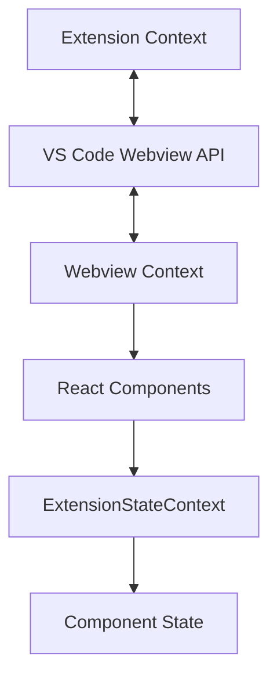
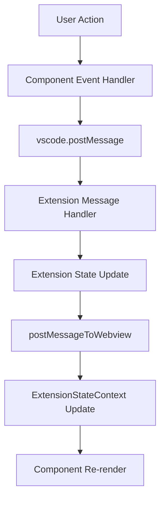

# Webview API and Message Protocols

This document provides comprehensive documentation for the webview-extension communication protocols, React component APIs,
and data flow patterns.

## Table of Contents

- [Message Protocol Overview](#message-protocol-overview)
- [Extension to Webview Messages](#extension-to-webview-messages)
- [Webview to Extension Messages](#webview-to-extension-messages)
- [React Context APIs](#react-context-apis)
- [Component Library](#component-library)
- [Custom Hooks](#custom-hooks)
- [Utility Functions](#utility-functions)

## Message Protocol Overview

The webview and extension communicate through a bidirectional message passing system using VS Code's webview API. Messages are
typed and follow consistent patterns for data exchange.

### Message Flow Architecture



### Core Message Interface

```typescript
// Base message structure
interface BaseMessage {
	type: string
	[key: string]: any
}

// VS Code API wrapper
class VSCodeAPIWrapper {
	postMessage(message: WebviewMessage): void
	getState(): unknown | undefined
	setState<T>(newState: T): T
}
```

## Extension to Webview Messages

Messages sent from the extension to the webview to update UI state and trigger actions.

### ExtensionMessage Interface

```typescript
interface ExtensionMessage {
	type:
		| "action"
		| "state"
		| "selectedImages"
		| "theme"
		| "workspaceUpdated"
		| "invoke"
		| "messageUpdated"
		| "mcpServers"
		| "enhancedPrompt"
		| "commitSearchResults"
		| "listApiConfig"
		| "routerModels"
		| "openAiModels"
		| "ollamaModels"
		| "lmStudioModels"
		| "vsCodeLmModels"
		| "vsCodeLmApiAvailable"
		| "updatePrompt"
		| "systemPrompt"
		| "autoApprovalEnabled"
		| "updateCustomMode"
		| "deleteCustomMode"
		| "exportModeResult"
		| "importModeResult"
		| "checkRulesDirectoryResult"
		| "deleteCustomModeCheck"
		| "currentCheckpointUpdated"
		| "showHumanRelayDialog"
		| "humanRelayResponse"
		| "humanRelayCancel"
		| "insertTextToChatArea"
		| "browserToolEnabled"
		| "browserConnectionResult"
		| "remoteBrowserEnabled"
		| "ttsStart"
		| "ttsStop"
		| "maxReadFileLine"
		| "fileSearchResults"
		| "toggleApiConfigPin"
		| "mcpMarketplaceCatalog"
		| "mcpDownloadDetails"
		| "showSystemNotification"
		| "openInBrowser"
		| "acceptInput"
}
```

### Key Message Types

#### State Updates

The most important message type for synchronizing extension state with the webview.

```typescript
{
	type: "state"
	state: ExtensionState
}

interface ExtensionState {
	version: string
	clineMessages: ClineMessage[]
	taskHistory: HistoryItem[]
	shouldShowAnnouncement: boolean
	apiConfiguration?: ProviderSettings
	customInstructions?: string
	alwaysAllowReadOnly: boolean
	alwaysAllowWrite: boolean
	alwaysAllowExecute: boolean
	alwaysAllowBrowser: boolean
	alwaysAllowMcp: boolean
	// ... additional state properties
}
```

#### Action Messages

Trigger specific UI actions or state changes.

```typescript
{
  type: "action"
  action:
    | "chatButtonClicked"
    | "settingsButtonClicked"
    | "historyButtonClicked"
    | "mcpButtonClicked"
    | "newTask"
    | "clearTask"
}
```

#### Theme Updates

Synchronize VS Code theme with webview styling.

```typescript
{
	type: "theme"
	text: string
	backgroundColor: string
	buttonBackgroundColor: string
	// Additional theme properties
}
```

#### MCP Server Updates

Update available MCP servers and tools.

```typescript
{
  type: "mcpServers"
  mcpServers: McpServer[]
}

interface McpServer {
  name: string
  status: "connected" | "disconnected" | "error"
  tools: McpTool[]
  resources: McpResource[]
}
```

## Webview to Extension Messages

Messages sent from the webview to the extension to trigger operations and provide user input.

### WebviewMessage Interface

```typescript
interface WebviewMessage {
	type:
		| "updateTodoList"
		| "deleteMultipleTasksWithIds"
		| "currentApiConfigName"
		| "saveApiConfiguration"
		| "upsertApiConfiguration"
		| "deleteApiConfiguration"
		| "loadApiConfiguration"
		| "loadApiConfigurationById"
		| "renameApiConfiguration"
		| "getListApiConfiguration"
		| "customInstructions"
		| "allowedCommands"
		| "deniedCommands"
		| "alwaysAllowReadOnly"
		| "alwaysAllowReadOnlyOutsideWorkspace"
		| "alwaysAllowWrite"
		| "alwaysAllowWriteOutsideWorkspace"
		| "alwaysAllowWriteProtected"
		| "alwaysAllowExecute"
		| "alwaysAllowFollowupQuestions"
		| "alwaysAllowUpdateTodoList"
		| "followupAutoApproveTimeoutMs"
		| "webviewDidLaunch"
		| "newTask"
		| "askResponse"
		| "terminalOperation"
		| "clearTask"
		| "didShowAnnouncement"
		| "selectImages"
		| "exportCurrentTask"
		| "shareCurrentTask"
		| "showTaskWithId"
		| "deleteTaskWithId"
		| "exportTaskWithId"
		| "importSettings"
		| "toggleToolAutoApprove"
		| "openExtensionSettings"
		| "openInBrowser"
		| "fetchOpenGraphData"
		| "checkIsImageUrl"
		| "exportSettings"
		| "resetState"
		| "flushRouterModels"
		| "requestRouterModels"
		| "requestOpenAiModels"
		| "requestOllamaModels"
		| "requestLmStudioModels"
		| "requestVsCodeLmModels"
		| "openImage"
		| "saveImage"
		| "openFile"
		| "openMention"
		| "cancelTask"
		| "updateVSCodeSetting"
		| "getVSCodeSetting"
		| "vsCodeSetting"
		| "alwaysAllowBrowser"
		| "alwaysAllowMcp"
		| "alwaysAllowModeSwitch"
		| "allowedMaxRequests"
		| "alwaysAllowSubtasks"
		| "autoCondenseContext"
		| "autoCondenseContextPercent"
		| "condensingApiConfigId"
		| "updateCondensingPrompt"
		| "playSound"
		| "playTts"
		| "stopTts"
}
```

### Message Types

#### Task Management

##### New Task Creation

```typescript
{
  type: "newTask"
  text: string
  images?: string[]
  mode?: string
}
```

##### User Responses

```typescript
{
  type: "askResponse"
  askResponse: ClineAskResponse
  text?: string
  images?: string[]
}

type ClineAskResponse =
  | "yesButtonClicked"
  | "noButtonClicked"
  | "messageResponse"
  | "objectResponse"
  | "retry_clicked"
```

#### Configuration Updates

##### API Configuration

```typescript
{
	type: "saveApiConfiguration"
	apiConfiguration: ProviderSettings
}

{
	type: "upsertApiConfiguration"
	apiConfiguration: ProviderSettings
}
```

##### Auto-Approval Settings

```typescript
{
	type: "alwaysAllowReadOnly"
	bool: boolean
}

{
	type: "alwaysAllowWrite"
	bool: boolean
}

{
	type: "alwaysAllowExecute"
	bool: boolean
}
```

## React Context APIs

### ExtensionStateContext

The primary context for managing extension state and providing data to components.

```typescript
interface ExtensionStateContextType extends ExtensionState {
	// State properties
	didHydrateState: boolean
	showWelcome: boolean
	theme: any
	mcpServers: McpServer[]
	mcpMarketplaceCatalog: McpMarketplaceCatalog
	hasSystemPromptOverride?: boolean
	currentCheckpoint?: string
	filePaths: string[]
	openedTabs: Array<{ label: string; isActive: boolean; path?: string }>

	// Rule and workflow toggles
	globalRules: ClineRulesToggles
	localRules: ClineRulesToggles
	globalWorkflows: ClineRulesToggles
	localWorkflows: ClineRulesToggles

	// Organization and authentication
	organizationAllowList: OrganizationAllowList
	cloudIsAuthenticated: boolean
	sharingEnabled: boolean

	// Configuration properties
	maxConcurrentFileReads?: number
	allowVeryLargeReads?: boolean
	mdmCompliant?: boolean
	hasOpenedModeSelector: boolean
	alwaysAllowFollowupQuestions: boolean
	followupAutoApproveTimeoutMs: number | undefined
	condensingApiConfigId?: string
	customCondensingPrompt?: string
	marketplaceItems?: any[]
	marketplaceInstalledMetadata?: MarketplaceInstalledMetadata
	profileThresholds: Record<string, number>

	// UI state
	historyPreviewCollapsed?: boolean
	showTaskTimeline?: boolean
	hoveringTaskTimeline?: boolean
	systemNotificationsEnabled?: boolean

	// Setter functions
	setShowTaskTimeline: (value: boolean) => void
	setHoveringTaskTimeline: (value: boolean) => void
	setSystemNotificationsEnabled: (value: boolean) => void
	setHasOpenedModeSelector: (value: boolean) => void
	setAlwaysAllowFollowupQuestions: (value: boolean) => void
	setFollowupAutoApproveTimeoutMs: (value: number) => void
	setCondensingApiConfigId: (value: string) => void
	setCustomCondensingPrompt: (value: string) => void
	setProfileThresholds: (value: Record<string, number>) => void
	setApiConfiguration: (config: ProviderSettings) => void
	setCustomInstructions: (value?: string) => void
	setAlwaysAllowReadOnly: (value: boolean) => void
	setAlwaysAllowReadOnlyOutsideWorkspace: (value: boolean) => void
	setAlwaysAllowWrite: (value: boolean) => void
	setAlwaysAllowWriteOutsideWorkspace: (value: boolean) => void
	setAlwaysAllowExecute: (value: boolean) => void
	setAlwaysAllowBrowser: (value: boolean) => void
	setAlwaysAllowMcp: (value: boolean) => void
	setAlwaysAllowModeSwitch: (value: boolean) => void
	setAlwaysAllowSubtasks: (value: boolean) => void
	setBrowserToolEnabled: (value: boolean) => void
	setShowRooIgnoredFiles: (value: boolean) => void
	setShowAutoApproveMenu: (value: boolean) => void
	setShowAnnouncement: (value: boolean) => void
	setAllowedCommands: (value: string[]) => void
	setDeniedCommands: (value: string[]) => void
	setAllowedMaxRequests: (value: number | undefined) => void
	setSoundEnabled: (value: boolean) => void
	setSoundVolume: (value: number) => void
	setTerminalShellIntegrationTimeout: (value: number) => void
	setTerminalShellIntegrationDisabled: (value: boolean) => void
	setTerminalZdotdir: (value: boolean) => void
	setTtsEnabled: (value: boolean) => void
	setTtsSpeed: (value: number) => void
	setDiffEnabled: (value: boolean) => void
}
```

#### Usage Example

```typescript
import { useExtensionState } from "@src/context/ExtensionStateContext"

function MyComponent() {
  const {
    clineMessages,
    apiConfiguration,
    setApiConfiguration,
    alwaysAllowReadOnly,
    setAlwaysAllowReadOnly
  } = useExtensionState()

  const handleConfigUpdate = (newConfig: ProviderSettings) => {
    setApiConfiguration(newConfig)
    vscode.postMessage({
      type: "saveApiConfiguration",
      apiConfiguration: newConfig
    })
  }

  return (
    <div>
      {/* Component JSX */}
    </div>
  )
}
```

### TranslationContext

Provides internationalization support for the webview.

```typescript
interface TranslationContextType {
	t: (key: string, options?: any) => string
	language: string
	setLanguage: (lang: string) => void
}
```

## Component Library

### Core Components

#### ChatView

The main chat interface component.

```typescript
interface ChatViewProps {
	isHidden: boolean
	showAnnouncement: boolean
	hideAnnouncement: () => void
}

interface ChatViewRef {
	acceptInput: () => void
	focusInput: () => void
}

const ChatView = forwardRef<ChatViewRef, ChatViewProps>((props, ref) => {
	// Component implementation
})
```

**Key Features:**

- Message virtualization for performance
- Image attachment support
- Auto-approval controls
- Command validation
- Sound and TTS integration

#### ChatTextArea

Text input component with advanced features.

```typescript
interface ChatTextAreaProps {
	value: string
	onChange: (value: string) => void
	onSubmit: () => void
	placeholder?: string
	disabled?: boolean
	onImagePaste?: (images: string[]) => void
}
```

**Features:**

- Markdown syntax highlighting
- Image paste support
- Keyboard shortcuts
- Auto-resize
- Context mentions (@file, @folder)

#### SettingsView

Configuration interface for the extension.

```typescript
interface SettingsViewProps {
	onDone: () => void
}

interface SettingsViewRef {
	focusApiKey: () => void
}

const SettingsView = forwardRef<SettingsViewRef, SettingsViewProps>((props, ref) => {
	// Component implementation
})
```

### UI Components

#### Button Components

```typescript
// Standard VS Code button
import { VSCodeButton } from "@vscode/webview-ui-toolkit/react"

// Custom button with tooltip
interface ButtonProps {
	onClick: () => void
	disabled?: boolean
	variant?: "primary" | "secondary"
	children: React.ReactNode
}
```

#### Input Components

```typescript
// Text input with validation
interface TextInputProps {
	value: string
	onChange: (value: string) => void
	placeholder?: string
	error?: string
	disabled?: boolean
}

// Select dropdown
interface SelectProps<T> {
	value: T
	onChange: (value: T) => void
	options: Array<{ label: string; value: T }>
	placeholder?: string
}
```

## Custom Hooks

### useAutoApprovalState

Manages auto-approval toggle states.

```typescript
interface AutoApprovalToggles {
  alwaysAllowReadOnly?: boolean
  alwaysAllowWrite?: boolean
  alwaysAllowExecute?: boolean
  alwaysAllowBrowser?: boolean
  alwaysAllowMcp?: boolean
  alwaysAllowModeSwitch?: boolean
  alwaysAllowSubtasks?: boolean
  alwaysApproveResubmit?: boolean
  alwaysAllowFollowupQuestions?: boolean
  alwaysAllowUpdateTodoList?: boolean
}

function useAutoApprovalState(
  toggles: AutoApprovalToggles,
  autoApprovalEnabled?: boolean
) {
  return {
    hasEnabledOptions: boolean
    effectiveAutoApprovalEnabled: boolean
  }
}
```

### useAutoApprovalToggles

Provides toggle functions for auto-approval settings.

```typescript
function useAutoApprovalToggles() {
  return {
    toggleReadOnly: () => void
    toggleWrite: () => void
    toggleExecute: () => void
    toggleBrowser: () => void
    toggleMcp: () => void
    toggleModeSwitch: () => void
    toggleSubtasks: () => void
    toggleFollowupQuestions: () => void
    toggleUpdateTodoList: () => void
  }
}
```

### useSelectedModel

Manages model selection state.

```typescript
function useSelectedModel() {
  return {
    selectedModel: ModelInfo | undefined
    setSelectedModel: (model: ModelInfo) => void
    availableModels: ModelInfo[]
    isLoading: boolean
  }
}
```

### useTooltip

Provides tooltip functionality.

```typescript
function useTooltip() {
  return {
    showTooltip: (content: string, element: HTMLElement) => void
    hideTooltip: () => void
    isVisible: boolean
  }
}
```

## Utility Functions

### Message Handling

#### vscode.postMessage

Send messages to the extension.

```typescript
import { vscode } from "@src/utils/vscode"

// Send configuration update
vscode.postMessage({
	type: "saveApiConfiguration",
	apiConfiguration: newConfig,
})

// Request data
vscode.postMessage({
	type: "requestRouterModels",
})
```

#### Message Event Handling

```typescript
// Listen for extension messages
useEffect(() => {
	const handleMessage = (event: MessageEvent) => {
		const message: ExtensionMessage = event.data

		switch (message.type) {
			case "state":
				// Handle state update
				break
			case "theme":
				// Handle theme update
				break
			// ... other message types
		}
	}

	window.addEventListener("message", handleMessage)
	return () => window.removeEventListener("message", handleMessage)
}, [])
```

### Image Utilities

```typescript
// Image processing functions
export function appendImages(text: string, images: string[]): string
export function isImageUrl(url: string): boolean
export function compressImage(file: File, maxSize: number): Promise<string>
```

### Format Utilities

```typescript
// Text formatting
export function formatPrice(amount: number, currency: string): string
export function formatLanguage(language: string): string
export function removeLeadingNonAlphanumeric(text: string): string

// Code highlighting
export function highlightCode(code: string, language: string): string
export function getLanguageFromPath(filePath: string): string
```

### Validation Utilities

```typescript
// Command validation
export function getCommandDecision(
	command: string,
	allowedCommands: string[],
	deniedCommands: string[],
): CommandDecision

export function parseCommand(command: string): {
	command: string
	args: string[]
}

// Input validation
export function validateApiKey(key: string): boolean
export function validateUrl(url: string): boolean
```

## Data Flow Patterns

### State Management Flow



### Message Processing Pattern

```typescript
// Extension side
class ClineProvider {
	async handleWebviewMessage(message: WebviewMessage) {
		switch (message.type) {
			case "newTask":
				await this.startNewTask(message.text, message.images)
				break
			case "saveApiConfiguration":
				await this.saveConfiguration(message.apiConfiguration)
				this.postMessageToWebview({
					type: "state",
					state: this.getState(),
				})
				break
		}
	}
}

// Webview side
function useMessageHandler() {
	useEffect(() => {
		const handleMessage = (event: MessageEvent) => {
			const message: ExtensionMessage = event.data

			switch (message.type) {
				case "state":
					updateExtensionState(message.state)
					break
				case "action":
					handleAction(message.action)
					break
			}
		}

		window.addEventListener("message", handleMessage)
		return () => window.removeEventListener("message", handleMessage)
	}, [])
}
```

### Error Handling Pattern

```typescript
// Component error boundary
class ErrorBoundary extends React.Component {
	componentDidCatch(error: Error, errorInfo: React.ErrorInfo) {
		vscode.postMessage({
			type: "reportError",
			error: error.message,
			stack: error.stack,
			componentStack: errorInfo.componentStack,
		})
	}
}

// Async operation error handling
async function handleAsyncOperation() {
	try {
		const result = await someAsyncOperation()
		return result
	} catch (error) {
		vscode.postMessage({
			type: "showSystemNotification",
			message: `Operation failed: ${error.message}`,
			type: "error",
		})
		throw error
	}
}
```

## Performance Considerations

### Message Optimization

- Batch related messages when possible
- Use debouncing for frequent updates
- Implement message queuing for high-frequency operations

### Component Optimization

- Use React.memo for expensive components
- Implement virtualization for large lists
- Lazy load heavy components

### State Management

- Minimize context re-renders with selective subscriptions
- Use local state for UI-only concerns
- Implement proper cleanup in useEffect hooks

This API reference provides comprehensive documentation for working with the webview layer of the Kiro extension, including
message protocols, React components, and integration patterns.
