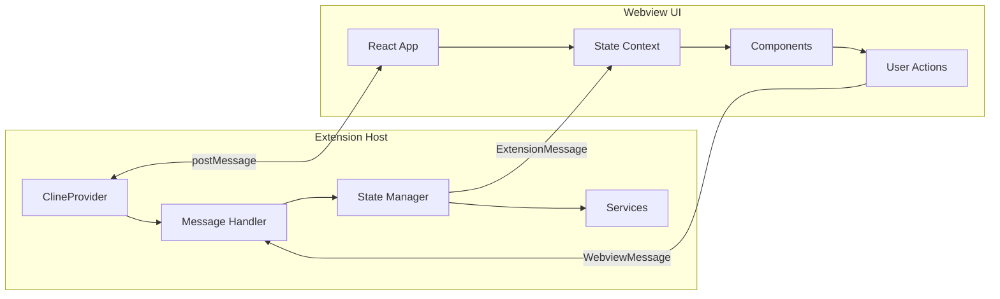
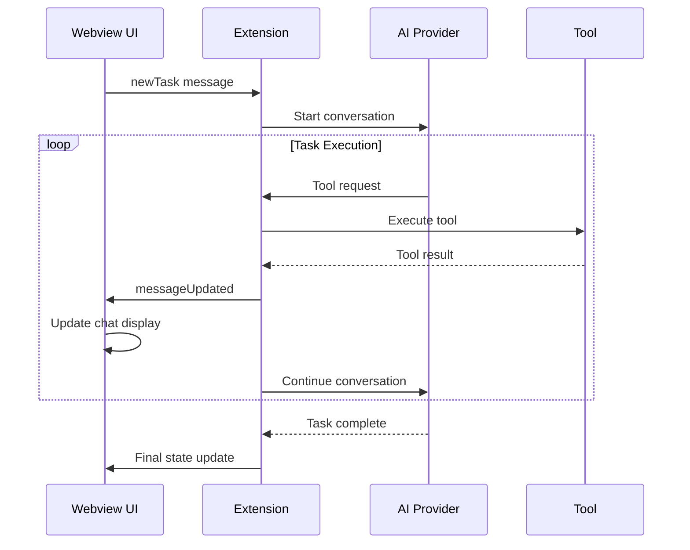

# Data Flow and Communication Documentation

## Overview

Kilo Code uses a sophisticated communication system between the VS Code extension host and the webview UI. This
document details the message protocols, state management patterns, and data synchronization mechanisms.

## Communication Architecture

The extension uses VS Code's webview message passing API for bidirectional communication:



## Message Types

### WebviewMessage (UI → Extension)

Messages sent from the webview to the extension host:

```typescript
interface WebviewMessage {
	type:
		| "newTask"
		| "askResponse"
		| "saveApiConfiguration"
		| "customInstructions"
		| "openFile"
		| "cancelTask"
		| "exportCurrentTask"
	// ... many more types
}
```

#### Key Message Categories

**Task Management**:

- `newTask`: Start a new conversation/task
- `cancelTask`: Cancel current task execution
- `clearTask`: Clear current task state
- `exportCurrentTask`: Export task to markdown

**Configuration**:

- `saveApiConfiguration`: Save API provider settings
- `customInstructions`: Update custom instructions
- `allowedCommands`: Update allowed terminal commands
- `alwaysAllowReadOnly`: Update auto-approval settings

**File Operations**:

- `openFile`: Open file in VS Code editor
- `openImage`: Open image in default viewer
- `selectImages`: Select images for context

**Terminal Operations**:

- `terminalOperation`: Execute terminal commands
- `playSound`: Play notification sounds
- `playTts`: Text-to-speech operations

### ExtensionMessage (Extension → UI)

Messages sent from the extension to the webview:

```typescript
interface ExtensionMessage {
	type: "state" | "action" | "theme" | "workspaceUpdated" | "mcpServers" | "routerModels"
	// ... many more types
}
```

#### Extension → Webview Message Categories

**State Updates**:

- `state`: Complete state synchronization
- `workspaceUpdated`: Workspace changes
- `currentCheckpointUpdated`: Version control state

**UI Updates**:

- `theme`: VS Code theme changes
- `selectedImages`: Image selection results
- `fileSearchResults`: File search results

**Service Updates**:

- `mcpServers`: MCP server status
- `routerModels`: Available AI models
- `browserConnectionResult`: Browser service status

## State Management

### Extension State Structure

The main state object contains all persistent data:

```typescript
interface ExtensionState {
	// Core conversation data
	clineMessages: ClineMessage[]
	taskHistory: HistoryItem[]

	// Configuration
	apiConfiguration: ProviderSettings
	customInstructions?: string
	allowedCommands: string[]
	deniedCommands: string[]

	// UI preferences
	soundEnabled: boolean
	ttsEnabled: boolean
	diffEnabled: boolean
	theme: any

	// Auto-approval settings
	alwaysAllowReadOnly: boolean
	alwaysAllowWrite: boolean
	alwaysAllowExecute: boolean

	// Service settings
	mcpEnabled: boolean
	browserToolEnabled: boolean

	// Advanced settings
	maxWorkspaceFiles: number
	fuzzyMatchThreshold: number
	writeDelayMs: number
}
```

### State Synchronization

#### Initial State Loading

When the webview loads, it requests the current state:

```typescript
// Webview initialization
useEffect(() => {
    vscode.postMessage({ type: "webviewDidLaunch" })
}, [])

// Extension response
case "webviewDidLaunch":
    await provider.postStateToWebview()
    break
```

#### State Updates

State changes flow in both directions:

**UI → Extension**:

```typescript
// User changes a setting
const setApiConfiguration = useCallback((config: ProviderSettings) => {
	vscode.postMessage({
		type: "saveApiConfiguration",
		apiConfiguration: config,
	})
}, [])
```

**Extension → UI**:

```typescript
// Extension broadcasts state change
await this.postMessageToWebview({
	type: "state",
	state: await this.getStateToPostToWebview(),
})
```

### State Merging

The webview uses a merging strategy to handle partial state updates:

```typescript
export const mergeExtensionState = (prevState: ExtensionState, newState: ExtensionState) => {
	const { customModePrompts: prevCustomModePrompts, experiments: prevExperiments, ...prevRest } = prevState

	const {
		apiConfiguration,
		customModePrompts: newCustomModePrompts,
		experiments: newExperiments,
		...newRest
	} = newState

	// Merge nested objects
	const customModePrompts = { ...prevCustomModePrompts, ...newCustomModePrompts }
	const experiments = { ...prevExperiments, ...newExperiments }
	const rest = { ...prevRest, ...newRest }

	return { ...rest, apiConfiguration, customModePrompts, experiments }
}
```

## Message Handling Patterns

### Extension Message Handler

The extension uses a centralized message handler:

```typescript
export const webviewMessageHandler = async (
	provider: ClineProvider,
	message: WebviewMessage,
	marketplaceManager?: MarketplaceManager,
) => {
	// Utility functions for state management
	const getGlobalState = <K extends keyof GlobalState>(key: K) => provider.contextProxy.getValue(key)

	const updateGlobalState = async <K extends keyof GlobalState>(key: K, value: GlobalState[K]) =>
		await provider.contextProxy.setValue(key, value)

	switch (message.type) {
		case "newTask":
			await provider.clearTask()
			await provider.startTask(message.text, message.images)
			break

		case "saveApiConfiguration":
			await updateGlobalState("apiConfiguration", message.apiConfiguration)
			await provider.postStateToWebview()
			break

		// ... handle other message types
	}
}
```

### Webview Message Handling

The webview uses React hooks for message handling:

```typescript
const ExtensionStateContextProvider = ({ children }) => {
    const [state, setState] = useState<ExtensionState>({...})

    useEffect(() => {
        const handleMessage = (event: MessageEvent) => {
            const message: ExtensionMessage = event.data

            switch (message.type) {
                case "state":
                    setState(prevState =>
                        mergeExtensionState(prevState, message.state)
                    )
                    break

                case "theme":
                    setTheme(message.theme)
                    break

                // ... handle other message types
            }
        }

        window.addEventListener("message", handleMessage)
        return () => window.removeEventListener("message", handleMessage)
    }, [])
}
```

## Data Persistence

### Global State Storage

The extension uses VS Code's global state for persistence:

```typescript
class ContextProxy {
	async setValue<K extends keyof GlobalState>(key: K, value: GlobalState[K]): Promise<void> {
		await this.context.globalState.update(key, value)

		// Notify all providers of state change
		this.eventEmitter.emit("stateChanged", key, value)
	}

	getValue<K extends keyof GlobalState>(key: K): GlobalState[K] | undefined {
		return this.context.globalState.get(key)
	}
}
```

### Task Persistence

Individual tasks are persisted to the file system:

```typescript
// Task storage location
const getTasksDir = () => path.join(os.homedir(), ".kilo-code", "tasks")

// Save task data
await safeWriteJson(path.join(getTasksDir(), `${taskId}.json`), {
	clineMessages: this.clineMessages,
	apiConversationHistory: this.apiConversationHistory,
	taskMetadata: this.taskMetadata,
})
```

## Real-time Communication

### Task Execution Updates

During task execution, the extension streams updates to the webview:



### Progress Indicators

The system provides real-time progress updates:

```typescript
// Extension sends progress updates
await this.postMessageToWebview({
    type: "indexingStatusUpdate",
    values: {
        systemStatus: "indexing",
        processedItems: 150,
        totalItems: 500,
        currentItemUnit: "files"
    }
})

// UI displays progress
const ProgressIndicator = () => {
    const { indexingStatus } = useExtensionState()

    return (
        <div>
            {indexingStatus.systemStatus === "indexing" && (
                <ProgressBar
                    value={indexingStatus.processedItems}
                    max={indexingStatus.totalItems}
                />
            )}
        </div>
    )
}
```

## Error Handling

### Message Validation

Messages are validated using Zod schemas:

```typescript
const checkoutDiffPayloadSchema = z.object({
	filePath: z.string(),
	content: z.string(),
	timestamp: z.number(),
})

// Validate incoming message
try {
	const payload = checkoutDiffPayloadSchema.parse(message.payload)
	// Process valid payload
} catch (error) {
	console.error("Invalid message payload:", error)
	return
}
```

### Error Propagation

Errors are communicated back to the UI:

```typescript
// Extension error handling
try {
    await executeCommand(command)
} catch (error) {
    await this.postMessageToWebview({
        type: "action",
        action: "error",
        message: error.message
    })
}

// UI error display
const ErrorBoundary = ({ children }) => {
    const [error, setError] = useState(null)

    useEffect(() => {
        const handleMessage = (event) => {
            if (event.data.type === "action" && event.data.action === "error") {
                setError(event.data.message)
            }
        }

        window.addEventListener("message", handleMessage)
        return () => window.removeEventListener("message", handleMessage)
    }, [])

    if (error) {
        return <ErrorDisplay error={error} />
    }

    return children
}
```

## Performance Optimizations

### Message Batching

Related state updates are batched to reduce message overhead:

```typescript
// Batch multiple state changes
const batchedUpdates = {
	apiConfiguration: newConfig,
	customInstructions: newInstructions,
	allowedCommands: newCommands,
}

await this.postMessageToWebview({
	type: "state",
	state: batchedUpdates,
})
```

### Selective Updates

Only changed data is sent in updates:

```typescript
// Compare and send only differences
const stateDiff = computeStateDifference(previousState, currentState)
if (Object.keys(stateDiff).length > 0) {
	await this.postMessageToWebview({
		type: "state",
		state: stateDiff,
	})
}
```

### Debounced Updates

Rapid state changes are debounced:

```typescript
const debouncedStateUpdate = debounce(async () => {
	await this.postStateToWebview()
}, 100)

// Use debounced update for frequent changes
debouncedStateUpdate()
```

This communication architecture ensures reliable, performant, and maintainable data flow between the extension
and webview components while providing a responsive user experience.
