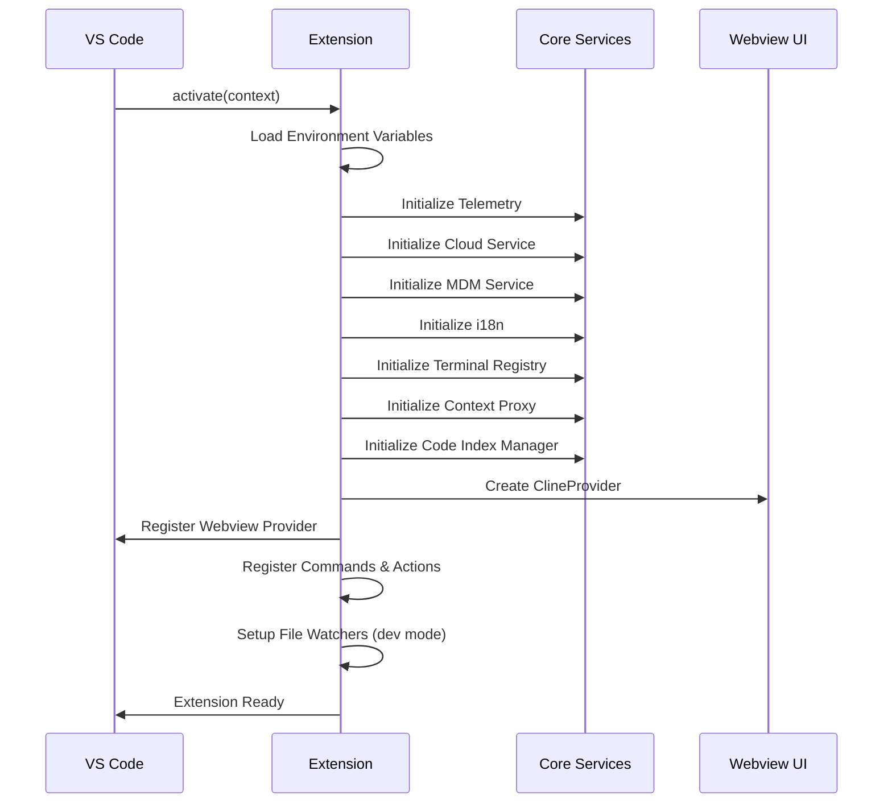

# Extension Lifecycle and Activation

## Overview

The Kilo Code extension follows VS Code's standard extension lifecycle with specific activation events and
initialization sequences. This document details the complete lifecycle from activation to deactivation.

## Activation Events

The extension is configured to activate on the following events (defined in `package.json`):

```json
"activationEvents": [
    "onLanguage",
    "onStartupFinished"
]
```

### Activation Triggers

1. **onLanguage**: Activates when any programming language file is opened
2. **onStartupFinished**: Activates after VS Code has finished starting up

This ensures the extension is available whenever users are working with code files or when VS Code is ready.

## Activation Sequence

The main activation flow occurs in `src/extension.ts`:



### Detailed Activation Steps

#### 1. Environment Setup

```typescript
// Load environment variables from .env file
const envPath = path.join(__dirname, "..", ".env")
dotenvx.config({ path: envPath })
```

#### 2. Output Channel Creation

```typescript
outputChannel = vscode.window.createOutputChannel("Kilo-Code")
context.subscriptions.push(outputChannel)
```

#### 3. Settings Migration

```typescript
await migrateSettings(context, outputChannel)
```

#### 4. Service Initialization

**Telemetry Service**:

```typescript
const telemetryService = TelemetryService.createInstance()
telemetryService.register(new PostHogTelemetryClient())
```

**Cloud Service**:

```typescript
await CloudService.createInstance(context, {
	stateChanged: () => ClineProvider.getVisibleInstance()?.postStateToWebview(),
	log: cloudLogger,
})
```

**MDM Service**:

```typescript
const mdmService = await MdmService.createInstance(cloudLogger)
```

**Internationalization**:

```typescript
initializeI18n(context.globalState.get("language") ?? "en-US")
```

**Terminal Registry**:

```typescript
TerminalRegistry.initialize()
```

#### 5. Context and Indexing Setup

**Context Proxy**:

```typescript
const contextProxy = await ContextProxy.getInstance(context)
```

**Code Index Manager**:

```typescript
const codeIndexManager = CodeIndexManager.getInstance(context)
await codeIndexManager?.initialize(contextProxy)
```

#### 6. Main Provider Creation

**ClineProvider Initialization**:

```typescript
const provider = new ClineProvider(context, outputChannel, "sidebar", contextProxy, codeIndexManager, mdmService)
```

#### 7. Webview Registration

**Sidebar Registration**:

```typescript
context.subscriptions.push(
	vscode.window.registerWebviewViewProvider(ClineProvider.sideBarId, provider, {
		webviewOptions: { retainContextWhenHidden: true },
	}),
)
```

#### 8. First-Time Setup

For new installations:

```typescript
if (!context.globalState.get("firstInstallCompleted")) {
	await vscode.commands.executeCommand("kilo-code.SidebarProvider.focus")
	await vscode.commands.executeCommand(
		"workbench.action.openWalkthrough",
		"kilocode.kilo-code#kiloCodeWalkthrough",
		false,
	)
	context.globalState.update("firstInstallCompleted", true)
}
```

#### 9. Command and Action Registration

**Commands**:

```typescript
registerCommands({ context, outputChannel, provider })
```

**Code Actions**:

```typescript
registerCodeActions(context)
registerTerminalActions(context)
```

**Additional Providers**:

```typescript
registerAutocomplete(context)
registerGhostProvider(context)
registerCommitMessageProvider(context, outputChannel)
```

## Command Registration

### Core Commands

The extension registers numerous commands for different functionalities:

#### Chat and Task Commands

- `kilo-code.newTask`: Create a new task
- `kilo-code.focusChatInput`: Focus the chat input
- `kilo-code.acceptInput`: Accept current input

#### UI Navigation Commands

- `kilo-code.plusButtonClicked`: New task button
- `kilo-code.settingsButtonClicked`: Open settings
- `kilo-code.historyButtonClicked`: View history
- `kilo-code.popoutButtonClicked`: Open in new tab

#### Code Action Commands

- `kilo-code.explainCode`: Explain selected code
- `kilo-code.fixCode`: Fix code issues
- `kilo-code.improveCode`: Improve code quality
- `kilo-code.addToContext`: Add to conversation context

#### Terminal Integration Commands

- `kilo-code.terminalAddToContext`: Add terminal output to context
- `kilo-code.terminalFixCommand`: Fix terminal command
- `kilo-code.terminalExplainCommand`: Explain terminal command

### Command Registration Process

```typescript
export const registerCommands = (options: RegisterCommandOptions) => {
	const { context } = options

	for (const [id, callback] of Object.entries(getCommandsMap(options))) {
		const command = getCommand(id as CommandId)
		context.subscriptions.push(vscode.commands.registerCommand(command, callback))
	}
}
```

## Event Handling

### URI Handling

The extension handles custom URI schemes for OAuth callbacks:

```typescript
context.subscriptions.push(vscode.window.registerUriHandler({ handleUri }))
```

Supported URI schemes:

- `/glama`: Glama OAuth callback
- `/openrouter`: OpenRouter OAuth callback
- `/kilocode`: Kilo Code authentication
- `/requesty`: Requesty OAuth callback
- `/auth/clerk/callback`: Clerk authentication callback

### Code Actions Provider

```typescript
context.subscriptions.push(
	vscode.languages.registerCodeActionsProvider({ pattern: "**/*" }, new CodeActionProvider(), {
		providedCodeActionKinds: CodeActionProvider.providedCodeActionKinds,
	}),
)
```

### Diff Content Provider

For showing file differences:

```typescript
const diffContentProvider = new (class implements vscode.TextDocumentContentProvider {
	provideTextDocumentContent(uri: vscode.Uri): string {
		return Buffer.from(uri.query, "base64").toString("utf-8")
	}
})()

context.subscriptions.push(
	vscode.workspace.registerTextDocumentContentProvider(DIFF_VIEW_URI_SCHEME, diffContentProvider),
)
```

## Webview Management

### Webview Creation

The webview is created through the `ClineProvider` class:

```typescript
export class ClineProvider implements vscode.WebviewViewProvider {
	public static readonly sideBarId = `${Package.name}.SidebarProvider`

	public resolveWebviewView(
		webviewView: vscode.WebviewView,
		context: vscode.WebviewViewResolveContext,
		_token: vscode.CancellationToken,
	): void | Thenable<void> {
		// Configure webview options
		webviewView.webview.options = {
			enableScripts: true,
			localResourceRoots: [this.context.extensionUri],
		}

		// Set HTML content
		webviewView.webview.html = this.getHtmlForWebview(webviewView.webview)

		// Setup message handling
		this.setupWebviewMessageHandling(webviewView.webview)
	}
}
```

### Webview Options

Key webview configuration:

- **enableScripts**: Allows JavaScript execution
- **localResourceRoots**: Restricts resource access to extension directory
- **retainContextWhenHidden**: Preserves state when webview is hidden

## Development Mode Features

### Auto-Reload

In development mode, the extension watches for file changes and automatically reloads:

```typescript
if (process.env.NODE_ENV === "development") {
	const watchPaths = [
		{ path: context.extensionPath, name: "extension" },
		{ path: path.join(context.extensionPath, "../packages/types"), name: "types" },
		{ path: path.join(context.extensionPath, "../packages/telemetry"), name: "telemetry" },
		{ path: path.join(context.extensionPath, "../packages/cloud"), name: "cloud" },
	]

	watchPaths.forEach(({ path: watchPath, name }) => {
		const watcher = vscode.workspace.createFileSystemWatcher(new vscode.RelativePattern(watchPath, "**/*.ts"))

		watcher.onDidChange((uri) => {
			console.log(`♻️ ${name} file changed: ${uri.fsPath}. Reloading host…`)
			vscode.commands.executeCommand("workbench.action.reloadWindow")
		})

		context.subscriptions.push(watcher)
	})
}
```

## Deactivation

The deactivation process ensures proper cleanup:

```typescript
export async function deactivate() {
	outputChannel.appendLine(`${Package.name} extension deactivated`)

	// Cleanup services
	await McpServerManager.cleanup(extensionContext)
	TelemetryService.instance.shutdown()
	TerminalRegistry.cleanup()
}
```

### Cleanup Tasks

1. **MCP Server Cleanup**: Properly close MCP server connections
2. **Telemetry Shutdown**: Flush and close telemetry connections
3. **Terminal Cleanup**: Clean up terminal integrations
4. **Resource Disposal**: All subscriptions are automatically disposed by VS Code

## Error Handling

### Graceful Degradation

The extension is designed to handle initialization failures gracefully:

```typescript
try {
	await codeIndexManager?.initialize(contextProxy)
} catch (error) {
	outputChannel.appendLine(
		`[CodeIndexManager] Error during background configuration/indexing: ${error.message || error}`,
	)
}
```

### Service Isolation

Each service is initialized independently, so failure in one service doesn't prevent others from working:

```typescript
try {
	telemetryService.register(new PostHogTelemetryClient())
} catch (error) {
	console.warn("Failed to register PostHogTelemetryClient:", error)
}
```

This lifecycle design ensures robust initialization, proper resource management, and graceful handling of edge
cases while providing a rich development experience.
