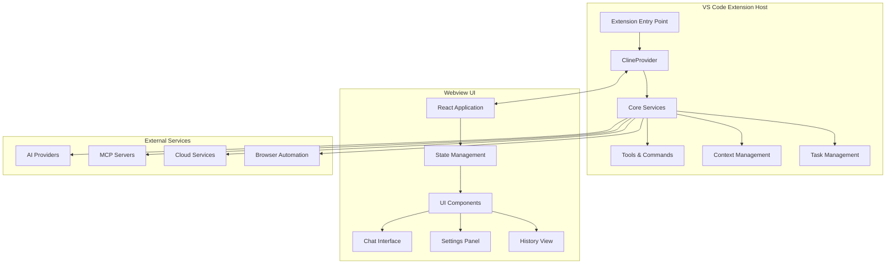
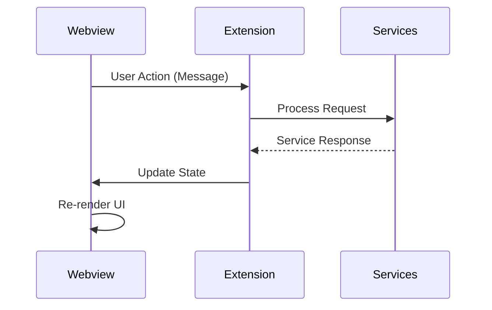
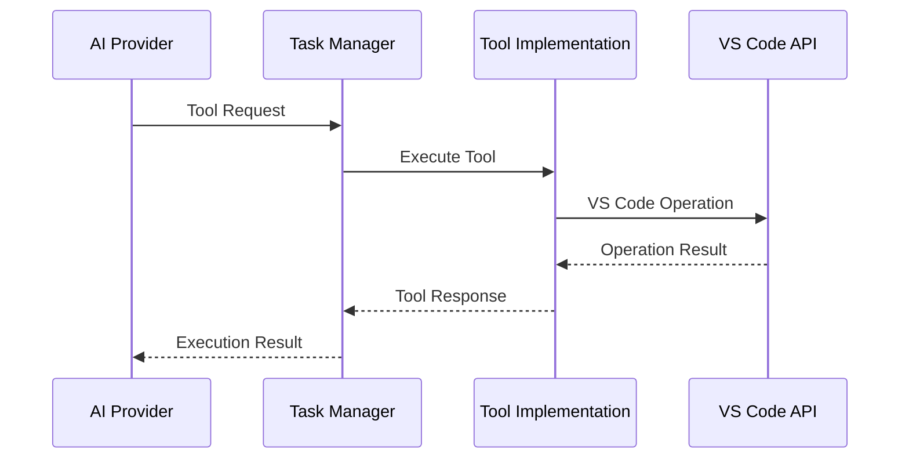

# High-Level Architecture Overview

## Introduction

Kilo Code is a VS Code extension that provides an AI-powered coding assistant with autonomous capabilities.
The extension follows a modular architecture with clear separation between the VS Code extension host, webview
UI, and various service layers.

## System Architecture

The system is built around three main architectural layers:

## Core Components

### 1. Extension Host Layer

The extension host runs in Node.js and handles:

- **Extension Lifecycle**: Activation, deactivation, and command registration
- **Core Services**: File operations, terminal integration, and system interactions
- **AI Integration**: Communication with various AI providers and model management
- **Context Management**: Workspace analysis, file tracking, and code indexing
- **Tool Execution**: File operations, command execution, and browser automation

### 2. Webview UI Layer

The webview provides the user interface built with React:

- **Chat Interface**: Real-time conversation with the AI assistant
- **Settings Management**: Configuration of providers, models, and preferences
- **History Management**: Task history and conversation tracking
- **State Synchronization**: Bidirectional communication with the extension host

### 3. Service Layer

Modular services provide specialized functionality:

- **MCP (Model Context Protocol)**: Integration with external tools and services
- **Code Index**: Semantic search and code understanding
- **Browser Service**: Web scraping and automation capabilities
- **Checkpoint Service**: Version control and rollback functionality
- **Ghost Service**: Inline code suggestions and completions

## Key Design Decisions

### Webview Architecture

The extension uses VS Code's webview API to provide a rich, interactive UI:

- **Isolation**: The webview runs in a separate context for security
- **Communication**: Message passing between extension and webview
- **Persistence**: State is maintained across webview reloads
- **Theming**: Automatic adaptation to VS Code themes

### Modular Service Design

Services are designed as independent modules:

- **Dependency Injection**: Services are injected where needed
- **Lifecycle Management**: Proper initialization and cleanup
- **Error Isolation**: Failures in one service don't affect others
- **Extensibility**: New services can be added without core changes

### Tool-Based Architecture

The AI assistant uses a tool-based approach:

- **Structured Tools**: Each capability is exposed as a structured tool
- **Validation**: Tool inputs and outputs are validated
- **Permissions**: Tools require appropriate permissions
- **Composability**: Tools can be combined for complex operations

## Communication Patterns

### Extension ↔ Webview Communication

### Tool Execution Flow

## Data Flow

### Context Management

The system maintains various types of context:

1. **Workspace Context**: Files, folders, and project structure
2. **Conversation Context**: Chat history and task state
3. **Code Context**: Semantic understanding and relationships
4. **User Context**: Preferences, settings, and permissions

### State Management

State is managed at multiple levels:

- **Global State**: Extension-wide configuration and settings
- **Task State**: Individual conversation and task context
- **UI State**: Webview component state and user interactions
- **Service State**: Internal service state and caches

## Security Considerations

### Sandboxing

- **Webview Isolation**: UI runs in isolated webview context
- **Tool Permissions**: Each tool requires explicit permissions
- **Command Validation**: User commands are validated before execution
- **File Access**: Controlled access to workspace files

### Data Protection

- **Sensitive Data**: API keys and tokens are securely stored
- **User Privacy**: Telemetry is opt-in and anonymized
- **Cloud Integration**: Optional cloud features with user consent
- **Local Processing**: Core functionality works offline

## Performance Optimizations

### Lazy Loading

- **Service Initialization**: Services are initialized on demand
- **UI Components**: React components use lazy loading
- **Code Indexing**: Incremental indexing with background processing
- **Tool Loading**: Tools are loaded when first used

### Caching Strategies

- **File System Cache**: Frequently accessed files are cached
- **AI Response Cache**: Similar requests are cached to reduce API calls
- **Code Analysis Cache**: Parsed code structures are cached
- **UI State Cache**: Component state is preserved across renders

## Extensibility

### Plugin Architecture

The system supports various extension points:

- **Custom Tools**: New tools can be registered
- **MCP Servers**: External services via Model Context Protocol
- **Custom Modes**: User-defined interaction modes
- **Provider Integration**: Support for new AI providers

### Configuration System

Flexible configuration allows customization:

- **Provider Settings**: AI model and provider configuration
- **Tool Settings**: Individual tool configuration
- **UI Preferences**: User interface customization
- **Workspace Settings**: Project-specific configuration

This architecture provides a solid foundation for an AI-powered coding assistant while maintaining flexibility, security, and performance.
