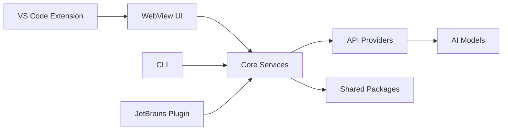

# دليل التطوير

> **نظرة عامة:** كيفية المساهمة في تطوير Kilo Code
> **المستوى:** متوسط إلى متقدم
> **الوقت المقدر:** 1-2 ساعة للقراءة

## 🎯 نظرة عامة

هذا الدليل يساعدك على فهم كيفية المساهمة في Kilo Code، من إصلاح الأخطاء البسيطة إلى إضافة ميزات جديدة.

## 🏗️ فهم البنية

### 1. المكونات الرئيسية

```
kilocode/
├── src/                    # امتداد VS Code
├── webview-ui/            # واجهة الويب (React)
├── cli/                   # واجهة سطر الأوامر
├── jetbrains/             # ملحق JetBrains
├── packages/              # مكتبات مشتركة
└── apps/                  # تطبيقات إضافية
```

### 2. التدفق بين المكونات



### 3. التقنيات المستخدمة

- **TypeScript** - اللغة الرئيسية
- **React** - واجهة الويب
- **Node.js** - Backend و CLI
- **Kotlin** - ملحق JetBrains
- **Turbo** - بناء متوازٍ
- **pnpm** - إدارة الحزم

## 🚀 بدء التطوير

### 1. إعداد البيئة

```bash
# استنساخ وتثبيت
git clone https://github.com/Kilo-Org/kilocode.git
cd kilocode
pnpm install

# بناء المشروع
pnpm build

# تشغيل الاختبارات
pnpm test
```

### 2. اختيار منطقة العمل

```bash
# تطوير امتداد VS Code
cd src
pnpm dev

# تطوير واجهة الويب
cd webview-ui
pnpm dev

# تطوير CLI
cd cli
pnpm dev

# تطوير ملحق JetBrains
cd jetbrains
pnpm jetbrains:run
```

### 3. إعداد VS Code

```json
// .vscode/launch.json
{
	"version": "0.2.0",
	"configurations": [
		{
			"name": "Run Extension",
			"type": "extensionHost",
			"request": "launch",
			"args": ["--extensionDevelopmentPath=${workspaceFolder}/src"]
		}
	]
}
```

## 📝 دورة التطوير

### 1. البدء بمشكلة

```bash
# البحث عن issues
gh issue list

# اختيار issue للعمل عليه
gh issue view 123

# إنشاء فرع جديد
git checkout -b fix/issue-123
```

### 2. التطوير

```bash
# إجراء التغييرات
# فحص الكود
pnpm lint

# فحص الأنواع
pnpm check-types

# تشغيل الاختبارات
pnpm test

# البناء
pnpm build
```

### 3. الاختبار

```bash
# اختبار الوحدة
pnpm --filter <package> test

# اختبار التكامل
pnpm playwright

# اختبار يدوي
# تشغيل الامتداد في VS Code
```

### 4. التقديم

```bash
# إضافة التغييرات
git add .

# إنشاء commit
git commit -m "fix: resolve issue #123"

# دفع الفرع
git push origin fix/issue-123

# إنشاء PR
gh pr create
```

## 🔧 أنواع المساهمات

### 1. إصلاح الأخطاء

```typescript
// مثال: إصلاح خطأ في معالجة الرسائل
// src/core/webview/ClineProvider.ts

export class ClineProvider {
	private async handleMessage(message: ExtensionMessage) {
		try {
			// معالجة الرسالة
			await this.processMessage(message)
		} catch (error) {
			// معالجة الخطأ بشكل أفضل
			this.logger.error("Failed to handle message:", error)
			this.showErrorMessage("Failed to process request")
		}
	}
}
```

### 2. إضافة ميزات جديدة

```typescript
// مثال: إضافة أداة جديدة
// src/core/tools/NewTool.ts

export class NewTool implements Tool {
	name = "newTool"
	description = "Description of the new tool"

	async execute(params: NewToolParams): Promise<NewToolResult> {
		// تنفيذ الأداة
		return { success: true, data: result }
	}
}
```

### 3. تحسينات الأداء

```typescript
// مثال: تحسين الأداء
// src/services/code-index/manager.ts

export class CodeIndexManager {
	private cache = new LRUCache<string, IndexedFile>({
		max: 1000,
		ttl: 1000 * 60 * 5, // 5 دقائق
	})

	async getFile(filePath: string): Promise<IndexedFile> {
		// استخدام التخزين المؤقت
		if (this.cache.has(filePath)) {
			return this.cache.get(filePath)!
		}

		const file = await this.indexFile(filePath)
		this.cache.set(filePath, file)
		return file
	}
}
```

### 4. تحسينات الواجهة

```tsx
// مثال: تحسين واجهة المستخدم
// webview-ui/src/components/NewComponent.tsx

export const NewComponent: React.FC<NewComponentProps> = ({ data, onAction }) => {
	return (
		<div className="p-4 border rounded-lg">
			<h3 className="text-lg font-semibold mb-2">{data.title}</h3>
			<Button onClick={() => onAction(data.id)}>Action</Button>
		</div>
	)
}
```

## 🧪 الاختبار

### 1. اختبارات الوحدات

```typescript
// src/__tests__/example.test.ts
import { describe, test, expect } from "vitest"
import { functionToTest } from "../src/module"

describe("functionToTest", () => {
	test("should work correctly", () => {
		const result = functionToTest(input)
		expect(result).toBe(expectedOutput)
	})
})
```

### 2. اختبارات التكامل

```typescript
// src/__tests__/integration.test.ts
import { describe, test, expect } from "vitest"
import { ClineProvider } from "../src/core/webview/ClineProvider"

describe("ClineProvider Integration", () => {
	test("should handle messages correctly", async () => {
		const provider = new ClineProvider()
		const result = await provider.handleMessage(testMessage)
		expect(result).toBeDefined()
	})
})
```

### 3. اختبارات E2E

```typescript
// apps/playwright-e2e/tests/example.spec.ts
import { test, expect } from "@playwright/test"

test("should complete a coding task", async ({ page }) => {
	await page.goto("vscode://extension/kilo-code")
	await page.fill('[data-testid="chat-input"]', "Write a hello world function")
	await page.click('[data-testid="send-button"]')
	await expect(page.locator('[data-testid="response"]')).toContainText("function helloWorld")
})
```

## 📊 مراجعة الكود

### 1. معايير الكود

```typescript
// ✅ جيد
export const calculateSum = (a: number, b: number): number => {
	return a + b
}

// ❌ سيء
export const sum = (a, b) => a + b
```

### 2. التوثيق

```typescript
/**
 * Calculates the sum of two numbers
 * @param a - First number
 * @param b - Second number
 * @returns The sum of a and b
 */
export const calculateSum = (a: number, b: number): number => {
	return a + b
}
```

### 3. معالجة الأخطاء

```typescript
export async function fetchData(url: string): Promise<Data> {
	try {
		const response = await fetch(url)
		if (!response.ok) {
			throw new Error(`HTTP error! status: ${response.status}`)
		}
		return await response.json()
	} catch (error) {
		logger.error("Failed to fetch data:", error)
		throw new Error("Failed to fetch data")
	}
}
```

## 🔄 سير العمل المتقدم

### 1. التطوير الموازي

```bash
# بناء وتشغيل مكونات متعددة
pnpm build --parallel
pnpm dev --parallel

# اختبار مكونات متعددة
pnpm test --parallel
```

### 2. التصحيح

```bash
# تصحيح امتداد VS Code
code --inspect-extensions ./src

# تصحيح Node.js
node --inspect ./dist/index.js

# تصحيح المتصفح
chrome --inspect --remote-debugging-port=9222
```

### 3. التحليل

```bash
# تحليل الأداء
pnpm build --analyze

# تحليل التغطية
pnpm test --coverage

# تحليل الاعتماديات
pnpm why <package>
```

## 📈 أفضل الممارسات

### 1. كتابة الكود

- استخدام TypeScript بشكل صارم
- اتباع ESLint rules
- كتابة اختبارات لكل ميزة جديدة
- توثيق الكود بشكل جيد

### 2. إدارة الاعتماديات

- استخدام workspace dependencies
- تجنب الاعتماديات الدائرية
- تحديث الاعتماديات بانتظام
- استخدام semantic versioning

### 3. التعاون

- مراجعة PRs من الآخرين
- المشاركة في المناقشات
- المساعدة في حل المشاكل
- مشاركة المعرفة

## 🚨 المشاكل الشائعة

### 1. مشاكل البناء

```bash
# مسح التخزين المؤقت
pnpm turbo clean

# إعادة البناء
pnpm build --force

# التحقق من الاعتماديات
pnpm list --depth=0
```

### 2. مشاكل الاختبار

```bash
# تشغيل اختبار معين
pnpm --filter <package> test

# تشغيل اختبار معين
pnpm test --grep "test name"

# تحديث snapshots
pnpm test --update-snapshots
```

### 3. مشاكل التطوير

```bash
# التحقق من البيئة
pnpm env

# التحقق من الإعدادات
pnpm config list

# إعادة إعداد البيئة
pnpm reinstall
```

## 📚 المصادر الإضافية

### 1. الوثائق الداخلية

- [بنية الامتداد](../architecture/extension-architecture.md)
- [بنية واجهة الويب](../architecture/webview-architecture.md)
- [نظام البناء](../development/build-system.md)

### 2. وثائق خارجية

- [TypeScript Handbook](https://www.typescriptlang.org/docs/)
- [React Documentation](https://react.dev/)
- [VS Code Extension API](https://code.visualstudio.com/api)

### 3. المجتمع

- [Discord](https://kilo.ai/discord)
- [GitHub Discussions](https://github.com/Kilo-Org/kilocode/discussions)
- [Weekly Calls](https://kilo.ai/calls)

---

**شكراً لمساهمتك!** كل مساهمة تساعد في جعل Kilo Code أفضل.
