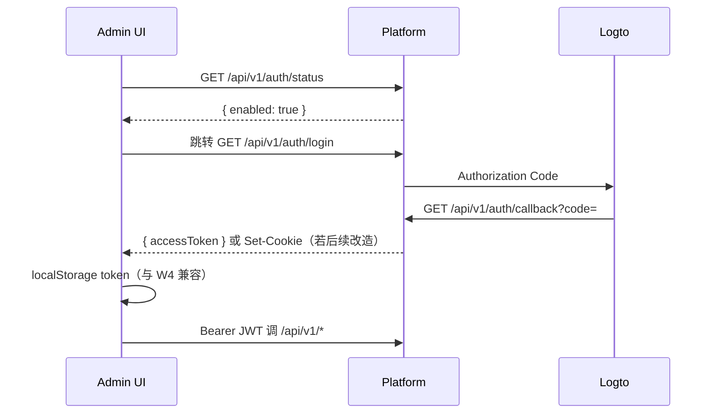

# 管理后台 — Ant Design Pro 企业级开发文档


| 项        | 值                                                                                           |
| -------- | ------------------------------------------------------------------------------------------- |
| 文档版本     | v1.0                                                                                        |
| 日期       | 2026-06-02                                                                                  |
| 对齐       | 合同 Layer 3 管理后台、[PHASE2-PLAN.md](./PHASE2-PLAN.md) §5、[验收标准详细说明.md](./验收标准详细说明.md) P2-L3-10 |
| 代码入口（规划） | `deploy/enterprise/platform/admin-ui/`                                                      |
| 当前过渡实现   | `deploy/enterprise/platform/internal/admin/static/`（W4 静态 SPA）                              |
| 后端 API   | `deploy/enterprise/platform/`（Go，`8090`）                                                    |


---

## 1. 背景与目标

### 1.1 合同要求

外包合同与 [二次开发计划.md](./二次开发计划.md) 约定：

- **技术栈：** React 18 + **Ant Design Pro 6**
- **范围：** **8 大管理模块**，支撑企业私有化运维与配置
- **集成：** OIDC 登录 → Platform 签发 JWT → 管理 API 鉴权

### 1.2 当前状态（W4 MVP）

Phase 2 W4 已交付 **嵌入式静态 SPA**（原生 JS），非 Ant Design Pro：


| 能力          | W4 MVP              | AD Pro 目标               |
| ----------- | ------------------- | ----------------------- |
| 8 模块导航      | ✅ 侧栏 8 项            | ProLayout + 权限菜单        |
| 登录          | dev-token + OIDC 跳转 | Pro 登录页 + SSO 回调页       |
| 数据展示        | 多数为 `<pre>` JSON    | ProTable / ProForm / 图表 |
| 租户 CRUD     | ❌ 仅列表               | CRUD + 配额               |
| 用户绑角色       | ❌ API 有、UI 无        | 表格内操作 + 三员互斥提示          |
| 模型 Fallback | DB 字段有、UI 无         | 表单 + 下发预览               |
| 代码索引 / 安全报告 | 占位                  | Phase 3 前保持占位或只读说明      |


**本文档目标：** 指导从 W4 MVP **迁移/重建** 为 Ant Design Pro 企业级后台，并列出需补齐的后端 API。

### 1.3 非目标（Phase 2 后台范围外）

- ClickHouse 审计 WORM、哈希链（Phase 3）
- Semgrep 报告、代码索引管道 UI（Phase 3）
- 国密证书登录 UI（Phase 3）

---

## 2. 架构

### 2.1 部署拓扑

```
浏览器
  → https://wab.flyfishphp.cn/admin/     （生产：Nginx / APISIX 反代）
  → enterprise-platform:8090/admin/      （静态资源，AD Pro build 产物）
  → /api/v1/*                            （同域 JSON API，Bearer JWT）
  → Logto OIDC                           （/api/v1/auth/login → callback）
```

开发时 AD Pro 使用 **Umi proxy** 将 `/api` 转发到 `localhost:8090`，避免 CORS。

### 2.2 仓库布局（建议）

```
deploy/enterprise/platform/
  admin-ui/                    # 新建：Ant Design Pro 工程（本仓库子目录）
    package.json
    config/
    src/
      pages/                   # 8 模块页面
      services/                # API 封装
      access.ts                # 路由/按钮权限
      app.tsx                  # 全局 layout、request 拦截器
    README.md
  admin/
    README.md                  # 指向上游文档 + 本地 dev 命令
  internal/admin/
    static/                    # 构建输出目录（go:embed 或 CI 拷贝）
    admin.go
  cmd/server/main.go
  Dockerfile                   # 多阶段：node build → copy static → go build
```

**原则：** 前端独立工程、构建产物嵌入 Go；不修改 Kilo 核心包（`packages/opencode` 等）。

### 2.3 技术选型


| 层    | 选型                                                   | 说明                             |
| ---- | ---------------------------------------------------- | ------------------------------ |
| 脚手架  | [Ant Design Pro](https://pro.ant.design/)（Umi Max 4） | 与合同一致                          |
| UI   | Ant Design 5 + `@ant-design/pro-components` 2.x      | ProTable / ProForm / ProLayout |
| 语言   | TypeScript                                           | 与扩展 webview 技术栈接近              |
| 请求   | Umi `request` + 统一错误处理                               | 401 → 登出；409 → 三员互斥 Message    |
| 状态   | 页面级 + `useModel('@@initialState')`                   | 登录用户、租户、角色                     |
| 图表   | `@ant-design/charts` 或 ECharts                       | 用量模块                           |
| i18n | `zh-CN` 默认，`en-US` 可选                                | 政企交付以中文为主                      |


### 2.4 构建与发布

**本地开发：**

```bash
cd deploy/enterprise/platform/admin-ui
bun install          # 或 npm / pnpm
bun run dev          # 默认 :8000，proxy → :8090
```

**生产构建：**

```bash
bun run build        # 输出 dist/
# CI 将 dist/* 同步到 internal/admin/static/ 后 go build
```

**Docker 多阶段（规划，写入 platform Dockerfile）：**

1. `node:20-alpine` — `admin-ui` 执行 `bun run build`
2. `golang:1.22-alpine` — `COPY --from=0` 静态文件到 `internal/admin/static/`，`go build`
3. `alpine` — 运行 `enterprise-platform`

环境变量与现有 [PHASE2-W4-CHECKLIST.md](./PHASE2-W4-CHECKLIST.md) 一致；`PLATFORM_OIDC_BROWSER_REDIRECT` 默认 `/admin/`。

---

## 3. 认证与会话

### 3.1 登录流程




**W4 兼容：** 回调 JSON 含 `accessToken` 时，前端写入 `localStorage` 键 `ent_admin_token`（可与 W4 共用，便于灰度切换）。

**开发环境：** `PLATFORM_AUTH_DEV=1` 时保留邮箱 + `POST /api/v1/auth/dev-token` 入口（仅内网）。

### 3.2 JWT Claims（前端权限依据）

```json
{
  "sub": "<user uuid>",
  "tenant_id": "00000000-0000-0000-0000-000000000001",
  "roles": ["developer", "tenant_admin"]
}
```

`GET /api/v1/auth/me` 返回同上字段。

### 3.3 前端 access 规则（`src/access.ts`）


| 角色 kind / name         | 后台能力                               |
| ---------------------- | ---------------------------------- |
| `sys_admin`            | 租户、用户、模型、监控、系统配置                   |
| `security_admin`       | 用户角色（非三员岗）、模型只读或密钥策略（Phase 2 可先只读） |
| `audit_admin`          | 审计日志、用量只读                          |
| `tenant_admin`         | 本租户用户、模型配置、用量                      |
| `developer` / `viewer` | **默认无后台入口**（403 或隐藏菜单）             |


三员互斥由 **后端** `rbac.CanAssign` 强制；前端在绑角色时预检并展示 409 文案。

---

## 4. API 契约

### 4.1 已实现（W2～W4，可直接对接）


| 方法   | 路径                           | 用途         | 响应要点                                                     |
| ---- | ---------------------------- | ---------- | -------------------------------------------------------- |
| GET  | `/api/v1/auth/status`        | OIDC 是否启用  | `{ enabled, issuer? }`                                   |
| GET  | `/api/v1/auth/login`         | OIDC 跳转    | 302                                                      |
| GET  | `/api/v1/auth/callback`      | 回调签发       | `{ accessToken }`                                        |
| POST | `/api/v1/auth/dev-token`     | 开发 JWT     | `{ accessToken }`                                        |
| GET  | `/api/v1/auth/me`            | 当前用户       | `{ id, tenant_id, roles }`                               |
| GET  | `/api/v1/tenants`            | 租户列表       | `{ items: [{ id, name, status }] }`                      |
| GET  | `/api/v1/users`              | 用户列表       | `{ items: [{ id, email, displayName, status, roles }] }` |
| POST | `/api/v1/users/{id}/roles`   | 分配角色       | 200 / **409** 三员互斥                                       |
| GET  | `/api/v1/usage/summary`      | 用量摘要       | `{ licenseUsage, users }`                                |
| GET  | `/api/v1/model-config`       | 读模型配置      | `Config` JSON                                            |
| PUT  | `/api/v1/model-config`       | 保存配置       | `{ status: "ok" }`                                       |
| POST | `/api/v1/model-config/apply` | 下发 Engine  | `{ path, provider, ... }`                                |
| GET  | `/api/v1/monitor/health`     | 探活         | `{ items: [{ name, status, code }], at }`                |
| GET  | `/api/v1/audit/logs`         | 审计列表       | `{ items: [{ id, kind, summary, actorId, createdAt }] }` |
| POST | `/api/v1/license/verify`     | 插件用，后台一般不调 | 公开接口                                                     |


OpenAPI 草案：`deploy/enterprise/openapi.yaml`（W4 后需增补 tenants/model/monitor 等，与实现同步）。

### 4.2 待后端补齐（AD Pro 完整体验）

按优先级排列；**前端可先 mock / 隐藏按钮**，但验收前需实装或标注 Phase 3。


| 优先级     | API                                      | 说明                                     |
| ------- | ---------------------------------------- | -------------------------------------- |
| P0      | `POST/PUT/PATCH /api/v1/tenants`         | 创建、编辑、启用/停用                            |
| P0      | `DELETE /api/v1/users/{id}/roles`        | 卸角色（三员换人）                              |
| P0      | `GET /api/v1/roles`                      | 可选角色列表（含 kind，供 Select）                |
| P1      | `GET /api/v1/usage/detail`               | 按用户/日聚合 `license_usage`                |
| P1      | `GET /api/v1/licenses`                   | 租户 License 列表、到期、status                |
| P1      | `model-config` 扩展                        | 表单 `fallbackProvider` + `apiKeyEnv`（env 引用，非明文） |
| P2      | `GET /api/v1/audit/logs?kind=&from=&to=` | 筛选、分页                                  |
| P2      | `GET /api/v1/users/{id}`                 | 用户详情 + SSO `oidc_sub`                  |
| Phase 3 | 索引任务、Semgrep 报告                          | 独立服务 API                               |


---

## 5. 八大模块 — 页面规格

与 [PHASE2-PLAN.md](./PHASE2-PLAN.md) §5 一一对应。

### 5.1 租户管理 `/admin/tenants`


| 项   | 规格                                     |
| --- | -------------------------------------- |
| 列表  | ProTable：名称、状态、创建时间、License 到期（P1 API） |
| 操作  | 新建、编辑、启用/停用（P0 API）                    |
| 配额  | Phase 2 可显示占位列「席位上限 / 已用」；Phase 3 接计量  |
| 权限  | `sys_admin`                            |


### 5.2 用户管理 `/admin/users`


| 项   | 规格                                                                    |
| --- | --------------------------------------------------------------------- |
| 列表  | ProTable：邮箱、显示名、状态、角色 Tag                                             |
| 操作  | 「分配角色」Modal：Select 角色 → POST roles；409 显示互斥说明                         |
| SSO | 列展示「SSO 已绑定」；详情页 `oidc_sub`（P2）                                       |
| 权限  | `tenant_admin` 及以上；三员岗分配仅 `sys_admin` / `security_admin`（按最终 RBAC 矩阵） |


**三员互斥文案示例：**「系统管理员与安全/审计管理员不能授予同一用户，请先移除已有管理岗。」

### 5.3 用量统计 `/admin/usage`


| 项   | 规格                                         |
| --- | ------------------------------------------ |
| 概览  | Statistic：License 校验次数、用户数（现有 summary API） |
| 趋势  | 折线图：近 7/30 天（P1 detail API）                |
| 下钻  | 按用户表格（P1）                                  |
| 权限  | `tenant_admin`、`audit_admin` 只读            |


### 5.4 模型配置 `/admin/model`


| 项   | 规格                                                                                  |
| --- | ----------------------------------------------------------------------------------- |
| 表单  | ProForm：Provider（deepseek/qwen/glm/minimax）、API Base、默认模型、小模型、**Fallback Provider** |
| 操作  | 保存（PUT）、下发 Engine（POST apply，二次确认）                                                  |
| 预览  | 下发前展示 `generated.kilo.jsonc` 摘要（只读 JSON Viewer）                                     |
| 审计  | 保存/下发成功后提示「已记入审计日志」                                                                 |
| 权限  | `tenant_admin`、`sys_admin` 可写；其他只读                                                  |


Provider 预设模型名见 `internal/model/translate.go` 的 `presets`。

### 5.5 代码索引 `/admin/index`（占位）


| 项       | 规格                                |
| ------- | --------------------------------- |
| Phase 2 | Result 占位：「索引管道 Phase 3 交付」+ 文档链接 |
| Phase 3 | 任务列表、进度、Qdrant 集合状态               |


### 5.6 安全报告 `/admin/security`（占位）


| 项       | 规格                        |
| ------- | ------------------------- |
| Phase 2 | 占位：「Semgrep SAST Phase 3」 |
| Phase 3 | 扫描任务、严重级别分布、跳转详情          |


### 5.7 系统监控 `/admin/monitor`


| 项   | 规格                                                           |
| --- | ------------------------------------------------------------ |
| 展示  | 卡片：platform / engine / bridge / gateway 状态（up/down/degraded） |
| 刷新  | 手动刷新 + 可选 30s 轮询                                             |
| 权限  | 所有可进后台的管理员只读                                                 |


### 5.8 审计日志 `/admin/audit`


| 项       | 规格                         |
| ------- | -------------------------- |
| 列表      | ProTable：时间、类型 kind、摘要、操作人 |
| 筛选      | kind、时间范围（P2）              |
| Phase 3 | 导出、哈希链校验状态                 |


当前数据来源：`config_revisions`（主要为模型配置变更）。

---

## 6. 前端工程规范

### 6.1 目录约定

```
src/
  pages/
    tenants/index.tsx
    users/index.tsx
    usage/index.tsx
    model/index.tsx
    index-placeholder/index.tsx    # 代码索引
    security-placeholder/index.tsx
    monitor/index.tsx
    audit/index.tsx
    user/login/index.tsx           # 登录
    user/oidc-callback/index.tsx   # 可选：解析 token
  services/
    api.ts                         # request 封装
    auth.ts
    tenants.ts
    users.ts
    ...
  components/
    RoleAssignModal.tsx
    HealthCards.tsx
  access.ts
  app.tsx
```

### 6.2 Request 拦截器

- 请求头：`Authorization: Bearer ${token}`
- `401`：清 token，跳转 `/user/login`
- `403`：Message 无权限
- `409`：解析 `three_admin_mutex`，表单级错误

### 6.3 与静态 SPA 迁移


| 步骤  | 动作                                          |
| --- | ------------------------------------------- |
| 1   | 初始化 `admin-ui`，路由与 W4 侧栏 8 项对齐              |
| 2   | 逐页替换 JSON `<pre>` 为 Pro 组件                  |
| 3   | CI build 覆盖 `internal/admin/static/`        |
| 4   | `smoke-phase2-w4.sh` 仍测 `/admin/` 200 + API |
| 5   | 删除 `app.js` 中重复逻辑，保留单文件回滚标签（可选）             |


---

## 7. 开发排期（建议）

在 Phase 2 剩余或 Phase 2.5 迭代中执行（与 [PHASE2-PLAN.md](./PHASE2-PLAN.md) W4 后续对齐）。


| 阶段           | 周期    | 交付                                          |
| ------------ | ----- | ------------------------------------------- |
| **A0 脚手架**   | 2～3 天 | `admin-ui` 初始化、登录、Layout、proxy、Docker 多阶段草案 |
| **A1 只读模块**  | 3～4 天 | 租户/用户/用量/监控/审计 ProTable 对接现有 API            |
| **A2 可写模块**  | 4～5 天 | 模型配置 ProForm + apply；用户绑角色 Modal            |
| **A3 后端补齐**  | 并行    | P0 租户 CRUD、roles 列表、卸角色                     |
| **A4 体验与验收** | 2～3 天 | 权限菜单、空态、错误态、录屏、更新 P2-L3-10 走查表              |
| **A5 占位**    | 0.5 天 | 代码索引、安全报告 Result 页                          |


**验收对照：** [验收标准详细说明.md](./验收标准详细说明.md) **P2-L3-10** — 1～4、7、8 可操作；5、6 占位。

---

## 8. 测试


| 类型    | 内容                                                                   |
| ----- | -------------------------------------------------------------------- |
| 单元    | 角色 access 函数、`formatMutexError`                                      |
| E2E   | Playwright：OIDC mock 或 dev-token 登录 → 模型保存 → apply                   |
| smoke | 保留 `smoke-phase2-w4.sh`、`smoke-rbac.sh`；新增 `admin-ui` build 在 CI 中执行 |
| 手工    | 三员互斥：先 sys_admin 再 audit_admin → 409                                 |


---

## 9. 风险与决策


| 风险                   | 缓解                                                            |
| -------------------- | ------------------------------------------------------------- |
| 合同写 AD Pro、现网为静态 SPA | 本迭代交付 AD Pro build 替换 embed；验收单注明版本                           |
| OpenAPI 滞后           | 每增 API 同步 `openapi.yaml` + `services/*.ts`                    |
| OIDC 回调仅 JSON        | 短期前端轮询/localStorage；中期 callback HTML 页写 token                 |
| 密钥不进后台明文             | 模型 API Key 继续走 Engine env；后台只配置 base/model                    |
| 与上游 Kilo 合并          | 全部在 `deploy/enterprise/platform/`，不碰 `packages/opencode` 共享代码 |


**待产品确认：**

1. AD Pro 是否必须在 M3 正式验收前替换静态 SPA，还是可作为「Phase 2.5」书面附件？
2. `developer` 是否允许只读进入后台查看用量？
3. 租户 CRUD 是否仅 `sys_admin` 跨租户，还是单租户 `tenant_admin` 只能看自己？

---

## 10. 相关文档


| 文档                                                   | 说明             |
| ---------------------------------------------------- | -------------- |
| [PHASE2-PLAN.md](./PHASE2-PLAN.md)                   | 8 模块定义、六周甘特    |
| [PHASE2-W4-CHECKLIST.md](./PHASE2-W4-CHECKLIST.md)   | W4 MVP 与 smoke |
| [PHASE2-E2E-CHECKLIST.md](./PHASE2-E2E-CHECKLIST.md) | D1～D8 模块验收     |
| [LOGTO-SSO.md](./LOGTO-SSO.md)                       | 后台 OIDC 配置     |
| `deploy/enterprise/platform/admin/README.md`         | 工程快速入口         |
| `deploy/enterprise/openapi.yaml`                     | API 草案         |


---

## 修订记录


| 版本   | 日期         | 说明                                            |
| ---- | ---------- | --------------------------------------------- |
| v1.4 | 2026-06-02 | model-config apiKeyEnv；openapi.yaml v0.4 同步全量 API |
| v1.1 | 2026-06-02 | admin-ui 工程 A0～A2：Umi Max + 8 模块 + Docker 多阶段 |


