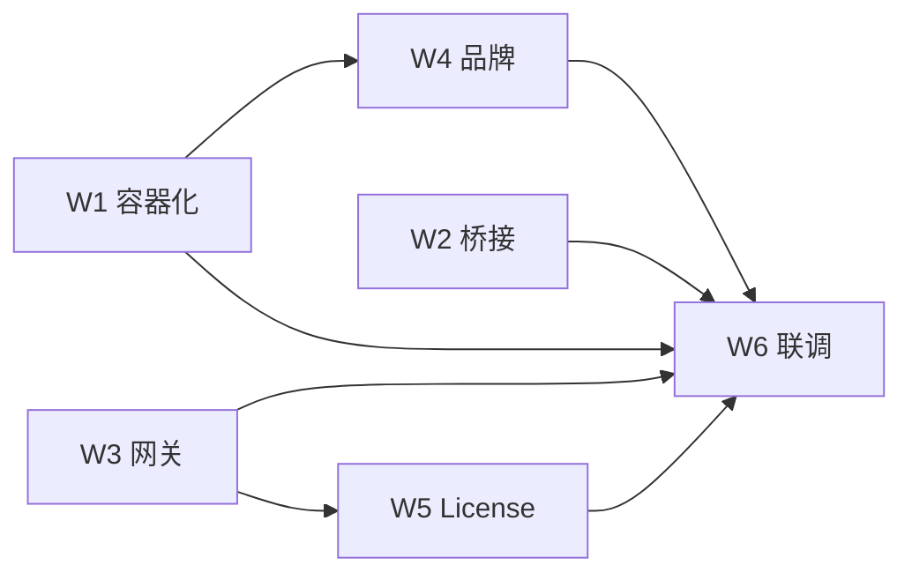

# Phase 1 里程碑 — 企业私有化 MVP

文档版本：v1.0 | 对齐《企业私有化Ai编程工具v2.4》第五章 Phase 1 | 基线仓库：kilocode Fork

## 目标

6 周内交付最小可用产品：开发者安装 VS Code 插件 →（可选）APISIX 网关 → Kilo Engine → 本地/私有化 LLM，完成流式代码补全与对话；具备 License 校验原型、容器化部署样例与初版部署手册。

## 验收标准（Phase 1 出口）

| # | 标准 | 状态 |
|---|---|---|
| A1 | 安装插件并配置 License 后，可连接 Kilo Engine 并完成对话/补全 | ⬜ |
| A2 | 流式输出 P95 延迟 &lt; 3s（14B 补全模型，局域网） | ⬜ |
| A3 | APISIX 可记录审计日志（含 SSE 请求） | ⬜ |
| A4 | Docker Compose 在 x86 上跑通 Engine + Qdrant（+ 可选 vLLM） | ⬜ |
| A5 | 离线 License 文件校验原型（JSON + 到期时间，RSA 占位） | ⬜ |
| A6 | Solid/webview 品牌配置项可切换产品名 | ⬜ |

状态图例：⬜ 未开始 · 🟡 进行中 · ✅ 完成

---

## 周次里程碑

### W1 — Layer 1 容器化（第 1 周）

| 任务 ID | 任务 | 交付物 | 负责人 | 状态 |
|---|---|---|---|---|
| P1-W1-01 | Kilo Engine 镜像构建脚本说明 | `deploy/enterprise/README.md` | 平台 | ✅ |
| P1-W1-02 | Docker Compose：Engine + Qdrant | `deploy/enterprise/docker-compose.yml` | 平台 | ✅ |
| P1-W1-03 | 可选 vLLM profile（Qwen2.5-Coder） | compose `profiles: [vllm]` | 平台 | ✅ |
| P1-W1-04 | 验证 Extension → 远端 Engine 链路 | `enterprise.remoteServer` 设置 | 客户端 | ✅ |
| P1-W1-05 | 记录 Engine 环境变量清单 | `PHASE1-DEPLOY.md` § Engine | 平台 | ✅ |

### W2 — Layer 2 桥接骨架（第 2 周）

| 任务 ID | 任务 | 交付物 | 负责人 | 状态 |
|---|---|---|---|---|
| P1-W2-01 | 内部 API 契约文档 | `deploy/enterprise/bridge/README.md` | 平台 | ✅ |
| P1-W2-02 | Go 桥接层仓库初始化（独立仓） | 外部 `enterprise-bridge` | 平台 | ⬜ |
| P1-W2-03 | 透传代理 POC（/internal/v1 → Kilo） | bridge 最小 main.go | 平台 | ⬜ |
| P1-W2-04 | 国产模型适配接口定义 | OpenAPI 草案 | 平台 | ⬜ |

> MVP 阶段 Extension 可直连 Engine；经 APISIX 时由网关转发至 Engine，桥接全量实现放在 W2 后半或 Phase 2。

### W3 — Layer 4 网关（第 3 周）

| 任务 ID | 任务 | 交付物 | 负责人 | 状态 |
|---|---|---|---|---|
| P1-W3-01 | APISIX 路由：Engine SSE | `deploy/enterprise/apisix/apisix.yaml` | 平台 | ✅ |
| P1-W3-02 | JWT 鉴权 + limit-count 100/min | apisix 插件配置 | 平台 | ✅ |
| P1-W3-03 | http-logger → 文件审计 | `deploy/enterprise/apisix/` | 平台 | ✅ |
| P1-W3-04 | Extension `enterprise.gatewayUrl` | `package.json` 配置项 | 客户端 | ✅ |
| P1-W3-05 | SSE：`proxy_buffering off` 验证 | 部署手册检查项 | 平台 | ⬜ |

### W4 — Layer 5 品牌（第 4 周）

| 任务 ID | 任务 | 交付物 | 负责人 | 状态 |
|---|---|---|---|---|
| P1-W4-01 | 产品名配置项 | `enterprise.productName` | 客户端 | ✅ |
| P1-W4-02 | 关于页 / Apache 2.0 声明命令 | `showEnterpriseAbout` | 客户端 | ✅ |
| P1-W4-03 | webview 标题与侧边栏名同步 | `extensionDisplayName()` | 客户端 | ✅ |
| P1-W4-04 | kilo-ui 主题色替换指南 | `PHASE1-DEPLOY.md` § 品牌 | 客户端 | 🟡 |
| P1-W4-05 | 定制 VSIX 打包流程 | CI / 手册 | 客户端 | ⬜ |

### W5 — License 原型（第 5 周）

| 任务 ID | 任务 | 交付物 | 负责人 | 状态 |
|---|---|---|---|---|
| P1-W5-01 | 在线 `POST /api/v1/license/verify` | `enterprise/license.ts` | 客户端 | ✅ |
| P1-W5-02 | Token 本地缓存 24h | `globalState` | 客户端 | ✅ |
| P1-W5-03 | 离线 License 文件（JSON） | `enterprise.license.offlinePath` | 客户端 | ✅ |
| P1-W5-04 | Mock License 服务 | `deploy/enterprise/mock-license.mjs` | 平台 | ✅ |
| P1-W5-05 | 校验失败阻断 CLI 连接 | `connection-service` / `extension` | 客户端 | ✅ |
| P1-W5-06 | RSA 签名校验（生产） | Phase 2 | 安全 | ⬜ |

### W6 — 联调与文档（第 6 周）

| 任务 ID | 任务 | 交付物 | 负责人 | 状态 |
|---|---|---|---|---|
| P1-W6-01 | E2E：插件 → 网关 → Engine | 联调记录 | 全员 | ⬜ |
| P1-W6-02 | 安装部署手册 v1.0 | `PHASE1-DEPLOY.md` | 平台 | ✅ |
| P1-W6-03 | x86/ARM64 镜像构建验证 | 构建日志 | 平台 | ⬜ |
| P1-W6-04 | 安全评审：License 原型 | 评审纪要 | 安全 | ⬜ |
| P1-W6-05 | Phase 1 复盘与 Phase 2  backlog | 会议纪要 | PM | ⬜ |

---

## 本仓库代码映射（附录 A 修正版）

| 文档旧路径 | 实际路径 | Phase 1 改动 |
|---|---|---|
| `ClineProvider.ts` | `packages/kilo-vscode/src/KiloProvider.ts` | 后续：License 状态 UI |
| `extension.ts` | `packages/kilo-vscode/src/extension.ts` | License 门控、关于命令 |
| `webview-ui/vite.config.ts` | `packages/kilo-vscode/esbuild.js` | 品牌不改构建链 |
| `webview-ui/src/App.tsx` | `packages/kilo-vscode/webview-ui/src/App.tsx` | W4 主题 |
| — | `packages/kilo-vscode/src/enterprise-config.ts` | 已有：自定义 API |
| — | `packages/kilo-vscode/src/enterprise/*` | 新增：License、远端 Engine |
| `packages/opencode/src/server/` | 共享，尽量少改 | 审计中间件 → Phase 2 |

---

## 依赖关系

---

## 风险与升级策略

| 风险 | 缓解 | 检查点 |
|---|---|---|
| Engine 镜像未构建 | 先用本机 `bun script/local-bin.ts` + 扩展内置 CLI | W1 第 3 天 |
| APISIX SSE 缓冲 | 强制 `proxy_buffering off` | W3 联调 |
| License 服务未就绪 | Mock 服务 + 24h 缓存宽限 | W5 |
| 上游 Kilo 合并 | 企业逻辑放 `src/enterprise/`，少改 shared | 每 PR |

---

## 变更日志

| 日期 | 版本 | 说明 |
|---|---|---|
| 2026-06-02 | 1.0 | 初版；W1/W3/W5 客户端与 deploy 骨架已落地 |
