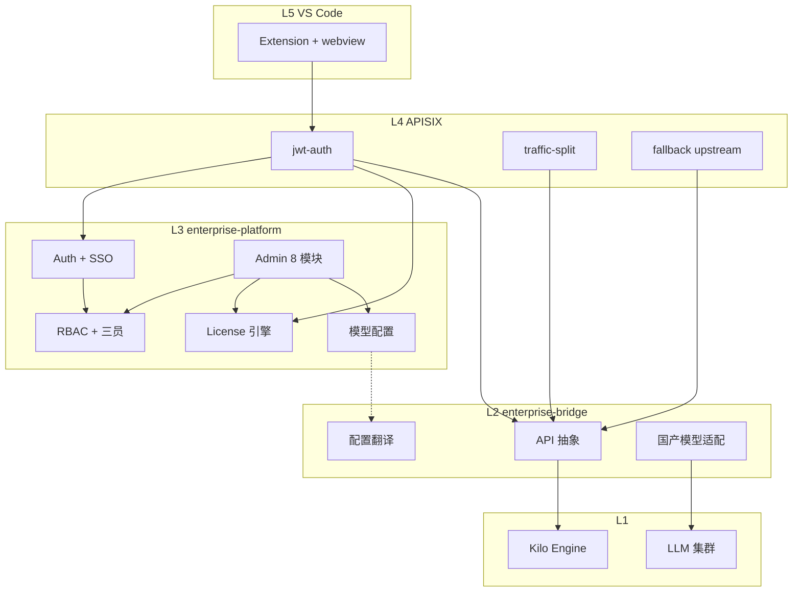

# Phase 2 开发计划与流程


| 项     | 内容                                               |
| ----- | ------------------------------------------------ |
| 文档版本  | v1.1                                             |
| 对应里程碑 | **M3**，T+12 周（Phase 2 起算：M2 验收通过日）               |
| 工期    | **6 周**                                          |
| 对齐    | [二次开发计划.md](./二次开发计划.md) v3.2 · 合同 §2.4 第二批次     |
| 前置    | Phase 1 验收通过（FullChain + License RSA 原型 + 插件经网关） |


**v3.2 范围调整：** SSO（原 Phase 3）并入 Phase 2，与 RBAC、管理后台同批交付。

---

## 1. Phase 2 目标

在 Phase 1「能连、能验、能演示」基础上，交付 **可商用的企业控制面**：


| 能力            | 用户价值                             |
| ------------- | -------------------------------- |
| License 完整引擎  | 订阅生命周期、用量、降级/冻结                  |
| RBAC + 三员     | 多租户权限、互斥管理岗                      |
| SSO           | 企业 IdP 统一登录，替代纯密码                |
| 管理后台 8 模块     | 运维可视、配置可管                        |
| 国产模型统一适配      | 一套配置切换 Qwen/DeepSeek/GLM/Minimax |
| 灰度 + Fallback | 模型/桥接版本平滑升级                      |


**不在 Phase 2 范围（仍属 Phase 3）：** 语义索引管道、向量租户隔离、Semgrep SAST、国密全栈、JetBrains、可观测性全栈、规模化压测。

---

## 2. 交付物清单

### 2.1 代码与镜像


| 交付物                    | 说明                              | 建议路径/仓                                 |
| ---------------------- | ------------------------------- | -------------------------------------- |
| `enterprise-platform`  | L3：Go API + Admin 前端 + PG/Redis | 新仓或 `deploy/enterprise/platform/`      |
| `enterprise-bridge` v2 | L2 全量：API 抽象、配置翻译、模型路由          | 从 `deploy/enterprise/bridge/` 演进       |
| APISIX 生产配置            | JWT 与 L3 Auth 联动、灰度、Fallback    | `deploy/enterprise/apisix/`            |
| VS Code 企业增强           | 默认经 L4；SSO 浏览器登录拿 Token         | `packages/kilo-vscode/src/enterprise/` |
| Compose 栈 v2           | + PG、Redis、platform、迁移脚本        | `deploy/enterprise/docker-compose.yml` |


### 2.2 文档与验收


| 交付物               | 说明                                 |
| ----------------- | ---------------------------------- |
| OpenAPI 3.0 定稿    | License / Auth / RBAC / 模型配置 / SSO |
| Phase 2 测试报告 + 用例 | 覆盖率 ≥60%（合同 §10.4）                 |
| 部署手册增量            | Compose 扩展、SSO IdP 配置指南            |
| 《验收申请单-Phase2》    | 对齐附件三 v1.1                         |


---

## 3. 架构与依赖关系




**关键原则（继承 Phase 1）：**

- 不改 `packages/opencode/` 内核；企业策略经 L2 配置翻译 + L3 控制面下发。
- L5 只增加 auth mediation，Agent Loop 仍在 Engine。
- SSO 登录在 **L3/L4** 完成，插件持有 **JWT**（或短期 access token）访问 `/kilo/`*。

---

## 4. 模块拆分与优先级

### P0 — M3 验收 Blocker


| ID        | 模块            | 交付标准                                     |
| --------- | ------------- | ---------------------------------------- |
| P2-L3-LC  | License 引擎    | 在线/离线；到期只读降级；冻结；用量计量入库                   |
| P2-L3-RB  | RBAC + 三员     | 5 级角色；三员互斥；租户隔离；API 鉴权中间件                |
| P2-L3-SSO | SSO           | **OIDC 授权码**实测通过（P0）；SAML 或 LDAP 二选一（P1） |
| P2-L3-AD  | 管理后台          | 8 模块可登录、可配置、可审计基础操作                      |
| P2-L2-MD  | 国产模型适配        | 4 家模型统一 Provider 配置 + 冒烟对话               |
| P2-L4-GR  | 灰度 + Fallback | Header 分流；主模型失败切备用                       |


### P1 — M3 建议完成


| ID          | 模块       | 说明                                |
| ----------- | -------- | --------------------------------- |
| P2-L3-AD-08 | 审计日志（基础） | 操作日志入库；完整 WORM/哈希链留 Phase 3       |
| P2-L2-CFG   | 配置翻译服务端  | 后台改模型 → 下发 kilo.jsonc 到 Engine 挂载 |
| P2-L5-GW    | 插件默认网关   | 关闭 POC 直连；SSO 登录流                 |


### P2 — 可延期到 Phase 3 第一周


| ID             | 模块       | 说明                            |
| -------------- | -------- | ----------------------------- |
| P2-L3-SSO-SAML | SAML 2.0 | 若 OIDC 已验收，SAML 可与 Phase 3 并行 |
| P2-L3-SSO-SM2  | SSO 国密证书 | 与 Phase 3 国密全栈合并              |


---

## 5. 管理后台 8 大模块（v2.4 §3.3）


| #   | 模块   | Phase 2 最小可用                    |
| --- | ---- | ------------------------------- |
| 1   | 租户管理 | CRUD、配额、启用/停用                   |
| 2   | 用户管理 | 与 SSO/LDAP 账号映射、角色绑定            |
| 3   | 用量统计 | License 计量只读、按租户/用户聚合           |
| 4   | 模型配置 | Provider/Endpoint/Fallback/默认模型 |
| 5   | 代码索引 | **占位页** + 跳转说明（管道 Phase 3）      |
| 6   | 安全报告 | **占位页**（Semgrep Phase 3）        |
| 7   | 系统监控 | 基础健康：Engine/Bridge/Gateway UP   |
| 8   | 审计日志 | 登录/配置变更查询（完整合规 Phase 3）         |


---

## 6. SSO 范围（自 Phase 3 调入）

### 6.1 Phase 2 必达（验收）


| 项    | 说明                                                              |
| ---- | --------------------------------------------------------------- |
| 协议   | **OIDC Authorization Code**（首选，对接 **Logto** / Authing / 企业 IdP） |
| 入口   | 管理后台登录 + VS Code「企业登录」浏览器授权                                     |
| 会话   | 登录成功 → L3 签发 JWT → APISIX `jwt-auth` 校验                         |
| 账号   | 首次 SSO 登录自动创建用户并绑定默认租户/角色                                       |
| RBAC | JWT claims 含 `tenant_id`、`roles`；与三员规则一致                        |


### 6.2 Phase 2 择一（建议 SAML）


| 协议       | 场景                   |
| -------- | -------------------- |
| SAML 2.0 | 传统 AD FS、部分国企 IdP    |
| LDAP     | 账号同步（非完整 SSO 时可作目录源） |


### 6.3 留 Phase 3

- SM2 证书双向认证（国密 SSO）
- 2 家以上客户现场 AD/LDAP 联调（v2.4 Phase 3 验收口径）

---

## 7. 六周开发流程（建议甘特）

**起算：** M2 验收通过日 = **W0 周一**。


| 周      | 主题             | 产出                                                         | 关项检查                                       |
| ------ | -------------- | ---------------------------------------------------------- | ------------------------------------------ |
| **W1** | 启动 + 地基        | `enterprise-platform` 骨架；PG/Redis Compose；DB 迁移；OpenAPI 草案 | `docker compose up` 含 platform；health OK   |
| **W2** | License + RBAC | License CRUD/验签/计量；角色/权限/三员；单元测试                           | 离线 License 走 L3 API；RBAC 中间件拦 unauthorized |
| **W3** | SSO + Auth     | OIDC 登录；JWT 签发；APISIX consumer 联动；后台登录页                    | 浏览器登录 → 调 `/api/v1/`* 200                  |
| **W4** | 后台 + 模型        | Admin 8 模块 MVP；L2 配置翻译；4 模型冒烟                              | 后台改 DeepSeek 配置 → Engine 生效                |
| **W5** | 灰度 + 插件        | traffic-split；Fallback；VS Code SSO + 默认网关                  | 插件不经 POC 直连；灰度 Header 分流验证                 |
| **W6** | 联调 + 验收        | E2E 脚本；附件三用例；测试报告；验收申请单                                    | Phase 2 smoke 全绿                           |


### 7.1 每周例会产出

- 周报：完成项 / 风险 / 下周计划
- 演示：可运行环境 + 5 分钟 Demo 录屏
- 代码：合并至甲方指定私有仓；无密钥入库

### 7.2 与 Phase 1 的衔接


| Phase 1 资产                  | Phase 2 演进                  |
| --------------------------- | --------------------------- |
| `deploy/enterprise/bridge/` | 迁入 `enterprise-bridge` 全量   |
| `enterprise/license.ts`（插件） | 改为调 L3 `/api/v1/license/`*  |
| `mock-license.mjs`          | 下线或仅 dev profile            |
| `apisix/` 基础路由              | 增加 `jwt-auth`、platform 上游   |
| 云机 `43.143.227.210`         | 升级为 Phase 2 Compose profile |


---

## 8. 技术选型（建议，W1 前冻结）


| 层        | 选型                                  | 备注                         |
| -------- | ----------------------------------- | -------------------------- |
| L3 API   | Go 1.22+（与 bridge 一致）               | 单仓 monorepo 或 platform 独立仓 |
| L3 Admin | React 18 + Ant Design Pro 6         | 与合同一致                      |
| 身份       | `coreos/go-oidc` + `golang-jwt/jwt` | SAML 可用 `crewjam/saml`     |
| DB       | PostgreSQL 16                       | 租户/用户/角色/License/审计        |
| 缓存       | Redis 7                             | 会话、限流计数、License 缓存         |
| 迁移       | golang-migrate 或 goose              | 版本化 SQL                    |
| 测试       | testify + testcontainers（PG/Redis）  | 避免 mock 业务逻辑               |


---

## 9. 仓库与目录规划（**已确认：单仓**）

**决策 D1（2026-06-16）：** 采用 **方案 A** — 单仓 `kilocode`，不新建独立 `enterprise-platform` 仓库。

```
deploy/enterprise/
  platform/          # L3 Go API + admin/（React W4）
  bridge/            # L2 演进
  apisix/
  docker-compose.yml # profile: platform → PG + Redis + enterprise-platform
docs/enterprise/
  PHASE2-PLAN.md
  PHASE2-W1-CHECKLIST.md
```

W1 骨架已落地：`platform/cmd/server` 提供 `GET /health`；`scripts/smoke-phase2.sh` 验收。

---

## 10. 验收口径（附件三 v1.1 纲要）


| 类别       | Blocker 用例方向                    |
| -------- | ------------------------------- |
| License  | 在线过期 → 只读；离线签名；用量累加             |
| RBAC     | 三员互斥；跨租户 403                    |
| SSO      | OIDC 全流程；插件持 JWT 访问 Engine      |
| 后台       | 8 模块登录后可操作（5/6 可为占位）            |
| 模型       | 4 模型各 1 次对话成功                   |
| 灰度       | `X-Canary: true` 路由到指定 upstream |
| Fallback | 主 upstream 5xx → 备用模型           |


详细用例编号在 M2 签署后扩写至 [验收标准详细说明.md](./验收标准详细说明.md) §3 v1.1。

---

## 11. 风险与缓解


| 风险                 | 影响       | 缓解                                      |
| ------------------ | -------- | --------------------------------------- |
| Phase 2 塞入 SSO 工期紧 | M3 延期    | OIDC 先行；SAML/LDAP 标 P1；国密 SSO 留 Phase 3 |
| 合同原文 SSO 在 Phase 3 | 付款/验收争议  | **M3 前**与甲方对齐；开发按内部计划推进                 |
| 无甲方测试 IdP          | SSO 无法验收 | W3 用 **Logto**（自托管或 Cloud）完成开发与内部验收     |
| 8 模块范围大            | 后台烂尾     | 5/6 占位；验收聚焦 1～4、7、8                     |
| 继续改 opencode 内核    | 合并冲突、违约定 | 坚持 L2 配置翻译；问题用配置/桥接解决                   |


---

## 12. Phase 2 启动清单

**模式：** 内部自确认（2026-06-18），不阻塞 W2 开发。

- Phase 2 内部启动纪要（[PHASE2-KICKOFF.md](./PHASE2-KICKOFF.md)）
- 单仓方案 + `enterprise-platform` 骨架
- 云机 Compose `platform` profile + smoke
- W2：License API + RBAC + migrate（见 [PHASE2-W2-CHECKLIST.md](./PHASE2-W2-CHECKLIST.md)）
- W3：OIDC + JWT + APISIX（见 [PHASE2-W3-CHECKLIST.md](./PHASE2-W3-CHECKLIST.md)）
- W4：Admin + 模型配置（见 [PHASE2-W4-CHECKLIST.md](./PHASE2-W4-CHECKLIST.md)）
- W6：联调验收（见 [PHASE2-W6-CHECKLIST.md](./PHASE2-W6-CHECKLIST.md)）— 2026-06-02 `smoke-phase2-all` 全绿
- **P2 增量：** IDE 使用分析（见 [P2-USAGE-ANALYTICS-SPEC-v1.md](./P2-USAGE-ANALYTICS-SPEC-v1.md)）— 2026-07-09 §7 验收全通过
- **P2 规划：** 效能考核 V3 个人模型（见 [P2-ASSESSMENT-SPEC-v1.md](./P2-ASSESSMENT-SPEC-v1.md)）— 经理考核 / 渗透率可后期补

---

## 13. 修订记录


| 版本   | 日期         | 说明                                             |
| ---- | ---------- | ---------------------------------------------- |
| v1.0 | 2026-06-16 | 初版；SSO 并入 Phase 2；六周流程与 Blocker 定义             |
| v1.1 | 2026-06-16 | **单仓方案确认**；W1 骨架 `deploy/enterprise/platform/` |
| v1.2 | 2026-06-18 | 内部自确认启动；甲方对齐延后至 M3                             |
| v1.3 | 2026-06-02 | W6 联调验收 smoke-all 通过                              |
| v1.4 | 2026-07-09 | P2 IDE 使用分析（ingestion + 四 Tab + xlsx + VS Code 联调）验收 |


