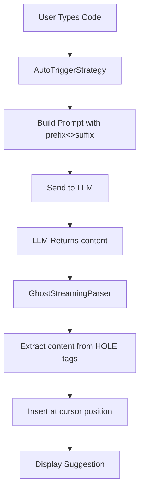

# Hole-Filling Strategy Implementation Plan

## Overview

Replace the current search/replace XML strategy with a simpler hole-filling approach where:

- The cursor marker changes from `<<<AUTOCOMPLETE_HERE>>>` to `<<HOLE>>`
- LLM receives the full prefix with `<<HOLE>>` marker
- LLM responds with `<HOLE>content</HOLE>` format
- No backward compatibility with old search/replace format

## Architecture Flow



## Files to Modify

### 1. Core Constants

- **File**: `src/services/ghost/classic-auto-complete/ghostConstants.ts`
- **Change**: Update `CURSOR_MARKER` from `"<<<AUTOCOMPLETE_HERE>>>"` to `"<<HOLE>>"`

### 2. Prompt Generation

- **File**: `src/services/ghost/classic-auto-complete/AutoTriggerStrategy.ts`
- **Changes**:
    - Update `getBaseSystemInstructions()` to describe hole-filling format
    - Update `getUserPrompt()` to reference `<<HOLE>>` marker
    - Update `getCommentsSystemInstructions()` for hole-filling
    - Update `getCommentsUserPrompt()` for hole-filling

### 3. Response Parser

- **File**: `src/services/ghost/classic-auto-complete/GhostStreamingParser.ts`
- **Changes**:
    - Remove all search/replace XML parsing logic
    - Add new hole extraction logic: `extractHoleContent()`
    - Update `parseGhostResponse()` to use hole extraction
    - Remove `extractCompletedChanges()`, `findBestMatch()`, `generateModifiedContent()`
    - Simplify `sanitizeXMLConservative()` for hole format
    - Update `isResponseComplete()` to check for complete `<HOLE>` tags

### 4. Test Files

All test files need updates to use new format:

- `AutoTriggerStrategy.test.ts`
- `GhostStreamingParser.test.ts`
- `GhostStreamingParser.sanitization.test.ts`
- `GhostStreamingParser.fuzzy-length-bug.test.ts`
- `GhostStreamingParser.user-issue.test.ts`

## Implementation Steps

### Step 1: Update Constants

- Change `CURSOR_MARKER` constant to `"<<HOLE>>"`
- Verify no other files directly reference the old marker string

### Step 2: Update AutoTriggerStrategy Prompts

- Rewrite `getBaseSystemInstructions()`:
    - Remove search/replace XML format instructions
    - Add hole-filling format: `<HOLE>content</HOLE>`
    - Emphasize single hole at cursor position
    - Remove CDATA wrapper instructions
- Update `getUserPrompt()`:
    - Change references from `<<<AUTOCOMPLETE_HERE>>>` to `<<HOLE>>`
    - Simplify instructions for hole-filling
    - Remove search block requirements
- Update `getCommentsSystemInstructions()`:
    - Adapt for hole-filling format
    - Remove search/replace references
- Update `getCommentsUserPrompt()`:
    - Change cursor marker references to `<<HOLE>>`

### Step 3: Rewrite GhostStreamingParser

- Create new `extractHoleContent()` function:
    - Parse `<HOLE>content</HOLE>` tags
    - Return extracted content string
    - Handle incomplete streaming (partial tags)
- Simplify `parseGhostResponse()`:
    - Call `extractHoleContent()` instead of `extractCompletedChanges()`
    - Directly construct suggestion from hole content
    - Remove complex change application logic
- Update `sanitizeXMLConservative()`:
    - Remove CDATA sanitization
    - Add logic to close incomplete `<HOLE>` or `</HOLE>` tags
- Update `isResponseComplete()`:
    - Check for complete `<HOLE>...</HOLE>` structure
    - Remove search/replace/change tag checks
- Remove obsolete functions:
    - `extractCompletedChanges()`
    - `findBestMatch()` and related helpers
    - `generateModifiedContent()`
    - `ParsedChange` interface

### Step 4: Update Type Definitions

- Remove `ParsedChange` interface from `GhostStreamingParser.ts`
- Verify `StreamingParseResult` interface still works with simplified logic

### Step 5: Update All Tests

- Update test expectations to use `<<HOLE>>` marker
- Rewrite test cases to expect `<HOLE>content</HOLE>` format
- Remove tests for search/replace functionality
- Add new tests for hole extraction edge cases:
    - Incomplete hole tags during streaming
    - Multiple hole tags (should only use first)
    - Empty hole content
    - Hole with special characters

### Step 6: Integration Testing

- Test with actual LLM responses
- Verify streaming behavior works correctly
- Test comment-driven development flow
- Test auto-trigger scenarios

## Key Simplifications

### Before (Search/Replace)

```xml
<change>
  <search><![CDATA[
    function example() {
      <<<AUTOCOMPLETE_HERE>>>
    }
  ]]></search>
  <replace><![CDATA[
    function example() {
      console.log('hello');
    }
  ]]></replace>
</change>
```

### After (Hole-Filling)

```xml
<HOLE>console.log('hello');</HOLE>
```

## Benefits

1. **Simpler parsing**: No fuzzy matching or search pattern logic
2. **Clearer intent**: LLM just fills the hole at cursor
3. **Less error-prone**: No CDATA escaping issues
4. **Faster**: Direct insertion without pattern matching
5. **More predictable**: Single insertion point

## Risks & Mitigations

- **Risk**: Existing users may have prompts optimized for search/replace
    - **Mitigation**: This is a breaking change; document in release notes
- **Risk**: Tests may be extensive and time-consuming to update
    - **Mitigation**: Update tests incrementally, run frequently
- **Risk**: Streaming parser may have edge cases
    - **Mitigation**: Comprehensive test coverage for partial tags

## Testing Strategy

1. Unit tests for each modified function
2. Integration tests for full flow
3. Edge case tests for streaming behavior
4. Manual testing with real LLM responses
