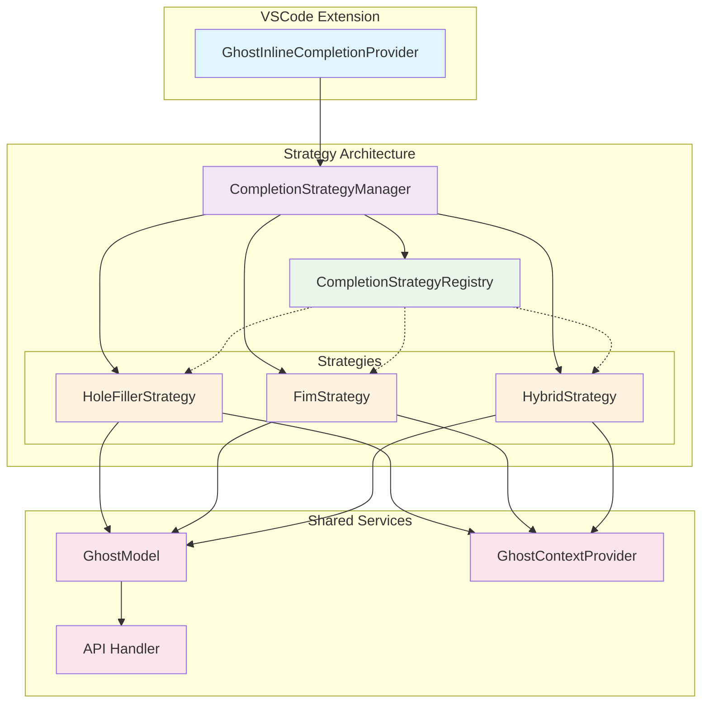

# Implementation Details for Modular Completion Strategy Architecture

## File Structure

```
src/services/ghost/strategies/
├── interfaces/
│   ├── ICompletionStrategy.ts
│   ├── CompletionRequest.ts
│   └── CompletionResult.ts
├── registry/
│   └── CompletionStrategyRegistry.ts
├── manager/
│   └── CompletionStrategyManager.ts
├── implementations/
│   ├── HoleFillerStrategy.ts
│   ├── FimStrategy.ts
│   └── HybridStrategy.ts
└── __tests__/
    ├── HoleFillerStrategy.test.ts
    ├── FimStrategy.test.ts
    └── CompletionStrategyManager.test.ts
```

## Core Interface Definitions

### ICompletionStrategy.ts

```typescript
import { GhostModel } from "../GhostModel"
import { GhostContextProvider } from "../classic-auto-complete/GhostContextProvider"
import { CompletionRequest } from "./CompletionRequest"
import { CompletionResult } from "./CompletionResult"

/**
 * Base interface for all completion strategies
 * Each strategy handles its own prompt creation and server calling
 */
export interface ICompletionStrategy {
	/** Unique identifier for the strategy */
	readonly name: string

	/** Human-readable description of the strategy */
	readonly description: string

	/** Check if this strategy supports the given model */
	supportsModel(model: GhostModel): boolean

	/** Generate completion using this strategy */
	generateCompletion(
		request: CompletionRequest,
		model: GhostModel,
		contextProvider: GhostContextProvider,
	): Promise<CompletionResult>

	/** Priority for strategy selection (higher = more preferred) */
	getPriority(): number

	/** Optional: Strategy-specific configuration validation */
	validateConfig?(config: any): boolean

	/** Optional: Strategy initialization */
	initialize?(): Promise<void>

	/** Optional: Strategy cleanup */
	dispose?(): void
}
```

### CompletionRequest.ts

```typescript
import * as vscode from "vscode"
import { AutocompleteInput } from "../types"

/**
 * Standardized request structure for all completion strategies
 */
export interface CompletionRequest {
	/** Text before the cursor position */
	prefix: string

	/** Text after the cursor position */
	suffix: string

	/** Language identifier (typescript, javascript, etc.) */
	languageId: string

	/** Standardized autocomplete input data */
	autocompleteInput: AutocompleteInput

	/** VSCode document reference */
	document: vscode.TextDocument

	/** Cursor position in the document */
	position: vscode.Position

	/** Optional: Request metadata for tracking/analytics */
	metadata?: {
		requestId: string
		timestamp: number
		triggerKind: vscode.InlineCompletionTriggerKind
	}
}
```

### CompletionResult.ts

```typescript
import { FillInAtCursorSuggestion } from "../classic-auto-complete/HoleFiller"

/**
 * Standardized result structure for all completion strategies
 */
export interface CompletionResult {
	/** The generated completion suggestion */
	suggestion: FillInAtCursorSuggestion

	/** Cost information for the completion */
	cost: number

	/** Token usage information */
	inputTokens: number
	outputTokens: number
	cacheWriteTokens: number
	cacheReadTokens: number

	/** Which strategy was used to generate this result */
	strategyUsed: string

	/** Optional: Performance metrics */
	metrics?: {
		duration: number
		promptGenerationTime: number
		serverCallTime: number
	}

	/** Optional: Strategy-specific metadata */
	strategyMetadata?: Record<string, any>
}
```

## Strategy Registry Implementation

### CompletionStrategyRegistry.ts

```typescript
import { ICompletionStrategy } from "../interfaces/ICompletionStrategy"
import { GhostModel } from "../../GhostModel"

/**
 * Registry for managing completion strategies
 * Handles registration, selection, and lifecycle management
 */
export class CompletionStrategyRegistry {
	private strategies: Map<string, ICompletionStrategy> = new Map()
	private strategyCache: WeakMap<GhostModel, ICompletionStrategy | null> = new WeakMap()

	/**
	 * Register a new completion strategy
	 */
	register(strategy: ICompletionStrategy): void {
		if (this.strategies.has(strategy.name)) {
			console.warn(`Strategy ${strategy.name} is already registered, overwriting`)
		}

		this.strategies.set(strategy.name, strategy)
		console.info(`Registered completion strategy: ${strategy.name}`)

		// Clear cache when strategies change
		this.strategyCache = new WeakMap()
	}

	/**
	 * Unregister a completion strategy
	 */
	unregister(strategyName: string): boolean {
		const removed = this.strategies.delete(strategyName)
		if (removed) {
			console.info(`Unregistered completion strategy: ${strategyName}`)
			this.strategyCache = new WeakMap()
		}
		return removed
	}

	/**
	 * Get all registered strategies
	 */
	getStrategies(): ICompletionStrategy[] {
		return Array.from(this.strategies.values())
	}

	/**
	 * Get strategy by name
	 */
	getStrategy(name: string): ICompletionStrategy | undefined {
		return this.strategies.get(name)
	}

	/**
	 * Select the best strategy for the given model
	 * Uses caching to avoid repeated selection logic
	 */
	selectBestStrategy(model: GhostModel): ICompletionStrategy | null {
		// Check cache first
		if (this.strategyCache.has(model)) {
			return this.strategyCache.get(model) || null
		}

		// Find all strategies that support this model
		const supportedStrategies = this.getStrategies().filter((strategy) => strategy.supportsModel(model))

		if (supportedStrategies.length === 0) {
			console.warn("No strategies support the current model")
			this.strategyCache.set(model, null)
			return null
		}

		// Select strategy with highest priority
		const bestStrategy = supportedStrategies.reduce((best, current) => {
			return current.getPriority() > best.getPriority() ? current : best
		})

		console.info(`Selected strategy ${bestStrategy.name} for model ${model.getModelName()}`)

		// Cache the result
		this.strategyCache.set(model, bestStrategy)
		return bestStrategy
	}

	/**
	 * Initialize all strategies that support initialization
	 */
	async initializeStrategies(): Promise<void> {
		const initPromises = this.getStrategies()
			.filter((strategy) => strategy.initialize)
			.map((strategy) => {
				console.info(`Initializing strategy: ${strategy.name}`)
				return strategy.initialize!()
			})

		await Promise.allSettled(initPromises)
	}

	/**
	 * Dispose all strategies that support cleanup
	 */
	async disposeStrategies(): Promise<void> {
		const disposePromises = this.getStrategies()
			.filter((strategy) => strategy.dispose)
			.map((strategy) => {
				console.info(`Disposing strategy: ${strategy.name}`)
				return strategy.dispose!()
			})

		await Promise.allSettled(disposePromises)
		this.strategies.clear()
	}
}
```

## Strategy Manager Implementation

### CompletionStrategyManager.ts

```typescript
import { CompletionStrategyRegistry } from "../registry/CompletionStrategyRegistry"
import { ICompletionStrategy } from "../interfaces/ICompletionStrategy"
import { CompletionRequest } from "../interfaces/CompletionRequest"
import { CompletionResult } from "../interfaces/CompletionResult"
import { GhostModel } from "../../GhostModel"
import { GhostContextProvider } from "../classic-auto-complete/GhostContextProvider"
import { HoleFillerStrategy } from "../implementations/HoleFillerStrategy"

/**
 * Manages strategy selection and execution
 * Provides fallback mechanisms and error handling
 */
export class CompletionStrategyManager {
	private registry: CompletionStrategyRegistry
	private fallbackStrategy: ICompletionStrategy

	constructor(registry: CompletionStrategyRegistry) {
		this.registry = registry
		this.fallbackStrategy = new HoleFillerStrategy()
	}

	/**
	 * Execute completion using the best available strategy
	 * Includes fallback mechanism and error handling
	 */
	async executeCompletion(
		request: CompletionRequest,
		model: GhostModel,
		contextProvider: GhostContextProvider,
	): Promise<CompletionResult> {
		const selectedStrategy = this.registry.selectBestStrategy(model) || this.fallbackStrategy

		try {
			console.debug(`Executing completion with strategy: ${selectedStrategy.name}`)

			const result = await selectedStrategy.generateCompletion(request, model, contextProvider)

			// Add strategy metadata to result
			result.strategyUsed = selectedStrategy.name

			return result
		} catch (error) {
			console.warn(`Strategy ${selectedStrategy.name} failed, falling back to holefiller`, error)

			// Fallback to holefiller strategy
			if (selectedStrategy.name !== this.fallbackStrategy.name) {
				try {
					const fallbackResult = await this.fallbackStrategy.generateCompletion(
						request,
						model,
						contextProvider,
					)
					fallbackResult.strategyUsed = `${selectedStrategy.name}->${this.fallbackStrategy.name} (fallback)`
					return fallbackResult
				} catch (fallbackError) {
					console.error("Fallback strategy also failed", fallbackError)
					throw fallbackError
				}
			}

			throw error
		}
	}

	/**
	 * Execute completion with a specific strategy (for testing or overrides)
	 */
	async executeCompletionWithStrategy(
		strategyName: string,
		request: CompletionRequest,
		model: GhostModel,
		contextProvider: GhostContextProvider,
	): Promise<CompletionResult> {
		const strategy = this.registry.getStrategy(strategyName) || this.fallbackStrategy

		if (!strategy.supportsModel(model)) {
			throw new Error(`Strategy ${strategyName} does not support the current model`)
		}

		const result = await strategy.generateCompletion(request, model, contextProvider)
		result.strategyUsed = strategy.name
		return result
	}

	/**
	 * Get information about available strategies
	 */
	getStrategyInfo(): Array<{
		name: string
		description: string
		priority: number
		supportsCurrentModel: boolean
	}> {
		// This would need the current model, which should be passed in
		// For now, return basic info
		return this.registry.getStrategies().map((strategy) => ({
			name: strategy.name,
			description: strategy.description,
			priority: strategy.getPriority(),
			supportsCurrentModel: false, // Would need model parameter
		}))
	}
}
```

## Concrete Strategy Implementations

### HoleFillerStrategy.ts

```typescript
import { ICompletionStrategy } from "../interfaces/ICompletionStrategy"
import { CompletionRequest } from "../interfaces/CompletionRequest"
import { CompletionResult } from "../interfaces/CompletionResult"
import { GhostModel } from "../../GhostModel"
import { GhostContextProvider } from "../classic-auto-complete/GhostContextProvider"
import { HoleFiller, parseGhostResponse } from "../classic-auto-complete/HoleFiller"
import { formatSnippets } from "../../../continuedev/core/autocomplete/templating/formatting"

/**
 * HoleFiller strategy implementation
 * Uses {{FILL_HERE}} placeholder approach for completion
 */
export class HoleFillerStrategy implements ICompletionStrategy {
	readonly name = "holefiller"
	readonly description = "Uses {{FILL_HERE}} placeholder approach for code completion"

	private holeFiller: HoleFiller

	constructor(contextProvider?: GhostContextProvider) {
		this.holeFiller = new HoleFiller(contextProvider)
	}

	supportsModel(model: GhostModel): boolean {
		// HoleFiller works with any model that supports regular chat completion
		return model.hasValidCredentials()
	}

	getPriority(): number {
		return 1 // Lowest priority, used as fallback
	}

	async generateCompletion(
		request: CompletionRequest,
		model: GhostModel,
		contextProvider: GhostContextProvider,
	): Promise<CompletionResult> {
		const startTime = Date.now()

		// Generate prompts using existing HoleFiller logic
		const { systemPrompt, userPrompt } = await this.holeFiller.getPrompts(
			request.autocompleteInput,
			request.prefix,
			request.suffix,
			request.languageId,
		)

		let response = ""
		const onChunk = (chunk: any) => {
			if (chunk.type === "text") {
				response += chunk.text
			}
		}

		const serverCallStart = Date.now()
		const usageInfo = await model.generateResponse(systemPrompt, userPrompt, onChunk)
		const serverCallTime = Date.now() - serverCallStart

		// Parse response using existing HoleFiller logic
		const parsedSuggestion = parseGhostResponse(response, request.prefix, request.suffix)

		const totalDuration = Date.now() - startTime

		return {
			suggestion: parsedSuggestion,
			cost: usageInfo.cost,
			inputTokens: usageInfo.inputTokens,
			outputTokens: usageInfo.outputTokens,
			cacheWriteTokens: usageInfo.cacheWriteTokens,
			cacheReadTokens: usageInfo.cacheReadTokens,
			strategyUsed: this.name,
			metrics: {
				duration: totalDuration,
				promptGenerationTime: serverCallStart - startTime,
				serverCallTime,
			},
		}
	}
}
```

### FimStrategy.ts

```typescript
import { ICompletionStrategy } from "../interfaces/ICompletionStrategy"
import { CompletionRequest } from "../interfaces/CompletionRequest"
import { CompletionResult } from "../interfaces/CompletionResult"
import { GhostModel } from "../../GhostModel"
import { GhostContextProvider } from "../classic-auto-complete/GhostContextProvider"
import { getTemplateForModel } from "../../../continuedev/core/autocomplete/templating/AutocompleteTemplate"

/**
 * FIM (Fill-In-Middle) strategy implementation
 * Uses native FIM API endpoints for completion
 */
export class FimStrategy implements ICompletionStrategy {
	readonly name = "fim"
	readonly description = "Uses native Fill-In-Middle API for code completion"

	supportsModel(model: GhostModel): boolean {
		return model.supportsFim()
	}

	getPriority(): number {
		return 10 // High priority, preferred when available
	}

	async generateCompletion(
		request: CompletionRequest,
		model: GhostModel,
		contextProvider: GhostContextProvider,
	): Promise<CompletionResult> {
		const startTime = Date.now()

		// Get processed snippets for context
		const { filepathUri, snippetsWithUris, workspaceDirs } = await contextProvider.getProcessedSnippets(
			request.autocompleteInput,
			request.autocompleteInput.filepath,
		)

		// Get template for model
		const modelName = model.getModelName() ?? "codestral"
		const template = getTemplateForModel(modelName)

		// Format prefix using template
		let formattedPrefix = request.prefix
		if (template.compilePrefixSuffix) {
			const [compiledPrefix] = template.compilePrefixSuffix(
				request.prefix,
				request.suffix,
				filepathUri,
				"", // reponame not used in our context
				snippetsWithUris,
				workspaceDirs,
			)
			formattedPrefix = compiledPrefix
		}

		let response = ""
		const onChunk = (text: string) => {
			response += text
		}

		const serverCallStart = Date.now()
		const usageInfo = await model.generateFimResponse(
			formattedPrefix,
			request.suffix,
			onChunk,
			request.autocompleteInput.completionId,
		)
		const serverCallTime = Date.now() - serverCallStart

		const totalDuration = Date.now() - startTime

		return {
			suggestion: {
				text: response,
				prefix: request.prefix,
				suffix: request.suffix,
			},
			cost: usageInfo.cost,
			inputTokens: usageInfo.inputTokens,
			outputTokens: usageInfo.outputTokens,
			cacheWriteTokens: usageInfo.cacheWriteTokens,
			cacheReadTokens: usageInfo.cacheReadTokens,
			strategyUsed: this.name,
			metrics: {
				duration: totalDuration,
				promptGenerationTime: serverCallStart - startTime,
				serverCallTime,
			},
			strategyMetadata: {
				templateUsed: template.name || "default",
				formattedPrefix: formattedPrefix !== request.prefix,
			},
		}
	}
}
```

## Architecture Diagram



## Integration Points

### 1. Provider Refactoring

The `GhostInlineCompletionProvider` will be simplified to use the strategy manager:

```typescript
// In GhostInlineCompletionProvider
private async getCompletionResult(
  document: vscode.TextDocument,
  position: vscode.Position
): Promise<CompletionResult> {
  const request = this.buildCompletionRequest(document, position)

  return await this.strategyManager.executeCompletion(
    request,
    this.model,
    this.contextProvider
  )
}
```

### 2. Service Manager Integration

The `GhostServiceManager` will initialize the strategy system:

```typescript
// In GhostServiceManager constructor
private strategyRegistry: CompletionStrategyRegistry
private strategyManager: CompletionStrategyManager

private async initializeStrategies() {
  this.strategyRegistry = new CompletionStrategyRegistry()

  // Register strategies
  this.strategyRegistry.register(new HoleFillerStrategy(this.ghostContextProvider))
  this.strategyRegistry.register(new FimStrategy())

  this.strategyManager = new CompletionStrategyManager(this.strategyRegistry)

  // Initialize strategies
  await this.strategyRegistry.initializeStrategies()
}
```

### 3. Configuration Integration

Strategy configuration can be added to the existing settings system:

```typescript
// In GhostServiceSettings
interface GhostServiceSettings {
	// ... existing settings
	completionStrategy?: {
		preferredStrategy?: string
		enableFallback?: boolean
		strategyConfigs?: Record<string, any>
	}
}
```

## Testing Strategy

### Unit Tests

- Each strategy tested independently
- Registry selection logic tested
- Manager fallback behavior tested

### Integration Tests

- End-to-end completion flow tested
- Strategy switching tested
- Error handling tested

### Performance Tests

- Strategy selection overhead measured
- Memory usage monitored
- Latency compared to current implementation

This implementation provides a clean, modular architecture that maintains backward compatibility while enabling easy extension and modification of completion strategies.
