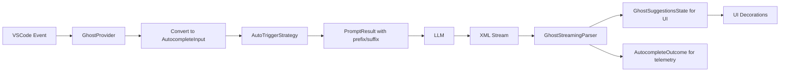

# Interface Alignment Architecture

## Current Architecture

```mermaid
graph LR
    A[VSCode Event] --> B[GhostProvider]
    B --> C[GhostContext]
    C --> D[GhostSuggestionContext]
    D --> E[AutoTriggerStrategy]
    E --> F[Prompts]
    F --> G[LLM]
    G --> H[XML Stream]
    H --> I[GhostStreamingParser]
    I --> J[GhostSuggestionsState]
    J --> K[UI Decorations]
```



## Target Architecture (After Alignment)



## Key Changes

### 1. Input Standardization

**Before:**

```typescript
interface GhostSuggestionContext {
	document: TextDocument
	range?: Range
	recentOperations?: Operation[]
}
```

**After:**

```typescript
interface AutocompleteInput {
	filepath: string
	pos: Position
	completionId: string
	recentlyEditedRanges: RecentlyEditedRange[]
	// ... other fields
}
```

### 2. Prompt Output Enhancement

**Before:**

```typescript
getPrompts(context): { systemPrompt: string, userPrompt: string }
```

**After:**

```typescript
getPrompts(input: AutocompleteInput): PromptResult {
  systemPrompt: string
  userPrompt: string
  prefix: string      // NEW
  suffix: string      // NEW
  completionId: string // NEW
}
```

### 3. Parser Output Dual-Mode

**Before:**

```typescript
processChunk(chunk): StreamingParseResult {
  suggestions: GhostSuggestionsState
  isComplete: boolean
  hasNewSuggestions: boolean
}
```

**After (Dual Output):**

```typescript
// Existing method - unchanged for UI
processChunk(chunk): StreamingParseResult

// NEW method for CompletionProvider compatibility
toAutocompleteOutcome(): AutocompleteOutcome {
  completion: string
  prefix: string
  suffix: string
  time: number
  modelProvider: string
  // ... other metadata
}
```

## Benefits

1. **Gradual Migration**: UI continues to work with `GhostSuggestionsState`
2. **CompletionProvider Ready**: Can swap in CompletionProvider next week
3. **Better Telemetry**: `AutocompleteOutcome` provides standardized metrics
4. **Testability**: Clear input/output contracts
5. **Maintainability**: Aligned with Continue.dev patterns

## Migration Timeline

### This Week (Interface Alignment)

- Day 1-2: Create types and conversion utilities
- Day 3-4: Update AutoTriggerStrategy and GhostStreamingParser
- Day 5: Integration testing and bug fixes

### Next Week (CompletionProvider Swap)

- Day 1: Replace AutoTriggerStrategy with CompletionProvider prompt logic
- Day 2: Replace GhostStreamingParser with CompletionProvider streaming
- Day 3: Add diff conversion layer (string → GhostSuggestionsState)
- Day 4-5: Testing and refinement
