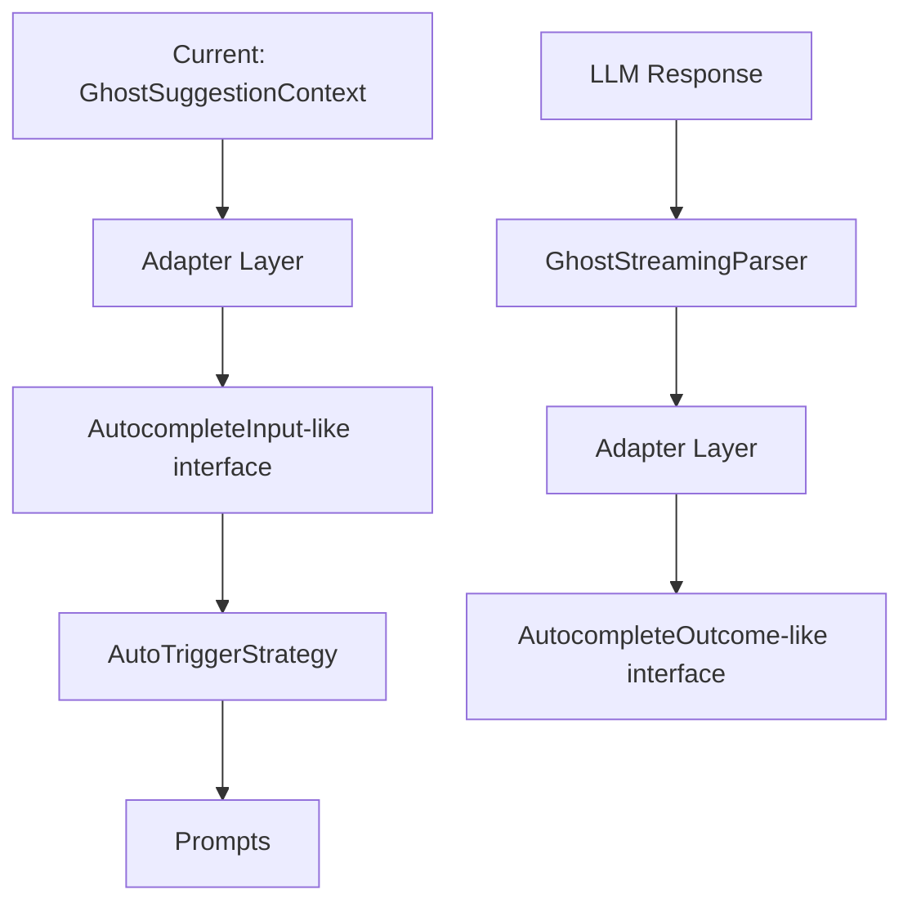

# Interface Alignment Plan: AutoTriggerStrategy/GhostStreamingParser → CompletionProvider

## Current State Analysis

### AutoTriggerStrategy

- **Input**: `GhostSuggestionContext` (VSCode document + range)
- **Output**: `{ systemPrompt: string, userPrompt: string }`
- **Purpose**: Generate prompts for LLM based on typing context

### GhostStreamingParser

- **Input**: Streaming XML chunks with `<change>/<search>/<replace>` blocks
- **Output**: `GhostSuggestionsState` (diff-based edit operations)
- **Purpose**: Parse streaming responses into actionable edits

### CompletionProvider (Target)

- **Input**: `AutocompleteInput` (filepath, position, prefix/suffix context)
- **Output**: `AutocompleteOutcome` (completion string + metadata)
- **Purpose**: Provide inline completions using prefix/suffix model

## Key Differences

| Aspect            | Current (Ghost)                    | Target (CompletionProvider)         |
| ----------------- | ---------------------------------- | ----------------------------------- |
| Context Type      | VSCode Document + Range            | Filepath + Position + Prefix/Suffix |
| Prompt Generation | Strategy-based (comment vs code)   | Template-based with snippets        |
| Response Format   | XML with search/replace blocks     | Plain text completion               |
| Output Type       | Diff operations (add/delete lines) | Completion string                   |
| Streaming         | Custom XML parser                  | Character-by-character with filters |

## Recommended Intermediate Step

Create an **adapter layer** that makes AutoTriggerStrategy/GhostStreamingParser more compatible with CompletionProvider's interface without breaking existing functionality.

### Proposed Changes

## Implementation Plan

### Phase 1: Create Context Adapter

1. Create `GhostAutocompleteInput` interface that mirrors `AutocompleteInput` structure
2. Add conversion method: `GhostSuggestionContext → GhostAutocompleteInput`
3. Update `AutoTriggerStrategy` to accept both context types

### Phase 2: Standardize Prompt Interface

1. Create `PromptResult` interface: `{ systemPrompt: string, userPrompt: string, prefix: string, suffix: string }`
2. Update `AutoTriggerStrategy.getPrompts()` to return this interface
3. Extract prefix/suffix from document context

### Phase 3: Create Outcome Adapter

1. Create `GhostAutocompleteOutcome` interface that mirrors `AutocompleteOutcome`
2. Add conversion method: `GhostSuggestionsState → GhostAutocompleteOutcome`
3. This will help track completion metadata consistently

### Phase 4: Simplify Parser Output (Optional)

1. Consider adding a "simple completion mode" to `GhostStreamingParser`
2. This mode would output plain text instead of XML diffs
3. Useful for simpler autocomplete scenarios

## Benefits of This Approach

1. **Non-breaking**: Existing Ghost functionality continues to work
2. **Gradual migration**: Can switch components one at a time
3. **Testable**: Each adapter can be unit tested independently
4. **Reversible**: Easy to roll back if issues arise
5. **Learning opportunity**: Understand both systems better during migration

## Files to Modify

1. `src/services/ghost/types.ts` - Add new interfaces
2. `src/services/ghost/strategies/AutoTriggerStrategy.ts` - Accept new input format
3. `src/services/ghost/GhostStreamingParser.ts` - Add outcome conversion
4. `src/services/ghost/adapters/` (new) - Create adapter utilities

## Testing Strategy

1. Create adapter tests that verify bidirectional conversion
2. Run existing Ghost tests to ensure no regression
3. Create integration tests showing both interfaces work
4. Add performance benchmarks to ensure no degradation
