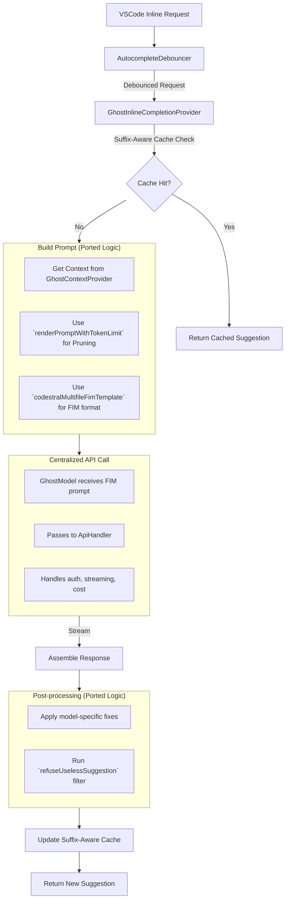

# Autocomplete Consolidation: Synthesized Review and Plan

## 1. Executive Summary

**Decision: Use the Classic implementation as the base** and strategically port high-value features from the New (continue-based) implementation.

**Rationale:** After synthesizing all AI and human reviews and conducting a direct code analysis, it's clear that the Classic implementation's architectural simplicity and deep integration with our existing `GhostModel` and cost-tracking infrastructure provide a less risky and more maintainable foundation.

While the New implementation has superior, production-tested features, its separate and duplicative LLM-calling architecture presents a major integration hurdle. The risk and complexity of re-architecting its core to use our centralized `ApiHandler` are far greater than the risk of porting its modular, self-contained features (like debouncing and templating) into the stable Classic codebase.

This approach allows us to:

- **Preserve** the superior suffix-aware caching of the Classic implementation.
- **Avoid** a high-risk "heart transplant" of the New implementation's async logic.
- **Gain** the most impactful features (cost savings from debouncing, quality from FIM templating) with the lowest initial effort.
- **Incrementally** adopt features, starting with the most critical ones.

---

## 2. Synthesized Implementation Comparison

This review synthesizes the findings from all provided reviews (Opus, GPT, Gemini, Sonnet, GLM, Human) and our direct code inspection.

| Feature                 | Classic Implementation                                                                                                  | New (continue-based) Implementation                                                                                   | Verdict & Synthesis                                                                                                                                                                                                       |
| :---------------------- | :---------------------------------------------------------------------------------------------------------------------- | :-------------------------------------------------------------------------------------------------------------------- | :------------------------------------------------------------------------------------------------------------------------------------------------------------------------------------------------------------------------ |
| **Prompt Format**       | ❌ Uses custom XML `<COMPLETION>` tags. (`HoleFiller.ts`)                                                               | ✅ Uses correct, native FIM format `[SUFFIX]...[PREFIX]`. (`AutocompleteTemplate.ts`)                                 | 🏆 **New wins.** Native FIM is critical for Codestral performance. This is the highest-priority feature to port.                                                                                                          |
| **Caching**             | ✅ Excellent suffix-aware cache that handles backspacing and partial typing. (`GhostInlineCompletionProvider.ts`)       | ❌ Inferior prefix-only LRU cache. Misses cache hits on suffix changes. (`AutocompleteLruCacheInMem.ts`)              | 🏆 **Classic wins.** We must keep Classic's superior caching logic as it's better suited for the interactive nature of autocomplete.                                                                                      |
| **Concurrency**         | ❌ Primitive polling-based cancellation flag (`isRequestCancelled`). No debouncing. Fires a request on every keystroke. | ✅ Sophisticated, multi-layered approach: debouncing, `AbortController`, and `GeneratorReuseManager`.                 | 🏆 **New wins decisively.** Debouncing is essential for cost control and UX. This is the second-highest priority port. The `GeneratorReuseManager` adds complexity and can be deferred.                                   |
| **Token Management**    | ❌ No explicit token limit handling. Risks context window errors on large files.                                        | ✅ Robust, proportional token pruning to fit context window (`templating/index.ts`).                                  | 🏆 **New wins.** This is critical for production stability. Must be ported.                                                                                                                                               |
| **Filtering & Quality** | ❌ Basic useless suggestion filter (`uselessSuggestionFilter.ts`).                                                      | ✅ Sophisticated, multi-stage post-processing with model-specific quirks handled (`postprocessing/index.ts`).         | 🏆 **New wins.** These filters address real-world model issues and significantly improve completion quality.                                                                                                              |
| **Architecture**        | ✅ **Simple & Lean (~400 LOC)**. Tightly integrated with centralized `GhostModel`.                                      | ❌ **Complex & Bloated (~3000+ LOC)**. Duplicates LLM infrastructure (`OpenAI.ts`, etc.), bypassing our `ApiHandler`. | 🏆 **Classic wins.** The architectural soundness and existing integration of Classic make it the safer and more maintainable foundation. The primary goal is to avoid inheriting the New implementation's technical debt. |

---

## 3. High-Level Integration Plan

The strategy is to enhance the `classic-auto-complete` provider by porting modules from the `continuedev` directory. We will not be touching the `new-auto-complete` wrapper, which will be deleted.

### Target Architecture

### Phased Implementation

#### Phase 1: Critical Enhancements (The 80/20 Gains)

_Goal: Achieve major improvements in cost and quality with minimal risk._

1.  **Integrate Debouncing:**

    - **Action:** Port the `AutocompleteDebouncer` module.
    - **Integration:** Wrap the `provideInlineCompletionItems_Internal` logic in [`GhostInlineCompletionProvider.ts`](src/services/ghost/classic-auto-complete/GhostInlineCompletionProvider.ts) with the debouncer.
    - **Impact:** Immediate and massive reduction in API calls. **(Addresses Scenario 1)**.

2.  **Adopt FIM Templating & Token Management:**

    - **Action:** Port the `renderPromptWithTokenLimit` function and the `codestralMultifileFimTemplate` from continue.dev's templating system.
    - **Integration:** Replace the logic inside `HoleFiller.getPrompts` to use this new module. The system prompt (`getBaseSystemInstructions`) will be discarded in favor of the native FIM format. The anemic `parseGhostResponse` will also be removed.
    - **Impact:** Significantly improves suggestion quality by using the correct prompt format and prevents errors on large files. **(Addresses Scenarios 4 & 3)**.

3.  **Enhance Post-processing:**
    - **Action:** Port the `postprocessCompletion` function.
    - **Integration:** Call this new function in `getFromLLM` before the existing `refuseUselessSuggestion` filter.
    - **Impact:** Cleans up model-specific quirks, improving the reliability and acceptance rate of completions. **(Addresses Scenario 5)**.

#### Phase 2: Advanced Concurrency & Cleanup

_Goal: Further improve performance and clean up the codebase._

1.  **Implement `AbortController`:**

    - **Action:** Modify `GhostModel` and the underlying `ApiHandler` to accept and respect an `AbortSignal`.
    - **Integration:** Thread the `AbortController` from `AutocompleteDebouncer` through the `getFromLLM` call stack.
    - **Impact:** Enables true cancellation of in-flight network requests, saving on token costs for aborted requests.

2.  **Deprecate and Remove `continue.dev` Bloat:**
    - **Action:** Delete the `src/services/ghost/new-auto-complete` directory.
    - **Action:** Identify and remove unused modules from `src/services/continuedev/` that are not part of our ported features (e.g., `NextEditProvider`, `BracketMatchingService`).
    - **Impact:** Reduces codebase size and maintenance burden.

#### Phase 3: Optional Optimizations (To Be Evaluated)

1.  **Evaluate `GeneratorReuseManager`:**
    - **Action:** Analyze the complexity vs. the actual benefit of the `GeneratorReuseManager`.
    - **Decision:** Decide whether the engineering effort to integrate this complex module is justified by the marginal gains over debouncing alone. Given its complexity, it may be better to **skip this feature** for now.

---

## 4. Summary of Changes

### Features to Port from "New" to "Classic"

| Feature                            | Priority       | Rationale                                                            |
| :--------------------------------- | :------------- | :------------------------------------------------------------------- |
| **`AutocompleteDebouncer`**        | **Critical**   | Drastically reduces API cost and improves UX.                        |
| **FIM Templating**                 | **Critical**   | Essential for completion quality with Codestral.                     |
| **Token-Aware Pruning**            | **Critical**   | Prevents errors and ensures stability with large files.              |
| **Model-Specific Post-Processing** | **High**       | Fixes real-world model quirks, improving acceptance rate.            |
| **`AbortController` Support**      | **Medium**     | Provides true request cancellation for additional cost savings.      |
| **`GeneratorReuseManager`**        | **Low / Skip** | High complexity for marginal benefit over debouncing. Defer or skip. |

### Features to Deprecate

- **`new-auto-complete` directory:** The entire wrapper and its logic.
- **`continue.dev`'s `ILLM` implementations:** All LLM calls will remain centralized in `GhostModel`.
- **Classic's `HoleFiller.ts`:** To be replaced by the superior templating and token management from `continue.dev`.
- **Unused `continue.dev` modules:** Any code related to Next Edit, prefetching, or other non-essential features.
