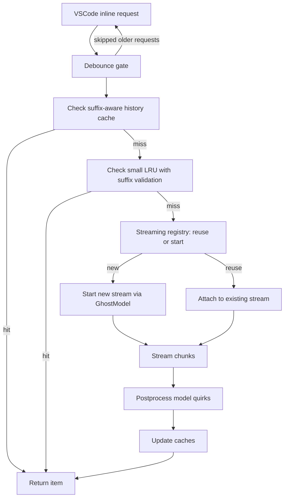

# Autocomplete Consolidation: Synthesized Review and Integration Plan

Executive summary

- Decision: Use Classic as the base and integrate a carefully selected subset of continuedev components. This aligns with team direction and the two Opus reviews while still capturing the strongest advantages highlighted by other reviewers.
- Why Classic: It is already wired into centralized LLM plumbing via [GhostModel.ts](src/services/ghost/GhostModel.ts), has a surprisingly effective suffix-aware cache in [findMatchingSuggestion()](src/services/ghost/classic-auto-complete/GhostInlineCompletionProvider.ts:30), and is ~10x smaller and easier to maintain. It also already threads recently visited and edited ranges.
- What to import from continuedev: Debouncing, token-aware prompt limiting, FIM templating for Codestral, model-specific postprocessing, and generator-reuse concepts. We will not graft the entire provider; instead we will fold minimal, high-value modules into Classic’s simpler loop.
- Concurrency direction: Replace request-per-keystroke with a cohesive orchestration that fuses a debouncer, a multi-inflight streaming registry inspired by [GeneratorReuseManager](src/services/continuedev/core/autocomplete/generation/GeneratorReuseManager.ts:1), and a small in-memory LRU (adapted from [AutocompleteLruCacheInMem](src/services/continuedev/core/autocomplete/util/AutocompleteLruCacheInMem.ts:1)) as a secondary tier behind Classic’s suffix-aware cache.
- Scope left out: NextEdit system, sqlite caching, and any duplicate ILLM layers. Keep GhostModel integration as the single API path. Treat bracket matching as optional follow-up.

This plan reflects consensus across reviews with prioritization aligned to the human summary: integrate debounce ASAP, reimplement concurrency ideas (not wholesale copy), adopt FIM + token limiting + filtering, and de-scope sqlite/NextEdit.

Synthesis of all reviews with code reality

Where reviews agree

- FIM format is critical for Codestral. The native prefix/suffix pattern is preferred to Classic’s XML hole-filler in [HoleFiller.ts](src/services/ghost/classic-auto-complete/HoleFiller.ts).
- Debouncing is essential to tame cost and improve UX. Import the small, focused logic from [AutocompleteDebouncer](src/services/continuedev/core/autocomplete/util/AutocompleteDebouncer.ts:1).
- Token-aware context control prevents errors on large files and improves reliability.
- Model-specific postprocessing improves acceptance rate, particularly for Codestral quirks; extend Classic’s simple [refuseUselessSuggestion()](src/services/ghost/classic-auto-complete/uselessSuggestionFilter.ts:9) with continuedev’s rules.

Where reviews diverge and final choice

- Base: Several reviews (Gemini, Sonnet) favor “New as base” for features; Opus A/B and GPT favor “Classic as base.” Given team decision and the integration/cost risk, choose Classic as base. We can still port the high-value continuedev features.
- Generator reuse: Opus A says the complexity may not be worth it; Opus B and others consider it valuable during rapid typing. Reconcile as follows: adopt the core reuse idea, but fold it into a unified streaming registry that is simpler than the raw [GeneratorReuseManager](src/services/continuedev/core/autocomplete/generation/GeneratorReuseManager.ts:1) and allows a limited number of concurrent in-flight streams. This lets us reuse already-streaming responses without adopting the entire continuedev orchestration.
- Caching: Classic’s suffix-aware cache is preferred for correctness in FIM scenarios. A small prefix-only LRU can serve as secondary cache, validated against the current suffix before use.

Code checkpoints that anchor this plan

- Classic provider entry with cache + request loop: [GhostInlineCompletionProvider.ts](src/services/ghost/classic-auto-complete/GhostInlineCompletionProvider.ts)
- Classic prompt building and XML parsing: [HoleFiller.ts](src/services/ghost/classic-auto-complete/HoleFiller.ts)
- Centralized LLM integration and streaming usage tracking: [GhostModel.ts](src/services/ghost/GhostModel.ts)
- Continuedev modules to borrow from, minimally:
    - Debouncer: [AutocompleteDebouncer](src/services/continuedev/core/autocomplete/util/AutocompleteDebouncer.ts:1)
    - Reuse concept: [GeneratorReuseManager](src/services/continuedev/core/autocomplete/generation/GeneratorReuseManager.ts:1)
    - In-memory LRU: [AutocompleteLruCacheInMem](src/services/continuedev/core/autocomplete/util/AutocompleteLruCacheInMem.ts:1)
    - Postprocessing and templating modules (referenced conceptually; we will not import their entire scaffolding)

Key design decisions

1. Prompting: adopt native Codestral FIM, keep flexible fallback

- Replace Classic’s XML-based prompt in [HoleFiller.ts](src/services/ghost/classic-auto-complete/HoleFiller.ts) with a native FIM path for Codestral models and a fallback XML/chat path otherwise.
- Keep templates pluggable so we can support multiple providers without forking logic again.
- Keep Classic’s context gathering and recently visited/edited signals; integrate with multifile headers when in FIM mode.

2. Concurrency control: unify debouncer, stream reuse, and small LRU

- Debounce: Insert the lightweight [AutocompleteDebouncer](src/services/continuedev/core/autocomplete/util/AutocompleteDebouncer.ts:1) into Classic’s provideInline flow to gate API calls after ~100–150ms idle (configurable).
- Streaming registry: Implement a small “stream registry” inspired by [GeneratorReuseManager](src/services/continuedev/core/autocomplete/generation/GeneratorReuseManager.ts:1) that:
    - Tracks currently streaming completions keyed by document and a stable snapshot of the prompt inputs (e.g., a normalized prefix key and the current suffix).
    - Reuses an in-flight stream when the user’s new prefix is a direct extension of the pending generator’s prefix+completion head.
    - Supports a bounded number of concurrent in-flight requests (e.g., 2–3 per workspace) to avoid both contention and starvation when multiple editors or tabs are active.
    - Cancels stale or superseded streams with AbortController signals; cancellation must be plumbed down to the transport via [GhostModel.ts](src/services/ghost/GhostModel.ts).
- Caching tiers:
    - Primary: keep Classic’s suffix-aware recency cache in [findMatchingSuggestion()](src/services/ghost/classic-auto-complete/GhostInlineCompletionProvider.ts:30) because it’s robust against suffix changes and supports typed-advancement.
    - Secondary: add a small, prefix-only LRU adapted from [AutocompleteLruCacheInMem](src/services/continuedev/core/autocomplete/util/AutocompleteLruCacheInMem.ts:1), but validate against the current suffix before using a hit to avoid stale insertions in FIM scenarios.
- Outcome: Request-per-keystroke is eliminated; bursty typing makes 1–2 calls, and partially typed cached suggestions are returned instantly.

3. Token-aware limiting: proportional pruning with a pragmatic fallback

- Integrate proportional token budgeting into Classic’s prompt builder path (FIM and fallback). When the tokenizer is unavailable, allow a pragmatic fallback heuristic (e.g., 4 chars ≈ 1 token) to prevent hard failures while we integrate proper tokenizers.
- Preserve most-recent lines in prefix and closest lines in suffix; make pruning conservative and test-driven.

4. Postprocessing and filtering: multi-stage but minimal surface area

- Keep Classic’s [refuseUselessSuggestion()](src/services/ghost/classic-auto-complete/uselessSuggestionFilter.ts:9).
- Add a small postprocessing step with Codestral-specific whitespace/newline smoothing and repetition trimming, taking cues from continuedev’s postprocessing set without importing the entire filter pipeline.
- Place postprocessing before cache insert to avoid caching poor suggestions.

5. LLM integration: stay centralized in GhostModel

- All network calls and cost telemetry remain routed through [GhostModel.ts](src/services/ghost/GhostModel.ts).
- Thread AbortSignal from the streaming registry into GhostModel’s streaming call and then down to the HTTP fetch in the provider handlers, so cancellations actually stop token usage.
- Do not import continuedev’s ILLM layer; avoid duplicate transport logic.

6. De-scope items for now

- NextEdit system, complex bracket matching, sqlite caching, and continuedev’s large orchestrator. These introduce complexity and dependencies we do not need for core inline autocomplete.

Mermaid sketch: unified flow

High-level integration plan

Phase 0: Guardrails now

- Insert debouncer before any LLM call in [GhostInlineCompletionProvider.ts](src/services/ghost/classic-auto-complete/GhostInlineCompletionProvider.ts) using [AutocompleteDebouncer](src/services/continuedev/core/autocomplete/util/AutocompleteDebouncer.ts:1).
- Maintain feature flag or safe defaults to tune delay and to disable the new orchestration per-user if needed.

Phase 1: Prompting and token limits

- Add FIM path for Codestral to [HoleFiller.ts](src/services/ghost/classic-auto-complete/HoleFiller.ts) with swappable templates and a fallback XML/chat path for other models.
- Integrate token-aware pruning into prompt building, starting with proportional strategies and allowing a simple heuristic when tokenizer support is not available.

Phase 2: Reuse and cancellation

- Implement a streaming registry inspired by [GeneratorReuseManager](src/services/continuedev/core/autocomplete/generation/GeneratorReuseManager.ts:1) to reuse streams for prefix extensions; allow 2–3 concurrent in-flight requests; abort stale ones.
- Thread AbortSignal through [GhostModel.ts](src/services/ghost/GhostModel.ts) to the transport so cancellation actually halts token usage.

Phase 3: Postprocessing and filtering

- Add minimal but effective postprocessing for Codestral (leading space, double-newline smoothing, repetition clamps), positioned before cache insertion.
- Retain Classic’s [refuseUselessSuggestion()](src/services/ghost/classic-auto-complete/uselessSuggestionFilter.ts:9) as a fast path.

Phase 4: Cache tiering and metrics

- Keep suffix-aware cache as the primary session cache in [findMatchingSuggestion()](src/services/ghost/classic-auto-complete/GhostInlineCompletionProvider.ts:30).
- Add a small in-memory LRU adapted from [AutocompleteLruCacheInMem](src/services/continuedev/core/autocomplete/util/AutocompleteLruCacheInMem.ts:1) as a secondary tier, with suffix validation prior to use.
- Add basic counters: debounce-skips, reuse hits, cache hits, aborts, acceptance rate, and API call counts.

Phase 5: Cleanup and de-scope

- Remove unused continuedev provider scaffolding (keep only minimal modules we vendorized).
- Keep Classic as a single, unified implementation behind a guarded rollout. After stabilization, prune unused continuedev artifacts such as [NewAutocompleteProvider.ts](src/services/ghost/new-auto-complete/NewAutocompleteProvider.ts).

What we take from continuedev, and how

- Debouncer: Directly vendor the tiny [AutocompleteDebouncer](src/services/continuedev/core/autocomplete/util/AutocompleteDebouncer.ts:1) class. Minimal integration risk.
- Generator reuse: Re-implement the reuse concept from [GeneratorReuseManager](src/services/continuedev/core/autocomplete/generation/GeneratorReuseManager.ts:1) inside our own “streaming registry” more suitable for Classic: support multi-inflight, document-aware keys, and centralized AbortController lifecycle. This yields reuse without adopting continuedev’s larger orchestration.
- In-memory LRU: Adapt the core approach from [AutocompleteLruCacheInMem](src/services/continuedev/core/autocomplete/util/AutocompleteLruCacheInMem.ts:1) for a small secondary cache, with suffix validation to avoid stale hits under FIM.
- Templating and postprocessing: Recreate minimal versions of FIM templating and Codestral postprocessing rules based on the continuedev patterns, but avoid importing their full templating/postprocessing stacks.

What we keep from Classic

- Centralized integration: All LLM calls and usage tracking via [GhostModel.ts](src/services/ghost/GhostModel.ts).
- Suffix-aware cache and typed-advancement: [findMatchingSuggestion()](src/services/ghost/classic-auto-complete/GhostInlineCompletionProvider.ts:30) stays primary.
- Simple and maintainable loop in [GhostInlineCompletionProvider.ts](src/services/ghost/classic-auto-complete/GhostInlineCompletionProvider.ts), extended rather than replaced.
- Basic filter as a first-pass guard: [refuseUselessSuggestion()](src/services/ghost/classic-auto-complete/uselessSuggestionFilter.ts:9).

What we explicitly ignore for now

- NextEdit and related orchestration: not needed for inline autocomplete; avoid importing this complexity.
- Sqlite or on-disk caching: de-prioritized per discussion; in-memory is enough and plays better with streaming reuse.
- Deep bracket matching service: investigate later; current priority is concurrency, costs, and correctness.

Success criteria

- Cost: 60–80 percent drop in API calls during typing bursts due to debouncing and stream reuse.
- Quality: Higher acceptance rates from FIM prompting and model-specific postprocessing.
- Reliability: Near-zero context-window errors via proportional pruning.
- Cache hit rate: Maintain or improve Classic’s hit-rate thanks to suffix-aware primary cache; LRU adds small incremental benefit.
- Maintainability: Keep unified implementation <= ~800–1000 LOC delta; avoid importing large continuedev scaffolding.

Risks and mitigations

- Over-coupling to model quirks. Mitigation: keep postprocessing modular and minimal; gate per model family.
- Stream reuse edge cases. Mitigation: only reuse when prefix monotonically extends and suffix is identical; disable reuse when suffix or cursor context changes.
- Cancellation not plumbed: ensure AbortSignal flows through [GhostModel.ts](src/services/ghost/GhostModel.ts) to transport; verify on providers.
- Debounce feels sluggish to some users: expose a setting and provide a reasonable default (e.g., 120–150ms).

Deliverables checklist (high-level)

- Debounce gate integrated into Classic request loop using [AutocompleteDebouncer](src/services/continuedev/core/autocomplete/util/AutocompleteDebouncer.ts:1)
- FIM path in [HoleFiller.ts](src/services/ghost/classic-auto-complete/HoleFiller.ts) with fallback
- Token-aware prompt limiting in Classic prompting path
- Minimal postprocessing stage before caching and display
- Streaming registry for reuse with bounded multi-inflight + AbortController plumbing through [GhostModel.ts](src/services/ghost/GhostModel.ts)
- Secondary LRU cache adapted from [AutocompleteLruCacheInMem](src/services/continuedev/core/autocomplete/util/AutocompleteLruCacheInMem.ts:1) behind Classic’s suffix-aware cache
- Metrics for debounce-skips, reuse hits, cache hits, aborts, acceptance
- Cleanup of unused continuedev provider scaffolding like [NewAutocompleteProvider.ts](src/services/ghost/new-auto-complete/NewAutocompleteProvider.ts)

Closing note

This plan delivers the “devil you know” benefits of Classic’s clean architecture with the most valuable production learnings from continuedev. It deliberately re-implements only the thin concurrency primitives we need (debounce + reuse + multi-inflight + abort), keeps GhostModel as the single LLM gateway, and preserves the unique advantage of Classic’s suffix-aware caching. The result is cheaper, faster, and more reliable autocomplete without taking on continuedev’s architectural overhead.
