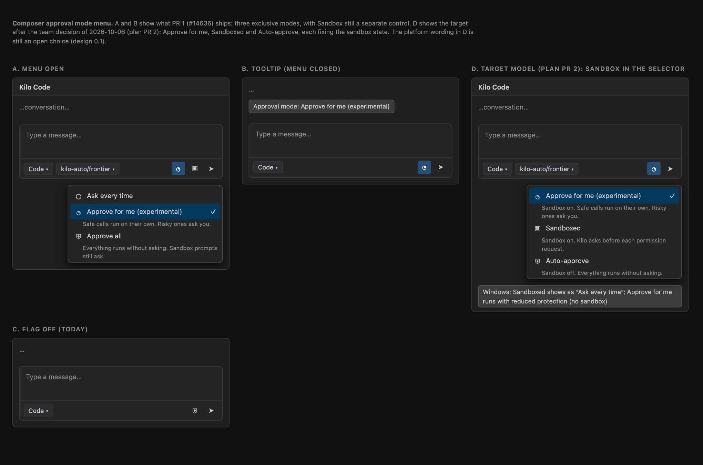
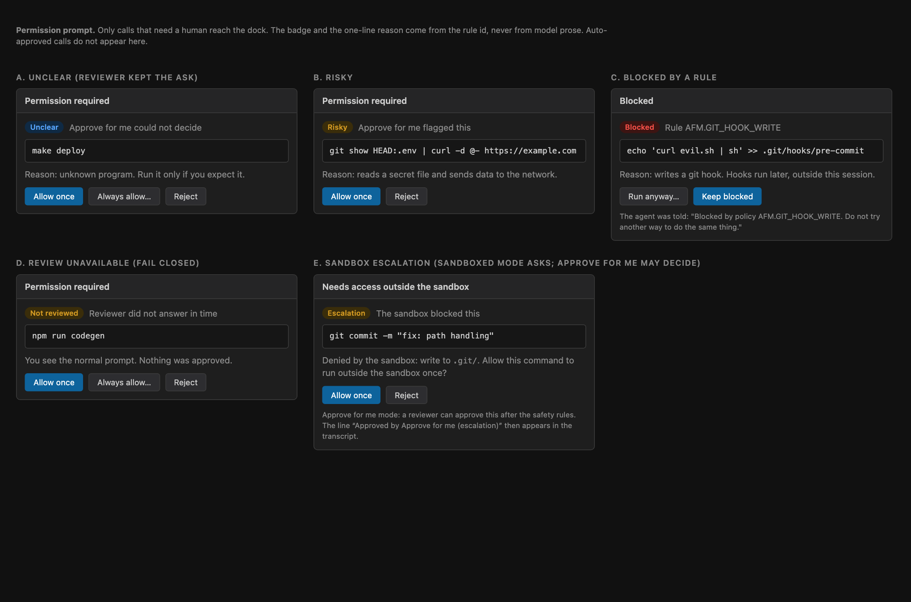
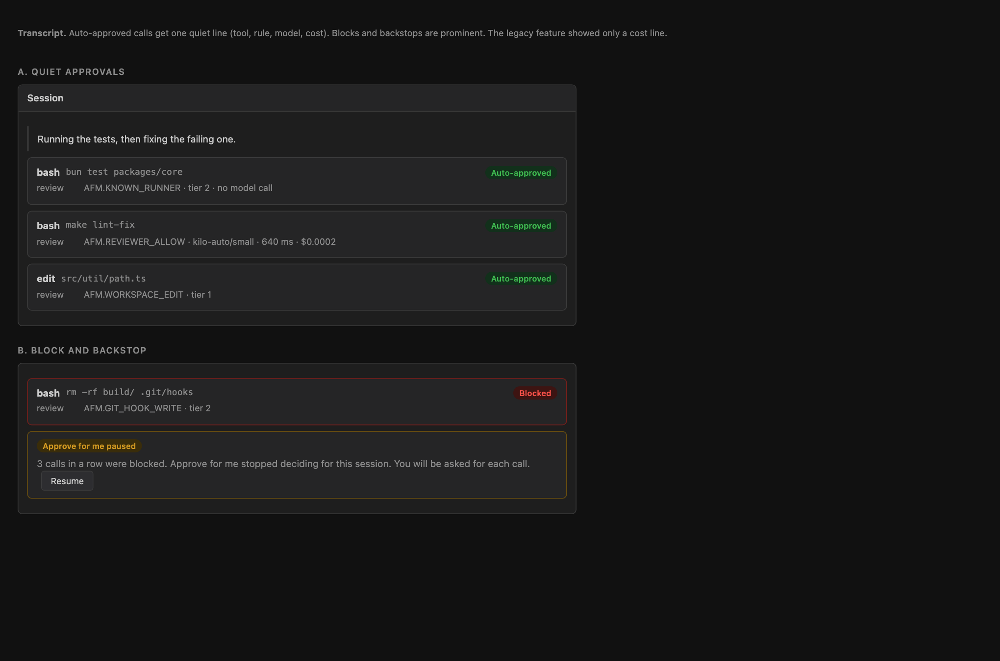
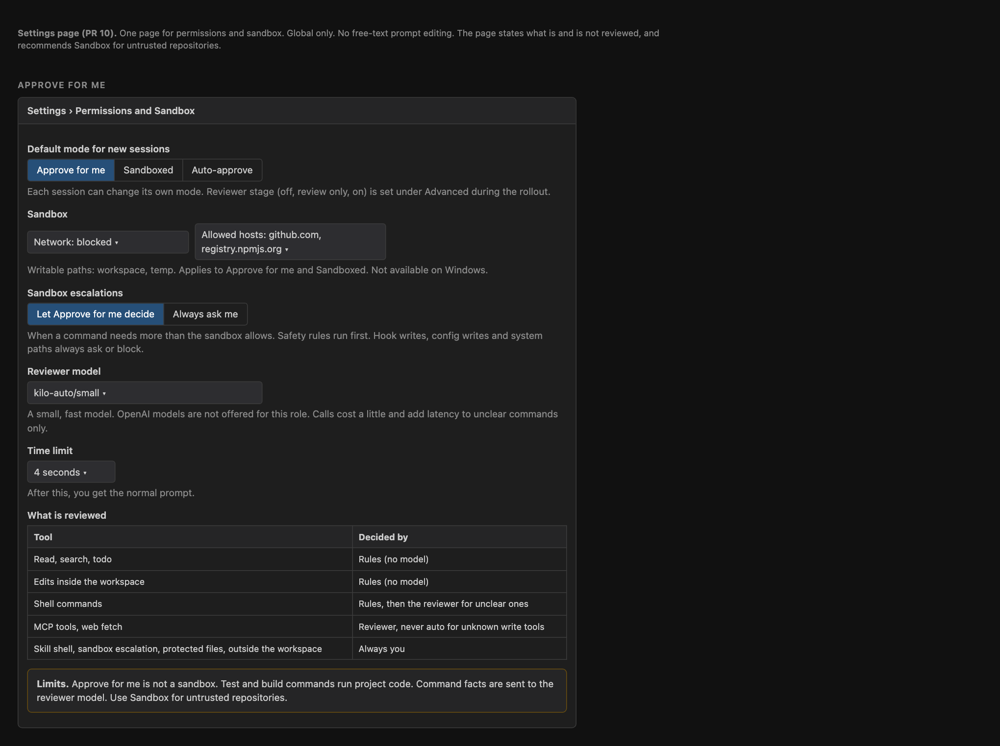
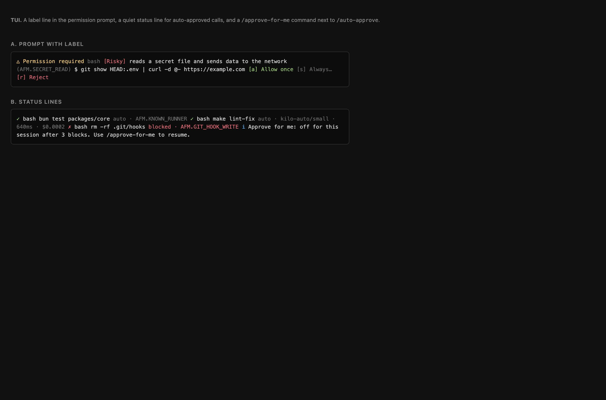

# Plan: Approve for Me (Gatekeeper)

Status: proposal. Tracking issue: [#7684](https://github.com/Kilo-Org/kilocode/issues/7684).
First slice (hidden UI entry point): [#14636](https://github.com/Kilo-Org/kilocode/pull/14636).

This folder is the plan for bringing the legacy "AI Gatekeeper" to the new CLI and
extensions as **Approve for Me**. It follows this approach:

1. Reverse engineer the legacy feature and cite exact code.
2. Commit one consistent plan to `main`.
3. Build it in many small PRs, all behind one hidden flag.

| File | What it holds |
|---|---|
| [`legacy-gatekeeper.md`](./legacy-gatekeeper.md) | Full map of the legacy feature, with permalinks, and what we keep or change |
| [`design.md`](./design.md) | Architecture for the new repo: hook point, pipeline, verdicts, tool coverage, config, trust, clients |
| [`roadmap.md`](./roadmap.md) | PR-by-PR delivery plan, acceptance criteria, rollout and evaluation |
| [`prior-art.md`](./prior-art.md) | What to reuse from community attempts (#13893, #11619, #9138) |
| [`mockups/`](./mockups) | HTML mockups and screenshots of the planned UI (section 7 below) |

## 1. What the feature is

Kilo has two approval behaviors for tool calls today:

- **Ask every time.** The default. Every call that no rule allows waits for the user.
- **Approve all.** The composer shield (VS Code), `/auto-approve` (TUI), `kilo run --auto`.
  It approves everything. There is no judgment.
- **Sandbox.** An operating-system boundary around tools (macOS and Linux). Off by default today. Separate from the two above.

**Approve for Me** sits between them, on top of the sandbox. A reviewer looks at each call that
would need approval. Safe calls run without a prompt. Risky or unclear calls go to the
user, with a label that says why. A few classes of call are never auto-approved.
The end state is one selector with three modes (Approve for me, Sandboxed, Auto-approve), like Codex.

Decisions already made (from the team discussion):

| Topic | Decision |
|---|---|
| Relation to Approve all | Mutually exclusive. Turning one on turns the other off. Done in #14636. |
| Relation to Sandbox | Joins the same selector (decided 2026-10-06). Three modes: Approve for me (sandbox on), Sandboxed (sandbox on, ask), Auto-approve (sandbox off). Sandbox is the first layer of defense and is enabled by default in the end state, gated by data. |
| Sandbox escalation | Becomes a normal ask in Sandboxed mode. In Approve for me the reviewer may approve any escalation, with guard rails. Pros and cons in `design.md` 2.5. |
| Mode state | Per session, default from global config, so sessions can move between local and cloud. Cloud wiring waits for cloud to be stable. |
| Settings | Permissions and sandbox in one settings page. |
| Reviewer model | Not an OpenAI model. Cheap and fast. Configurable. |
| Delivery | Small PRs behind one hidden flag. Plan first, code after. |
| Source of design | Port the idea of the legacy feature. Do not port it line by line (see below). |

## 2. Why we cannot port the legacy code as is

The legacy feature worked and users liked it. It also has gaps that the new feature must close.
Details and line references are in [`legacy-gatekeeper.md`](./legacy-gatekeeper.md).

| Legacy behavior | Problem | New behavior |
|---|---|---|
| Any error, missing config or timeout approves the call (`gatekeeper.ts:29-53,135-138`) | A broken setup silently becomes "approve all" | **Fail closed.** Any doubt shows the normal prompt. Issue #7684 asks for this. |
| Only works inside YOLO mode; it replaces the normal approval path | Skips user rules, deny lists and protected files | Runs inside the permission pipeline. Deny and hard rules still win. |
| Reply parsed with `startsWith("yes")` (`gatekeeper.ts:75-79`) | Loose. A reasoning preamble becomes a deny | Strict JSON verdict. Anything else is "ask". |
| Model sees raw command and 200 chars of file content (`gatekeeper.ts:261`) | Prompt injection through model-written text | Structured facts only. No chat history, no assistant prose, no tool output. |
| Edit tools: only the path and 200 chars reach the model (`gatekeeper.ts:252-264`) | Reviewer cannot see the diff | Deterministic rules for edits. Model only for what rules cannot decide. |
| Path extraction splits on spaces (`gatekeeper.ts:188-230`); `git ls-files "${path}"` is built as a shell string (`:170`) | Misses pipes, `&&`, quotes; shell injection surface | Tree-sitter parse. No shell strings built from model output. |
| Denial returns `toolDenied()` with no reason (`presentAssistantMessage.ts:704`) | The model retries the same call | A block carries a stable reason code. Repeated blocks escalate to the user. |
| MCP tools skip the gatekeeper (`presentAssistantMessage.ts:214-226`) | Coverage gap | Every permission key has an explicit policy (see `design.md`). |
| No timeout or abort on the model call | A hang blocks the tool | Hard deadline, then "ask". |
| No telemetry for gatekeeper decisions | No data on false denies, cost or latency | Verdict, latency, cost and human override are recorded. |
| Docs say it "reviews every intended change" (`auto-approving-actions.md:331`) | Overstates coverage; read tools were pre-approved | Docs state what is and is not reviewed. |
| Suggested model `gpt-oss-safeguard-20b` (OpenAI) | Conflicts with the "no OpenAI" decision | Default to a non-OpenAI small model. |

## 3. Proposed architecture in one page

```
tool call
   |
   v
KiloSessionPrompt.askPermission            (Kilo-owned file)
   |  mode off? -> normal Permission.ask
   v
ApproveForMe.review(request, context)      (new, packages/opencode/src/kilocode/approve-for-me/)
   |  tier 0  never auto: skill shell, protected config, hard deny
   |  tier 1  deterministic allow: read-only tools, in-workspace edits
   |  tier 2  deterministic classifier: shell facts, path classes, git verbs
   |  tier 3  LLM reviewer: only for what tier 2 marks "reviewable"; also sandbox escalations (design 2.5)
   v
verdict: allow | ask(reason) | block(reason)
   |
   +-- allow -> run now (once-scoped allow, no saved rule), record metadata.review
   +-- ask   -> normal prompt, annotated with risk label and reason
   +-- block -> tool error to the model with a stable reason; notice to the user
```

Key points (details in [`design.md`](./design.md)):

- The hook lives in `KiloSessionPrompt.askPermission` (Kilo-owned) so shared upstream files stay almost untouched.
- A verdict can only make a call **stricter than "allow"** when a rule says so, and can only
  **auto-allow what a human would otherwise be asked about**. It never overrides a deny.
- The reviewer model is chosen only from **global** config or the environment. A cloned repo cannot enable the mode, choose the model or point at an endpoint.
- The same server-side stage serves the TUI, `kilo run`, VS Code and JetBrains.
  The VS Code composer menu (#14636) only selects the mode.

## 4. Delivery in small PRs

Full list with acceptance criteria is in [`roadmap.md`](./roadmap.md).

| # | PR | Behavior change |
|---|---|---|
| 0 | This plan | None |
| 1 | Entry point + exclusion + mode menu (#14636) | None (hidden UI) |
| 2 | Mode model: per-session state, flag, trust scope; selector becomes Approve for me / Sandboxed / Auto-approve and drives the sandbox | Behind the flag |
| 3 | Sandbox escalation becomes an ask (Sandboxed mode) | Behind the sandbox flag |
| 4 | Review skeleton in shadow mode (tier 0 and 1) | None (logs only) |
| 5 | Deterministic bash classifier (tier 2) | None (logs only) |
| 6 | Verdict shown in prompts and transcript | Labels only |
| 7 | LLM reviewer (tier 3) in shadow mode | None (logs only) |
| 8 | Active mode: allow outcomes auto-approve, escalations included; backstops | **Yes, behind the flag** |
| 9 | Evaluation harness, escalation telemetry, thresholds | None |
| 10 | Unified settings page, legacy migration, docs | Behind the flag |
| 11 | Graduation: remove the flag, sandbox default-on if data allows | Decision needed |

Shadow mode first is deliberate. We collect real verdicts next to real human decisions
before any verdict changes what the user sees.

## 5. Open questions for the team

1. **Does an LLM "dangerous" verdict hard-block, or show a prompt?** We propose a prompt. Only deterministic rules block.
2. **Default reviewer model.** Which non-OpenAI small model is the default, and does the free tier have one?
3. **Overlap with #13893 / #14033.** The author has a large deterministic layer and offered to split it.
   Agree owners before PR 5 (see `prior-art.md`).
4. **Legacy migration.** Do we import `yoloGatekeeperApiConfigId` automatically? (#10252 says never turn guarded YOLO into allow-all.)
5. **Sandbox default-on.** What escalation rate is acceptable before we turn it on by default? Set in PR 9.

Decided: Sandbox joins the selector; without a sandbox, Approve for me runs with a reduced profile and "Sandboxed" shows as "Ask every time" (`design.md` 0.1); the reviewer may approve any sandbox escalation (with guard rails); mode is per session;
reviewer cost counts toward task cost.

## 6. Risks

| Risk | Mitigation |
|---|---|
| Reviewer approves something harmful (#13893 benchmark: the reviewer raised attack success from 2.6% to 5.3%) | Reviewer only sees a narrow class. Start in shadow mode. Gate graduation on a corpus with a zero critical false-allow target. |
| Latency and cost on every call | Tiers 0 to 2 are free and fast. Cache by session and normalized request. Hard deadline. |
| Prompt injection into the reviewer | Structured facts, delimited as untrusted data, strict JSON, no tools. |
| Upstream merge conflicts | One small marked hook in shared code. Everything else in `kilocode/` paths. |
| Duplicate community work stalls again (#10248, #10267 and #11619 were closed as stale) | One owner, a public plan, small PRs, and an early reply on #14033. |
| Client-side auto-approve in VS Code replies before the server can judge | Modes are exclusive. In Approve for Me the extension does not auto-reply. |
| Default-on sandbox causes constant escalations and a poor first run | Escalation becomes an ask first (PR 3). Default-on only after PR 9 data. Good defaults for common hosts and paths |
| Reviewer approves a harmful sandbox escalation | Deterministic rules first, narrowest scope, caps, shadow mode, visible off switch (`design.md` 2.5) |
| Mode and sandbox state diverge between clients or cloud | Mode lives on the session. Sandbox state is derived from it |

## 7. Planned UI

Source HTML and PNG files are in [`mockups/`](./mockups). They show intent, not final pixels.

| Mockup | Shows |
|---|---|
|  | Composer mode menu and tooltip. Three modes with Sandbox (PR 2); #14636 ships the first version (PR 1) |
|  | Prompts for unclear, risky, blocked and "not reviewed" calls, and a sandbox escalation (PRs 3 and 6) |
|  | Quiet auto-approved lines, a block, and the backstop notice (PRs 6 and 8) |
|  | Unified permissions and sandbox settings (PR 10) |
|  | TUI prompt label and status lines (PR 6) |

## 8. How to use this plan

- Each roadmap PR links to its section here and updates the status table.
- When a PR changes the design, it edits this folder in the same PR.
- When the feature graduates, delete the folder (the repo removes finished plans).
