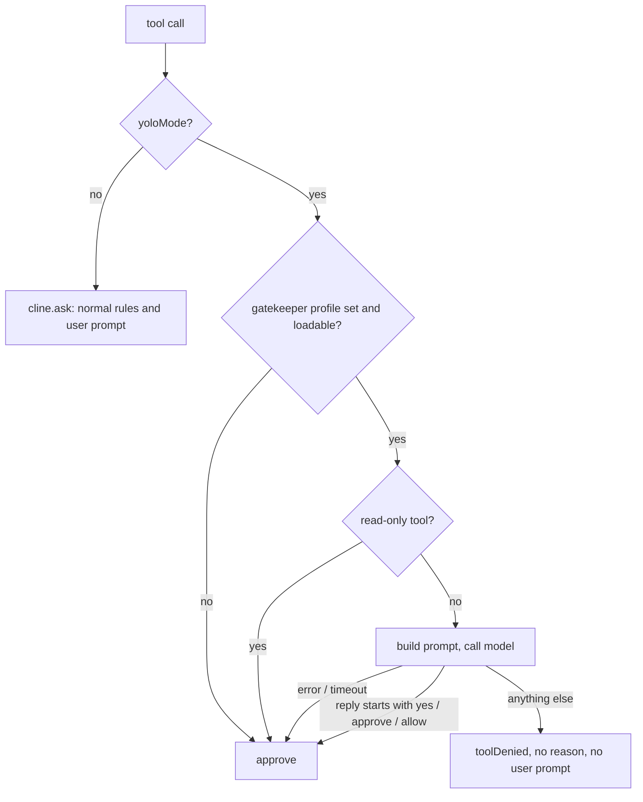

# Legacy Gatekeeper: reverse engineering

This file maps the legacy "AI Gatekeeper" (also "smart YOLO mode") end to end.
Every reference points to the legacy repo at one pinned commit:

- Repo: [`Kilo-Org/kilocode-legacy`](https://github.com/Kilo-Org/kilocode-legacy)
- Commit: [`ae046ac`](https://github.com/Kilo-Org/kilocode-legacy/tree/ae046acafd17993bdf12dce0f81d9ac948e17ee8) (`ae046acafd17993bdf12dce0f81d9ac948e17ee8`)
- Link base: `https://github.com/Kilo-Org/kilocode-legacy/blob/ae046acafd17993bdf12dce0f81d9ac948e17ee8/<path>#L<line>`

Paths below are relative to that repo. `gatekeeper.ts` means `src/core/assistant-message/kilocode/gatekeeper.ts`.
The clone of the legacy repo has no history, so history comes from the GitHub API (section 9).

## 1. What users see

- Settings, **Auto-Approve** tab. A yellow "YOLO Mode" box with the checkbox
  "Enable YOLO Mode - Auto-approve EVERYTHING"
  ([`AutoApproveSettings.tsx:441-462`](https://github.com/Kilo-Org/kilocode-legacy/blob/ae046acafd17993bdf12dce0f81d9ac948e17ee8/webview-ui/src/components/settings/AutoApproveSettings.tsx#L441-L462)).
- When YOLO is on, a second select: **AI Safety Gatekeeper (Optional)**. Its options are
  "No gatekeeper (approve all)" plus every saved API profile by name
  (`AutoApproveSettings.tsx:464-499`).
  Help text: pick "a small, fast model"; it "will incur additional costs, as well as additional latency".
- In chat, after each gated call, one line: `Gatekeeper approved|denied **<tool>** ($0.0003)`
  (`gatekeeper.ts:123-131`). It appears only when the provider reports usage.
- Agent Manager has a separate YOLO toggle (`Zap` button, `SessionDetail.tsx:569-578`) and defaults to YOLO on.
- Docs: [`auto-approving-actions.md:325-331`](https://github.com/Kilo-Org/kilocode-legacy/blob/ae046acafd17993bdf12dce0f81d9ac948e17ee8/docs/legacy-ides/getting-started/settings/auto-approving-actions.md#L325-L331).
  It says the gatekeeper "reviews every intended change" and suggests one specific model.

**Key fact.** In legacy the gatekeeper is not a separate mode. It is an option **inside YOLO mode**.
"YOLO without a gatekeeper" approves everything. "YOLO with a gatekeeper" is the feature we are rebuilding.

## 2. Runtime flow

The only call site is in the native-tool `askApproval` closure,
[`presentAssistantMessage.ts:697-711`](https://github.com/Kilo-Org/kilocode-legacy/blob/ae046acafd17993bdf12dce0f81d9ac948e17ee8/src/core/assistant-message/presentAssistantMessage.ts#L697-L711)
(import at `:47`):

```ts
const state = await cline.providerRef.deref()?.getState()
if (state?.yoloMode) {
	const approved = await evaluateGatekeeperApproval(cline, block.name, block.params)
	if (!approved) {
		pushToolResult(formatResponse.toolDenied())
		cline.didRejectTool = true
		captureAskApproval(block.name, false)
		return false
	}
	captureAskApproval(block.name, true)
	return true
}
```



What follows from this flow:

- The YOLO branch returns **before** `cline.ask`. The `alwaysAllow*` toggles, allowed and denied command lists,
  protected-file flag, and the request and cost limits are not read
  (`presentAssistantMessage.ts:691-711`, `src/core/auto-approval/AutoApprovalHandler.ts:29-35`).
- A denial never reaches the user. The model gets the generic `toolDenied()` text with no reason, and
  the `toolProtocol` argument is dropped (the normal path passes it at `:733`).
- Not covered: the MCP `askApproval` (`:214-226`) has no YOLO branch. Tools that call `cline.ask` directly
  (`deleteFileTool.ts:140`, `BrowserActionTool.ts:43`, `MultiApplyDiffTool.ts:369,572`, `newRuleTool.ts:78`) were not traced and may bypass it.
- No separate headless path. The CLI and Agent Manager pass `yoloMode` (`packages/agent-runtime/src/process.ts:68`,
  `src/core/kilocode/agent-manager/AgentRegistry.ts:42,77`). Nothing found sets the gatekeeper profile for a headless run.
- Side effects of YOLO that matter for design: follow-up questions are auto-answered with `suggest[0]`
  (`src/core/task/Task.ts:1477-1509`) and the question tool is removed from the prompt
  (`src/core/tools/AskFollowupQuestionTool.ts:75-80`).

## 3. Code walk: `gatekeeper.ts` (388 lines)

| Lines | Function | What it does |
|---|---|---|
| 19-140 | `evaluateGatekeeperApproval(cline, toolName, toolParams)` | Orchestrates one decision |
| 25-54 | config lookup | Reads `yoloGatekeeperApiConfigId`, finds it in `listApiConfigMeta`, loads the profile. Each miss does `return true` (`:30,37,43,53`) |
| 57-63 | pre-approval | `buildGatekeeperPrompt` may return `preApproved`; then `return true` |
| 65-72 | model call | `buildApiHandler(profile)`, optional `initialize()`, `streamResponseFromHandler(handler, userPrompt, systemPrompt)` |
| 75-79 | parse | `text.toLowerCase().trim()`, `startsWith("yes" / "approve" / "allow")` |
| 84-131 | cost line | Uses `usage.totalCost` or computes it; formats `<$0.0001` or `$x.xxxx`; `cline.say(..., { isNonInteractive: true })` |
| 135-139 | `catch` | `console.error(...)`, `return true` (fail open) |
| 147-160 | `getGitRepository` | `execSync("git rev-parse --show-toplevel", { timeout: 1000 })` |
| 166-180 | `isFileTrackedByGit` | `execSync(\`git ls-files --error-unmatch "${filePath}"\`)`, a shell string built from model output |
| 188-230 | `extractFilePathsFromCommand` | Splits on a single space, strips quotes, skips flags and short bare words, keeps tokens that `existsSync` |
| 239-306 | `buildGatekeeperPrompt` | Per-tool description of the action (table below) |
| 310-381 | system prompt | Seven principles and examples (section 4) |
| 381 | output rule | `Respond with ONLY "yes" to approve or "no" to deny. Be concise.` |

What the model sees per tool (`gatekeeper.ts:251-306`):

| Tool | Sent to the model |
|---|---|
| `write_to_file`, `apply_diff`, `search_and_replace`, `fast_edit_file`, `edit_file` | Path (`path` or `target_file`) and the first 200 chars of `content` (`:261`). For diff tools `content` is usually empty, so the model sees only the path |
| `execute_command` | `command`, optional `cwd`, and for each path-like token found in the command: `git tracked: YES (recoverable)` or `NO (untracked)` (`:266-284`) |
| `read_file`, `list_files`, `search_files`, `codebase_search`, `list_code_definition_names`, `update_todo_list` | Nothing. Pre-approved without a model call (`:285-292`) |
| `browser_action` | `action` and `url` |
| `use_mcp_tool` | `server_name` and `tool_name`, not the arguments |
| anything else | `JSON.stringify(params)` cut to 300 chars (`:303`) |

The only "heuristics" in legacy are the read-tool allowlist and the git-tracked hint.
That is the "LLM + heuristic" the team refers to.

## 4. The system prompt (what to keep as policy)

The prompt (`gatekeeper.ts:310-381`) encodes seven principles. They are good policy. We turn
the ones a program can decide into deterministic rules, and keep the rest as reviewer guidance.

| # | Legacy principle | Where it goes in the new design |
|---|---|---|
| 1 | Reads are safe | Tier 1 deterministic allow. Exception: secret paths (`.env`, `~/.ssh`) stay human-asked (`ReadPermission.harden`) |
| 2 | Todo and task tracking are safe | Tier 1 |
| 3 | Writes inside the workspace are generally safe; be careful with `.git/config` and similar | Tier 1 for ordinary paths. Tier 0 or 2 for protected paths, `.git/hooks`, CI files, agent control files |
| 4 | Deletion depends on recoverability: tracked in git is recoverable; untracked is not; recursive or multi-file is high risk | Tier 2 facts: `tracked`, `dirty`, `recursive`, `count`. Reviewer only for the ambiguous middle |
| 5 | Commands: judge by intent and scope. Reads and test/build are safe. System dirs are denied | Tier 2 classifier (path classes, git verb allowlist). Reviewer for the rest |
| 6 | MCP tools: read-like is safe, write-like needs scope, external effects need care | Tier 3 reviewer with tool name, server and argument shape. Never auto-allow unknown MCP writes in v1 |
| 7 | System integrity: no sudo, no system directories, no global installs, no public services, nothing outside the workspace | Tier 0 or 2 deterministic denials and asks |

The "evaluation approach" questions (worst case, undoable, in scope, workspace only) and the
approve and deny examples (`:355-381`) are a ready-made seed for the reviewer prompt and for the first test corpus.

## 5. Settings, messages and persistence

| Name | Type and default | Defined | Written by | Read by |
|---|---|---|---|---|
| `yoloMode` | boolean, `false` | `packages/types/src/global-settings.ts:76` | `webviewMessageHandler.ts:2138-2141` | `ClineProvider.ts` `getState` (`:2713`, `:2811`), `presentAssistantMessage.ts:699` |
| `yoloGatekeeperApiConfigId` | string, unset | `global-settings.ts:77` | `webviewMessageHandler.ts:2118-2121` | `ClineProvider.ts` `getState`, `gatekeeper.ts:26` |

- Both live in VS Code `globalState`. There is no per-workspace or per-session value.
- Webview messages: `{ type: "yoloMode", bool }` and `{ type: "yoloGatekeeperApiConfigId", text }`
  (`packages/types/src/vscode-extension-host.ts:163,493,564,764,815`).
- The select posts immediately (`AutoApproveSettings.tsx:473-476`). The YOLO checkbox posts on Save (`SettingsView.tsx:615,624`).
- UI strings in `AutoApproveSettings.tsx` are hard-coded English. No i18n keys except Agent Manager YOLO labels.
- Telemetry: only `ASK_APPROVAL { tool, isApproved }` via
  `src/core/assistant-message/kilocode/captureAskApprovalEvent.ts:4-6`. It cannot tell a gatekeeper decision from a human one.

## 6. Model access and cost

- The gatekeeper reuses a saved **API profile**: `providerSettingsManager.getProfile({ id })` then `buildApiHandler(profile)` (`gatekeeper.ts:40-70`).
- It calls `streamResponseFromHandler` (`src/utils/single-completion-handler.ts:36-57`): `handler.createMessage(system, [user])`,
  concatenate text chunks, keep the last `usage`. There is no timeout and no abort signal.
- Cost: `usage.totalCost` if given, else a provider-specific cost function from `src/shared/cost`,
  chosen by `getApiProtocol(provider, model.id)` (`gatekeeper.ts:86-112`).
  The gatekeeper cost is not added to the task cost totals (not verified; assume it is not).

## 7. Tests (`__tests__/gatekeeper.test.ts`, 702 lines)

Mocks: `execSync` (default throws = "not a git repo"), `existsSync`, `buildApiHandler`, cost functions, and
`streamResponseFromHandler`. Real code under test: control flow, prompt builder, path extraction, cost formatting.

Covered: fail-open on each missing config (`:102-147`); pre-approval of read tools (`:505-567`);
prompt content per tool (`:467-548`); git detection (`:596-616`); command path extraction (`:657-679`);
cost formatting (`:262-418`); fail-open on a rejected model call (`:446`).

Gaps to avoid repeating:

- Three "parser" tests (`approve`, `allow`, mixed case) use `read_file`, which is pre-approved. The model reply is never read, so they pass for any parser (`:187,203,246`).
- `vi.clearAllMocks()` keeps implementations, so cost mocks leak between tests (`:52`).
- Not tested: `apply_diff` and the other edit tools, the 300-char default branch, quoted paths and shell metacharacters,
  one of the provider-specific cost paths, the caller in `presentAssistantMessage.ts`, timeouts.

## 8. Weaknesses to design away

1. Fail open on every error (`gatekeeper.ts:29-53,135-138`).
2. Loose parsing: "yes, but this is dangerous" is an approval (`:75-79`).
3. Untrusted text in the prompt: the model-written command, path and content preview.
4. The reviewer never sees the diff for edit tools, or MCP arguments.
5. Coverage holes: MCP tools and tools that call `cline.ask` directly. Read tools can read secrets.
6. YOLO overrides every user rule, including denied-command lists.
7. Path extraction is easy to bypass: pipes, `&&`, `$(...)`, redirects, quoted spaces, globs, short bare names such as `rm -rf build`.
   "Tracked in git" ignores uncommitted changes.
8. A denial has no reason, so the model retries. Nothing escalates to the user.
9. One serial, uncached model call per gated tool, with no timeout.
10. `console.log` of the whole action (`:308`) leaks command text and previews into logs.
11. The docs claim more coverage than the code gives.
12. The gatekeeper can be pointed at the same profile as the main model.

## 9. History

(Original PRs live in `Kilo-Org/kilocode`; the legacy repo is a copy made on 2026-02-22.)

| Date | PR | Change |
|---|---|---|
| 2025-11-10 | [#3632](https://github.com/Kilo-Org/kilocode/pull/3632) | Show YOLO settings to all users |
| 2025-11-12 | [#3643](https://github.com/Kilo-Org/kilocode/pull/3643) | "Add smart yolo mode": adds `gatekeeper.ts`; an automated reviewer flagged substring parsing, changed to `startsWith`; chrarnoldus asked for streaming API to get cost; fail-open chosen on purpose "to avoid blocking the workflow" |
| 2025-11-13 | [#3720](https://github.com/Kilo-Org/kilocode/pull/3720) | Docs; reviewers asked to say "use a cheap, fast model" and "the gatekeeper can make mistakes" |
| 2025-11-14 | [#3768](https://github.com/Kilo-Org/kilocode/pull/3768) | Pre-approve `codebase_search`; prompt tweak |
| 2025-12 / 2026-01 | #4333, #4865 | Merge fixes: tool case removed, `fast_edit_file` added |
| 2025-12 to 2026-01 | #4155, #4465, #4890 | Ctrl+Y toggle in CLI, `--yolo` flag, Agent Manager YOLO toggle |

Public feedback is thin. The one YOLO bug report is legacy issue #51 ("Yolo mode doesn't work"). Nobody reported gatekeeper false denies, cost or latency, and the code collected no telemetry that could show them.

## 10. Mapping legacy to the new modes

| Legacy settings | New mode |
|---|---|
| `yoloMode` off | Ask every time |
| `yoloMode` on, no gatekeeper profile | Approve all |
| `yoloMode` on, gatekeeper profile set | Approve for Me, reviewer model = that profile's model if it is allowed (provider not excluded, global scope) |

Rule: a migration must never turn a guarded setup into "Approve all". If the profile
cannot be mapped, land in Ask every time and tell the user.
