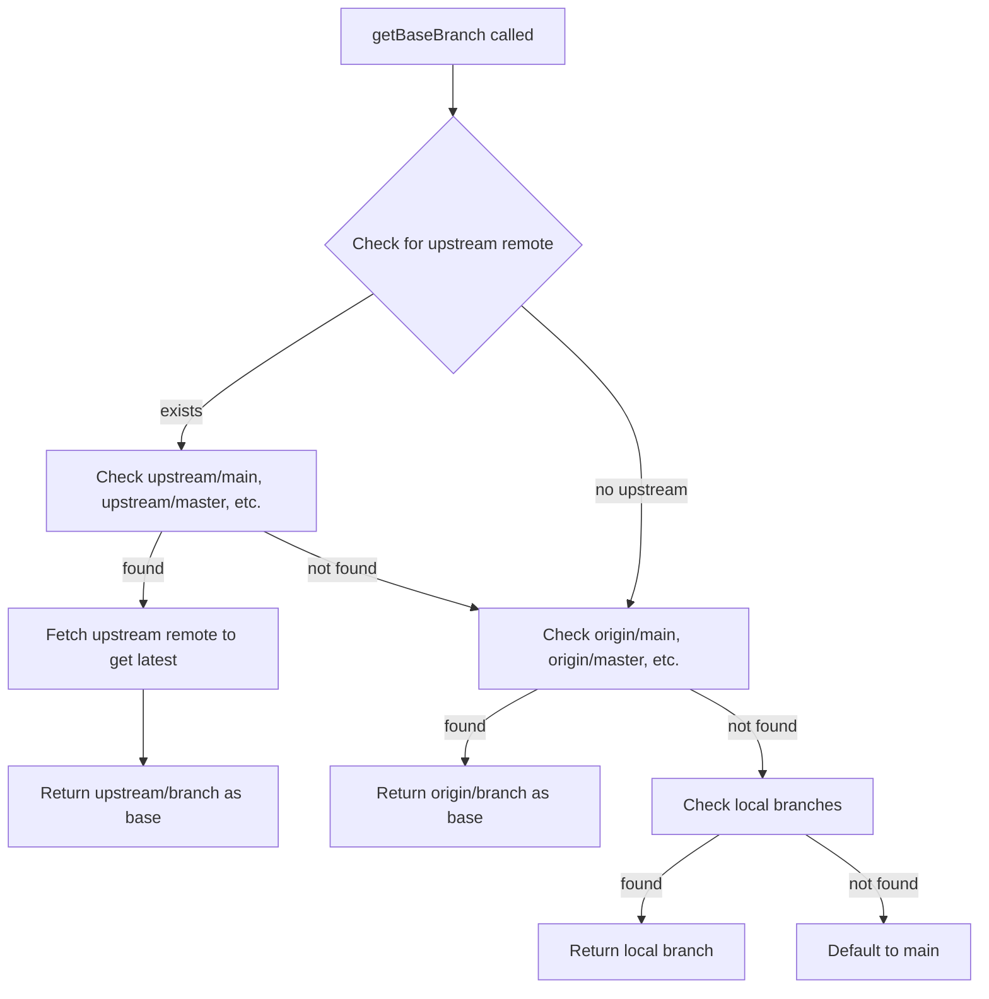

# Fork PR Review: "Review Against Base Branch" Support

## Problem Statement

When a user forks a public repo and creates a PR from their fork's `feature-A` branch against the original repo's `main` branch, the `/local-review` command fails to produce a correct diff. This is because [`getBaseBranch()`](packages/opencode/src/kilocode/review/review.ts:308) only looks for `origin/main`, `origin/master`, etc. — where `origin` is the **fork**, not the **upstream** original repo.

### Current Behavior

1. [`getBaseBranch()`](packages/opencode/src/kilocode/review/review.ts:308) checks `refs/remotes/origin/{main,master,dev,develop}` first
2. Falls back to local branches `refs/heads/{main,master,dev,develop}`
3. [`getBranchChanges()`](packages/opencode/src/kilocode/review/review.ts:382) runs `git diff <base>...HEAD`

### Why This Fails for Forks

In a fork workflow:
- `origin` = the user's fork (e.g., `github.com/user/repo`)
- `upstream` = the original repo (e.g., `github.com/org/repo`)
- `origin/main` may be stale — the user may not have synced their fork's `main` with upstream
- The PR target is `upstream/main`, but the code never checks for an `upstream` remote

### Example

```
# User's git remotes:
origin    git@github.com:user/repo.git     # their fork
upstream  git@github.com:org/repo.git      # original repo

# User is on feature-A branch
# PR is: user/repo:feature-A -> org/repo:main

# Current code does:
git diff origin/main...HEAD    # WRONG - diffs against fork's main, possibly stale

# Should do:
git diff upstream/main...HEAD  # CORRECT - diffs against the actual PR target
```

## Solution Design

### Approach: Smart Remote Detection with Upstream Priority

Enhance [`getBaseBranch()`](packages/opencode/src/kilocode/review/review.ts:308) to detect fork setups and prefer the upstream remote when available.



### Key Changes

#### 1. Detect upstream remote in [`getBaseBranch()`](packages/opencode/src/kilocode/review/review.ts:308)

Add upstream remote detection before checking `origin`. The remote priority order should be:

1. `upstream/{main,master,dev,develop}` — standard fork convention
2. `origin/{main,master,dev,develop}` — standard non-fork setup
3. Local branches — fallback
4. `main` — last resort default

#### 2. Fetch upstream before diffing in [`getBranchChanges()`](packages/opencode/src/kilocode/review/review.ts:382)

When the detected base branch is on a remote like `upstream`, we need to ensure the remote refs are up-to-date. Add a `git fetch <remote> <branch>` call before the diff when the base is a remote tracking branch.

#### 3. Handle edge cases

- **No upstream remote configured**: Fall back to current behavior with `origin`
- **Upstream remote exists but fetch fails**: Log warning, fall back to stale ref or `origin`
- **Custom remote names**: Some users name their upstream remote differently. We can detect fork relationships by checking if multiple remotes point to different URLs for the same repo path
- **User is on the base branch itself**: Current handling already covers this — diff returns empty

### Detailed Implementation Plan

#### File: [`packages/opencode/src/kilocode/review/review.ts`](packages/opencode/src/kilocode/review/review.ts)

**A. New helper: `getRemotes()`**

```typescript
async function getRemotes(): Promise<Map<string, string>> {
  const result = await $`git remote -v`
    .cwd(Instance.directory).quiet().nothrow()
  const remotes = new Map<string, string>()
  for (const line of result.stdout.toString().split("\n")) {
    const match = line.match(/^(\S+)\s+(\S+)\s+\(fetch\)$/)
    if (match) remotes.set(match[1], match[2])
  }
  return remotes
}
```

**B. Modify `getBaseBranch()` to check upstream first**

The remote priority becomes: `upstream` > `origin` > local. The candidate branch names remain `main, master, dev, develop`.

**C. New helper: `fetchRemoteBranch()`**

```typescript
async function fetchRemoteBranch(remote: string, branch: string): Promise<boolean> {
  const result = await $`git fetch ${remote} ${branch}`
    .cwd(Instance.directory).quiet().nothrow()
  return result.exitCode === 0
}
```

**D. Modify `getBranchChanges()` to fetch before diffing**

When the base branch is a remote ref like `upstream/main`, extract the remote name and branch, then fetch before running the diff.

#### File: [`packages/opencode/test/kilocode/review.test.ts`](packages/opencode/test/kilocode/review.test.ts) (new)

Add tests for:
- `parseDiff()` with various diff formats
- `getBaseBranch()` returning `upstream/main` when upstream remote exists
- `getBaseBranch()` falling back to `origin/main` when no upstream
- `getBranchChanges()` with upstream base branch

## Risk Assessment

- **Network dependency**: Fetching upstream requires network access. If offline, we fall back to the existing stale ref — this is acceptable since the user would get a slightly inaccurate diff rather than no diff
- **Performance**: Adding a `git fetch` adds latency. This is a one-time fetch per review invocation and should be fast for a single branch
- **Breaking changes**: None — this is purely additive. Existing non-fork workflows continue to work identically since they won't have an `upstream` remote

## Summary

**Yes, fork PR review can absolutely work.** The fix requires:
1. Teaching [`getBaseBranch()`](packages/opencode/src/kilocode/review/review.ts:308) to look for `upstream` remotes first
2. Fetching the upstream remote before diffing to ensure we have the latest base
3. Falling back gracefully to current behavior when no upstream exists
