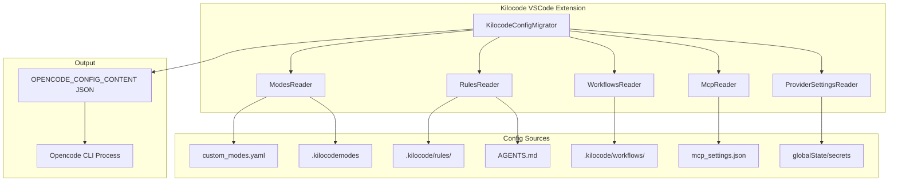

# Kilocode Config Migration to Opencode

## Overview

This document outlines the plan for migrating Kilocode's configuration system to work with Opencode's `OPENCODE_CONFIG_CONTENT` environment variable injection mechanism. The goal is to read existing Kilocode user configurations and inject them at runtime into Opencode's config system.

## Architecture



## Feature Mapping

| Kilocode Feature | Storage Location | Opencode Equivalent | Config Key |
|-----------------|------------------|---------------------|------------|
| Custom Modes | `custom_modes.yaml`, `.kilocodemodes` | Agents with `mode: primary` | `agent` |
| Global Rules | `~/.kilocode/rules/` | `instructions` array | `instructions` |
| Project Rules | `.kilocode/rules/` | `AGENTS.md` or `instructions` | `instructions` |
| Global Workflows | `~/.kilocode/workflows/` | Custom Commands | `command` |
| Project Workflows | `.kilocode/workflows/` | Custom Commands | `command` |
| MCP Servers | `mcp_settings.json` | MCP config | `mcp` |
| Provider Settings | `globalState`, `secrets` | Provider config | `provider` |
| Model Selection | `globalState` | Model config | `model` |

---

## 1. Modes Migration

### Understanding the Mode Systems

#### Kilocode Default Modes

Kilocode has 5 built-in modes defined in [`packages/types/src/mode.ts`](/Users/marius/Documents/git/kilocode/packages/types/src/mode.ts:142):

| Mode | Purpose | Groups | Opencode Equivalent |
|------|---------|--------|---------------------|
| `architect` | Planning, design, strategy | read, edit(md only), browser, mcp | **Migrate as custom agent** - useful for planning workflows |
| `code` | Write/modify code | read, edit, browser, command, mcp | **Maps to `build`** - native opencode agent |
| `ask` | Q&A, explanations | read, browser, mcp | **Migrate as custom agent** - read-only exploration |
| `debug` | Troubleshooting | read, edit, browser, command, mcp | **Migrate as custom agent** - specialized debugging |
| `orchestrator` | Coordinate subtasks | (empty) | **DO NOT MIGRATE** - opencode has native subagent support |

#### Opencode Native Agents

Opencode has built-in agents in [`packages/opencode/src/agent/agent.ts`](packages/opencode/src/agent/agent.ts:73):

| Agent | Mode | Purpose |
|-------|------|---------|
| `build` | primary | Main coding agent (equivalent to Kilocode's `code`) |
| `plan` | primary | Planning with restricted edit (only `.opencode/plans/*.md`) |
| `general` | subagent | Multi-step task execution |
| `explore` | subagent | Fast codebase exploration |
| `compaction` | primary (hidden) | Context compaction |
| `title` | primary (hidden) | Title generation |
| `summary` | primary (hidden) | Summary generation |

### Migration Strategy: Mode Classification

```typescript
// Mode migration classification
enum MigrationAction {
  SKIP_NATIVE,      // Mode maps to native opencode agent
  SKIP_REDUNDANT,   // Mode's functionality is built into opencode
  MIGRATE_PRIMARY,  // Migrate as primary agent
  MIGRATE_SUBAGENT, // Migrate as subagent
}

const DEFAULT_MODE_MIGRATION: Record<string, MigrationAction> = {
  // Kilocode default modes
  'code': MigrationAction.SKIP_NATIVE,        // Maps to opencode 'build'
  'orchestrator': MigrationAction.SKIP_REDUNDANT, // All agents can spawn subagents
  'architect': MigrationAction.MIGRATE_PRIMARY,   // Useful planning workflow
  'ask': MigrationAction.MIGRATE_PRIMARY,         // Read-only exploration mode
  'debug': MigrationAction.MIGRATE_PRIMARY,       // Specialized debugging workflow
}

function classifyMode(mode: KilocodeModeConfig): MigrationAction {
  // Check if it's a default mode with known mapping
  if (mode.slug in DEFAULT_MODE_MIGRATION) {
    return DEFAULT_MODE_MIGRATION[mode.slug]
  }
  
  // Custom modes: analyze their capabilities
  const hasEditPermission = mode.groups.some(g =>
    (typeof g === 'string' && g === 'edit') ||
    (Array.isArray(g) && g[0] === 'edit')
  )
  
  const hasCommandPermission = mode.groups.some(g =>
    typeof g === 'string' && g === 'command'
  )
  
  // If it can edit and run commands, it's a primary agent
  if (hasEditPermission && hasCommandPermission) {
    return MigrationAction.MIGRATE_PRIMARY
  }
  
  // If it's read-only or limited, could be a subagent
  if (!hasEditPermission) {
    return MigrationAction.MIGRATE_SUBAGENT
  }
  
  return MigrationAction.MIGRATE_PRIMARY
}
```

### Source Format (Kilocode)

**File: `custom_modes.yaml` or `.kilocodemodes`**

```yaml
customModes:
  - slug: translate
    name: Translate
    roleDefinition: You are Kilo Code, a linguistic specialist...
    groups:
      - read
      - - edit
        - fileRegex: ((src/i18n/locales/)|(src/package\.nls(\.\w+)?\.json))
          description: Translation files only
    customInstructions: |-
      When translating content:
      - Maintain consistent terminology...
```

### Target Format (Opencode)

**Config key: `agent`**

```json
{
  "agent": {
    "translate": {
      "mode": "primary",
      "description": "Translate - linguistic specialist",
      "prompt": "You are Kilo Code, a linguistic specialist...\n\nWhen translating content:\n- Maintain consistent terminology...",
      "permission": {
        "edit": {
          "((src/i18n/locales/)|(src/package\\.nls(\\.\w+)?\\.json))": "allow",
          "*": "deny"
        },
        "read": "allow"
      }
    }
  }
}
```

### Migration Logic

```typescript
interface KilocodeModeConfig {
  slug: string
  name: string
  roleDefinition: string
  groups: Array<string | [string, { fileRegex?: string; description?: string }]>
  customInstructions?: string
  source?: 'global' | 'project' | 'organization'
}

interface MigrationResult {
  agents: Record<string, OpencodeAgent>
  skipped: Array<{ slug: string; reason: string }>
  warnings: string[]
}

async function migrateModes(
  modes: KilocodeModeConfig[],
  options: { includeDefaults?: boolean } = {}
): Promise<MigrationResult> {
  const result: MigrationResult = {
    agents: {},
    skipped: [],
    warnings: []
  }
  
  for (const mode of modes) {
    const action = classifyMode(mode)
    
    switch (action) {
      case MigrationAction.SKIP_NATIVE:
        result.skipped.push({
          slug: mode.slug,
          reason: `Maps to native opencode agent`
        })
        break
        
      case MigrationAction.SKIP_REDUNDANT:
        result.skipped.push({
          slug: mode.slug,
          reason: `Functionality built into opencode (all agents can spawn subagents)`
        })
        break
        
      case MigrationAction.MIGRATE_PRIMARY:
      case MigrationAction.MIGRATE_SUBAGENT:
        result.agents[mode.slug] = migrateMode(mode, action)
        break
    }
  }
  
  return result
}

function migrateMode(
  mode: KilocodeModeConfig,
  action: MigrationAction
): OpencodeAgent {
  const prompt = [mode.roleDefinition, mode.customInstructions].filter(Boolean).join('\n\n')
  
  const permission: Record<string, any> = {}
  
  for (const group of mode.groups) {
    if (typeof group === 'string') {
      // Simple permission like 'read', 'browser', 'command'
      permission[mapGroupToPermission(group)] = 'allow'
    } else if (Array.isArray(group)) {
      // Complex permission with fileRegex
      const [permType, config] = group
      if (config?.fileRegex) {
        permission[permType] = {
          [config.fileRegex]: 'allow',
          '*': 'deny'
        }
      } else {
        permission[permType] = 'allow'
      }
    }
  }
  
  return {
    mode: action === MigrationAction.MIGRATE_PRIMARY ? 'primary' : 'subagent',
    description: `${mode.name} - ${mode.roleDefinition.slice(0, 50)}...`,
    prompt,
    permission
  }
}

function mapGroupToPermission(group: string): string {
  const mapping: Record<string, string> = {
    'read': 'read',
    'edit': 'edit',
    'browser': 'bash', // Browser actions run via bash
    'command': 'bash',
    'mcp': 'mcp'
  }
  return mapping[group] || group
}
```

### Recommended Migration for Default Modes

| Kilocode Mode | Recommendation | Rationale |
|---------------|----------------|-----------|
| `code` | **Skip** | Identical to opencode's `build` agent |
| `orchestrator` | **Skip** | Redundant - opencode's `task` tool lets any agent spawn subagents via `general` or `explore` |
| `architect` | **Migrate** | Useful planning workflow with markdown-only editing |
| `ask` | **Migrate** | Read-only mode useful for exploration without changes |
| `debug` | **Migrate** | Specialized debugging workflow with logging focus |

### Configuration Option

Allow users to control which default modes to migrate:

```typescript
interface ModesMigrationConfig {
  // Skip all default modes (only migrate custom modes)
  skipDefaultModes?: boolean
  
  // Explicitly include/exclude specific modes
  include?: string[]
  exclude?: string[]
  
  // Map kilocode modes to existing opencode agents
  mappings?: Record<string, string>
}

// Example config
const config: ModesMigrationConfig = {
  skipDefaultModes: false,
  exclude: ['code', 'orchestrator'], // These are redundant
  mappings: {
    'code': 'build' // If someone references 'code', use 'build'
  }
}
```

### Challenges

1. **File Regex Permissions**: Kilocode uses `fileRegex` for fine-grained file access. Opencode uses glob patterns in permission rules.
2. **Group Mapping**: Kilocode's `groups` concept needs mapping to Opencode's `permission` object.
3. **Organization Modes**: Modes with `source: organization` should be preserved separately.
4. **Orchestrator Redundancy**: Kilocode's orchestrator mode is redundant since opencode's `task` tool provides native subagent spawning.
5. **Mode References**: If user workflows reference `code` mode, need to map to `build` agent.

---

## 2. Rules Migration

### Source Format (Kilocode)

**Global Rules**: `~/.kilocode/rules/*.md`
**Project Rules**: `.kilocode/rules/*.md`

Rules are markdown files with custom instructions that get injected into the system prompt.

### Target Format (Opencode)

**Option A: Use `instructions` array**

```json
{
  "instructions": [
    "~/.kilocode/rules/coding-standards.md",
    ".kilocode/rules/project-specific.md"
  ]
}
```

**Option B: Inline in config**

For rules that need to be injected directly, we can use the `AGENTS.md` convention or inline them in agent prompts.

### Migration Logic

```typescript
async function migrateRules(
  globalRulesDir: string,
  projectRulesDir: string,
  toggles: Record<string, boolean>
): Promise<string[]> {
  const instructions: string[] = []
  
  // Read global rules
  const globalRules = await readRulesDirectory(globalRulesDir)
  for (const rule of globalRules) {
    if (toggles[rule.path] !== false) {
      instructions.push(rule.path)
    }
  }
  
  // Read project rules
  const projectRules = await readRulesDirectory(projectRulesDir)
  for (const rule of projectRules) {
    if (toggles[rule.path] !== false) {
      instructions.push(rule.path)
    }
  }
  
  return instructions
}
```

### Challenges

1. **Toggle State**: Kilocode stores rule toggle state in `globalState`/`workspaceState`. Need to respect enabled/disabled rules.
2. **Path Resolution**: Opencode supports `~/` paths and relative paths differently.

---

## 3. Workflows Migration to Custom Commands

### Source Format (Kilocode)

**Global Workflows**: `~/.kilocode/workflows/*.md`
**Project Workflows**: `.kilocode/workflows/*.md`

Workflows are markdown files that define reusable task templates.

### Target Format (Opencode)

**Config key: `command`**

Opencode uses custom slash commands defined in `.opencode/command/*.md`:

```markdown
---
description: git commit and push
model: opencode/glm-4.7
subtask: true
---

commit and push

make sure it includes a prefix like
docs:
tui:
...
```

### Migration Strategy

Since Opencode commands are file-based, we have two options:

**Option A: Generate command files at runtime**

Create temporary `.opencode/command/` files from Kilocode workflows.

**Option B: Inline commands in config**

```json
{
  "command": {
    "my-workflow": {
      "template": "Content of the workflow markdown...",
      "description": "My custom workflow",
      "subtask": true
    }
  }
}
```

### Migration Logic

```typescript
interface KilocodeWorkflow {
  path: string
  content: string
  name: string
}

function migrateWorkflow(workflow: KilocodeWorkflow): OpencodeCommand {
  // Parse frontmatter if present
  const { frontmatter, content } = parseFrontmatter(workflow.content)
  
  return {
    template: content.trim(),
    description: frontmatter?.description || workflow.name,
    subtask: frontmatter?.subtask ?? false,
    model: frontmatter?.model,
    agent: frontmatter?.agent
  }
}
```

### Challenges

1. **Frontmatter Compatibility**: Kilocode workflows may not have the same frontmatter structure as Opencode commands.
2. **Toggle State**: Need to respect workflow toggle state from `globalState`/`workspaceState`.

---

## 4. MCP Server Migration

### Source Format (Kilocode)

**File: `~/.kilocode-agent/settings/mcp_settings.json`**

```json
{
  "mcpServers": {
    "schaltwerk": {
      "command": "node",
      "args": ["/path/to/mcp-server.js"],
      "env": {
        "SOME_VAR": "value"
      },
      "disabled": false
    }
  }
}
```

### Target Format (Opencode)

**Config key: `mcp`**

```json
{
  "mcp": {
    "schaltwerk": {
      "type": "local",
      "command": ["node", "/path/to/mcp-server.js"],
      "environment": {
        "SOME_VAR": "value"
      },
      "enabled": true
    }
  }
}
```

### Migration Logic

```typescript
interface KilocodeMcpServer {
  command: string
  args?: string[]
  env?: Record<string, string>
  disabled?: boolean
  url?: string // For remote servers
}

function migrateMcpServer(
  name: string, 
  server: KilocodeMcpServer
): OpencodeLocalMcp | OpencodeRemoteMcp {
  if (server.url) {
    return {
      type: 'remote',
      url: server.url,
      enabled: !server.disabled
    }
  }
  
  return {
    type: 'local',
    command: [server.command, ...(server.args || [])],
    environment: server.env,
    enabled: !server.disabled
  }
}
```

### Challenges

1. **Server State**: MCP servers may have runtime state that needs to be preserved.
2. **OAuth Tokens**: Remote MCP servers with OAuth need token migration.
3. **Project vs Global**: Need to merge project-level and global MCP configs.

---

## 5. Provider Settings Migration

### Source Format (Kilocode)

Provider settings are stored in VSCode's `globalState` and `secrets`:

```typescript
// From ProviderSettingsManager
interface ProviderProfiles {
  currentApiConfigName: string
  apiConfigs: Record<string, ProviderSettingsWithId>
  modeApiConfigs?: Record<string, string>
}

interface ProviderSettingsWithId {
  id: string
  apiProvider?: string
  apiModelId?: string
  apiKey?: string // Stored in secrets
  // ... many more fields
}
```

### Target Format (Opencode)

**Config keys: `provider`, `model`**

```json
{
  "model": "anthropic/claude-sonnet-4-20250514",
  "provider": {
    "anthropic": {
      "options": {
        "apiKey": "{env:ANTHROPIC_API_KEY}"
      }
    },
    "openrouter": {
      "options": {
        "apiKey": "{env:OPENROUTER_API_KEY}"
      }
    }
  }
}
```

### Migration Strategy

Since API keys should not be passed via `OPENCODE_CONFIG_CONTENT` for security reasons, we should:

1. Set API keys as environment variables before spawning Opencode
2. Reference them in config using `{env:VAR_NAME}` syntax

```typescript
interface MigrationResult {
  config: OpencodeConfig
  envVars: Record<string, string>
}

async function migrateProviderSettings(
  context: vscode.ExtensionContext,
  manager: ProviderSettingsManager
): Promise<MigrationResult> {
  const profiles = await manager.getProviderProfiles()
  const activeProfile = profiles.apiConfigs[profiles.currentApiConfigName]
  
  const envVars: Record<string, string> = {}
  const provider: Record<string, any> = {}
  
  if (activeProfile.apiKey) {
    const envKey = `KILOCODE_${activeProfile.apiProvider?.toUpperCase()}_API_KEY`
    envVars[envKey] = activeProfile.apiKey
    
    provider[activeProfile.apiProvider!] = {
      options: {
        apiKey: `{env:${envKey}}`
      }
    }
  }
  
  return {
    config: {
      model: `${activeProfile.apiProvider}/${activeProfile.apiModelId}`,
      provider
    },
    envVars
  }
}
```

### Challenges

1. **Multiple Profiles**: Kilocode supports multiple provider profiles per mode.
2. **Secret Storage**: API keys are in VSCode secrets, need secure handling.
3. **Mode-specific Models**: Different modes may use different models.

---

## 6. Component Architecture

### KilocodeConfigMigrator

```typescript
// packages/opencode/src/kilocode/config-migrator.ts

export namespace KilocodeConfigMigrator {
  export interface MigrationResult {
    config: Config.Info
    envVars: Record<string, string>
    warnings: string[]
  }
  
  export interface MigrationOptions {
    kilocodeDir: string        // Path to kilocode installation
    globalSettingsDir: string  // ~/.kilocode-agent/settings
    projectDir: string         // Current workspace
    context?: {
      globalState: Record<string, any>
      workspaceState: Record<string, any>
      secrets: Record<string, string>
    }
  }
  
  export async function migrate(options: MigrationOptions): Promise<MigrationResult> {
    const warnings: string[] = []
    const envVars: Record<string, string> = {}
    
    // 1. Migrate modes
    const agents = await migrateModes(options)
    
    // 2. Migrate rules
    const instructions = await migrateRules(options)
    
    // 3. Migrate workflows
    const commands = await migrateWorkflows(options)
    
    // 4. Migrate MCP servers
    const mcp = await migrateMcpServers(options)
    
    // 5. Migrate provider settings
    const { provider, model, envVars: providerEnvVars } = await migrateProviderSettings(options)
    Object.assign(envVars, providerEnvVars)
    
    return {
      config: {
        agent: agents,
        instructions,
        command: commands,
        mcp,
        provider,
        model
      },
      envVars,
      warnings
    }
  }
  
  // Individual migration functions...
  async function migrateModes(options: MigrationOptions): Promise<Record<string, Config.Agent>> { ... }
  async function migrateRules(options: MigrationOptions): Promise<string[]> { ... }
  async function migrateWorkflows(options: MigrationOptions): Promise<Record<string, Config.Command>> { ... }
  async function migrateMcpServers(options: MigrationOptions): Promise<Record<string, Config.Mcp>> { ... }
  async function migrateProviderSettings(options: MigrationOptions): Promise<ProviderMigrationResult> { ... }
}
```

### Integration Point

The migrator should be called when spawning an Opencode CLI process:

```typescript
// In the agent spawning code
async function spawnOpencodeAgent(options: SpawnOptions) {
  // Migrate kilocode config
  const migration = await KilocodeConfigMigrator.migrate({
    kilocodeDir: getKilocodeDir(),
    globalSettingsDir: getGlobalSettingsDir(),
    projectDir: options.workingDirectory,
    context: {
      globalState: await getGlobalState(),
      workspaceState: await getWorkspaceState(),
      secrets: await getSecrets()
    }
  })
  
  // Spawn with injected config
  const proc = spawn('opencode', args, {
    env: {
      ...process.env,
      ...migration.envVars,
      OPENCODE_CONFIG_CONTENT: JSON.stringify(migration.config)
    }
  })
}
```

---

## 7. Isolation Strategy

To ensure the migration component can be easily removed later:

### File Organization

```
packages/opencode/src/kilocode/
├── config-migrator.ts       # Main migration orchestrator
├── modes-migrator.ts        # Modes → Agents migration
├── rules-migrator.ts        # Rules → Instructions migration
├── workflows-migrator.ts    # Workflows → Commands migration
├── mcp-migrator.ts          # MCP server migration
├── provider-migrator.ts     # Provider settings migration
├── types.ts                 # Kilocode-specific types
└── index.ts                 # Public exports
```

### Marker Comments

All kilocode-specific code should be marked:

```typescript
// kilocode_change - new file
// This entire file is kilocode-specific and can be removed
// when migrating away from kilocode config format
```

### Feature Flag

Add a flag to disable migration:

```typescript
// In Flag namespace
export const KILOCODE_CONFIG_MIGRATION = truthy("KILOCODE_CONFIG_MIGRATION") ?? true
```

### Clean Removal Path

When ready to remove:

1. Delete `packages/opencode/src/kilocode/` directory
2. Remove `KILOCODE_CONFIG_MIGRATION` flag
3. Remove migration call from agent spawning code
4. Search for `kilocode_change` markers and clean up

---

## 8. Implementation Order

1. **Phase 1: Core Infrastructure**
   - Create `KilocodeConfigMigrator` namespace
   - Implement basic config merging with `OPENCODE_CONFIG_CONTENT`
   - Add feature flag

2. **Phase 2: Modes Migration**
   - Implement modes reader
   - Implement permission mapping
   - Handle organization modes

3. **Phase 3: Rules Migration**
   - Implement rules directory reader
   - Handle toggle state
   - Map to instructions array

4. **Phase 4: Workflows Migration**
   - Implement workflows reader
   - Convert to command format
   - Handle toggle state

5. **Phase 5: MCP Migration**
   - Implement MCP settings reader
   - Handle local vs remote servers
   - Merge project and global configs

6. **Phase 6: Provider Settings**
   - Implement secure API key handling
   - Map provider profiles to opencode format
   - Handle mode-specific models

7. **Phase 7: Testing & Validation**
   - Unit tests for each migrator
   - Integration tests with real configs
   - Migration validation tooling

---

## 9. Open Questions

1. **Mode-specific API configs**: Kilocode allows different API configurations per mode. How should this map to Opencode's agent system?

2. **Toggle State Persistence**: Should we read toggle state from VSCode's globalState/workspaceState, or should users re-configure in Opencode?

3. **Incremental Migration**: Should we support partial migration (e.g., only modes, not MCP)?

4. **Conflict Resolution**: When both Kilocode and Opencode configs exist, which takes precedence?

5. **OAuth Token Migration**: How do we handle MCP OAuth tokens stored in VSCode secrets?

---

## 10. References

- [Opencode Config Documentation](https://opencode.ai/docs/config)
- [Opencode Agents Documentation](https://opencode.ai/docs/agents)
- [Opencode Commands Documentation](https://opencode.ai/docs/commands)
- Kilocode source: `/Users/marius/Documents/git/kilocode`
- Opencode source: `packages/opencode/src/config/config.ts`
