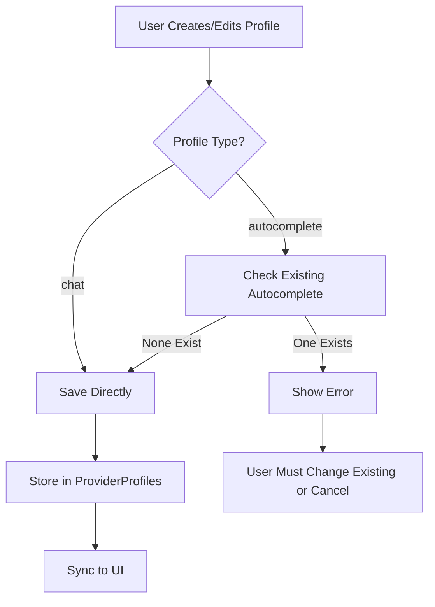

# Profile Type System Specification

## Overview

This specification defines the design for adding a `profileType` field to provider configurations to distinguish between different uses (chat vs autocomplete).

## Current State Analysis

### Type Definitions Location

- **Primary Type**: [`ProviderSettingsEntry`](packages/types/src/provider-settings.ts:170-177) in `packages/types/src/provider-settings.ts`
- **Full Settings**: [`ProviderSettings`](packages/types/src/provider-settings.ts:590) in same file
- **Usage**: Used throughout the codebase for profile management, particularly in:
    - [`ProviderSettingsManager`](src/core/config/ProviderSettingsManager.ts:362) for listing/managing profiles
    - [`GhostModel`](src/services/ghost/GhostModel.ts:56) for autocomplete provider selection
    - UI components for profile selection

### Current Schema Structure

```typescript
// ProviderSettingsEntry (metadata only)
export const providerSettingsEntrySchema = z.object({
	id: z.string(),
	name: z.string(),
	apiProvider: providerNamesSchema.optional(),
	modelId: z.string().optional(),
})

// ProviderSettings (full configuration)
export const providerSettingsSchema = z.object({
	apiProvider: providerNamesSchema.optional(),
	// ... all provider-specific fields
})
```

## Design Specification

### 1. Type System Design

#### Profile Type Enum

```typescript
// In packages/types/src/provider-settings.ts

export const profileTypes = ["chat", "autocomplete"] as const
export const profileTypeSchema = z.enum(profileTypes)
export type ProfileType = z.infer<typeof profileTypeSchema>

// Default value constant
export const DEFAULT_PROFILE_TYPE: ProfileType = "chat"
```

**Rationale**: Using `as const` with array makes it easy to add new types in the future while maintaining type safety.

#### Schema Updates

**ProviderSettingsEntry** (add to line ~170):

```typescript
export const providerSettingsEntrySchema = z.object({
	id: z.string(),
	name: z.string(),
	apiProvider: providerNamesSchema.optional(),
	modelId: z.string().optional(),
	profileType: profileTypeSchema.optional().default("chat"), // NEW
})
```

**ProviderSettings** (add to baseProviderSettingsSchema around line ~183):

```typescript
const baseProviderSettingsSchema = z.object({
	profileType: profileTypeSchema.optional().default("chat"), // NEW
	includeMaxTokens: z.boolean().optional(),
	// ... rest of fields
})
```

### 2. Constraint Enforcement

#### Single Autocomplete Profile Constraint

**Location**: [`ProviderSettingsManager`](src/core/config/ProviderSettingsManager.ts)

**Implementation Strategy**:

1. Add validation method to check autocomplete profile count
2. Enforce in `saveConfig()` method before saving
3. Provide clear error messages

**Code Addition** (around line ~380):

```typescript
/**
 * Validate that only one autocomplete profile exists
 */
private async validateAutocompleteConstraint(
  profiles: ProviderProfiles,
  newProfileName: string,
  newProfileType?: ProfileType
): Promise<void> {
  if (newProfileType !== "autocomplete") {
    return // No constraint for non-autocomplete profiles
  }

  const autocompleteProfiles = Object.entries(profiles.apiConfigs)
    .filter(([name, config]) =>
      config.profileType === "autocomplete" && name !== newProfileName
    )

  if (autocompleteProfiles.length > 0) {
    const existingName = autocompleteProfiles[0][0]
    throw new Error(
      `Only one autocomplete profile is allowed. ` +
      `Profile "${existingName}" is already configured for autocomplete. ` +
      `Please change its type first or delete it.`
    )
  }
}
```

**Integration in saveConfig()** (around line ~384):

```typescript
public async saveConfig(name: string, config: ProviderSettingsWithId): Promise<string> {
  try {
    return await this.lock(async () => {
      const providerProfiles = await this.load()

      // NEW: Validate autocomplete constraint
      await this.validateAutocompleteConstraint(
        providerProfiles,
        name,
        config.profileType
      )

      // ... rest of existing logic
    })
  } catch (error) {
    throw new Error(`Failed to save config: ${error}`)
  }
}
```

### 3. Backward Compatibility Strategy

#### Migration Approach

**Location**: [`ProviderSettingsManager.initialize()`](src/core/config/ProviderSettingsManager.ts:102)

**Add New Migration** (around line ~180):

```typescript
if (!providerProfiles.migrations.profileTypeMigrated) {
	await this.migrateProfileType(providerProfiles)
	providerProfiles.migrations.profileTypeMigrated = true
	isDirty = true
}
```

**Migration Method** (add around line ~305):

```typescript
/**
 * Migrate existing profiles to have profileType field defaulting to "chat"
 */
private async migrateProfileType(providerProfiles: ProviderProfiles) {
  try {
    for (const [name, apiConfig] of Object.entries(providerProfiles.apiConfigs)) {
      if (apiConfig.profileType === undefined) {
        apiConfig.profileType = "chat" // Default to chat for existing profiles
      }
    }
  } catch (error) {
    console.error(`[MigrateProfileType] Failed to migrate profile type:`, error)
  }
}
```

**Update Migration Schema** (around line ~43):

```typescript
migrations: z
  .object({
    rateLimitSecondsMigrated: z.boolean().optional(),
    diffSettingsMigrated: z.boolean().optional(),
    openAiHeadersMigrated: z.boolean().optional(),
    consecutiveMistakeLimitMigrated: z.boolean().optional(),
    todoListEnabledMigrated: z.boolean().optional(),
    morphApiKeyMigrated: z.boolean().optional(),
    profileTypeMigrated: z.boolean().optional(), // NEW
  })
  .optional(),
```

**Update Default Profiles** (around line ~69):

```typescript
private readonly defaultProviderProfiles: ProviderProfiles = {
  currentApiConfigName: "default",
  apiConfigs: { default: { id: this.defaultConfigId } },
  modeApiConfigs: this.defaultModeApiConfigs,
  migrations: {
    rateLimitSecondsMigrated: true,
    diffSettingsMigrated: true,
    openAiHeadersMigrated: true,
    consecutiveMistakeLimitMigrated: true,
    todoListEnabledMigrated: true,
    profileTypeMigrated: true, // NEW
  },
}
```

### 4. Usage Integration

#### Autocomplete Profile Selection

**Location**: [`GhostModel`](src/services/ghost/GhostModel.ts) or autocomplete service

**Filter Logic**:

```typescript
// When selecting autocomplete profile
const autocompleteProfiles = allProfiles.filter((profile) => profile.profileType === "autocomplete")

if (autocompleteProfiles.length === 0) {
	// Fall back to chat profiles or show warning
}
```

#### UI Integration Points

**Profile List Display**:

- Show profile type badge/indicator in profile lists
- Filter profiles by type in relevant UI contexts
- Prevent type changes that would violate constraints

**Profile Creation/Edit**:

- Add profile type selector (radio buttons or dropdown)
- Show warning when trying to create second autocomplete profile
- Validate on save

### 5. Data Flow Diagram



### 6. Testing Requirements

#### Unit Tests

**File**: `src/core/config/__tests__/ProviderSettingsManager.spec.ts`

Test cases needed:

1. ✅ Default profile type is "chat" for new profiles
2. ✅ Existing profiles without profileType migrate to "chat"
3. ✅ Can create one autocomplete profile
4. ✅ Cannot create second autocomplete profile
5. ✅ Can change autocomplete profile to chat
6. ✅ Can change chat profile to autocomplete (if none exist)
7. ✅ Cannot change chat to autocomplete if one already exists
8. ✅ Deleting autocomplete profile allows creating new one
9. ✅ Profile type persists through save/load cycle
10. ✅ listConfig() includes profileType in results

#### Integration Tests

**File**: `src/services/ghost/__tests__/GhostModel.spec.ts`

Test cases needed:

1. ✅ Autocomplete uses profiles with profileType="autocomplete"
2. ✅ Falls back appropriately when no autocomplete profiles exist
3. ✅ Respects profile type when selecting provider

### 7. Implementation Checklist

#### Phase 1: Type System Foundation

- [ ] Add `profileTypes`, `profileTypeSchema`, `ProfileType` to provider-settings.ts
- [ ] Add `DEFAULT_PROFILE_TYPE` constant
- [ ] Update `providerSettingsEntrySchema` with profileType field
- [ ] Update `baseProviderSettingsSchema` with profileType field
- [ ] Export new types and schemas

#### Phase 2: Migration & Backward Compatibility

- [ ] Add `profileTypeMigrated` to migrations schema
- [ ] Implement `migrateProfileType()` method
- [ ] Add migration call in `initialize()`
- [ ] Update default profiles to include migration flag
- [ ] Test migration with existing data

#### Phase 3: Constraint Enforcement

- [ ] Implement `validateAutocompleteConstraint()` method
- [ ] Integrate validation in `saveConfig()`
- [ ] Add validation in profile update flows
- [ ] Test constraint enforcement

#### Phase 4: Usage Integration

- [ ] Update autocomplete profile selection logic
- [ ] Add profile type filtering utilities
- [ ] Update UI components to display profile type
- [ ] Add profile type selector in create/edit UI

#### Phase 5: Testing

- [ ] Write unit tests for ProviderSettingsManager
- [ ] Write integration tests for autocomplete
- [ ] Test migration scenarios
- [ ] Test constraint enforcement
- [ ] Test UI interactions

#### Phase 6: Documentation

- [ ] Update API documentation
- [ ] Add migration notes
- [ ] Document constraint behavior
- [ ] Update user-facing documentation

## Key Design Decisions

### 1. Why Optional with Default?

Using `.optional().default("chat")` ensures:

- Existing profiles without the field work seamlessly
- New profiles automatically get "chat" type
- Explicit type safety in TypeScript
- Clear default behavior

### 2. Why Validate in saveConfig()?

- Single point of enforcement
- Catches all profile creation/update paths
- Clear error messages at save time
- Prevents invalid state from being stored

### 3. Why Migration Instead of Runtime Default?

- Ensures data consistency
- One-time cost
- Explicit in stored data
- Easier to debug and reason about

### 4. Extensibility Considerations

The design supports future profile types by:

- Using array-based enum definition
- Constraint validation is type-agnostic
- UI can be extended with new type options
- No hardcoded assumptions beyond autocomplete constraint

## Potential Future Enhancements

1. **Multiple Autocomplete Profiles**: If needed, could add profile priority/selection logic
2. **Profile Type-Specific Settings**: Different fields based on profile type
3. **Profile Type Inheritance**: Base profiles with type-specific overrides
4. **Profile Type Validation**: Type-specific validation rules
5. **Profile Type Analytics**: Track usage by profile type

## Risk Mitigation

### Data Loss Prevention

- Migration runs automatically on first load
- Validation prevents invalid states
- Lock mechanism prevents race conditions
- Comprehensive error handling

### User Experience

- Clear error messages for constraint violations
- Graceful fallbacks for missing autocomplete profiles
- Visual indicators for profile types
- Guided profile creation flow

### Performance

- Minimal overhead (single field addition)
- Validation only on save operations
- Migration runs once per installation
- No impact on read operations
