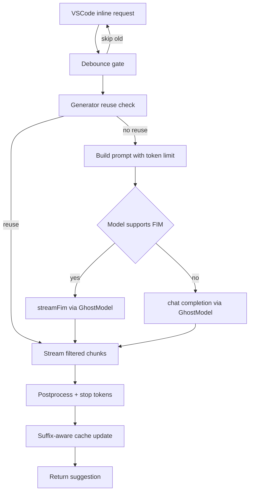

# Autocomplete Consolidation Review

Decision: Use Classic as base (Option A), port continue-based concurrency, token pruning, FIM templating, and postprocessing while keeping centralized LLM plumbing and cost tracking.

Rationale highlights:

- Classic is already integrated with GhostModel and the shared ApiHandler layer for telemetry, headers, cost, and model routing; see [GhostModel](src/services/ghost/GhostModel.ts:8) and its streaming call [GhostModel.generateResponse()](src/services/ghost/GhostModel.ts:56).
- The classic entrypoint is smaller and more maintainable, and it already consumes Continue context services via [GhostContextProvider](src/services/ghost/classic-auto-complete/GhostContextProvider.ts:13).
- We can selectively port proven Continue features (debounce, generator reuse, token-aware prompt pruning, postprocessing) without importing the entire Continue provider stack.
- New provider adds complexity and parallel LLM adapters. The brief explicitly prefers centralizing LLM calls with the rest of the extension.

Base selection: Classic as foundation, with targeted ports from Continue.

1. Codestral Prompt Format

Findings:

- Classic crafts XML-tag completions and parses <COMPLETION> markup; see [getBaseSystemInstructions()](src/services/ghost/classic-auto-complete/HoleFiller.ts:10) and [parseGhostResponse()](src/services/ghost/classic-auto-complete/HoleFiller.ts:112).
- Continue uses Codestral-style FIM templates with prefix/suffix markers; see [codestralMultifileFimTemplate](src/services/continuedev/core/autocomplete/templating/AutocompleteTemplate.ts:87) and stop tokens.
- The KiloCode OpenRouter handler exposes native FIM streaming and feature flags; see [KilocodeOpenrouterHandler.supportsFim()](src/api/providers/kilocode-openrouter.ts:134) and [KilocodeOpenrouterHandler.streamFim()](src/api/providers/kilocode-openrouter.ts:147).

Recommendation:

- Prefer native FIM for Codestral models: construct prompts with [codestralMultifileFimTemplate](src/services/continuedev/core/autocomplete/templating/AutocompleteTemplate.ts:87) and call streamFim when [supportsFim()](src/api/providers/kilocode-openrouter.ts:134) is true.
- Fallback to chat-completion only for models or routers without FIM; retain classic XML parsing path for that fallback.
- Keep Continue’s multifile header formatting in FIM mode to inject nearby context with file separators; see [codestralMultifileFimTemplate.compilePrefixSuffix](src/services/continuedev/core/autocomplete/templating/AutocompleteTemplate.ts:88).

Impact:

- Correctness improves by matching Codestral’s training format; expected quality-up and potential token savings due to reduced instruction overhead.
- Latency: FIM often yields earlier first tokens. Maintain stop tokens per template.

2. Caching Strategy

Observations:

- Classic caches last N suggestions keyed by exact prefix/suffix and typed-prefix advancement; see [findMatchingSuggestion()](src/services/ghost/classic-auto-complete/GhostInlineCompletionProvider.ts:30).
- Continue uses an in-memory LRU with fuzzy longest-prefix match on pruned prefix only; see [AutocompleteLruCacheInMem.get()](src/services/continuedev/core/autocomplete/util/AutocompleteLruCacheInMem.ts:36).
- Continue’s provider additionally reuses active generators to avoid new calls while typing; see [GeneratorReuseManager.getGenerator()](src/services/continuedev/core/autocomplete/generation/GeneratorReuseManager.ts:31).

Guidance:

- Keep classic’s suffix-aware cache to avoid stale completions after backspace or suffix edits.
- Add a small prefix-only LRU as a secondary tier for rapid repeated patterns in the same session; reuse Continue’s [AutocompleteLruCacheInMem.put()](src/services/continuedev/core/autocomplete/util/AutocompleteLruCacheInMem.ts:73) with validation against current suffix before use.
- Rely primarily on generator reuse and debouncing to reduce cache dependence.

Cost/benefit:

- Suffix-awareness materially improves Scenario 2 (Backspace Correction).
- Memory footprint is small (<=100 entries). Complexity low.

3. Concurrent Request Handling

Observations:

- Classic uses a manual cancellation flag polled during streaming; see [GhostInlineCompletionProvider.cancelRequest()](src/services/ghost/classic-auto-complete/GhostInlineCompletionProvider.ts:235).
- Continue composes: debouncing ([AutocompleteDebouncer.delayAndShouldDebounce()](src/services/continuedev/core/autocomplete/util/AutocompleteDebouncer.ts:7)), AbortController propagation and generator reuse ([CompletionStreamer.streamCompletionWithFilters()](src/services/continuedev/core/autocomplete/generation/CompletionStreamer.ts:16), [GeneratorReuseManager](src/services/continuedev/core/autocomplete/generation/GeneratorReuseManager.ts:3)).

Recommendation:

- Port debouncing to fire after ~100–150ms of idle by default; expose a setting. Use [AutocompleteDebouncer](src/services/continuedev/core/autocomplete/util/AutocompleteDebouncer.ts:1).
- Port generator reuse to avoid reissuing when typed characters match the head of the pending completion; see [GeneratorReuseManager.shouldReuseExistingGenerator()](src/services/continuedev/core/autocomplete/generation/GeneratorReuseManager.ts:21).
- Plumb AbortController down into the HTTP layer so network calls are actually cancelled. The OpenRouter/KiloCode FIM path can support this by threading an abort signal into fetch; see [KilocodeOpenrouterHandler.streamFim()](src/api/providers/kilocode-openrouter.ts:147).

Expected outcomes:

- Scenario 1 (Rapid Typing): 1–2 API calls for 10–15 keypress bursts.
- Cost savings from fewer wasted tokens; improved UX due to lower in-flight contention.

4. Token Management

Observations:

- Classic builds user prompts with optional context but no explicit context-window control; see [HoleFiller.getUserPrompt()](src/services/ghost/classic-auto-complete/HoleFiller.ts:165).
- Continue computes stop tokens, formats multifile snippets, and prunes proportionally within context length; see [renderPromptWithTokenLimit()](src/services/continuedev/core/autocomplete/templating/index.ts:140).

Recommendation:

- Use Continue’s [renderPromptWithTokenLimit()](src/services/continuedev/core/autocomplete/templating/index.ts:140) to prune prefix/suffix based on model.contextLength and reserved completion tokens.
- Ensure Codestral FIM stop tokens from the template are applied; see [getStopTokens()](src/services/continuedev/core/autocomplete/templating/index.ts:90).

Impact:

- Scenario 4 (Large Files): Avoids server-side truncation or errors; keeps nearest code prioritized.

5. Filtering and Quality

Observations:

- Classic has a minimal heuristic filter; see [refuseUselessSuggestion()](src/services/ghost/classic-auto-complete/uselessSuggestionFilter.ts:9).
- Continue has multi-stage postprocessing and model-specific fixes; see [postprocessCompletion()](src/services/continuedev/core/autocomplete/postprocessing/index.ts:90), including Codestral whitespace/newline handling at [121–135](src/services/continuedev/core/autocomplete/postprocessing/index.ts:121).

Recommendation:

- Keep the simple anti-duplication check but add Continue’s postprocessing stage to normalize Codestral quirks and collapse low-signal completions (blank, whitespace, extreme repetition).
- Run postprocessing before final cache insert and acceptance gating.

Expected result:

- Higher acceptance rate and fewer visually noisy suggestions (Scenario 5).

6. Code Complexity vs. Feature Value

Assessment:

- New provider brings substantial plumbing (stream transforms, status bars, NextEdit scaffolding) that is orthogonal to core autocomplete.
- Classic is ~400 LOC in provider/prompting but already leverages Continue’s context subsystem where it matters.

Strategy:

- Do not wholesale adopt Continue’s provider; instead, selectively integrate the small, high-value modules: [AutocompleteDebouncer](src/services/continuedev/core/autocomplete/util/AutocompleteDebouncer.ts:1), [GeneratorReuseManager](src/services/continuedev/core/autocomplete/generation/GeneratorReuseManager.ts:1), [renderPromptWithTokenLimit](src/services/continuedev/core/autocomplete/templating/index.ts:140), [codestralMultifileFimTemplate](src/services/continuedev/core/autocomplete/templating/AutocompleteTemplate.ts:87), and [postprocessCompletion](src/services/continuedev/core/autocomplete/postprocessing/index.ts:90).
- Keep all LLM invocations centralized through [GhostModel](src/services/ghost/GhostModel.ts:56) and the shared ApiHandler layer.

7. Feature Gap Analysis

Unique to Classic worth keeping/porting into the merged solution:

- Suffix-aware typed-advancement cache for backspace and mid-line edits: [findMatchingSuggestion()](src/services/ghost/classic-auto-complete/GhostInlineCompletionProvider.ts:30). Priority: Critical.
- Centralized cost tracking and usage accounting via ApiHandler: [GhostModel.generateResponse()](src/services/ghost/GhostModel.ts:56). Priority: Critical.

Unique to Continue to port:

- Debouncing: [AutocompleteDebouncer.delayAndShouldDebounce()](src/services/continuedev/core/autocomplete/util/AutocompleteDebouncer.ts:7). Priority: Critical.
- Generator reuse: [GeneratorReuseManager.getGenerator()](src/services/continuedev/core/autocomplete/generation/GeneratorReuseManager.ts:31). Priority: Important.
- Token-aware pruning: [renderPromptWithTokenLimit()](src/services/continuedev/core/autocomplete/templating/index.ts:140). Priority: Critical.
- Codestral FIM templating + stop tokens: [codestralMultifileFimTemplate](src/services/continuedev/core/autocomplete/templating/AutocompleteTemplate.ts:87). Priority: Critical.
- Postprocessing (model-specific fixes, repetition trimming): [postprocessCompletion()](src/services/continuedev/core/autocomplete/postprocessing/index.ts:90). Priority: Important.
- Optional LRU cache for repeated patterns: [AutocompleteLruCacheInMem](src/services/continuedev/core/autocomplete/util/AutocompleteLruCacheInMem.ts:22). Priority: Nice-to-have.

Features to skip (for now):

- Continue’s full NextEdit/StatusBar/Jump/prefetch stack from [ContinueCompletionProvider](src/services/continuedev/core/vscode-test-harness/src/autocomplete/completionProvider.ts:1). Priority: Skip for merge; orthogonal to tab completions.

8. Porting Effort Estimates

Legend: Easy (0.5–1 day), Medium (1–2 days), Hard (3–5 days).

- Debouncing integration in classic provider loop: Easy. Touchpoints: [GhostServiceManager.updateInlineCompletionProviderRegistration()](src/services/ghost/GhostServiceManager.ts:105), classic provider entry. Risk: low.
- Generator reuse (requires streaming path and prefix tracking): Medium. Touchpoints: classic provider’s LLM streaming and suggestion assembly; reuse [GeneratorReuseManager](src/services/continuedev/core/autocomplete/generation/GeneratorReuseManager.ts:1). Risk: medium due to lifecycle edge cases.
- FIM support from GhostModel path: Medium. Use [KilocodeOpenrouterHandler.supportsFim()](src/api/providers/kilocode-openrouter.ts:134) and [streamFim()](src/api/providers/kilocode-openrouter.ts:147); fallback to chat. Risk: medium around stop tokens and partials.
- Token-aware pruning: Easy–Medium. Wire [renderPromptWithTokenLimit()](src/services/continuedev/core/autocomplete/templating/index.ts:140) into prompt build. Risk: low.
- Postprocessing: Easy. Insert [postprocessCompletion()](src/services/continuedev/core/autocomplete/postprocessing/index.ts:90) before acceptance/gating. Risk: low.
- Dual-cache (suffix-aware history + optional LRU): Easy. Risk: low; ensure suffix match validation when using LRU value.
- Abort semantics end-to-end: Medium–Hard. Requires threading AbortSignal into ApiHandler.createMessage and FIM fetch; reference [CompletionStreamer](src/services/continuedev/core/autocomplete/generation/CompletionStreamer.ts:16). Risk: medium.

Rough total: 1.5–3 weeks elapsed for a high-quality merge in a small team with review and validation.

9. Step-by-step Implementation Plan

Phase 0: Guardrails

- Add a feature flag useUnifiedAutocomplete; behind it, register only the classic provider entrypoint.

Phase 1: Prompting and Limits

- Integrate [renderPromptWithTokenLimit](src/services/continuedev/core/autocomplete/templating/index.ts:140) into classic prompt construction.
- Add Codestral FIM path: when [supportsFim()](src/api/providers/kilocode-openrouter.ts:134) true, build [codestralMultifileFimTemplate](src/services/continuedev/core/autocomplete/templating/AutocompleteTemplate.ts:87) prompt and call [streamFim()](src/api/providers/kilocode-openrouter.ts:147); else, keep XML path [HoleFiller.getUserPrompt()](src/services/ghost/classic-auto-complete/HoleFiller.ts:165).

Phase 2: Concurrency and Cost

- Insert [AutocompleteDebouncer](src/services/continuedev/core/autocomplete/util/AutocompleteDebouncer.ts:1) in provideInline flow with configurable delay.
- Port [GeneratorReuseManager](src/services/continuedev/core/autocomplete/generation/GeneratorReuseManager.ts:1) to avoid re-issuing calls while prefix extends pending completion.
- Thread AbortSignal through GhostModel/ApiHandler stack for both chat and FIM paths.

Phase 3: Filtering and Caching

- Add [postprocessCompletion](src/services/continuedev/core/autocomplete/postprocessing/index.ts:90) to the classic pipeline, keep [refuseUselessSuggestion](src/services/ghost/classic-auto-complete/uselessSuggestionFilter.ts:9).
- Keep suffix-aware session cache [findMatchingSuggestion](src/services/ghost/classic-auto-complete/GhostInlineCompletionProvider.ts:30); add optional [AutocompleteLruCacheInMem](src/services/continuedev/core/autocomplete/util/AutocompleteLruCacheInMem.ts:22) with suffix validation.

Phase 4: Clean-up and Consolidation

- Remove NewAutocompleteProvider registration once parity validated; see [GhostServiceManager.updateInlineCompletionProviderRegistration()](src/services/ghost/GhostServiceManager.ts:121).
- Migrate any Continue-only LLM wrappers out of the flow; ensure all calls go through [GhostModel](src/services/ghost/GhostModel.ts:56).

Phase 5: Telemetry and Tuning

- Log debounce-skips, generator-reuse hits, cache hits, and aborts to quantify wins.
- Tune delays and stop tokens per language.

10. Testing and Validation Plan

Manual scenarios from brief:

- Scenario 1 Rapid Typing: Verify 1–2 calls per burst with generator reuse counters increasing.
- Scenario 2 Backspace Correction: Ensure suffix-aware cache invalidates stale “lt = …” style continuations.
- Scenario 3 Multi-file Context: Validate that imports/definitions affect completions through [GhostContextProvider](src/services/ghost/classic-auto-complete/GhostContextProvider.ts:35).
- Scenario 4 Large Files: Confirm no context-window errors; check proportional pruning behavior.
- Scenario 5 Model Quirks: Verify removal of leading spaces/double newlines for Codestral in [postprocessCompletion](src/services/continuedev/core/autocomplete/postprocessing/index.ts:121).

Automated tests (vitest, unit-level):

- Prompt pruning: token-budget allocation across prefix/suffix.
- Postprocessing filters (blank, whitespace, repetition; Codestral-specific trimming).
- Caching: suffix-aware hit logic and LRU fallback validation.
- Debouncer behavior: only last request wins for a burst.

11. Risk Analysis and Mitigations

Technical risks:

- Abort propagation gaps causing zombie requests. Mitigation: add AbortSignal to fetch and to ApiHandler streams.
- Edge cases in generator reuse when user edits suffix or moves cursor. Mitigation: disable reuse when suffix changes; validate prefix continuity.
- FIM stop-token mismatches across models. Mitigation: per-model template/stop-token map; default to conservative stops.

Migration risks:

- Regression in acceptance-rate. Mitigation: phased rollout behind feature flag; A/B measurement by user cohort.
- Increased bundle size from importing Continue modules. Mitigation: port only minimal modules; avoid importing the entire provider.

Maintainability:

- Keep all LLM calls in [GhostModel](src/services/ghost/GhostModel.ts:56) to avoid drift; keep Continue modules vendorized under a thin compatibility layer.

12. Architecture sketch

13. Deprecation Plan

- When feature parity and metrics are acceptable, remove [NewAutocompleteProvider](src/services/ghost/new-auto-complete/NewAutocompleteProvider.ts:1) registration.
- Delete unused Continue provider wiring like [ContinueCompletionProvider](src/services/continuedev/core/vscode-test-harness/src/autocomplete/completionProvider.ts:1); retain only vendorized utility modules used by the classic flow.
- Keep contexts and templates under a single location with unit tests.

Appendix: Notable references

- Classic provider entry and caching: [GhostInlineCompletionProvider](src/services/ghost/classic-auto-complete/GhostInlineCompletionProvider.ts:74), [findMatchingSuggestion()](src/services/ghost/classic-auto-complete/GhostInlineCompletionProvider.ts:30).
- Classic prompting and XML parsing: [HoleFiller.getUserPrompt()](src/services/ghost/classic-auto-complete/HoleFiller.ts:165), [parseGhostResponse()](src/services/ghost/classic-auto-complete/HoleFiller.ts:112).
- Continue FIM template and token pruning: [codestralMultifileFimTemplate](src/services/continuedev/core/autocomplete/templating/AutocompleteTemplate.ts:87), [renderPromptWithTokenLimit](src/services/continuedev/core/autocomplete/templating/index.ts:140).
- Concurrency modules: [AutocompleteDebouncer](src/services/continuedev/core/autocomplete/util/AutocompleteDebouncer.ts:1), [GeneratorReuseManager](src/services/continuedev/core/autocomplete/generation/GeneratorReuseManager.ts:1), [CompletionStreamer](src/services/continuedev/core/autocomplete/generation/CompletionStreamer.ts:16).
- Postprocessing: [postprocessCompletion](src/services/continuedev/core/autocomplete/postprocessing/index.ts:90).
- FIM transport: [KilocodeOpenrouterHandler.streamFim](src/api/providers/kilocode-openrouter.ts:147), [KilocodeOpenrouterHandler.supportsFim](src/api/providers/kilocode-openrouter.ts:134).
