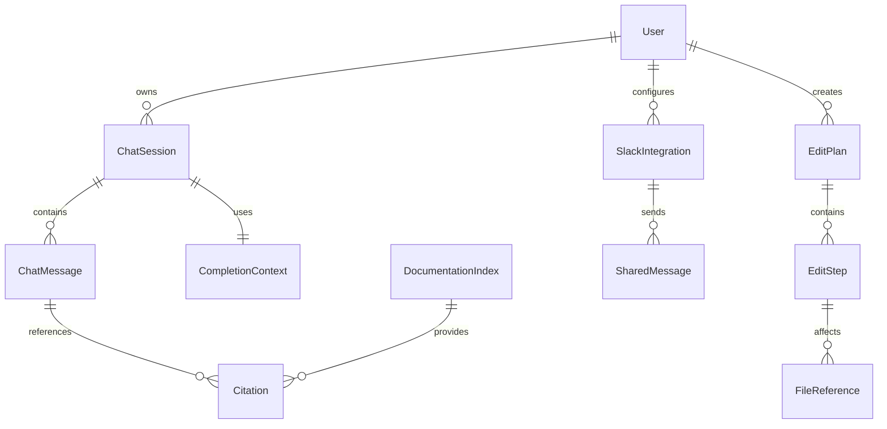
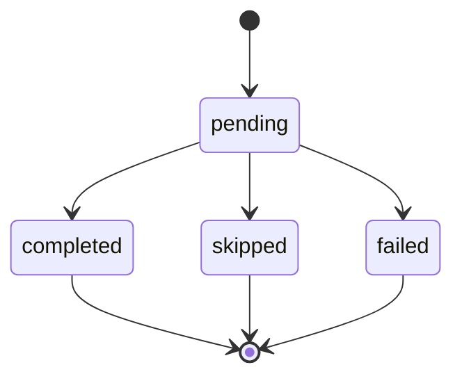

# Data Model: Advanced AI Features Enhancement

**Date**: January 12, 2026  
**Feature**: Enhanced AI capabilities with source discovery, edit guidance, and Slack integration  
**Phase**: 1 - Design & Contracts

## Entity Relationships



## Core Entities

### ChatSession

Represents a conversation with the AI, including messages, context, and citations.

**Fields**:

```typescript
interface ChatSession {
	id: string // UUID v4
	userId: string // User identifier
	title: string // Session title (auto-generated)
	createdAt: Date // Session creation timestamp
	updatedAt: Date // Last activity timestamp
	context: CompletionContext // Current context for the session
	metadata: SessionMetadata // Additional session information
}
```

**Validation Rules**:

- `id` must be valid UUID v4
- `title` required, max 255 characters
- `createdAt` and `updatedAt` must be valid dates
- `userId` required, references existing user

### ChatMessage

Represents individual messages within a chat session.

**Fields**:

```typescript
interface ChatMessage {
	id: string // UUID v4
	sessionId: string // Reference to ChatSession
	role: "user" | "assistant" // Message sender
	content: string // Message content
	citations: Citation[] // Source references
	timestamp: Date // Message timestamp
	metadata: MessageMetadata // Additional message data
}
```

**Validation Rules**:

- `id` must be valid UUID v4
- `sessionId` required, references existing ChatSession
- `role` must be 'user' or 'assistant'
- `content` required, max 100,000 characters
- `timestamp` must be valid date

### Citation

Represents a source reference within AI responses.

**Fields**:

```typescript
interface Citation {
	id: string // UUID v4
	messageId: string // Reference to ChatMessage
	sourceType: "file" | "documentation" | "url"
	sourcePath: string // File path or URL
	startLine?: number // Start line for file citations
	endLine?: number // End line for file citations
	snippet: string // Relevant code snippet
	confidence: number // Relevance confidence (0-1)
	metadata: CitationMetadata // Additional citation data
}
```

**Validation Rules**:

- `id` must be valid UUID v4
- `messageId` required, references existing ChatMessage
- `sourceType` must be 'file', 'documentation', or 'url'
- `sourcePath` required, max 1000 characters
- `confidence` must be between 0 and 1
- `startLine` and `endLine` must be positive integers if provided

### EditPlan

Represents a multi-step code change operation with related files and dependencies.

**Fields**:

```typescript
interface EditPlan {
	id: string // UUID v4
	userId: string // User who created the plan
	title: string // Plan description
	description: string // Detailed plan description
	status: "pending" | "in-progress" | "completed" | "cancelled"
	steps: EditStep[] // Ordered list of edit steps
	createdAt: Date // Plan creation timestamp
	updatedAt: Date // Last update timestamp
	metadata: PlanMetadata // Additional plan data
}
```

**Validation Rules**:

- `id` must be valid UUID v4
- `userId` required, references existing user
- `title` required, max 255 characters
- `description` required, max 10,000 characters
- `status` must be one of the allowed values
- `steps` array, max 100 steps

### EditStep

Represents individual steps within an edit plan.

**Fields**:

```typescript
interface EditStep {
	id: string // UUID v4
	planId: string // Reference to EditPlan
	order: number // Step order in the plan
	title: string // Step description
	type: "create" | "update" | "delete" | "move"
	files: FileReference[] // Files affected by this step
	description: string // Detailed step instructions
	status: "pending" | "completed" | "skipped" | "failed"
	dependencies: string[] // IDs of prerequisite steps
	metadata: StepMetadata // Additional step data
}
```

**Validation Rules**:

- `id` must be valid UUID v4
- `planId` required, references existing EditPlan
- `order` must be positive integer
- `title` required, max 255 characters
- `type` must be one of the allowed values
- `files` array, max 50 files per step
- `dependencies` array of valid EditStep IDs

### FileReference

Represents a file affected by an edit step.

**Fields**:

```typescript
interface FileReference {
	id: string // UUID v4
	stepId: string // Reference to EditStep
	filePath: string // Absolute file path
	changeType: "create" | "update" | "delete"
	oldContent?: string // Original content (for updates)
	newContent?: string // New content (for creates/updates)
	metadata: FileMetadata // Additional file data
}
```

**Validation Rules**:

- `id` must be valid UUID v4
- `stepId` required, references existing EditStep
- `filePath` required, must be valid absolute path
- `changeType` must be one of the allowed values
- `oldContent` required for 'update' and 'delete' operations
- `newContent` required for 'create' and 'update' operations

### CompletionContext

Represents the context used for generating intelligent code completions.

**Fields**:

```typescript
interface CompletionContext {
	id: string // UUID v4
	sessionId?: string // Optional reference to ChatSession
	filePath: string // Current file path
	position: number // Cursor position in file
	surroundingCode: string // Code around cursor
	projectContext: ProjectContext // Project-wide context
	semanticContext: SemanticContext // Vector-based semantic context
	metadata: ContextMetadata // Additional context data
}
```

**Validation Rules**:

- `id` must be valid UUID v4
- `filePath` required, must be valid absolute path
- `position` must be non-negative integer
- `surroundingCode` required, max 10,000 characters

### ProjectContext

Project-wide context for completions and chat.

**Fields**:

```typescript
interface ProjectContext {
	projectPath: string // Root directory of project
	language: string // Primary programming language
	framework?: string // Framework being used
	dependencies: string[] // Project dependencies
	recentFiles: string[] // Recently accessed files
	gitBranch?: string // Current git branch
	metadata: ProjectMetadata // Additional project data
}
```

**Validation Rules**:

- `projectPath` required, must be valid directory path
- `language` required, must be valid programming language identifier
- `dependencies` array, max 1000 dependencies
- `recentFiles` array, max 50 files

### SemanticContext

Vector-based semantic context for AI interactions.

**Fields**:

```typescript
interface SemanticContext {
	embeddings: number[][] // Vector embeddings
	relevantFiles: FileReference[] // Semantically similar files
	concepts: string[] // Key concepts identified
	relationships: ConceptRelationship[] // Concept relationships
	metadata: SemanticMetadata // Additional semantic data
}
```

**Validation Rules**:

- `embeddings` array of number arrays, each vector max 1536 dimensions
- `relevantFiles` array, max 20 files
- `concepts` array, max 100 concepts
- `relationships` array, max 200 relationships

### SlackIntegration

Represents the configuration and state for Slack sharing functionality.

**Fields**:

```typescript
interface SlackIntegration {
	id: string // UUID v4
	userId: string // User who owns the integration
	workspaceId: string // Slack workspace ID
	channelId?: string // Default channel for sharing
	botToken: string // Encrypted bot token
	userToken: string // Encrypted user token
	isActive: boolean // Integration status
	createdAt: Date // Integration creation
	lastUsed?: Date // Last usage timestamp
	metadata: SlackMetadata // Additional integration data
}
```

**Validation Rules**:

- `id` must be valid UUID v4
- `userId` required, references existing user
- `workspaceId` required, valid Slack workspace ID
- `botToken` and `userToken` required, encrypted strings
- `isActive` must be boolean

### SharedMessage

Represents messages shared to Slack.

**Fields**:

```typescript
interface SharedMessage {
	id: string // UUID v4
	integrationId: string // Reference to SlackIntegration
	messageId?: string // Optional reference to ChatMessage
	content: string // Message content
	channelId: string // Target Slack channel
	timestamp: Date // Sharing timestamp
	response?: SlackResponse // Slack API response
	metadata: SharedMetadata // Additional sharing data
}
```

**Validation Rules**:

- `id` must be valid UUID v4
- `integrationId` required, references existing SlackIntegration
- `content` required, max 4000 characters (Slack limit)
- `channelId` required, valid Slack channel ID
- `timestamp` must be valid date

### DocumentationIndex

Represents indexed external documentation for third-party packages.

**Fields**:

```typescript
interface DocumentationIndex {
	id: string // UUID v4
	packageName: string // Package name
	version: string // Package version
	sourceType: "npm" | "pypi" | "cargo" | "maven"
	sourceUrl: string // Documentation source URL
	indexedAt: Date // Indexing timestamp
	embeddings: number[][] // Vector embeddings for search
	metadata: DocumentationMetadata // Additional documentation data
}
```

**Validation Rules**:

- `id` must be valid UUID v4
- `packageName` required, valid package name format
- `version` required, semantic version format
- `sourceType` must be one of the allowed values
- `sourceUrl` required, valid URL
- `indexedAt` must be valid date

## State Transitions

### EditPlan Status Flow

```mermaid
stateDiagram-v2
    [*] --> pending
    pending --> in-progress
    in-progress --> completed
    in-progress --> cancelled
    completed --> [*]
    cancelled --> [*]
```

### EditStep Status Flow



## Database Schema

### Tables

```sql
-- Chat sessions
CREATE TABLE chat_sessions (
    id TEXT PRIMARY KEY,
    user_id TEXT NOT NULL,
    title TEXT NOT NULL,
    created_at DATETIME NOT NULL,
    updated_at DATETIME NOT NULL,
    context_id TEXT,
    metadata TEXT, -- JSON
    FOREIGN KEY (context_id) REFERENCES completion_contexts(id)
);

-- Chat messages
CREATE TABLE chat_messages (
    id TEXT PRIMARY KEY,
    session_id TEXT NOT NULL,
    role TEXT NOT NULL CHECK (role IN ('user', 'assistant')),
    content TEXT NOT NULL,
    timestamp DATETIME NOT NULL,
    metadata TEXT, -- JSON
    FOREIGN KEY (session_id) REFERENCES chat_sessions(id) ON DELETE CASCADE
);

-- Citations
CREATE TABLE citations (
    id TEXT PRIMARY KEY,
    message_id TEXT NOT NULL,
    source_type TEXT NOT NULL CHECK (source_type IN ('file', 'documentation', 'url')),
    source_path TEXT NOT NULL,
    start_line INTEGER,
    end_line INTEGER,
    snippet TEXT NOT NULL,
    confidence REAL NOT NULL CHECK (confidence >= 0 AND confidence <= 1),
    metadata TEXT, -- JSON
    FOREIGN KEY (message_id) REFERENCES chat_messages(id) ON DELETE CASCADE
);

-- Edit plans
CREATE TABLE edit_plans (
    id TEXT PRIMARY KEY,
    user_id TEXT NOT NULL,
    title TEXT NOT NULL,
    description TEXT NOT NULL,
    status TEXT NOT NULL CHECK (status IN ('pending', 'in-progress', 'completed', 'cancelled')),
    created_at DATETIME NOT NULL,
    updated_at DATETIME NOT NULL,
    metadata TEXT -- JSON
);

-- Edit steps
CREATE TABLE edit_steps (
    id TEXT PRIMARY KEY,
    plan_id TEXT NOT NULL,
    "order" INTEGER NOT NULL,
    title TEXT NOT NULL,
    type TEXT NOT NULL CHECK (type IN ('create', 'update', 'delete', 'move')),
    description TEXT NOT NULL,
    status TEXT NOT NULL CHECK (status IN ('pending', 'completed', 'skipped', 'failed')),
    metadata TEXT, -- JSON
    FOREIGN KEY (plan_id) REFERENCES edit_plans(id) ON DELETE CASCADE
);

-- File references
CREATE TABLE file_references (
    id TEXT PRIMARY KEY,
    step_id TEXT NOT NULL,
    file_path TEXT NOT NULL,
    change_type TEXT NOT NULL CHECK (change_type IN ('create', 'update', 'delete')),
    old_content TEXT,
    new_content TEXT,
    metadata TEXT, -- JSON
    FOREIGN KEY (step_id) REFERENCES edit_steps(id) ON DELETE CASCADE
);

-- Completion contexts
CREATE TABLE completion_contexts (
    id TEXT PRIMARY KEY,
    session_id TEXT,
    file_path TEXT NOT NULL,
    position INTEGER NOT NULL,
    surrounding_code TEXT NOT NULL,
    project_context TEXT NOT NULL, -- JSON
    semantic_context TEXT NOT NULL, -- JSON
    metadata TEXT, -- JSON
    FOREIGN KEY (session_id) REFERENCES chat_sessions(id) ON DELETE SET NULL
);

-- Slack integrations
CREATE TABLE slack_integrations (
    id TEXT PRIMARY KEY,
    user_id TEXT NOT NULL,
    workspace_id TEXT NOT NULL,
    channel_id TEXT,
    bot_token TEXT NOT NULL, -- Encrypted
    user_token TEXT NOT NULL, -- Encrypted
    is_active BOOLEAN NOT NULL DEFAULT TRUE,
    created_at DATETIME NOT NULL,
    last_used DATETIME,
    metadata TEXT -- JSON
);

-- Shared messages
CREATE TABLE shared_messages (
    id TEXT PRIMARY KEY,
    integration_id TEXT NOT NULL,
    message_id TEXT,
    content TEXT NOT NULL,
    channel_id TEXT NOT NULL,
    timestamp DATETIME NOT NULL,
    response TEXT, -- JSON (Slack API response)
    metadata TEXT, -- JSON
    FOREIGN KEY (integration_id) REFERENCES slack_integrations(id) ON DELETE CASCADE,
    FOREIGN KEY (message_id) REFERENCES chat_messages(id) ON DELETE SET NULL
);

-- Documentation index
CREATE TABLE documentation_index (
    id TEXT PRIMARY KEY,
    package_name TEXT NOT NULL,
    version TEXT NOT NULL,
    source_type TEXT NOT NULL CHECK (source_type IN ('npm', 'pypi', 'cargo', 'maven')),
    source_url TEXT NOT NULL,
    indexed_at DATETIME NOT NULL,
    embeddings TEXT NOT NULL, -- JSON (vector embeddings)
    metadata TEXT -- JSON
);
```

### Indexes

```sql
-- Performance indexes
CREATE INDEX idx_chat_sessions_user_id ON chat_sessions(user_id);
CREATE INDEX idx_chat_sessions_updated_at ON chat_sessions(updated_at DESC);
CREATE INDEX idx_chat_messages_session_id ON chat_messages(session_id);
CREATE INDEX idx_chat_messages_timestamp ON chat_messages(timestamp DESC);
CREATE INDEX idx_citations_message_id ON citations(message_id);
CREATE INDEX idx_citations_source_path ON citations(source_path);
CREATE INDEX idx_edit_plans_user_id ON edit_plans(user_id);
CREATE INDEX idx_edit_plans_status ON edit_plans(status);
CREATE INDEX idx_edit_steps_plan_id ON edit_steps(plan_id);
CREATE INDEX idx_edit_steps_order ON edit_steps(plan_id, "order");
CREATE INDEX idx_file_references_step_id ON file_references(step_id);
CREATE INDEX idx_completion_contexts_session_id ON completion_contexts(session_id);
CREATE INDEX idx_completion_contexts_file_path ON completion_contexts(file_path);
CREATE INDEX idx_slack_integrations_user_id ON slack_integrations(user_id);
CREATE INDEX idx_shared_messages_integration_id ON shared_messages(integration_id);
CREATE INDEX idx_shared_messages_timestamp ON shared_messages(timestamp DESC);
CREATE INDEX idx_documentation_index_package_name ON documentation_index(package_name);
CREATE INDEX idx_documentation_index_source_type ON documentation_index(source_type);
```

## Data Access Patterns

### Chat Operations

- **Create Session**: Insert into `chat_sessions`, create initial `completion_context`
- **Add Message**: Insert into `chat_messages`, create `citations` if needed
- **Retrieve History**: Join `chat_sessions` → `chat_messages` → `citations`
- **Context Search**: Query `completion_contexts` with semantic similarity

### Edit Guidance Operations

- **Create Plan**: Insert into `edit_plans`, create `edit_steps` and `file_references`
- **Update Progress**: Update `edit_steps` status, maintain order
- **Retrieve Active Plans**: Query `edit_plans` with status 'pending' or 'in-progress'

### Slack Integration Operations

- **Configure Integration**: Insert into `slack_integrations` with encrypted tokens
- **Share Message**: Insert into `shared_messages`, update `last_used` timestamp
- **Retrieve History**: Query `shared_messages` ordered by timestamp

### Documentation Operations

- **Index Documentation**: Insert into `documentation_index` with embeddings
- **Search**: Vector similarity search on `embeddings` column
- **Update**: Re-index when documentation versions change

## Security Considerations

### Data Encryption

- Slack tokens stored encrypted using VSCode's `SecretStorage`
- Sensitive content in metadata fields encrypted at rest
- API keys and credentials never logged or exposed

### Access Control

- User-scoped data isolation using `user_id` foreign keys
- Row-level security for multi-tenant scenarios
- Audit logging for data access and modifications

### Privacy Protection

- Code snippets anonymized for external sharing
- User consent mechanisms for data collection
- Data retention policies for chat history

## Performance Considerations

### Caching Strategy

- Frequently accessed completion contexts cached in memory
- Vector embeddings cached for semantic search performance
- Chat session pagination for large conversation histories

### Query Optimization

- Indexed queries for all foreign key relationships
- Full-text search indexes for content search
- Batch operations for bulk data updates

### Scalability

- Horizontal sharding for large user bases
- Archive old chat sessions to cold storage
- Streaming for large file operations
